Set up Code book options


```r
knitr::opts_chunk$set(
  warning = TRUE, # show warnings during codebook generation
  message = TRUE, # show messages during codebook generation
  error = TRUE, # do not interrupt codebook generation in case of errors,
                # usually better for debugging
  echo = TRUE  # show R code
)
ggplot2::theme_set(ggplot2::theme_bw())
```

Code book preparation


```r
library(codebook)

codebook_data <- rio::import("codebook_source/tidyset.rds")

# omit the following lines, if your missing values are already properly labelled
codebook_data <- detect_missing(codebook_data,
    only_labelled = TRUE, # only labelled values are autodetected as
                                   # missing
    negative_values_are_missing = FALSE, # negative values are missing values
    ninety_nine_problems = TRUE,   # 99/999 are missing values, if they
                                   # are more than 5 MAD from the median
    )

codebook_data <- detect_scales(codebook_data)
```


Create codebook


```r
codebook(codebook_data)
```

```
## No missing values.
```


### Metadata

#### Description
__Dataset name__: Grouped Accelerometer Standard Deviation and Mean Data by Student and Activity

This data set contains the standard deviation and mean of the original data. See the README.txt found in the original data, "sample_data/getdata_projectfiles_UCI_HAR_Dataset/UCI HAR Dataset/README.txt", for more information. Features value are normalized and bounded within -1.0 and 1.0.

<details>
<summary title="Expand this section to see some additional metadata in a structured format that is useful for search engines">Metadata for search engines</summary>


- __Spatial Coverage__: Online
- __Citation__: Davide Anguita, Alessandro Ghio, Luca Oneto, Xavier Parra and Jorge L. Reyes-Ortiz. Human Activity Recognition on Smartphones using a Multiclass Hardware-Friendly Support Vector Machine. International Workshop of Ambient Assisted Living (IWAAL 2012). Vitoria-Gasteiz, Spain. Dec 2012
- __URL__: [https://github.com/rodelor97/GettingCleaningDataWeek4Project](https://github.com/rodelor97/GettingCleaningDataWeek4Project)

- __Date published__: 2021-02-07

- __Creator__:

| name|value              |
|----:|:------------------|
|    1|Robert de Lorimier |


<table class="kable_wrapper">
<tbody>
  <tr>
   <td> 

|x                                                        |
|:--------------------------------------------------------|
|Subject                                                  |
|Activity                                                 |
|Time.Acceleration.Mean.X                                 |
|Time.Acceleration.Mean.Y                                 |
|Time.Acceleration.Mean.Z                                 |
|Time.Acceleration.Standard.Deviation.X                   |
|Time.Acceleration.Standard.Deviation.Y                   |
|Time.Acceleration.Standard.Deviation.Z                   |
|Time.Gravity.Acceleration.Mean.X                         |
|Time.Gravity.Acceleration.Mean.Y                         |
|Time.Gravity.Acceleration.Mean.Z                         |
|Time.Gravity.Acceleration.Standard.Deviation.X           |
|Time.Gravity.Acceleration.Standard.Deviation.Y           |
|Time.Gravity.Acceleration.Standard.Deviation.Z           |
|Time.Acceleration.Jerk.Mean.X                            |
|Time.Acceleration.Jerk.Mean.Y                            |
|Time.Acceleration.Jerk.Mean.Z                            |
|Time.Acceleration.Jerk.Standard.Deviation.X              |
|Time.Acceleration.Jerk.Standard.Deviation.Y              |
|Time.Acceleration.Jerk.Standard.Deviation.Z              |
|Time.Gyroscope.Mean.X                                    |
|Time.Gyroscope.Mean.Y                                    |
|Time.Gyroscope.Mean.Z                                    |
|Time.Gyroscope.Standard.Deviation.X                      |
|Time.Gyroscope.Standard.Deviation.Y                      |
|Time.Gyroscope.Standard.Deviation.Z                      |
|Time.Gyroscope.Jerk.Mean.X                               |
|Time.Gyroscope.Jerk.Mean.Y                               |
|Time.Gyroscope.Jerk.Mean.Z                               |
|Time.Gyroscope.Jerk.Standard.Deviation.X                 |
|Time.Gyroscope.Jerk.Standard.Deviation.Y                 |
|Time.Gyroscope.Jerk.Standard.Deviation.Z                 |
|Time.Acceleration.Magnitude.Mean                         |
|Time.Acceleration.Magnitude.Standard.Deviation           |
|Time.Gravity.Acceleration.Magnitude.Mean                 |
|Time.Gravity.Acceleration.Magnitude.Standard.Deviation   |
|Time.Acceleration.Jerk.Magnitude.Mean                    |
|Time.Acceleration.Jerk.Magnitude.Standard.Deviation      |
|Time.Gyroscope.Magnitude.Mean                            |
|Time.Gyroscope.Magnitude.Standard.Deviation              |
|Time.Gyroscope.Jerk.Magnitude.Mean                       |
|Time.Gyroscope.Jerk.Magnitude.Standard.Deviation         |
|Frequency.Acceleration.Mean.X                            |
|Frequency.Acceleration.Mean.Y                            |
|Frequency.Acceleration.Mean.Z                            |
|Frequency.Acceleration.Standard.Deviation.X              |
|Frequency.Acceleration.Standard.Deviation.Y              |
|Frequency.Acceleration.Standard.Deviation.Z              |
|Frequency.Acceleration.Mean.Frequency.X                  |
|Frequency.Acceleration.Mean.Frequency.Y                  |
|Frequency.Acceleration.Mean.Frequency.Z                  |
|Frequency.Acceleration.Jerk.Mean.X                       |
|Frequency.Acceleration.Jerk.Mean.Y                       |
|Frequency.Acceleration.Jerk.Mean.Z                       |
|Frequency.Acceleration.Jerk.Standard.Deviation.X         |
|Frequency.Acceleration.Jerk.Standard.Deviation.Y         |
|Frequency.Acceleration.Jerk.Standard.Deviation.Z         |
|Frequency.Acceleration.Jerk.Mean.Frequency.X             |
|Frequency.Acceleration.Jerk.Mean.Frequency.Y             |
|Frequency.Acceleration.Jerk.Mean.Frequency.Z             |
|Frequency.Gyroscope.Mean.X                               |
|Frequency.Gyroscope.Mean.Y                               |
|Frequency.Gyroscope.Mean.Z                               |
|Frequency.Gyroscope.Standard.Deviation.X                 |
|Frequency.Gyroscope.Standard.Deviation.Y                 |
|Frequency.Gyroscope.Standard.Deviation.Z                 |
|Frequency.Gyroscope.Mean.Frequency.X                     |
|Frequency.Gyroscope.Mean.Frequency.Y                     |
|Frequency.Gyroscope.Mean.Frequency.Z                     |
|Frequency.Acceleration.Magnitude.Mean                    |
|Frequency.Acceleration.Magnitude.Standard.Deviation      |
|Frequency.Acceleration.Magnitude.Mean.Frequency          |
|Frequency.Acceleration.Jerk.Magnitude.Mean               |
|Frequency.Acceleration.Jerk.Magnitude.Standard.Deviation |
|Frequency.Acceleration.Jerk.Magnitude.Mean.Frequency     |
|Frequency.Gyroscope.Magnitude.Mean                       |
|Frequency.Gyroscope.Magnitude.Standard.Deviation         |
|Frequency.Gyroscope.Magnitude.Mean.Frequency             |
|Frequency.Gyroscope.Jerk.Magnitude.Mean                  |
|Frequency.Gyroscope.Jerk.Magnitude.Standard.Deviation    |
|Frequency.Gyroscope.Jerk.Magnitude.Mean.Frequency        |
|Angle.Time.Acceleration.Mean.Gravity                     |
|Angle.Time.Acceleration.Jerk.Mean.Gravity.Mean           |
|Angle.Time.Gyroscope.Mean.Gravity.Mean                   |
|Angle.Time.Gyroscope.Jerk.Mean.Gravity.Mean              |
|Angle.X.Gravity.Mean                                     |
|Angle.Y.Gravity.Mean                                     |
|Angle.Z.Gravity.Mean                                     |

 </td>
  </tr>
</tbody>
</table>

</details>


#Variables


### Subject {#Subject .tabset}

Subject:  Labels,  Subject = The identifier of the subject who carried out the experiment, numbered from 1 to 30

#### Distribution {#Subject_distribution}

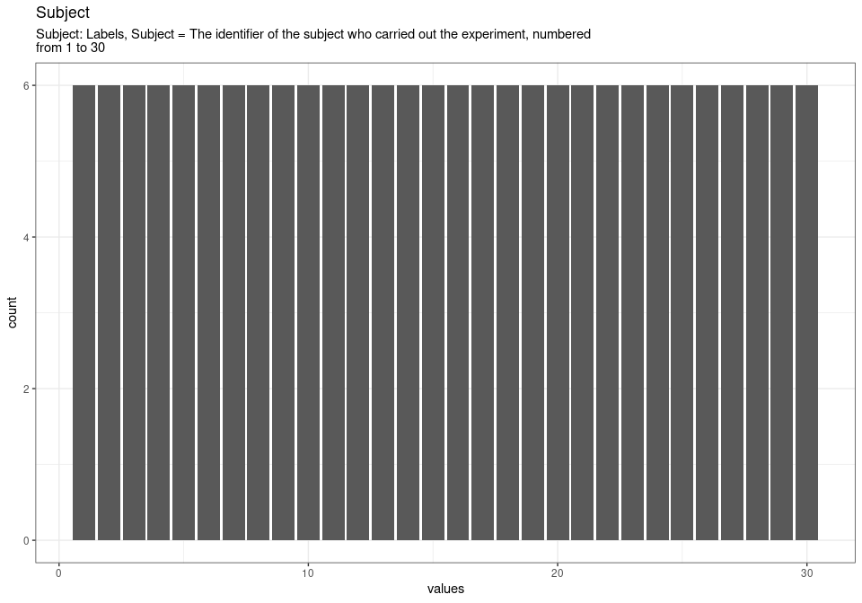

0 missing values.

#### Summary statistics {#Subject_summary}

|name    |label                                                                                                            |data_type | n_missing| complete_rate|min |median |max | mean|       sd|hist  |
|:-------|:----------------------------------------------------------------------------------------------------------------|:---------|---------:|-------------:|:---|:------|:---|----:|--------:|:-----|
|Subject |Subject:  Labels,  Subject = The identifier of the subject who carried out the experiment, numbered from 1 to 30 |numeric   |         0|             1|1   |16     |30  | 15.5| 8.679585|▇▇▇▇▇ |


### Activity {#Activity .tabset}

Activity:  Labels,  Activity = One of six activities performed by subjects, WALKIN, WALKING_UPSTAIRS, WALKING_DOWNSTAIRS, SITTING, STANDING, and LAYING

#### Distribution {#Activity_distribution}

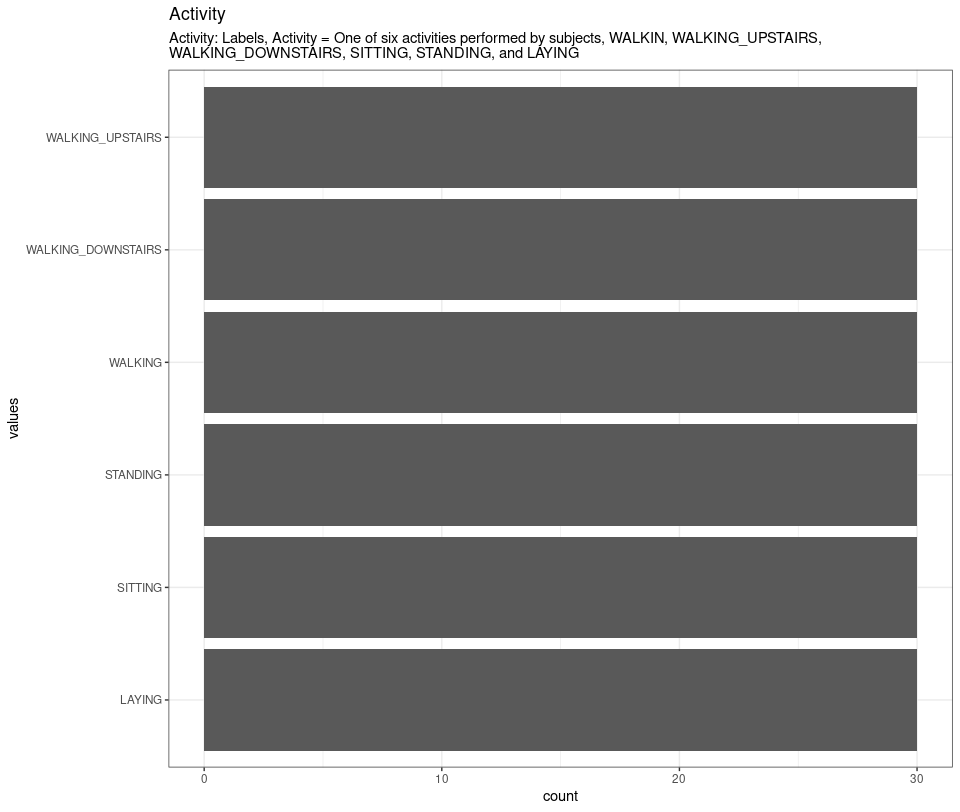

0 missing values.

#### Summary statistics {#Activity_summary}

|name     |label                                                                                                                                                   |data_type | n_missing| complete_rate| n_unique| empty|min |max | whitespace|
|:--------|:-------------------------------------------------------------------------------------------------------------------------------------------------------|:---------|---------:|-------------:|--------:|-----:|:---|:---|----------:|
|Activity |Activity:  Labels,  Activity = One of six activities performed by subjects, WALKIN, WALKING_UPSTAIRS, WALKING_DOWNSTAIRS, SITTING, STANDING, and LAYING |character |         0|             1|        6|     0|6   |18  |          0|


### Time.Acceleration.Mean.X {#Time_Acceleration_Mean_X .tabset}

Aggregated Mean Value Grouped By Subject and Activity For Time Acceleration Mean X:  Labels,  Time = Time Domain Signal, captured at a constant rate of 50 Hz, Acceleration = Acceleration in standard gravity units 'g', X = Triaxial signals in the X direction, Mean = Mean of value.

#### Distribution {#Time_Acceleration_Mean_X_distribution}

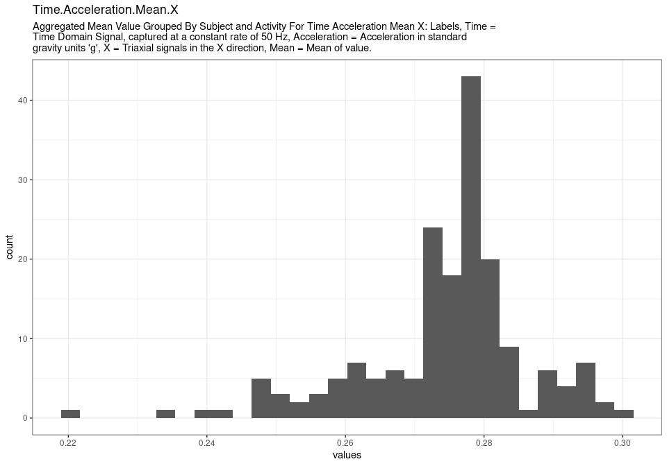

0 missing values.

#### Summary statistics {#Time_Acceleration_Mean_X_summary}

|name                     |label                                                                                                                                                                                                                                                                                    |data_type | n_missing| complete_rate|min  |median |max |      mean|        sd|hist  |
|:------------------------|:----------------------------------------------------------------------------------------------------------------------------------------------------------------------------------------------------------------------------------------------------------------------------------------|:---------|---------:|-------------:|:----|:------|:---|---------:|---------:|:-----|
|Time.Acceleration.Mean.X |Aggregated Mean Value Grouped By Subject and Activity For Time Acceleration Mean X:  Labels,  Time = Time Domain Signal, captured at a constant rate of 50 Hz, Acceleration = Acceleration in standard gravity units 'g', X = Triaxial signals in the X direction, Mean = Mean of value. |numeric   |         0|             1|0.22 |0.28   |0.3 | 0.2743027| 0.0121646|▁▁▂▇▂ |


### Time.Acceleration.Mean.Y {#Time_Acceleration_Mean_Y .tabset}

Aggregated Mean Value Grouped By Subject and Activity For Time Acceleration Mean Y:  Labels,  Time = Time Domain Signal, captured at a constant rate of 50 Hz, Acceleration = Acceleration in standard gravity units 'g', Y = Triaxial signals in the Y direction, Mean = Mean of value.

#### Distribution {#Time_Acceleration_Mean_Y_distribution}

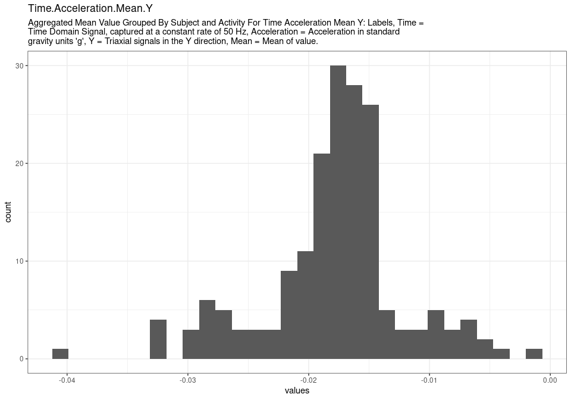

0 missing values.

#### Summary statistics {#Time_Acceleration_Mean_Y_summary}

|name                     |label                                                                                                                                                                                                                                                                                    |data_type | n_missing| complete_rate|min    |median |max     |       mean|        sd|hist  |
|:------------------------|:----------------------------------------------------------------------------------------------------------------------------------------------------------------------------------------------------------------------------------------------------------------------------------------|:---------|---------:|-------------:|:------|:------|:-------|----------:|---------:|:-----|
|Time.Acceleration.Mean.Y |Aggregated Mean Value Grouped By Subject and Activity For Time Acceleration Mean Y:  Labels,  Time = Time Domain Signal, captured at a constant rate of 50 Hz, Acceleration = Acceleration in standard gravity units 'g', Y = Triaxial signals in the Y direction, Mean = Mean of value. |numeric   |         0|             1|-0.041 |-0.017 |-0.0013 | -0.0178755| 0.0057712|▁▂▇▇▁ |


### Time.Acceleration.Mean.Z {#Time_Acceleration_Mean_Z .tabset}

Aggregated Mean Value Grouped By Subject and Activity For Time Acceleration Mean Z:  Labels,  Time = Time Domain Signal, captured at a constant rate of 50 Hz, Acceleration = Acceleration in standard gravity units 'g', Z = Triaxialsignals in the Z direction, Mean = Mean of value.

#### Distribution {#Time_Acceleration_Mean_Z_distribution}

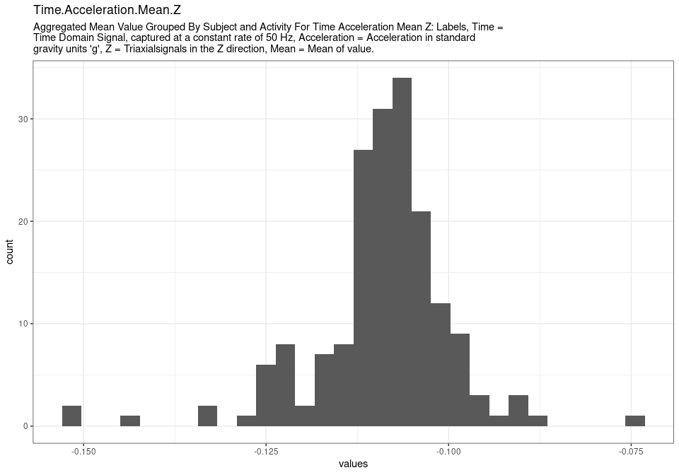

0 missing values.

#### Summary statistics {#Time_Acceleration_Mean_Z_summary}

|name                     |label                                                                                                                                                                                                                                                                                   |data_type | n_missing| complete_rate|min   |median |max    |       mean|       sd|hist  |
|:------------------------|:---------------------------------------------------------------------------------------------------------------------------------------------------------------------------------------------------------------------------------------------------------------------------------------|:---------|---------:|-------------:|:-----|:------|:------|----------:|--------:|:-----|
|Time.Acceleration.Mean.Z |Aggregated Mean Value Grouped By Subject and Activity For Time Acceleration Mean Z:  Labels,  Time = Time Domain Signal, captured at a constant rate of 50 Hz, Acceleration = Acceleration in standard gravity units 'g', Z = Triaxialsignals in the Z direction, Mean = Mean of value. |numeric   |         0|             1|-0.15 |-0.11  |-0.075 | -0.1091638| 0.009582|▁▁▇▅▁ |


### Time.Acceleration.Standard.Deviation.X {#Time_Acceleration_Standard_Deviation_X .tabset}

Aggregated Mean Value Grouped By Subject and Activity For Time Acceleration Standard Deviation X:  Labels,  Time = Time Domain Signal, captured at a constant rate of 50 Hz, Acceleration = Acceleration in standard gravity units 'g', X = Triaxial signals in the X direction, Standard Deviation = Standard deviation of value.

#### Distribution {#Time_Acceleration_Standard_Deviation_X_distribution}

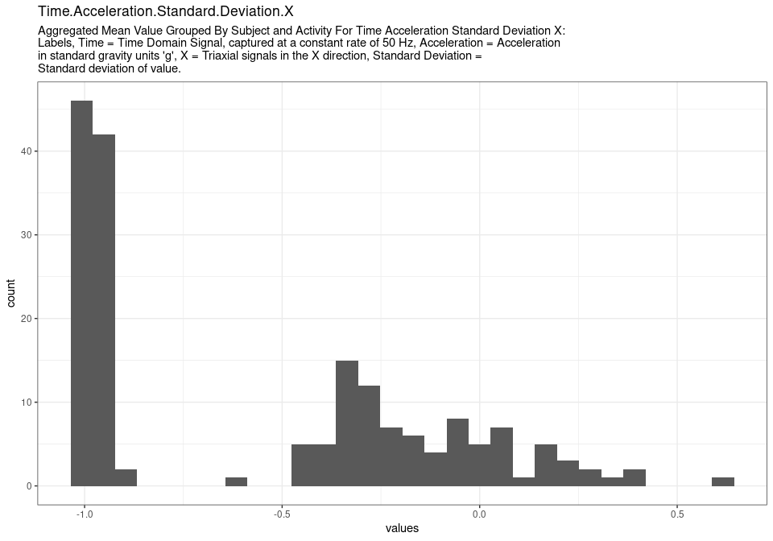

0 missing values.

#### Summary statistics {#Time_Acceleration_Standard_Deviation_X_summary}

|name                                   |label                                                                                                                                                                                                                                                                                                                              |data_type | n_missing| complete_rate|min |median |max  |       mean|        sd|hist  |
|:--------------------------------------|:----------------------------------------------------------------------------------------------------------------------------------------------------------------------------------------------------------------------------------------------------------------------------------------------------------------------------------|:---------|---------:|-------------:|:---|:------|:----|----------:|---------:|:-----|
|Time.Acceleration.Standard.Deviation.X |Aggregated Mean Value Grouped By Subject and Activity For Time Acceleration Standard Deviation X:  Labels,  Time = Time Domain Signal, captured at a constant rate of 50 Hz, Acceleration = Acceleration in standard gravity units 'g', X = Triaxial signals in the X direction, Standard Deviation = Standard deviation of value. |numeric   |         0|             1|-1  |-0.75  |0.63 | -0.5576901| 0.4516911|▇▂▅▂▁ |


### Time.Acceleration.Standard.Deviation.Y {#Time_Acceleration_Standard_Deviation_Y .tabset}

Aggregated Mean Value Grouped By Subject and Activity For Time Acceleration Standard Deviation Y:  Labels,  Time = Time Domain Signal, captured at a constant rate of 50 Hz, Acceleration = Acceleration in standard gravity units 'g', Y = Triaxial signals in the Y direction, Standard Deviation = Standard deviation of value.

#### Distribution {#Time_Acceleration_Standard_Deviation_Y_distribution}

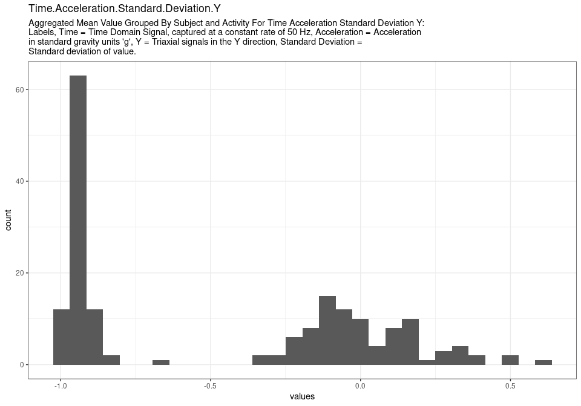

0 missing values.

#### Summary statistics {#Time_Acceleration_Standard_Deviation_Y_summary}

|name                                   |label                                                                                                                                                                                                                                                                                                                              |data_type | n_missing| complete_rate|min   |median |max  |       mean|       sd|hist  |
|:--------------------------------------|:----------------------------------------------------------------------------------------------------------------------------------------------------------------------------------------------------------------------------------------------------------------------------------------------------------------------------------|:---------|---------:|-------------:|:-----|:------|:----|----------:|--------:|:-----|
|Time.Acceleration.Standard.Deviation.Y |Aggregated Mean Value Grouped By Subject and Activity For Time Acceleration Standard Deviation Y:  Labels,  Time = Time Domain Signal, captured at a constant rate of 50 Hz, Acceleration = Acceleration in standard gravity units 'g', Y = Triaxial signals in the Y direction, Standard Deviation = Standard deviation of value. |numeric   |         0|             1|-0.99 |-0.51  |0.62 | -0.4604626| 0.496565|▇▁▅▃▁ |


### Time.Acceleration.Standard.Deviation.Z {#Time_Acceleration_Standard_Deviation_Z .tabset}

Aggregated Mean Value Grouped By Subject and Activity For Time Acceleration Standard Deviation Z:  Labels,  Time = Time Domain Signal, captured at a constant rate of 50 Hz, Acceleration = Acceleration in standard gravity units 'g', Z = Triaxialsignals in the Z direction, Standard Deviation = Standard deviation of value.

#### Distribution {#Time_Acceleration_Standard_Deviation_Z_distribution}

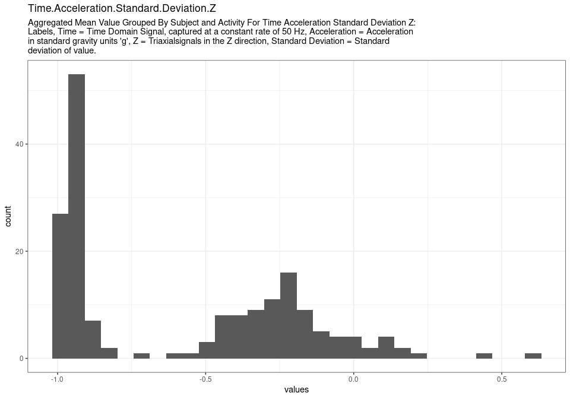

0 missing values.

#### Summary statistics {#Time_Acceleration_Standard_Deviation_Z_summary}

|name                                   |label                                                                                                                                                                                                                                                                                                                             |data_type | n_missing| complete_rate|min   |median |max  |       mean|        sd|hist  |
|:--------------------------------------|:---------------------------------------------------------------------------------------------------------------------------------------------------------------------------------------------------------------------------------------------------------------------------------------------------------------------------------|:---------|---------:|-------------:|:-----|:------|:----|----------:|---------:|:-----|
|Time.Acceleration.Standard.Deviation.Z |Aggregated Mean Value Grouped By Subject and Activity For Time Acceleration Standard Deviation Z:  Labels,  Time = Time Domain Signal, captured at a constant rate of 50 Hz, Acceleration = Acceleration in standard gravity units 'g', Z = Triaxialsignals in the Z direction, Standard Deviation = Standard deviation of value. |numeric   |         0|             1|-0.99 |-0.65  |0.61 | -0.5755602| 0.3955439|▇▂▅▁▁ |


### Time.Gravity.Acceleration.Mean.X {#Time_Gravity_Acceleration_Mean_X .tabset}

Aggregated Mean Value Grouped By Subject and Activity For Time Gravity Acceleration Mean X:  Labels,  Time = Time Domain Signal, captured at a constant rate of 50 Hz, Gravity = Sensor gravity in standard units 'g', Acceleration = Acceleration in standard gravity units 'g', X = Triaxial signals in the X direction, Mean = Mean of value.

#### Distribution {#Time_Gravity_Acceleration_Mean_X_distribution}

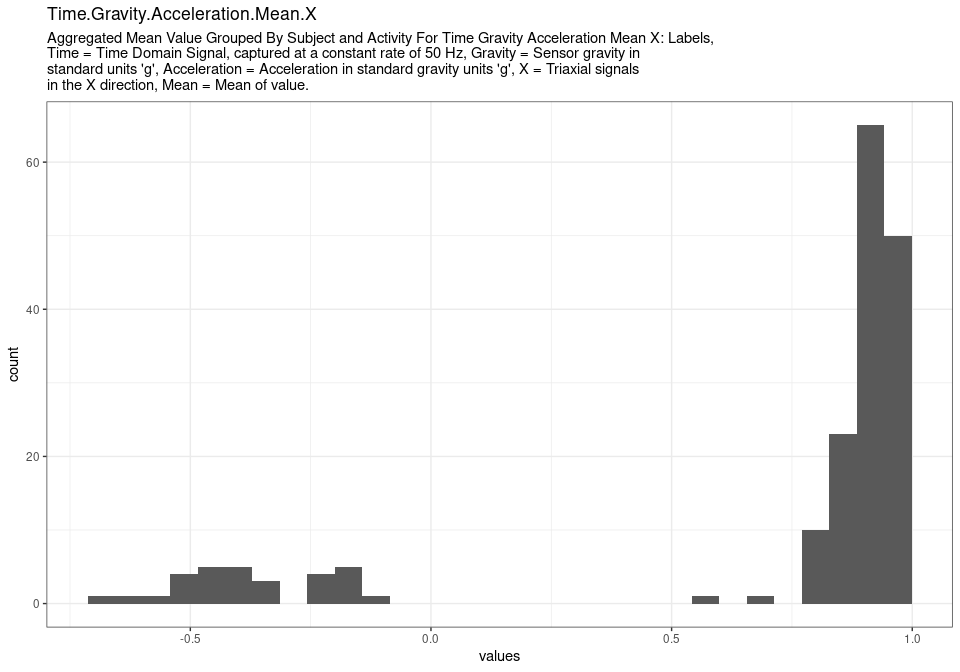

0 missing values.

#### Summary statistics {#Time_Gravity_Acceleration_Mean_X_summary}

|name                             |label                                                                                                                                                                                                                                                                                                                                            |data_type | n_missing| complete_rate|min   |median |max  |      mean|        sd|hist  |
|:--------------------------------|:------------------------------------------------------------------------------------------------------------------------------------------------------------------------------------------------------------------------------------------------------------------------------------------------------------------------------------------------|:---------|---------:|-------------:|:-----|:------|:----|---------:|---------:|:-----|
|Time.Gravity.Acceleration.Mean.X |Aggregated Mean Value Grouped By Subject and Activity For Time Gravity Acceleration Mean X:  Labels,  Time = Time Domain Signal, captured at a constant rate of 50 Hz, Gravity = Sensor gravity in standard units 'g', Acceleration = Acceleration in standard gravity units 'g', X = Triaxial signals in the X direction, Mean = Mean of value. |numeric   |         0|             1|-0.68 |0.92   |0.97 | 0.6974775| 0.4872534|▁▁▁▁▇ |


### Time.Gravity.Acceleration.Mean.Y {#Time_Gravity_Acceleration_Mean_Y .tabset}

Aggregated Mean Value Grouped By Subject and Activity For Time Gravity Acceleration Mean Y:  Labels,  Time = Time Domain Signal, captured at a constant rate of 50 Hz, Gravity = Sensor gravity in standard units 'g', Acceleration = Acceleration in standard gravity units 'g', Y = Triaxial signals in the Y direction, Mean = Mean of value.

#### Distribution {#Time_Gravity_Acceleration_Mean_Y_distribution}

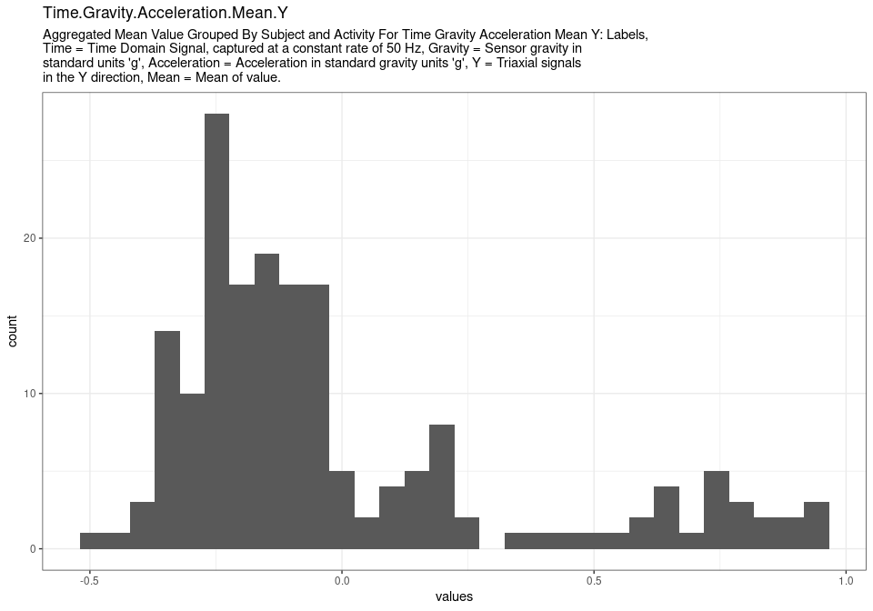

0 missing values.

#### Summary statistics {#Time_Gravity_Acceleration_Mean_Y_summary}

|name                             |label                                                                                                                                                                                                                                                                                                                                            |data_type | n_missing| complete_rate|min   |median |max  |       mean|        sd|hist  |
|:--------------------------------|:------------------------------------------------------------------------------------------------------------------------------------------------------------------------------------------------------------------------------------------------------------------------------------------------------------------------------------------------|:---------|---------:|-------------:|:-----|:------|:----|----------:|---------:|:-----|
|Time.Gravity.Acceleration.Mean.Y |Aggregated Mean Value Grouped By Subject and Activity For Time Gravity Acceleration Mean Y:  Labels,  Time = Time Domain Signal, captured at a constant rate of 50 Hz, Gravity = Sensor gravity in standard units 'g', Acceleration = Acceleration in standard gravity units 'g', Y = Triaxial signals in the Y direction, Mean = Mean of value. |numeric   |         0|             1|-0.48 |-0.13  |0.96 | -0.0162128| 0.3452376|▇▇▂▁▂ |


### Time.Gravity.Acceleration.Mean.Z {#Time_Gravity_Acceleration_Mean_Z .tabset}

Aggregated Mean Value Grouped By Subject and Activity For Time Gravity Acceleration Mean Z:  Labels,  Time = Time Domain Signal, captured at a constant rate of 50 Hz, Gravity = Sensor gravity in standard units 'g', Acceleration = Acceleration in standard gravity units 'g', Z = Triaxialsignals in the Z direction, Mean = Mean of value.

#### Distribution {#Time_Gravity_Acceleration_Mean_Z_distribution}

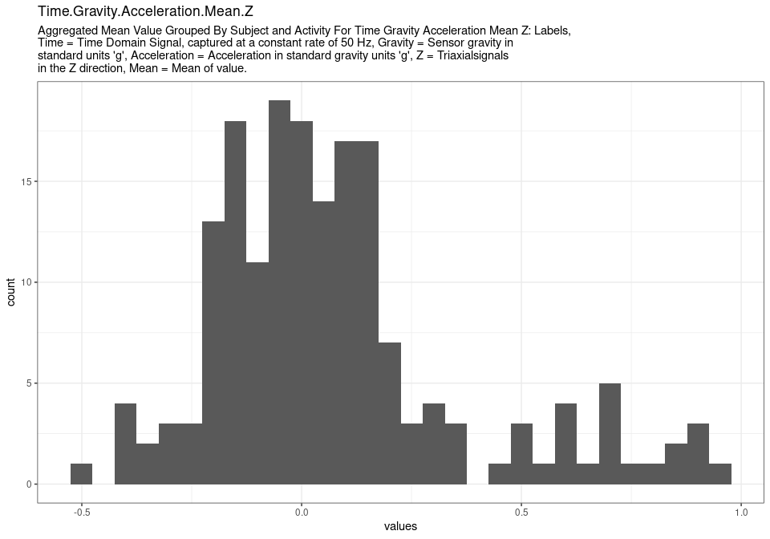

0 missing values.

#### Summary statistics {#Time_Gravity_Acceleration_Mean_Z_summary}

|name                             |label                                                                                                                                                                                                                                                                                                                                           |data_type | n_missing| complete_rate|min  |median |max  |      mean|        sd|hist  |
|:--------------------------------|:-----------------------------------------------------------------------------------------------------------------------------------------------------------------------------------------------------------------------------------------------------------------------------------------------------------------------------------------------|:---------|---------:|-------------:|:----|:------|:----|---------:|---------:|:-----|
|Time.Gravity.Acceleration.Mean.Z |Aggregated Mean Value Grouped By Subject and Activity For Time Gravity Acceleration Mean Z:  Labels,  Time = Time Domain Signal, captured at a constant rate of 50 Hz, Gravity = Sensor gravity in standard units 'g', Acceleration = Acceleration in standard gravity units 'g', Z = Triaxialsignals in the Z direction, Mean = Mean of value. |numeric   |         0|             1|-0.5 |0.024  |0.96 | 0.0741279| 0.2887919|▂▇▃▁▁ |


### Time.Gravity.Acceleration.Standard.Deviation.X {#Time_Gravity_Acceleration_Standard_Deviation_X .tabset}

Aggregated Mean Value Grouped By Subject and Activity For Time Gravity Acceleration Standard Deviation X:  Labels,  Time = Time Domain Signal, captured at a constant rate of 50 Hz, Gravity = Sensor gravity in standard units 'g', Acceleration = Acceleration in standard gravity units 'g', X = Triaxial signals in the X direction, Standard Deviation = Standard deviation of value.

#### Distribution {#Time_Gravity_Acceleration_Standard_Deviation_X_distribution}

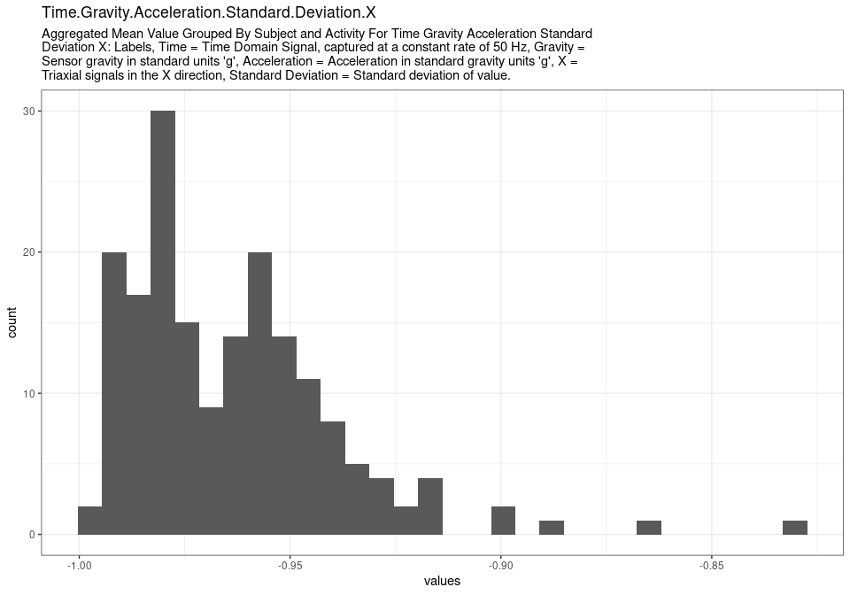

0 missing values.

#### Summary statistics {#Time_Gravity_Acceleration_Standard_Deviation_X_summary}

|name                                           |label                                                                                                                                                                                                                                                                                                                                                                                      |data_type | n_missing| complete_rate|min |median |max   |       mean|        sd|hist  |
|:----------------------------------------------|:------------------------------------------------------------------------------------------------------------------------------------------------------------------------------------------------------------------------------------------------------------------------------------------------------------------------------------------------------------------------------------------|:---------|---------:|-------------:|:---|:------|:-----|----------:|---------:|:-----|
|Time.Gravity.Acceleration.Standard.Deviation.X |Aggregated Mean Value Grouped By Subject and Activity For Time Gravity Acceleration Standard Deviation X:  Labels,  Time = Time Domain Signal, captured at a constant rate of 50 Hz, Gravity = Sensor gravity in standard units 'g', Acceleration = Acceleration in standard gravity units 'g', X = Triaxial signals in the X direction, Standard Deviation = Standard deviation of value. |numeric   |         0|             1|-1  |-0.97  |-0.83 | -0.9637525| 0.0250344|▇▆▁▁▁ |


### Time.Gravity.Acceleration.Standard.Deviation.Y {#Time_Gravity_Acceleration_Standard_Deviation_Y .tabset}

Aggregated Mean Value Grouped By Subject and Activity For Time Gravity Acceleration Standard Deviation Y:  Labels,  Time = Time Domain Signal, captured at a constant rate of 50 Hz, Gravity = Sensor gravity in standard units 'g', Acceleration = Acceleration in standard gravity units 'g', Y = Triaxial signals in the Y direction, Standard Deviation = Standard deviation of value.

#### Distribution {#Time_Gravity_Acceleration_Standard_Deviation_Y_distribution}

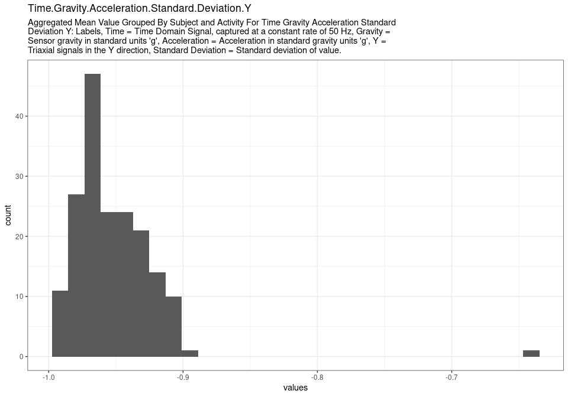

0 missing values.

#### Summary statistics {#Time_Gravity_Acceleration_Standard_Deviation_Y_summary}

|name                                           |label                                                                                                                                                                                                                                                                                                                                                                                      |data_type | n_missing| complete_rate|min   |median |max   |       mean|        sd|hist  |
|:----------------------------------------------|:------------------------------------------------------------------------------------------------------------------------------------------------------------------------------------------------------------------------------------------------------------------------------------------------------------------------------------------------------------------------------------------|:---------|---------:|-------------:|:-----|:------|:-----|----------:|---------:|:-----|
|Time.Gravity.Acceleration.Standard.Deviation.Y |Aggregated Mean Value Grouped By Subject and Activity For Time Gravity Acceleration Standard Deviation Y:  Labels,  Time = Time Domain Signal, captured at a constant rate of 50 Hz, Gravity = Sensor gravity in standard units 'g', Acceleration = Acceleration in standard gravity units 'g', Y = Triaxial signals in the Y direction, Standard Deviation = Standard deviation of value. |numeric   |         0|             1|-0.99 |-0.96  |-0.64 | -0.9524296| 0.0326557|▇▁▁▁▁ |


### Time.Gravity.Acceleration.Standard.Deviation.Z {#Time_Gravity_Acceleration_Standard_Deviation_Z .tabset}

Aggregated Mean Value Grouped By Subject and Activity For Time Gravity Acceleration Standard Deviation Z:  Labels,  Time = Time Domain Signal, captured at a constant rate of 50 Hz, Gravity = Sensor gravity in standard units 'g', Acceleration = Acceleration in standard gravity units 'g', Z = Triaxialsignals in the Z direction, Standard Deviation = Standard deviation of value.

#### Distribution {#Time_Gravity_Acceleration_Standard_Deviation_Z_distribution}

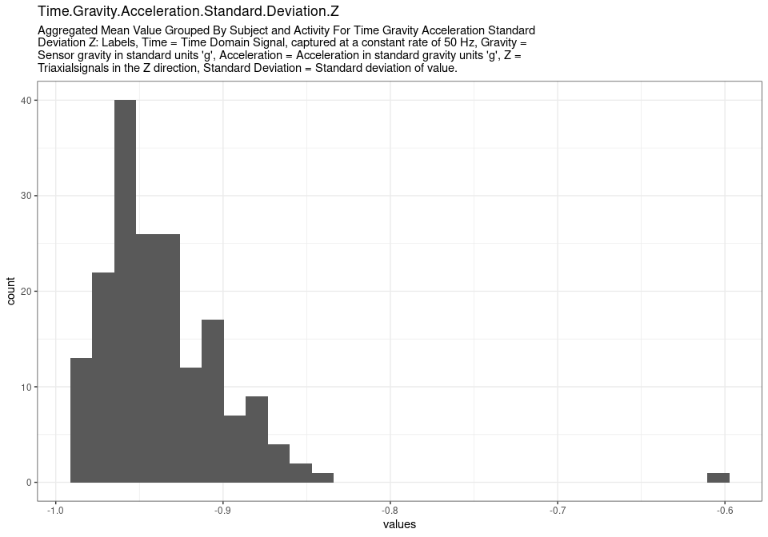

0 missing values.

#### Summary statistics {#Time_Gravity_Acceleration_Standard_Deviation_Z_summary}

|name                                           |label                                                                                                                                                                                                                                                                                                                                                                                     |data_type | n_missing| complete_rate|min   |median |max   |      mean|        sd|hist  |
|:----------------------------------------------|:-----------------------------------------------------------------------------------------------------------------------------------------------------------------------------------------------------------------------------------------------------------------------------------------------------------------------------------------------------------------------------------------|:---------|---------:|-------------:|:-----|:------|:-----|---------:|---------:|:-----|
|Time.Gravity.Acceleration.Standard.Deviation.Z |Aggregated Mean Value Grouped By Subject and Activity For Time Gravity Acceleration Standard Deviation Z:  Labels,  Time = Time Domain Signal, captured at a constant rate of 50 Hz, Gravity = Sensor gravity in standard units 'g', Acceleration = Acceleration in standard gravity units 'g', Z = Triaxialsignals in the Z direction, Standard Deviation = Standard deviation of value. |numeric   |         0|             1|-0.99 |-0.95  |-0.61 | -0.936401| 0.0402912|▇▂▁▁▁ |


### Time.Acceleration.Jerk.Mean.X {#Time_Acceleration_Jerk_Mean_X .tabset}

Aggregated Mean Value Grouped By Subject and Activity For Time Acceleration Jerk Mean X:  Labels,  Time = Time Domain Signal, captured at a constant rate of 50 Hz, Acceleration = Acceleration in standard gravity units 'g', Jerk = Jerk signals in standard gravity units 'g', X = Triaxial signals in the X direction, Mean = Mean of value.

#### Distribution {#Time_Acceleration_Jerk_Mean_X_distribution}

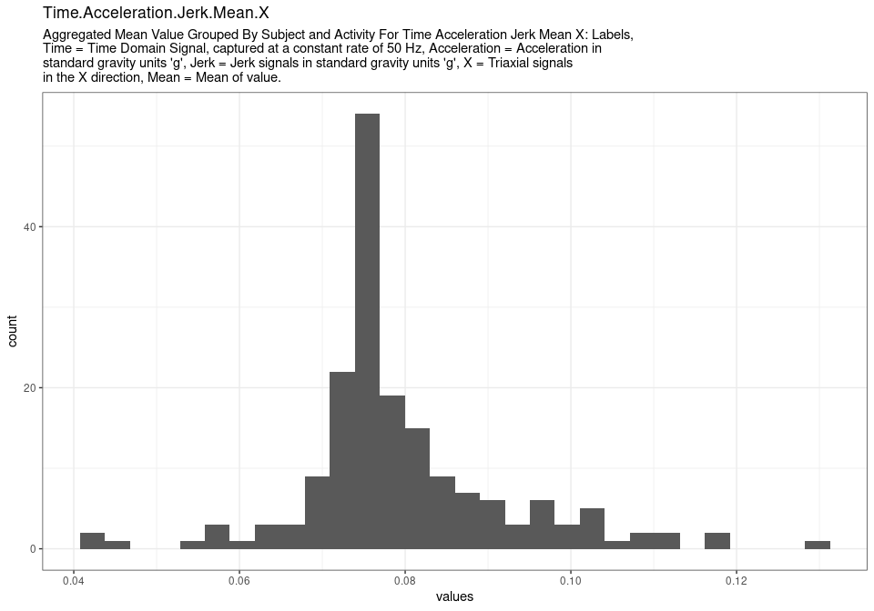

0 missing values.

#### Summary statistics {#Time_Acceleration_Jerk_Mean_X_summary}

|name                          |label                                                                                                                                                                                                                                                                                                                                            |data_type | n_missing| complete_rate|min   |median |max  |      mean|       sd|hist  |
|:-----------------------------|:------------------------------------------------------------------------------------------------------------------------------------------------------------------------------------------------------------------------------------------------------------------------------------------------------------------------------------------------|:---------|---------:|-------------:|:-----|:------|:----|---------:|--------:|:-----|
|Time.Acceleration.Jerk.Mean.X |Aggregated Mean Value Grouped By Subject and Activity For Time Acceleration Jerk Mean X:  Labels,  Time = Time Domain Signal, captured at a constant rate of 50 Hz, Acceleration = Acceleration in standard gravity units 'g', Jerk = Jerk signals in standard gravity units 'g', X = Triaxial signals in the X direction, Mean = Mean of value. |numeric   |         0|             1|0.043 |0.076  |0.13 | 0.0794736| 0.012588|▁▇▃▂▁ |


### Time.Acceleration.Jerk.Mean.Y {#Time_Acceleration_Jerk_Mean_Y .tabset}

Aggregated Mean Value Grouped By Subject and Activity For Time Acceleration Jerk Mean Y:  Labels,  Time = Time Domain Signal, captured at a constant rate of 50 Hz, Acceleration = Acceleration in standard gravity units 'g', Jerk = Jerk signals in standard gravity units 'g', Y = Triaxial signals in the Y direction, Mean = Mean of value.

#### Distribution {#Time_Acceleration_Jerk_Mean_Y_distribution}

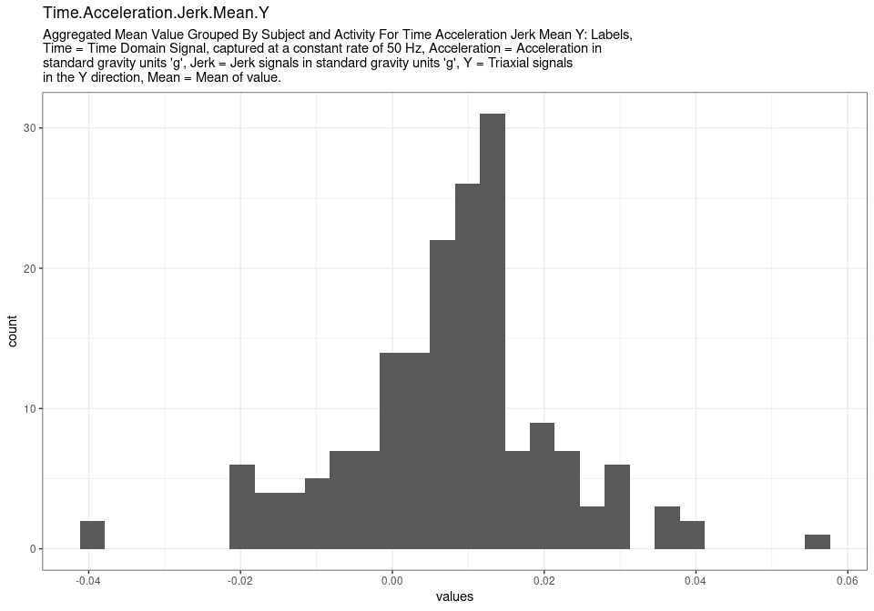

0 missing values.

#### Summary statistics {#Time_Acceleration_Jerk_Mean_Y_summary}

|name                          |label                                                                                                                                                                                                                                                                                                                                            |data_type | n_missing| complete_rate|min    |median |max   |      mean|        sd|hist  |
|:-----------------------------|:------------------------------------------------------------------------------------------------------------------------------------------------------------------------------------------------------------------------------------------------------------------------------------------------------------------------------------------------|:---------|---------:|-------------:|:------|:------|:-----|---------:|---------:|:-----|
|Time.Acceleration.Jerk.Mean.Y |Aggregated Mean Value Grouped By Subject and Activity For Time Acceleration Jerk Mean Y:  Labels,  Time = Time Domain Signal, captured at a constant rate of 50 Hz, Acceleration = Acceleration in standard gravity units 'g', Jerk = Jerk signals in standard gravity units 'g', Y = Triaxial signals in the Y direction, Mean = Mean of value. |numeric   |         0|             1|-0.039 |0.0095 |0.057 | 0.0075652| 0.0135764|▁▃▇▂▁ |


### Time.Acceleration.Jerk.Mean.Z {#Time_Acceleration_Jerk_Mean_Z .tabset}

Aggregated Mean Value Grouped By Subject and Activity For Time Acceleration Jerk Mean Z:  Labels,  Time = Time Domain Signal, captured at a constant rate of 50 Hz, Acceleration = Acceleration in standard gravity units 'g', Jerk = Jerk signals in standard gravity units 'g', Z = Triaxialsignals in the Z direction, Mean = Mean of value.

#### Distribution {#Time_Acceleration_Jerk_Mean_Z_distribution}


0 missing values.

#### Summary statistics {#Time_Acceleration_Jerk_Mean_Z_summary}

|name                          |label                                                                                                                                                                                                                                                                                                                                           |data_type | n_missing| complete_rate|min    |median  |max   |       mean|        sd|hist  |
|:-----------------------------|:-----------------------------------------------------------------------------------------------------------------------------------------------------------------------------------------------------------------------------------------------------------------------------------------------------------------------------------------------|:---------|---------:|-------------:|:------|:-------|:-----|----------:|---------:|:-----|
|Time.Acceleration.Jerk.Mean.Z |Aggregated Mean Value Grouped By Subject and Activity For Time Acceleration Jerk Mean Z:  Labels,  Time = Time Domain Signal, captured at a constant rate of 50 Hz, Acceleration = Acceleration in standard gravity units 'g', Jerk = Jerk signals in standard gravity units 'g', Z = Triaxialsignals in the Z direction, Mean = Mean of value. |numeric   |         0|             1|-0.067 |-0.0039 |0.038 | -0.0049534| 0.0134621|▁▁▇▇▁ |


### Time.Acceleration.Jerk.Standard.Deviation.X {#Time_Acceleration_Jerk_Standard_Deviation_X .tabset}

Aggregated Mean Value Grouped By Subject and Activity For Time Acceleration Jerk Standard Deviation X:  Labels,  Time = Time Domain Signal, captured at a constant rate of 50 Hz, Acceleration = Acceleration in standard gravity units 'g', Jerk = Jerk signals in standard gravity units 'g', X = Triaxial signals in the X direction, Standard Deviation = Standard deviation of value.

#### Distribution {#Time_Acceleration_Jerk_Standard_Deviation_X_distribution}

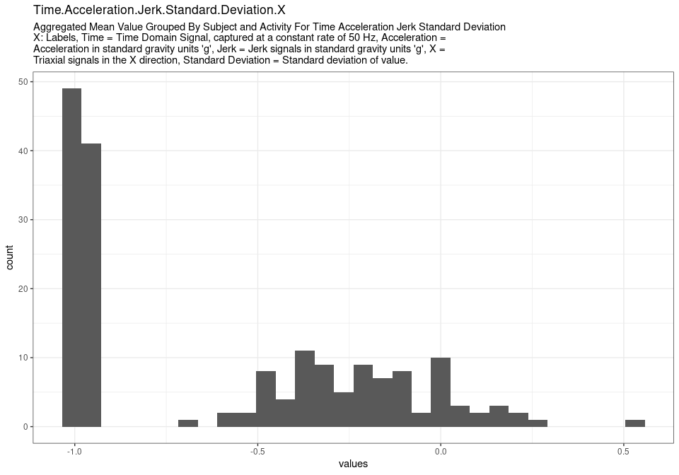

0 missing values.

#### Summary statistics {#Time_Acceleration_Jerk_Standard_Deviation_X_summary}

|name                                        |label                                                                                                                                                                                                                                                                                                                                                                                      |data_type | n_missing| complete_rate|min   |median |max  |       mean|        sd|hist  |
|:-------------------------------------------|:------------------------------------------------------------------------------------------------------------------------------------------------------------------------------------------------------------------------------------------------------------------------------------------------------------------------------------------------------------------------------------------|:---------|---------:|-------------:|:-----|:------|:----|----------:|---------:|:-----|
|Time.Acceleration.Jerk.Standard.Deviation.X |Aggregated Mean Value Grouped By Subject and Activity For Time Acceleration Jerk Standard Deviation X:  Labels,  Time = Time Domain Signal, captured at a constant rate of 50 Hz, Acceleration = Acceleration in standard gravity units 'g', Jerk = Jerk signals in standard gravity units 'g', X = Triaxial signals in the X direction, Standard Deviation = Standard deviation of value. |numeric   |         0|             1|-0.99 |-0.81  |0.54 | -0.5949467| 0.4175865|▇▂▅▂▁ |


### Time.Acceleration.Jerk.Standard.Deviation.Y {#Time_Acceleration_Jerk_Standard_Deviation_Y .tabset}

Aggregated Mean Value Grouped By Subject and Activity For Time Acceleration Jerk Standard Deviation Y:  Labels,  Time = Time Domain Signal, captured at a constant rate of 50 Hz, Acceleration = Acceleration in standard gravity units 'g', Jerk = Jerk signals in standard gravity units 'g', Y = Triaxial signals in the Y direction, Standard Deviation = Standard deviation of value.

#### Distribution {#Time_Acceleration_Jerk_Standard_Deviation_Y_distribution}


0 missing values.

#### Summary statistics {#Time_Acceleration_Jerk_Standard_Deviation_Y_summary}

|name                                        |label                                                                                                                                                                                                                                                                                                                                                                                      |data_type | n_missing| complete_rate|min   |median |max  |       mean|        sd|hist  |
|:-------------------------------------------|:------------------------------------------------------------------------------------------------------------------------------------------------------------------------------------------------------------------------------------------------------------------------------------------------------------------------------------------------------------------------------------------|:---------|---------:|-------------:|:-----|:------|:----|----------:|---------:|:-----|
|Time.Acceleration.Jerk.Standard.Deviation.Y |Aggregated Mean Value Grouped By Subject and Activity For Time Acceleration Jerk Standard Deviation Y:  Labels,  Time = Time Domain Signal, captured at a constant rate of 50 Hz, Acceleration = Acceleration in standard gravity units 'g', Jerk = Jerk signals in standard gravity units 'g', Y = Triaxial signals in the Y direction, Standard Deviation = Standard deviation of value. |numeric   |         0|             1|-0.99 |-0.78  |0.36 | -0.5654147| 0.4330871|▇▁▃▃▁ |


### Time.Acceleration.Jerk.Standard.Deviation.Z {#Time_Acceleration_Jerk_Standard_Deviation_Z .tabset}

Aggregated Mean Value Grouped By Subject and Activity For Time Acceleration Jerk Standard Deviation Z:  Labels,  Time = Time Domain Signal, captured at a constant rate of 50 Hz, Acceleration = Acceleration in standard gravity units 'g', Jerk = Jerk signals in standard gravity units 'g', Z = Triaxialsignals in the Z direction, Standard Deviation = Standard deviation of value.

#### Distribution {#Time_Acceleration_Jerk_Standard_Deviation_Z_distribution}

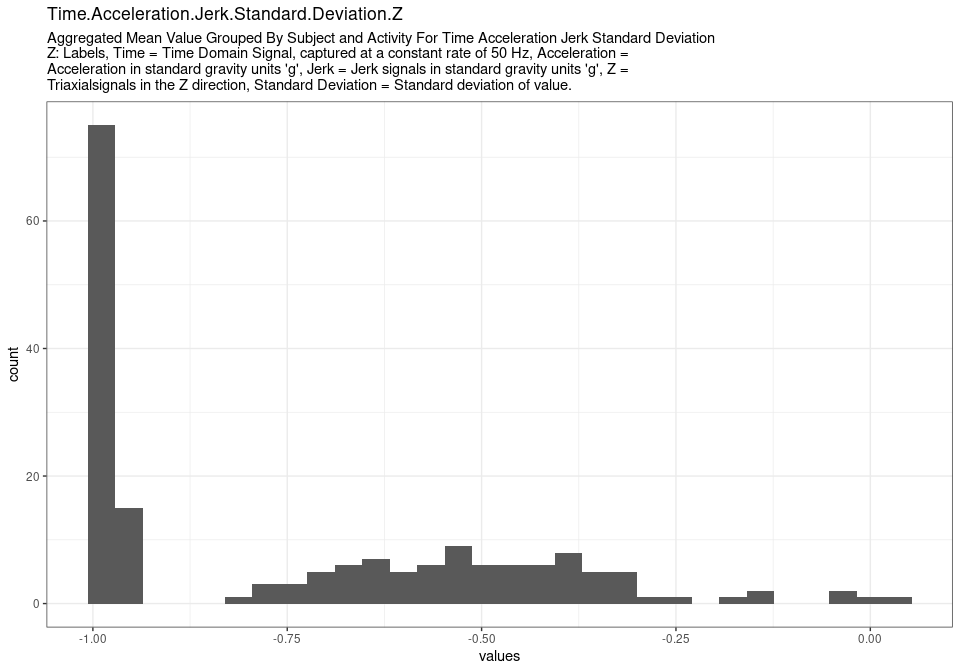

0 missing values.

#### Summary statistics {#Time_Acceleration_Jerk_Standard_Deviation_Z_summary}

|name                                        |label                                                                                                                                                                                                                                                                                                                                                                                     |data_type | n_missing| complete_rate|min   |median |max   |       mean|        sd|hist  |
|:-------------------------------------------|:-----------------------------------------------------------------------------------------------------------------------------------------------------------------------------------------------------------------------------------------------------------------------------------------------------------------------------------------------------------------------------------------|:---------|---------:|-------------:|:-----|:------|:-----|----------:|---------:|:-----|
|Time.Acceleration.Jerk.Standard.Deviation.Z |Aggregated Mean Value Grouped By Subject and Activity For Time Acceleration Jerk Standard Deviation Z:  Labels,  Time = Time Domain Signal, captured at a constant rate of 50 Hz, Acceleration = Acceleration in standard gravity units 'g', Jerk = Jerk signals in standard gravity units 'g', Z = Triaxialsignals in the Z direction, Standard Deviation = Standard deviation of value. |numeric   |         0|             1|-0.99 |-0.88  |0.031 | -0.7359577| 0.2768479|▇▂▃▁▁ |


### Time.Gyroscope.Mean.X {#Time_Gyroscope_Mean_X .tabset}

Aggregated Mean Value Grouped By Subject and Activity For Time Gyroscope Mean X:  Labels,  Time = Time Domain Signal, captured at a constant rate of 50 Hz, Gyroscope = The gyroscope sensor signals in radians/second, X = Triaxial signals in the X direction, Mean = Mean of value.

#### Distribution {#Time_Gyroscope_Mean_X_distribution}

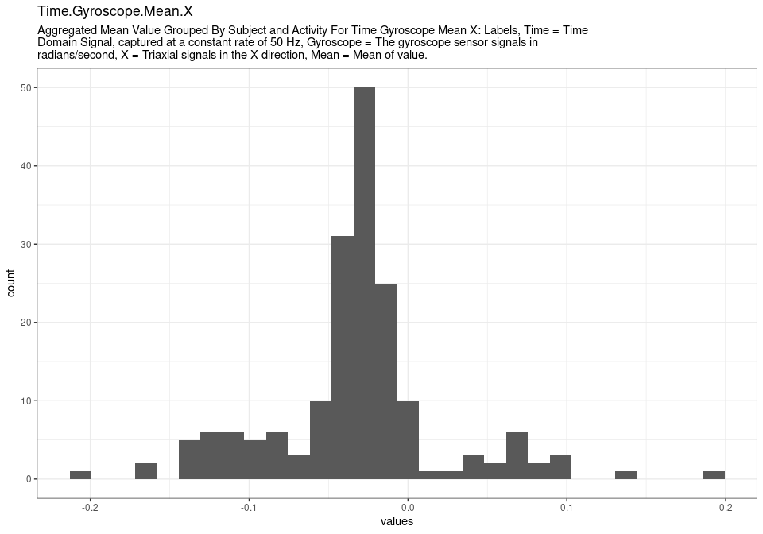

0 missing values.

#### Summary statistics {#Time_Gyroscope_Mean_X_summary}

|name                  |label                                                                                                                                                                                                                                                                                  |data_type | n_missing| complete_rate|min   |median |max  |       mean|        sd|hist  |
|:---------------------|:--------------------------------------------------------------------------------------------------------------------------------------------------------------------------------------------------------------------------------------------------------------------------------------|:---------|---------:|-------------:|:-----|:------|:----|----------:|---------:|:-----|
|Time.Gyroscope.Mean.X |Aggregated Mean Value Grouped By Subject and Activity For Time Gyroscope Mean X:  Labels,  Time = Time Domain Signal, captured at a constant rate of 50 Hz, Gyroscope = The gyroscope sensor signals in radians/second, X = Triaxial signals in the X direction, Mean = Mean of value. |numeric   |         0|             1|-0.21 |-0.029 |0.19 | -0.0324372| 0.0540518|▁▂▇▁▁ |


### Time.Gyroscope.Mean.Y {#Time_Gyroscope_Mean_Y .tabset}

Aggregated Mean Value Grouped By Subject and Activity For Time Gyroscope Mean Y:  Labels,  Time = Time Domain Signal, captured at a constant rate of 50 Hz, Gyroscope = The gyroscope sensor signals in radians/second, Y = Triaxial signals in the Y direction, Mean = Mean of value.

#### Distribution {#Time_Gyroscope_Mean_Y_distribution}

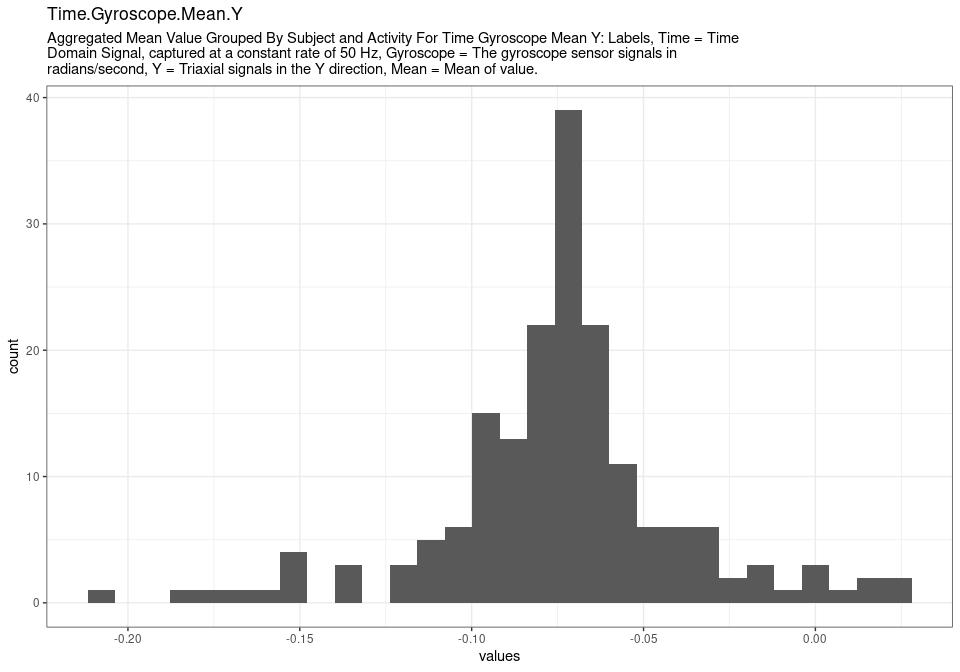

0 missing values.

#### Summary statistics {#Time_Gyroscope_Mean_Y_summary}

|name                  |label                                                                                                                                                                                                                                                                                  |data_type | n_missing| complete_rate|min  |median |max   |       mean|        sd|hist  |
|:---------------------|:--------------------------------------------------------------------------------------------------------------------------------------------------------------------------------------------------------------------------------------------------------------------------------------|:---------|---------:|-------------:|:----|:------|:-----|----------:|---------:|:-----|
|Time.Gyroscope.Mean.Y |Aggregated Mean Value Grouped By Subject and Activity For Time Gyroscope Mean Y:  Labels,  Time = Time Domain Signal, captured at a constant rate of 50 Hz, Gyroscope = The gyroscope sensor signals in radians/second, Y = Triaxial signals in the Y direction, Mean = Mean of value. |numeric   |         0|             1|-0.2 |-0.073 |0.027 | -0.0742596| 0.0355415|▁▁▇▃▁ |


### Time.Gyroscope.Mean.Z {#Time_Gyroscope_Mean_Z .tabset}

Aggregated Mean Value Grouped By Subject and Activity For Time Gyroscope Mean Z:  Labels,  Time = Time Domain Signal, captured at a constant rate of 50 Hz, Gyroscope = The gyroscope sensor signals in radians/second, Z = Triaxialsignals in the Z direction, Mean = Mean of value.

#### Distribution {#Time_Gyroscope_Mean_Z_distribution}

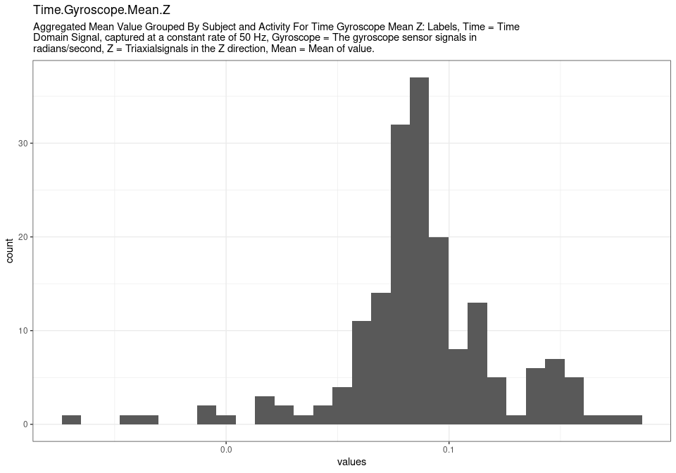

0 missing values.

#### Summary statistics {#Time_Gyroscope_Mean_Z_summary}

|name                  |label                                                                                                                                                                                                                                                                                 |data_type | n_missing| complete_rate|min    |median |max  |      mean|        sd|hist  |
|:---------------------|:-------------------------------------------------------------------------------------------------------------------------------------------------------------------------------------------------------------------------------------------------------------------------------------|:---------|---------:|-------------:|:------|:------|:----|---------:|---------:|:-----|
|Time.Gyroscope.Mean.Z |Aggregated Mean Value Grouped By Subject and Activity For Time Gyroscope Mean Z:  Labels,  Time = Time Domain Signal, captured at a constant rate of 50 Hz, Gyroscope = The gyroscope sensor signals in radians/second, Z = Triaxialsignals in the Z direction, Mean = Mean of value. |numeric   |         0|             1|-0.072 |0.085  |0.18 | 0.0874446| 0.0362125|▁▁▃▇▂ |


### Time.Gyroscope.Standard.Deviation.X {#Time_Gyroscope_Standard_Deviation_X .tabset}

Aggregated Mean Value Grouped By Subject and Activity For Time Gyroscope Standard Deviation X:  Labels,  Time = Time Domain Signal, captured at a constant rate of 50 Hz, Gyroscope = The gyroscope sensor signals in radians/second, X = Triaxial signals in the X direction, Standard Deviation = Standard deviation of value.

#### Distribution {#Time_Gyroscope_Standard_Deviation_X_distribution}

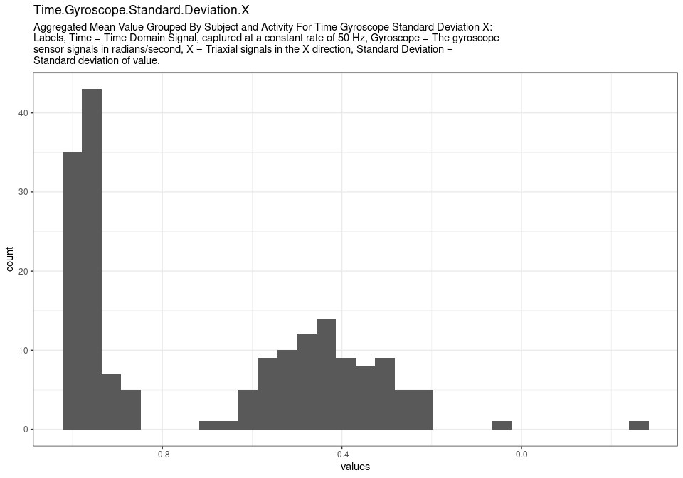

0 missing values.

#### Summary statistics {#Time_Gyroscope_Standard_Deviation_X_summary}

|name                                |label                                                                                                                                                                                                                                                                                                                            |data_type | n_missing| complete_rate|min   |median |max  |       mean|        sd|hist  |
|:-----------------------------------|:--------------------------------------------------------------------------------------------------------------------------------------------------------------------------------------------------------------------------------------------------------------------------------------------------------------------------------|:---------|---------:|-------------:|:-----|:------|:----|----------:|---------:|:-----|
|Time.Gyroscope.Standard.Deviation.X |Aggregated Mean Value Grouped By Subject and Activity For Time Gyroscope Standard Deviation X:  Labels,  Time = Time Domain Signal, captured at a constant rate of 50 Hz, Gyroscope = The gyroscope sensor signals in radians/second, X = Triaxial signals in the X direction, Standard Deviation = Standard deviation of value. |numeric   |         0|             1|-0.99 |-0.79  |0.27 | -0.6916399| 0.2910189|▇▃▅▁▁ |


### Time.Gyroscope.Standard.Deviation.Y {#Time_Gyroscope_Standard_Deviation_Y .tabset}

Aggregated Mean Value Grouped By Subject and Activity For Time Gyroscope Standard Deviation Y:  Labels,  Time = Time Domain Signal, captured at a constant rate of 50 Hz, Gyroscope = The gyroscope sensor signals in radians/second, Y = Triaxial signals in the Y direction, Standard Deviation = Standard deviation of value.

#### Distribution {#Time_Gyroscope_Standard_Deviation_Y_distribution}

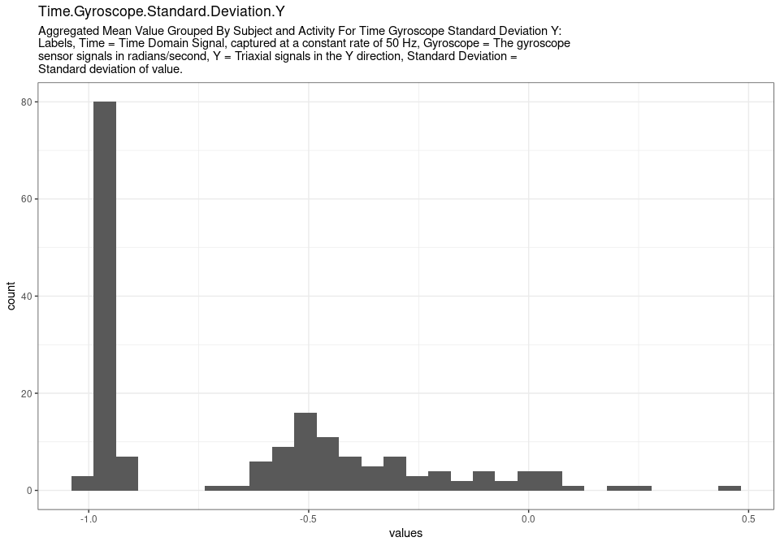

0 missing values.

#### Summary statistics {#Time_Gyroscope_Standard_Deviation_Y_summary}

|name                                |label                                                                                                                                                                                                                                                                                                                            |data_type | n_missing| complete_rate|min   |median |max  |      mean|        sd|hist  |
|:-----------------------------------|:--------------------------------------------------------------------------------------------------------------------------------------------------------------------------------------------------------------------------------------------------------------------------------------------------------------------------------|:---------|---------:|-------------:|:-----|:------|:----|---------:|---------:|:-----|
|Time.Gyroscope.Standard.Deviation.Y |Aggregated Mean Value Grouped By Subject and Activity For Time Gyroscope Standard Deviation Y:  Labels,  Time = Time Domain Signal, captured at a constant rate of 50 Hz, Gyroscope = The gyroscope sensor signals in radians/second, Y = Triaxial signals in the Y direction, Standard Deviation = Standard deviation of value. |numeric   |         0|             1|-0.99 |-0.8   |0.48 | -0.653302| 0.3520252|▇▅▂▁▁ |


### Time.Gyroscope.Standard.Deviation.Z {#Time_Gyroscope_Standard_Deviation_Z .tabset}

Aggregated Mean Value Grouped By Subject and Activity For Time Gyroscope Standard Deviation Z:  Labels,  Time = Time Domain Signal, captured at a constant rate of 50 Hz, Gyroscope = The gyroscope sensor signals in radians/second, Z = Triaxialsignals in the Z direction, Standard Deviation = Standard deviation of value.

#### Distribution {#Time_Gyroscope_Standard_Deviation_Z_distribution}

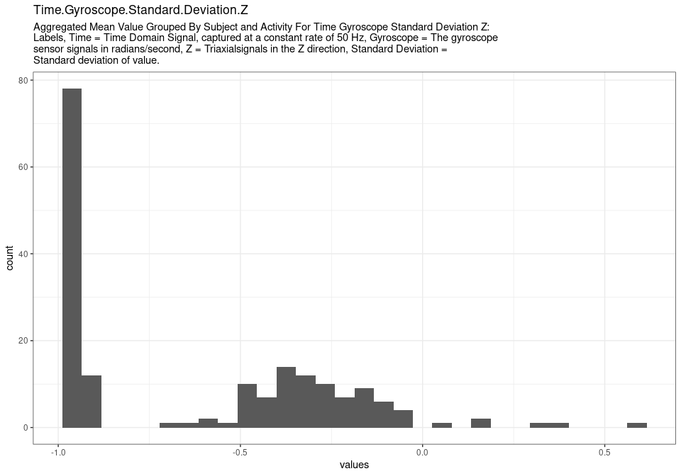

0 missing values.

#### Summary statistics {#Time_Gyroscope_Standard_Deviation_Z_summary}

|name                                |label                                                                                                                                                                                                                                                                                                                           |data_type | n_missing| complete_rate|min   |median |max  |       mean|        sd|hist  |
|:-----------------------------------|:-------------------------------------------------------------------------------------------------------------------------------------------------------------------------------------------------------------------------------------------------------------------------------------------------------------------------------|:---------|---------:|-------------:|:-----|:------|:----|----------:|---------:|:-----|
|Time.Gyroscope.Standard.Deviation.Z |Aggregated Mean Value Grouped By Subject and Activity For Time Gyroscope Standard Deviation Z:  Labels,  Time = Time Domain Signal, captured at a constant rate of 50 Hz, Gyroscope = The gyroscope sensor signals in radians/second, Z = Triaxialsignals in the Z direction, Standard Deviation = Standard deviation of value. |numeric   |         0|             1|-0.99 |-0.8   |0.56 | -0.6164353| 0.3730264|▇▂▅▁▁ |


### Time.Gyroscope.Jerk.Mean.X {#Time_Gyroscope_Jerk_Mean_X .tabset}

Aggregated Mean Value Grouped By Subject and Activity For Time Gyroscope Jerk Mean X:  Labels,  Time = Time Domain Signal, captured at a constant rate of 50 Hz, Gyroscope = The gyroscope sensor signals in radians/second, Jerk = Jerk signals in standard gravity units 'g', X = Triaxial signals in the X direction, Mean = Mean of value.

#### Distribution {#Time_Gyroscope_Jerk_Mean_X_distribution}

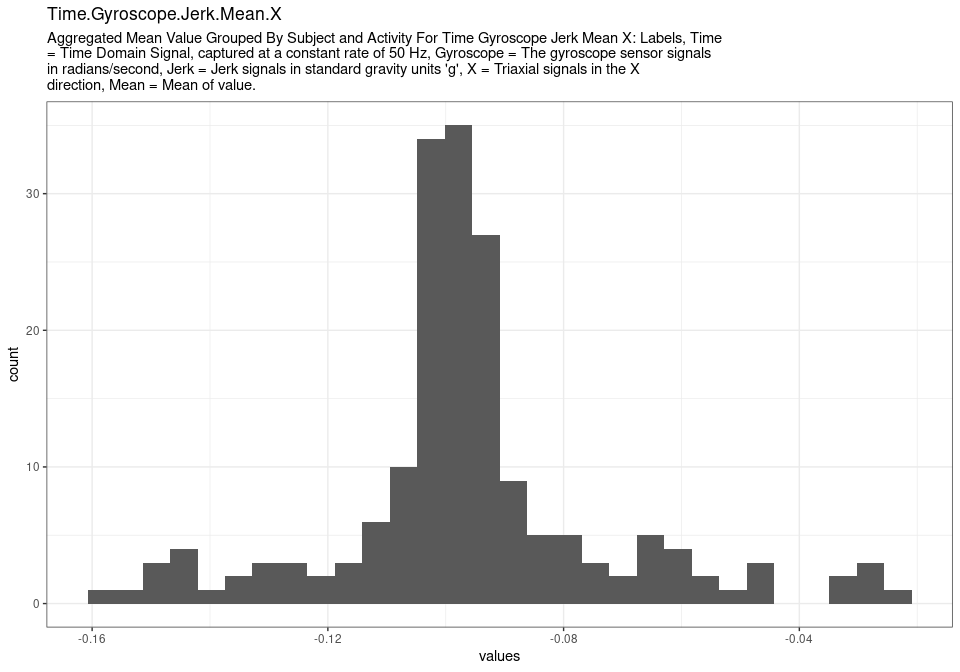

0 missing values.

#### Summary statistics {#Time_Gyroscope_Jerk_Mean_X_summary}

|name                       |label                                                                                                                                                                                                                                                                                                                                          |data_type | n_missing| complete_rate|min   |median |max    |       mean|        sd|hist  |
|:--------------------------|:----------------------------------------------------------------------------------------------------------------------------------------------------------------------------------------------------------------------------------------------------------------------------------------------------------------------------------------------|:---------|---------:|-------------:|:-----|:------|:------|----------:|---------:|:-----|
|Time.Gyroscope.Jerk.Mean.X |Aggregated Mean Value Grouped By Subject and Activity For Time Gyroscope Jerk Mean X:  Labels,  Time = Time Domain Signal, captured at a constant rate of 50 Hz, Gyroscope = The gyroscope sensor signals in radians/second, Jerk = Jerk signals in standard gravity units 'g', X = Triaxial signals in the X direction, Mean = Mean of value. |numeric   |         0|             1|-0.16 |-0.099 |-0.022 | -0.0960568| 0.0233458|▁▂▇▁▁ |


### Time.Gyroscope.Jerk.Mean.Y {#Time_Gyroscope_Jerk_Mean_Y .tabset}

Aggregated Mean Value Grouped By Subject and Activity For Time Gyroscope Jerk Mean Y:  Labels,  Time = Time Domain Signal, captured at a constant rate of 50 Hz, Gyroscope = The gyroscope sensor signals in radians/second, Jerk = Jerk signals in standard gravity units 'g', Y = Triaxial signals in the Y direction, Mean = Mean of value.

#### Distribution {#Time_Gyroscope_Jerk_Mean_Y_distribution}

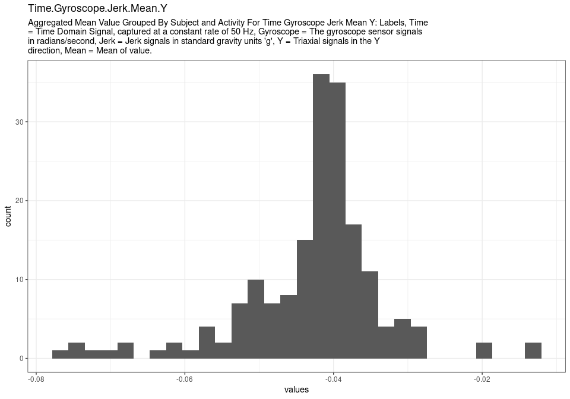

0 missing values.

#### Summary statistics {#Time_Gyroscope_Jerk_Mean_Y_summary}

|name                       |label                                                                                                                                                                                                                                                                                                                                          |data_type | n_missing| complete_rate|min    |median |max    |       mean|       sd|hist  |
|:--------------------------|:----------------------------------------------------------------------------------------------------------------------------------------------------------------------------------------------------------------------------------------------------------------------------------------------------------------------------------------------|:---------|---------:|-------------:|:------|:------|:------|----------:|--------:|:-----|
|Time.Gyroscope.Jerk.Mean.Y |Aggregated Mean Value Grouped By Subject and Activity For Time Gyroscope Jerk Mean Y:  Labels,  Time = Time Domain Signal, captured at a constant rate of 50 Hz, Gyroscope = The gyroscope sensor signals in radians/second, Jerk = Jerk signals in standard gravity units 'g', Y = Triaxial signals in the Y direction, Mean = Mean of value. |numeric   |         0|             1|-0.077 |-0.041 |-0.013 | -0.0426928| 0.009532|▁▂▇▃▁ |


### Time.Gyroscope.Jerk.Mean.Z {#Time_Gyroscope_Jerk_Mean_Z .tabset}

Aggregated Mean Value Grouped By Subject and Activity For Time Gyroscope Jerk Mean Z:  Labels,  Time = Time Domain Signal, captured at a constant rate of 50 Hz, Gyroscope = The gyroscope sensor signals in radians/second, Jerk = Jerk signals in standard gravity units 'g', Z = Triaxialsignals in the Z direction, Mean = Mean of value.

#### Distribution {#Time_Gyroscope_Jerk_Mean_Z_distribution}

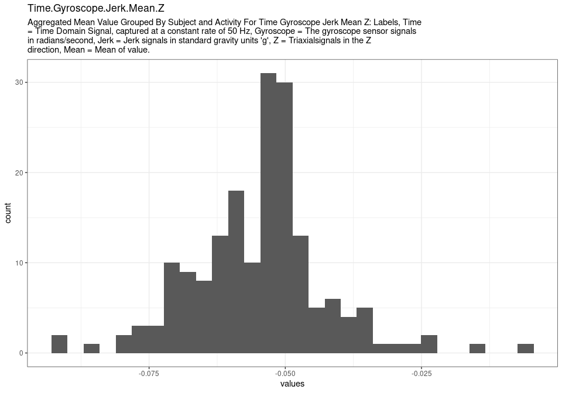

0 missing values.

#### Summary statistics {#Time_Gyroscope_Jerk_Mean_Z_summary}

|name                       |label                                                                                                                                                                                                                                                                                                                                         |data_type | n_missing| complete_rate|min    |median |max     |       mean|       sd|hist  |
|:--------------------------|:---------------------------------------------------------------------------------------------------------------------------------------------------------------------------------------------------------------------------------------------------------------------------------------------------------------------------------------------|:---------|---------:|-------------:|:------|:------|:-------|----------:|--------:|:-----|
|Time.Gyroscope.Jerk.Mean.Z |Aggregated Mean Value Grouped By Subject and Activity For Time Gyroscope Jerk Mean Z:  Labels,  Time = Time Domain Signal, captured at a constant rate of 50 Hz, Gyroscope = The gyroscope sensor signals in radians/second, Jerk = Jerk signals in standard gravity units 'g', Z = Triaxialsignals in the Z direction, Mean = Mean of value. |numeric   |         0|             1|-0.092 |-0.053 |-0.0069 | -0.0548019| 0.012347|▁▅▇▁▁ |


### Time.Gyroscope.Jerk.Standard.Deviation.X {#Time_Gyroscope_Jerk_Standard_Deviation_X .tabset}

Aggregated Mean Value Grouped By Subject and Activity For Time Gyroscope Jerk Standard Deviation X:  Labels,  Time = Time Domain Signal, captured at a constant rate of 50 Hz, Gyroscope = The gyroscope sensor signals in radians/second, Jerk = Jerk signals in standard gravity units 'g', X = Triaxial signals in the X direction, Standard Deviation = Standard deviation of value.

#### Distribution {#Time_Gyroscope_Jerk_Standard_Deviation_X_distribution}

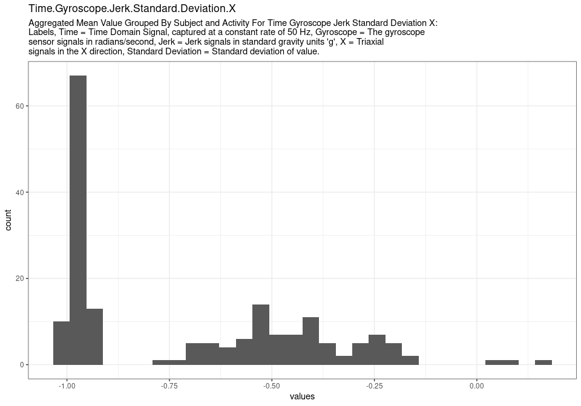

0 missing values.

#### Summary statistics {#Time_Gyroscope_Jerk_Standard_Deviation_X_summary}

|name                                     |label                                                                                                                                                                                                                                                                                                                                                                                    |data_type | n_missing| complete_rate|min |median |max  |       mean|        sd|hist  |
|:----------------------------------------|:----------------------------------------------------------------------------------------------------------------------------------------------------------------------------------------------------------------------------------------------------------------------------------------------------------------------------------------------------------------------------------------|:---------|---------:|-------------:|:---|:------|:----|----------:|---------:|:-----|
|Time.Gyroscope.Jerk.Standard.Deviation.X |Aggregated Mean Value Grouped By Subject and Activity For Time Gyroscope Jerk Standard Deviation X:  Labels,  Time = Time Domain Signal, captured at a constant rate of 50 Hz, Gyroscope = The gyroscope sensor signals in radians/second, Jerk = Jerk signals in standard gravity units 'g', X = Triaxial signals in the X direction, Standard Deviation = Standard deviation of value. |numeric   |         0|             1|-1  |-0.84  |0.18 | -0.7036327| 0.3008361|▇▂▃▂▁ |


### Time.Gyroscope.Jerk.Standard.Deviation.Y {#Time_Gyroscope_Jerk_Standard_Deviation_Y .tabset}

Aggregated Mean Value Grouped By Subject and Activity For Time Gyroscope Jerk Standard Deviation Y:  Labels,  Time = Time Domain Signal, captured at a constant rate of 50 Hz, Gyroscope = The gyroscope sensor signals in radians/second, Jerk = Jerk signals in standard gravity units 'g', Y = Triaxial signals in the Y direction, Standard Deviation = Standard deviation of value.

#### Distribution {#Time_Gyroscope_Jerk_Standard_Deviation_Y_distribution}

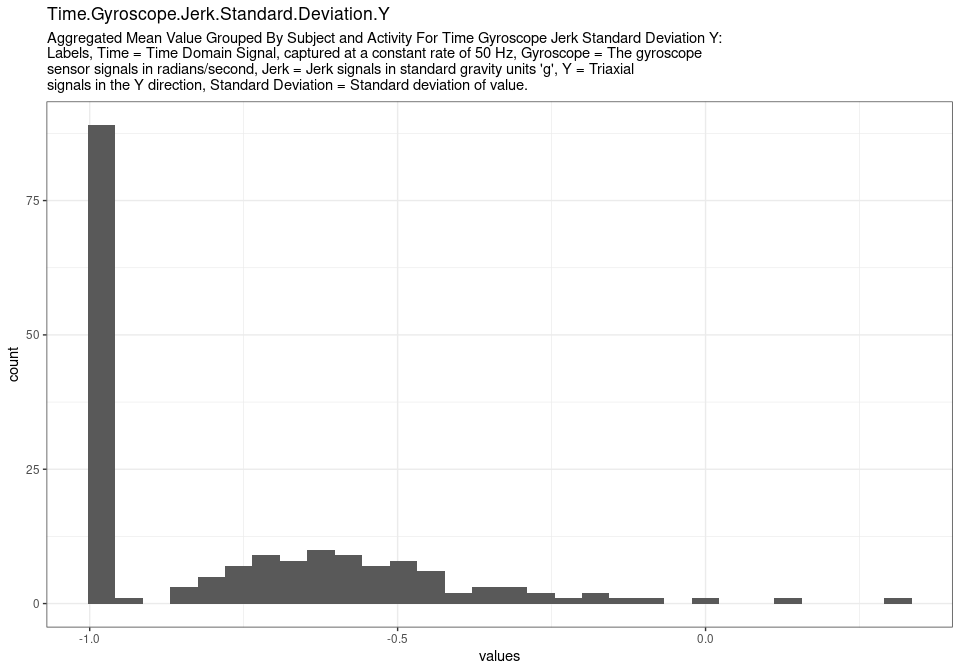

0 missing values.

#### Summary statistics {#Time_Gyroscope_Jerk_Standard_Deviation_Y_summary}

|name                                     |label                                                                                                                                                                                                                                                                                                                                                                                    |data_type | n_missing| complete_rate|min |median |max |       mean|        sd|hist  |
|:----------------------------------------|:----------------------------------------------------------------------------------------------------------------------------------------------------------------------------------------------------------------------------------------------------------------------------------------------------------------------------------------------------------------------------------------|:---------|---------:|-------------:|:---|:------|:---|----------:|---------:|:-----|
|Time.Gyroscope.Jerk.Standard.Deviation.Y |Aggregated Mean Value Grouped By Subject and Activity For Time Gyroscope Jerk Standard Deviation Y:  Labels,  Time = Time Domain Signal, captured at a constant rate of 50 Hz, Gyroscope = The gyroscope sensor signals in radians/second, Jerk = Jerk signals in standard gravity units 'g', Y = Triaxial signals in the Y direction, Standard Deviation = Standard deviation of value. |numeric   |         0|             1|-1  |-0.89  |0.3 | -0.7635518| 0.2672885|▇▃▂▁▁ |


### Time.Gyroscope.Jerk.Standard.Deviation.Z {#Time_Gyroscope_Jerk_Standard_Deviation_Z .tabset}

Aggregated Mean Value Grouped By Subject and Activity For Time Gyroscope Jerk Standard Deviation Z:  Labels,  Time = Time Domain Signal, captured at a constant rate of 50 Hz, Gyroscope = The gyroscope sensor signals in radians/second, Jerk = Jerk signals in standard gravity units 'g', Z = Triaxialsignals in the Z direction, Standard Deviation = Standard deviation of value.

#### Distribution {#Time_Gyroscope_Jerk_Standard_Deviation_Z_distribution}

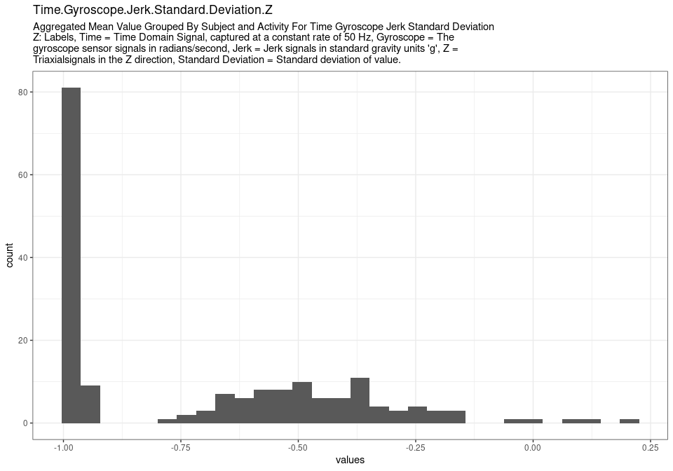

0 missing values.

#### Summary statistics {#Time_Gyroscope_Jerk_Standard_Deviation_Z_summary}

|name                                     |label                                                                                                                                                                                                                                                                                                                                                                                   |data_type | n_missing| complete_rate|min |median |max  |       mean|        sd|hist  |
|:----------------------------------------|:---------------------------------------------------------------------------------------------------------------------------------------------------------------------------------------------------------------------------------------------------------------------------------------------------------------------------------------------------------------------------------------|:---------|---------:|-------------:|:---|:------|:----|----------:|---------:|:-----|
|Time.Gyroscope.Jerk.Standard.Deviation.Z |Aggregated Mean Value Grouped By Subject and Activity For Time Gyroscope Jerk Standard Deviation Z:  Labels,  Time = Time Domain Signal, captured at a constant rate of 50 Hz, Gyroscope = The gyroscope sensor signals in radians/second, Jerk = Jerk signals in standard gravity units 'g', Z = Triaxialsignals in the Z direction, Standard Deviation = Standard deviation of value. |numeric   |         0|             1|-1  |-0.86  |0.19 | -0.7095592| 0.3045394|▇▃▃▁▁ |


### Time.Acceleration.Magnitude.Mean {#Time_Acceleration_Magnitude_Mean .tabset}

Aggregated Mean Value Grouped By Subject and Activity For Time Acceleration Magnitude Mean:  Labels,  Time = Time Domain Signal, captured at a constant rate of 50 Hz, Acceleration = Acceleration in standard gravity units 'g', Magnitude = The magnitude measured in the Euclidean norm, Mean = Mean of value.

#### Distribution {#Time_Acceleration_Magnitude_Mean_distribution}

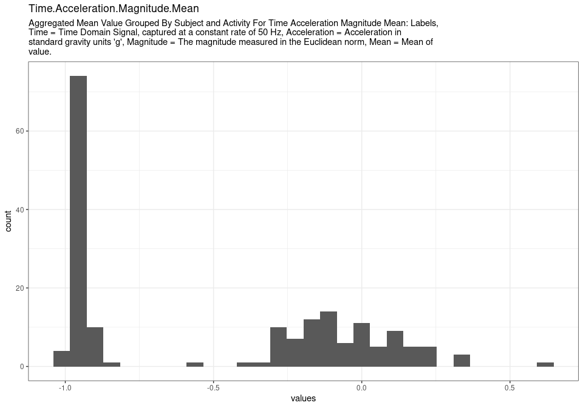

0 missing values.

#### Summary statistics {#Time_Acceleration_Magnitude_Mean_summary}

|name                             |label                                                                                                                                                                                                                                                                                                             |data_type | n_missing| complete_rate|min   |median |max  |       mean|        sd|hist  |
|:--------------------------------|:-----------------------------------------------------------------------------------------------------------------------------------------------------------------------------------------------------------------------------------------------------------------------------------------------------------------|:---------|---------:|-------------:|:-----|:------|:----|----------:|---------:|:-----|
|Time.Acceleration.Magnitude.Mean |Aggregated Mean Value Grouped By Subject and Activity For Time Acceleration Magnitude Mean:  Labels,  Time = Time Domain Signal, captured at a constant rate of 50 Hz, Acceleration = Acceleration in standard gravity units 'g', Magnitude = The magnitude measured in the Euclidean norm, Mean = Mean of value. |numeric   |         0|             1|-0.99 |-0.48  |0.64 | -0.4972897| 0.4728834|▇▁▅▃▁ |


### Time.Acceleration.Magnitude.Standard.Deviation {#Time_Acceleration_Magnitude_Standard_Deviation .tabset}

Aggregated Mean Value Grouped By Subject and Activity For Time Acceleration Magnitude Standard Deviation:  Labels,  Time = Time Domain Signal, captured at a constant rate of 50 Hz, Acceleration = Acceleration in standard gravity units 'g', Magnitude = The magnitude measured in the Euclidean norm, Standard Deviation = Standard deviation of value.

#### Distribution {#Time_Acceleration_Magnitude_Standard_Deviation_distribution}

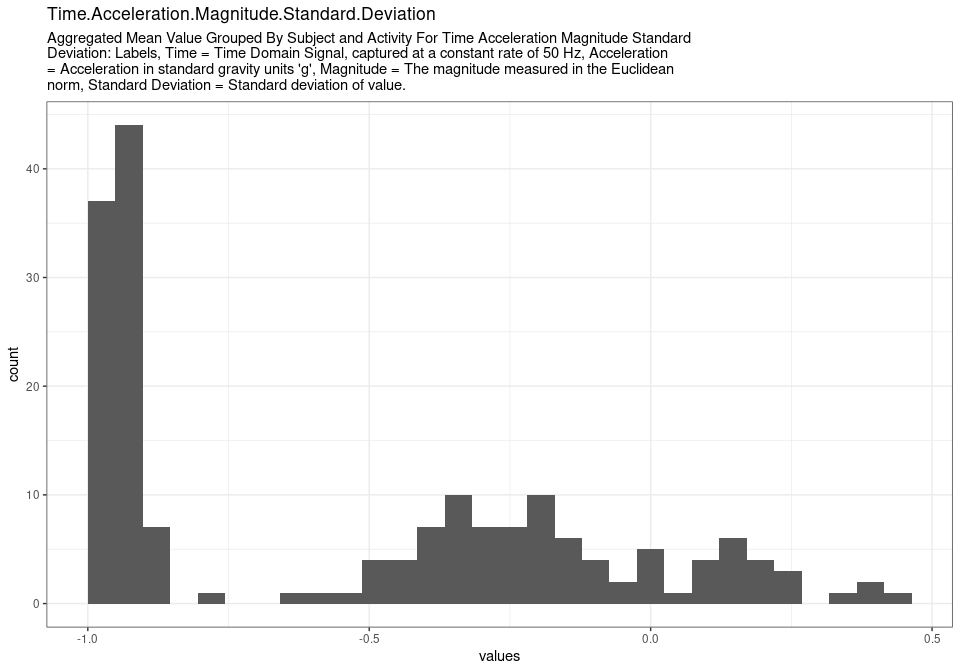

0 missing values.

#### Summary statistics {#Time_Acceleration_Magnitude_Standard_Deviation_summary}

|name                                           |label                                                                                                                                                                                                                                                                                                                                                       |data_type | n_missing| complete_rate|min   |median |max  |       mean|        sd|hist  |
|:----------------------------------------------|:-----------------------------------------------------------------------------------------------------------------------------------------------------------------------------------------------------------------------------------------------------------------------------------------------------------------------------------------------------------|:---------|---------:|-------------:|:-----|:------|:----|----------:|---------:|:-----|
|Time.Acceleration.Magnitude.Standard.Deviation |Aggregated Mean Value Grouped By Subject and Activity For Time Acceleration Magnitude Standard Deviation:  Labels,  Time = Time Domain Signal, captured at a constant rate of 50 Hz, Acceleration = Acceleration in standard gravity units 'g', Magnitude = The magnitude measured in the Euclidean norm, Standard Deviation = Standard deviation of value. |numeric   |         0|             1|-0.99 |-0.61  |0.43 | -0.5439087| 0.4310448|▇▁▅▂▁ |


### Time.Gravity.Acceleration.Magnitude.Mean {#Time_Gravity_Acceleration_Magnitude_Mean .tabset}

Aggregated Mean Value Grouped By Subject and Activity For Time Gravity Acceleration Magnitude Mean:  Labels,  Time = Time Domain Signal, captured at a constant rate of 50 Hz, Gravity = Sensor gravity in standard units 'g', Acceleration = Acceleration in standard gravity units 'g', Magnitude = The magnitude measured in the Euclidean norm, Mean = Mean of value.

#### Distribution {#Time_Gravity_Acceleration_Magnitude_Mean_distribution}

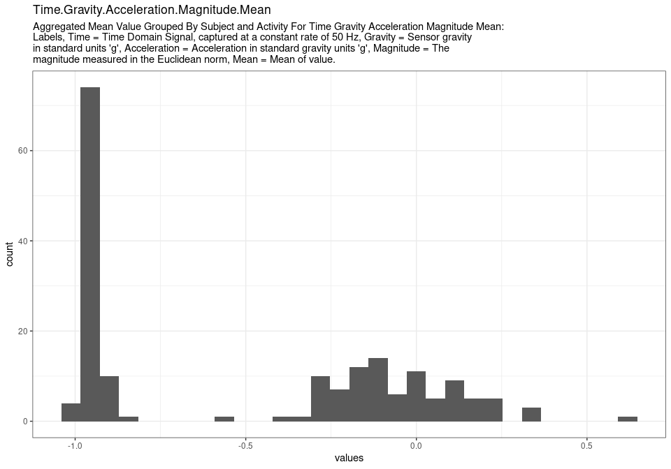

0 missing values.

#### Summary statistics {#Time_Gravity_Acceleration_Magnitude_Mean_summary}

|name                                     |label                                                                                                                                                                                                                                                                                                                                                                     |data_type | n_missing| complete_rate|min   |median |max  |       mean|        sd|hist  |
|:----------------------------------------|:-------------------------------------------------------------------------------------------------------------------------------------------------------------------------------------------------------------------------------------------------------------------------------------------------------------------------------------------------------------------------|:---------|---------:|-------------:|:-----|:------|:----|----------:|---------:|:-----|
|Time.Gravity.Acceleration.Magnitude.Mean |Aggregated Mean Value Grouped By Subject and Activity For Time Gravity Acceleration Magnitude Mean:  Labels,  Time = Time Domain Signal, captured at a constant rate of 50 Hz, Gravity = Sensor gravity in standard units 'g', Acceleration = Acceleration in standard gravity units 'g', Magnitude = The magnitude measured in the Euclidean norm, Mean = Mean of value. |numeric   |         0|             1|-0.99 |-0.48  |0.64 | -0.4972897| 0.4728834|▇▁▅▃▁ |


### Time.Gravity.Acceleration.Magnitude.Standard.Deviation {#Time_Gravity_Acceleration_Magnitude_Standard_Deviation .tabset}

Aggregated Mean Value Grouped By Subject and Activity For Time Gravity Acceleration Magnitude Standard Deviation:  Labels,  Time = Time Domain Signal, captured at a constant rate of 50 Hz, Gravity = Sensor gravity in standard units 'g', Acceleration = Acceleration in standard gravity units 'g', Magnitude = The magnitude measured in the Euclidean norm, Standard Deviation = Standard deviation of value.

#### Distribution {#Time_Gravity_Acceleration_Magnitude_Standard_Deviation_distribution}

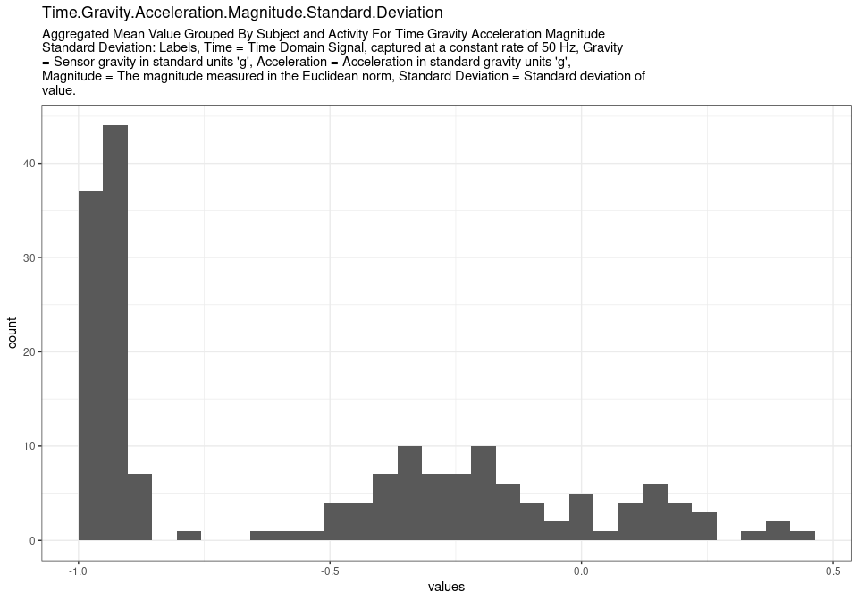

0 missing values.

#### Summary statistics {#Time_Gravity_Acceleration_Magnitude_Standard_Deviation_summary}

|name                                                   |label                                                                                                                                                                                                                                                                                                                                                                                                               |data_type | n_missing| complete_rate|min   |median |max  |       mean|        sd|hist  |
|:------------------------------------------------------|:-------------------------------------------------------------------------------------------------------------------------------------------------------------------------------------------------------------------------------------------------------------------------------------------------------------------------------------------------------------------------------------------------------------------|:---------|---------:|-------------:|:-----|:------|:----|----------:|---------:|:-----|
|Time.Gravity.Acceleration.Magnitude.Standard.Deviation |Aggregated Mean Value Grouped By Subject and Activity For Time Gravity Acceleration Magnitude Standard Deviation:  Labels,  Time = Time Domain Signal, captured at a constant rate of 50 Hz, Gravity = Sensor gravity in standard units 'g', Acceleration = Acceleration in standard gravity units 'g', Magnitude = The magnitude measured in the Euclidean norm, Standard Deviation = Standard deviation of value. |numeric   |         0|             1|-0.99 |-0.61  |0.43 | -0.5439087| 0.4310448|▇▁▅▂▁ |


### Time.Acceleration.Jerk.Magnitude.Mean {#Time_Acceleration_Jerk_Magnitude_Mean .tabset}

Aggregated Mean Value Grouped By Subject and Activity For Time Acceleration Jerk Magnitude Mean:  Labels,  Time = Time Domain Signal, captured at a constant rate of 50 Hz, Acceleration = Acceleration in standard gravity units 'g', Jerk = Jerk signals in standard gravity units 'g', Magnitude = The magnitude measured in the Euclidean norm, Mean = Mean of value.

#### Distribution {#Time_Acceleration_Jerk_Magnitude_Mean_distribution}

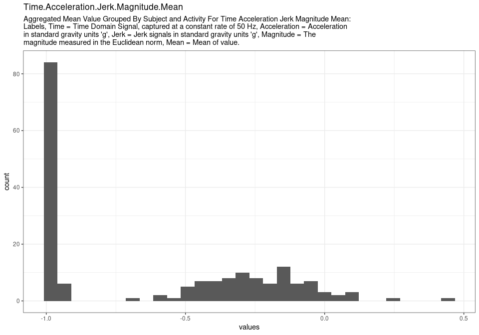

0 missing values.

#### Summary statistics {#Time_Acceleration_Jerk_Magnitude_Mean_summary}

|name                                  |label                                                                                                                                                                                                                                                                                                                                                                     |data_type | n_missing| complete_rate|min   |median |max  |       mean|        sd|hist  |
|:-------------------------------------|:-------------------------------------------------------------------------------------------------------------------------------------------------------------------------------------------------------------------------------------------------------------------------------------------------------------------------------------------------------------------------|:---------|---------:|-------------:|:-----|:------|:----|----------:|---------:|:-----|
|Time.Acceleration.Jerk.Magnitude.Mean |Aggregated Mean Value Grouped By Subject and Activity For Time Acceleration Jerk Magnitude Mean:  Labels,  Time = Time Domain Signal, captured at a constant rate of 50 Hz, Acceleration = Acceleration in standard gravity units 'g', Jerk = Jerk signals in standard gravity units 'g', Magnitude = The magnitude measured in the Euclidean norm, Mean = Mean of value. |numeric   |         0|             1|-0.99 |-0.82  |0.43 | -0.6079296| 0.3965272|▇▂▅▂▁ |


### Time.Acceleration.Jerk.Magnitude.Standard.Deviation {#Time_Acceleration_Jerk_Magnitude_Standard_Deviation .tabset}

Aggregated Mean Value Grouped By Subject and Activity For Time Acceleration Jerk Magnitude Standard Deviation:  Labels,  Time = Time Domain Signal, captured at a constant rate of 50 Hz, Acceleration = Acceleration in standard gravity units 'g', Jerk = Jerk signals in standard gravity units 'g', Magnitude = The magnitude measured in the Euclidean norm, Standard Deviation = Standard deviation of value.

#### Distribution {#Time_Acceleration_Jerk_Magnitude_Standard_Deviation_distribution}


0 missing values.

#### Summary statistics {#Time_Acceleration_Jerk_Magnitude_Standard_Deviation_summary}

|name                                                |label                                                                                                                                                                                                                                                                                                                                                                                                               |data_type | n_missing| complete_rate|min   |median |max  |       mean|        sd|hist  |
|:---------------------------------------------------|:-------------------------------------------------------------------------------------------------------------------------------------------------------------------------------------------------------------------------------------------------------------------------------------------------------------------------------------------------------------------------------------------------------------------|:---------|---------:|-------------:|:-----|:------|:----|----------:|---------:|:-----|
|Time.Acceleration.Jerk.Magnitude.Standard.Deviation |Aggregated Mean Value Grouped By Subject and Activity For Time Acceleration Jerk Magnitude Standard Deviation:  Labels,  Time = Time Domain Signal, captured at a constant rate of 50 Hz, Acceleration = Acceleration in standard gravity units 'g', Jerk = Jerk signals in standard gravity units 'g', Magnitude = The magnitude measured in the Euclidean norm, Standard Deviation = Standard deviation of value. |numeric   |         0|             1|-0.99 |-0.8   |0.45 | -0.5841756| 0.4227953|▇▂▃▂▁ |


### Time.Gyroscope.Magnitude.Mean {#Time_Gyroscope_Magnitude_Mean .tabset}

Aggregated Mean Value Grouped By Subject and Activity For Time Gyroscope Magnitude Mean:  Labels,  Time = Time Domain Signal, captured at a constant rate of 50 Hz, Gyroscope = The gyroscope sensor signals in radians/second, Magnitude = The magnitude measured in the Euclidean norm, Mean = Mean of value.

#### Distribution {#Time_Gyroscope_Magnitude_Mean_distribution}


0 missing values.

#### Summary statistics {#Time_Gyroscope_Magnitude_Mean_summary}

|name                          |label                                                                                                                                                                                                                                                                                                           |data_type | n_missing| complete_rate|min   |median |max  |       mean|        sd|hist  |
|:-----------------------------|:---------------------------------------------------------------------------------------------------------------------------------------------------------------------------------------------------------------------------------------------------------------------------------------------------------------|:---------|---------:|-------------:|:-----|:------|:----|----------:|---------:|:-----|
|Time.Gyroscope.Magnitude.Mean |Aggregated Mean Value Grouped By Subject and Activity For Time Gyroscope Magnitude Mean:  Labels,  Time = Time Domain Signal, captured at a constant rate of 50 Hz, Gyroscope = The gyroscope sensor signals in radians/second, Magnitude = The magnitude measured in the Euclidean norm, Mean = Mean of value. |numeric   |         0|             1|-0.98 |-0.66  |0.42 | -0.5651631| 0.3977338|▇▁▅▂▁ |


### Time.Gyroscope.Magnitude.Standard.Deviation {#Time_Gyroscope_Magnitude_Standard_Deviation .tabset}

Aggregated Mean Value Grouped By Subject and Activity For Time Gyroscope Magnitude Standard Deviation:  Labels,  Time = Time Domain Signal, captured at a constant rate of 50 Hz, Gyroscope = The gyroscope sensor signals in radians/second, Magnitude = The magnitude measured in the Euclidean norm, Standard Deviation = Standard deviation of value.

#### Distribution {#Time_Gyroscope_Magnitude_Standard_Deviation_distribution}

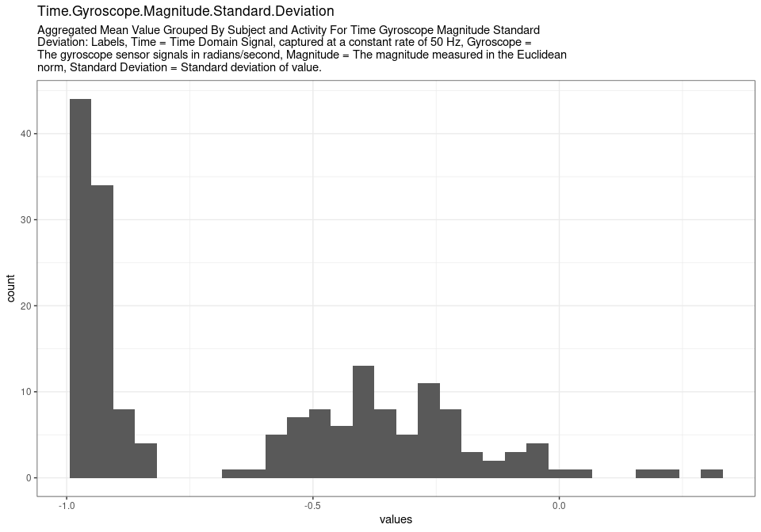

0 missing values.

#### Summary statistics {#Time_Gyroscope_Magnitude_Standard_Deviation_summary}

|name                                        |label                                                                                                                                                                                                                                                                                                                                                     |data_type | n_missing| complete_rate|min   |median |max |       mean|        sd|hist  |
|:-------------------------------------------|:---------------------------------------------------------------------------------------------------------------------------------------------------------------------------------------------------------------------------------------------------------------------------------------------------------------------------------------------------------|:---------|---------:|-------------:|:-----|:------|:---|----------:|---------:|:-----|
|Time.Gyroscope.Magnitude.Standard.Deviation |Aggregated Mean Value Grouped By Subject and Activity For Time Gyroscope Magnitude Standard Deviation:  Labels,  Time = Time Domain Signal, captured at a constant rate of 50 Hz, Gyroscope = The gyroscope sensor signals in radians/second, Magnitude = The magnitude measured in the Euclidean norm, Standard Deviation = Standard deviation of value. |numeric   |         0|             1|-0.98 |-0.74  |0.3 | -0.6303947| 0.3368827|▇▂▅▂▁ |


### Time.Gyroscope.Jerk.Magnitude.Mean {#Time_Gyroscope_Jerk_Magnitude_Mean .tabset}

Aggregated Mean Value Grouped By Subject and Activity For Time Gyroscope Jerk Magnitude Mean:  Labels,  Time = Time Domain Signal, captured at a constant rate of 50 Hz, Gyroscope = The gyroscope sensor signals in radians/second, Jerk = Jerk signals in standard gravity units 'g', Magnitude = The magnitude measured in the Euclidean norm, Mean = Mean of value.

#### Distribution {#Time_Gyroscope_Jerk_Magnitude_Mean_distribution}

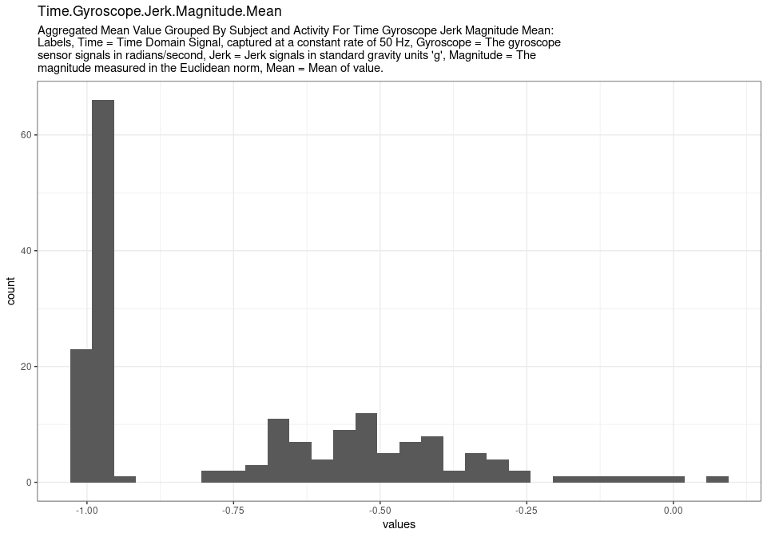

0 missing values.

#### Summary statistics {#Time_Gyroscope_Jerk_Magnitude_Mean_summary}

|name                               |label                                                                                                                                                                                                                                                                                                                                                                   |data_type | n_missing| complete_rate|min |median |max   |       mean|        sd|hist  |
|:----------------------------------|:-----------------------------------------------------------------------------------------------------------------------------------------------------------------------------------------------------------------------------------------------------------------------------------------------------------------------------------------------------------------------|:---------|---------:|-------------:|:---|:------|:-----|----------:|---------:|:-----|
|Time.Gyroscope.Jerk.Magnitude.Mean |Aggregated Mean Value Grouped By Subject and Activity For Time Gyroscope Jerk Magnitude Mean:  Labels,  Time = Time Domain Signal, captured at a constant rate of 50 Hz, Gyroscope = The gyroscope sensor signals in radians/second, Jerk = Jerk signals in standard gravity units 'g', Magnitude = The magnitude measured in the Euclidean norm, Mean = Mean of value. |numeric   |         0|             1|-1  |-0.86  |0.088 | -0.7363693| 0.2767541|▇▃▃▁▁ |


### Time.Gyroscope.Jerk.Magnitude.Standard.Deviation {#Time_Gyroscope_Jerk_Magnitude_Standard_Deviation .tabset}

Aggregated Mean Value Grouped By Subject and Activity For Time Gyroscope Jerk Magnitude Standard Deviation:  Labels,  Time = Time Domain Signal, captured at a constant rate of 50 Hz, Gyroscope = The gyroscope sensor signals in radians/second, Jerk = Jerk signals in standard gravity units 'g', Magnitude = The magnitude measured in the Euclidean norm, Standard Deviation = Standard deviation of value.

#### Distribution {#Time_Gyroscope_Jerk_Magnitude_Standard_Deviation_distribution}

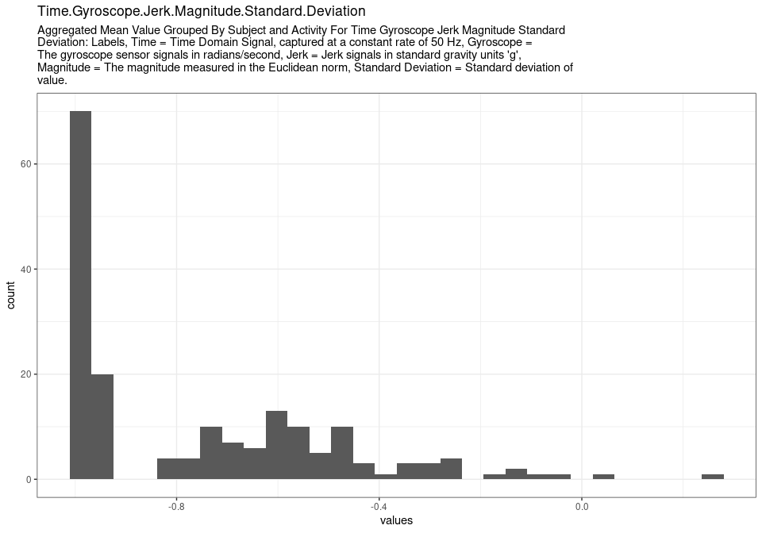

0 missing values.

#### Summary statistics {#Time_Gyroscope_Jerk_Magnitude_Standard_Deviation_summary}

|name                                             |label                                                                                                                                                                                                                                                                                                                                                                                                             |data_type | n_missing| complete_rate|min |median |max  |       mean|        sd|hist  |
|:------------------------------------------------|:-----------------------------------------------------------------------------------------------------------------------------------------------------------------------------------------------------------------------------------------------------------------------------------------------------------------------------------------------------------------------------------------------------------------|:---------|---------:|-------------:|:---|:------|:----|----------:|---------:|:-----|
|Time.Gyroscope.Jerk.Magnitude.Standard.Deviation |Aggregated Mean Value Grouped By Subject and Activity For Time Gyroscope Jerk Magnitude Standard Deviation:  Labels,  Time = Time Domain Signal, captured at a constant rate of 50 Hz, Gyroscope = The gyroscope sensor signals in radians/second, Jerk = Jerk signals in standard gravity units 'g', Magnitude = The magnitude measured in the Euclidean norm, Standard Deviation = Standard deviation of value. |numeric   |         0|             1|-1  |-0.88  |0.25 | -0.7550152| 0.2655057|▇▃▂▁▁ |


### Frequency.Acceleration.Mean.X {#Frequency_Acceleration_Mean_X .tabset}

Aggregated Mean Value Grouped By Subject and Activity For Frequency Acceleration Mean X:  Labels,  , Frequency = Fast Fourier Transform (FFT) was applied to frequency domain signals in hertz, Acceleration = Acceleration in standard gravity units 'g', X = Triaxial signals in the X direction, Mean = Mean of value.

#### Distribution {#Frequency_Acceleration_Mean_X_distribution}

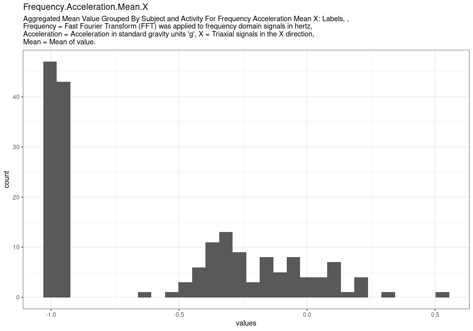

0 missing values.

#### Summary statistics {#Frequency_Acceleration_Mean_X_summary}

|name                          |label                                                                                                                                                                                                                                                                                                                     |data_type | n_missing| complete_rate|min |median |max  |    mean|        sd|hist  |
|:-----------------------------|:-------------------------------------------------------------------------------------------------------------------------------------------------------------------------------------------------------------------------------------------------------------------------------------------------------------------------|:---------|---------:|-------------:|:---|:------|:----|-------:|---------:|:-----|
|Frequency.Acceleration.Mean.X |Aggregated Mean Value Grouped By Subject and Activity For Frequency Acceleration Mean X:  Labels,  , Frequency = Fast Fourier Transform (FFT) was applied to frequency domain signals in hertz, Acceleration = Acceleration in standard gravity units 'g', X = Triaxial signals in the X direction, Mean = Mean of value. |numeric   |         0|             1|-1  |-0.77  |0.54 | -0.5758| 0.4300214|▇▁▃▂▁ |


### Frequency.Acceleration.Mean.Y {#Frequency_Acceleration_Mean_Y .tabset}

Aggregated Mean Value Grouped By Subject and Activity For Frequency Acceleration Mean Y:  Labels,  , Frequency = Fast Fourier Transform (FFT) was applied to frequency domain signals in hertz, Acceleration = Acceleration in standard gravity units 'g', Y = Triaxial signals in the Y direction, Mean = Mean of value.

#### Distribution {#Frequency_Acceleration_Mean_Y_distribution}

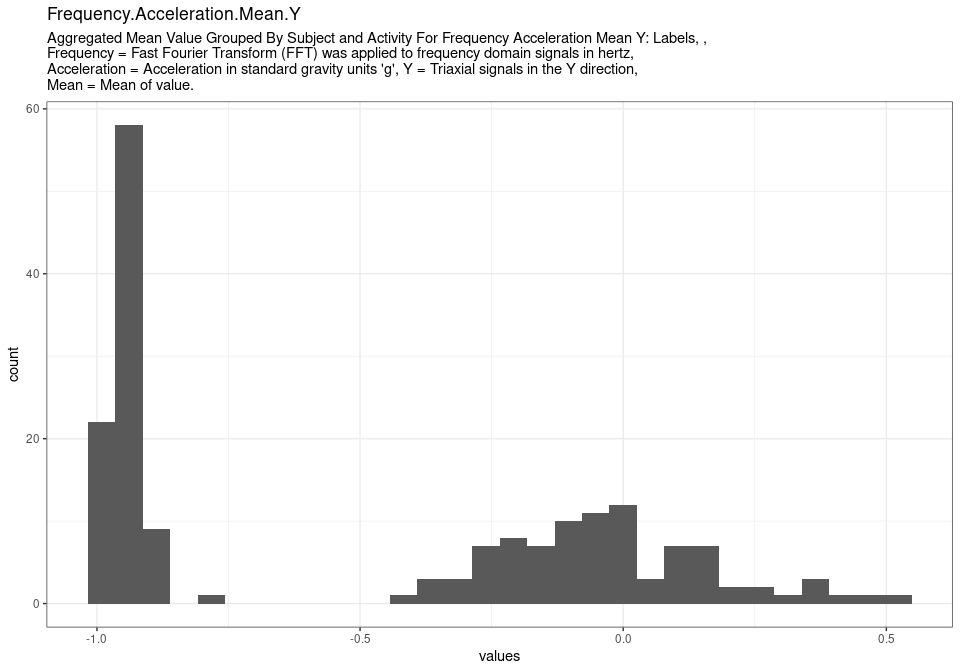

0 missing values.

#### Summary statistics {#Frequency_Acceleration_Mean_Y_summary}

|name                          |label                                                                                                                                                                                                                                                                                                                     |data_type | n_missing| complete_rate|min   |median |max  |       mean|        sd|hist  |
|:-----------------------------|:-------------------------------------------------------------------------------------------------------------------------------------------------------------------------------------------------------------------------------------------------------------------------------------------------------------------------|:---------|---------:|-------------:|:-----|:------|:----|----------:|---------:|:-----|
|Frequency.Acceleration.Mean.Y |Aggregated Mean Value Grouped By Subject and Activity For Frequency Acceleration Mean Y:  Labels,  , Frequency = Fast Fourier Transform (FFT) was applied to frequency domain signals in hertz, Acceleration = Acceleration in standard gravity units 'g', Y = Triaxial signals in the Y direction, Mean = Mean of value. |numeric   |         0|             1|-0.99 |-0.59  |0.52 | -0.4887327| 0.4806496|▇▁▃▃▁ |


### Frequency.Acceleration.Mean.Z {#Frequency_Acceleration_Mean_Z .tabset}

Aggregated Mean Value Grouped By Subject and Activity For Frequency Acceleration Mean Z:  Labels,  , Frequency = Fast Fourier Transform (FFT) was applied to frequency domain signals in hertz, Acceleration = Acceleration in standard gravity units 'g', Z = Triaxialsignals in the Z direction, Mean = Mean of value.

#### Distribution {#Frequency_Acceleration_Mean_Z_distribution}

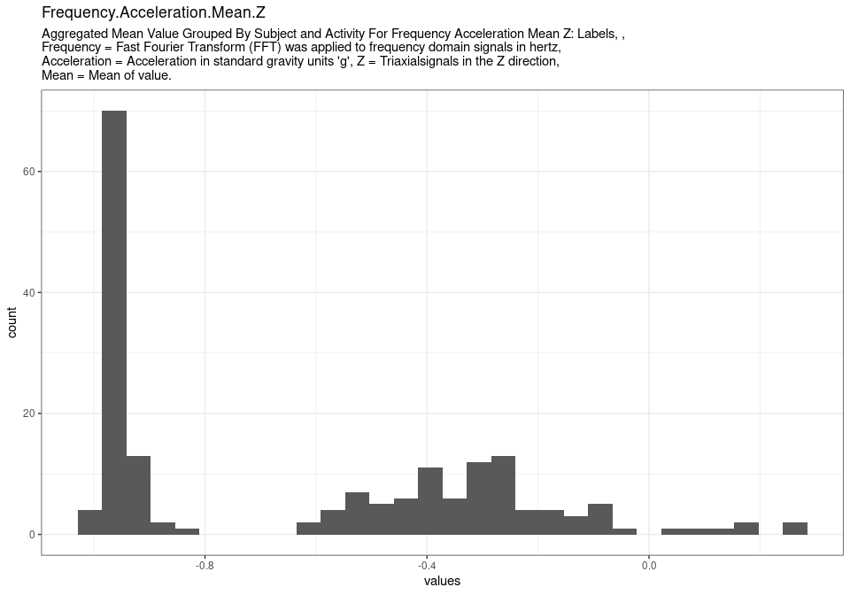

0 missing values.

#### Summary statistics {#Frequency_Acceleration_Mean_Z_summary}

|name                          |label                                                                                                                                                                                                                                                                                                                    |data_type | n_missing| complete_rate|min   |median |max  |       mean|        sd|hist  |
|:-----------------------------|:------------------------------------------------------------------------------------------------------------------------------------------------------------------------------------------------------------------------------------------------------------------------------------------------------------------------|:---------|---------:|-------------:|:-----|:------|:----|----------:|---------:|:-----|
|Frequency.Acceleration.Mean.Z |Aggregated Mean Value Grouped By Subject and Activity For Frequency Acceleration Mean Z:  Labels,  , Frequency = Fast Fourier Transform (FFT) was applied to frequency domain signals in hertz, Acceleration = Acceleration in standard gravity units 'g', Z = Triaxialsignals in the Z direction, Mean = Mean of value. |numeric   |         0|             1|-0.99 |-0.72  |0.28 | -0.6297388| 0.3556469|▇▂▅▁▁ |


### Frequency.Acceleration.Standard.Deviation.X {#Frequency_Acceleration_Standard_Deviation_X .tabset}

Aggregated Mean Value Grouped By Subject and Activity For Frequency Acceleration Standard Deviation X:  Labels,  , Frequency = Fast Fourier Transform (FFT) was applied to frequency domain signals in hertz, Acceleration = Acceleration in standard gravity units 'g', X = Triaxial signals in the X direction, Standard Deviation = Standard deviation of value.

#### Distribution {#Frequency_Acceleration_Standard_Deviation_X_distribution}

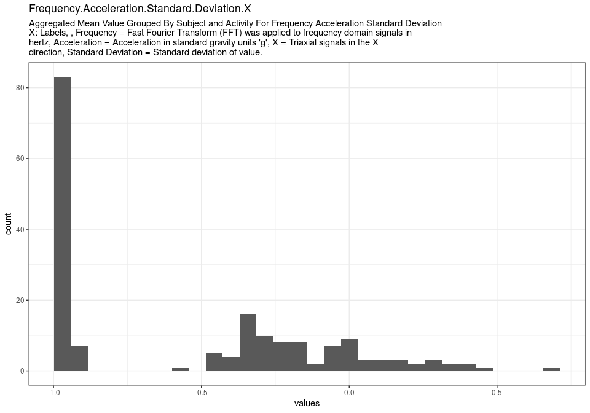

0 missing values.

#### Summary statistics {#Frequency_Acceleration_Standard_Deviation_X_summary}

|name                                        |label                                                                                                                                                                                                                                                                                                                                                               |data_type | n_missing| complete_rate|min |median |max  |       mean|        sd|hist  |
|:-------------------------------------------|:-------------------------------------------------------------------------------------------------------------------------------------------------------------------------------------------------------------------------------------------------------------------------------------------------------------------------------------------------------------------|:---------|---------:|-------------:|:---|:------|:----|----------:|---------:|:-----|
|Frequency.Acceleration.Standard.Deviation.X |Aggregated Mean Value Grouped By Subject and Activity For Frequency Acceleration Standard Deviation X:  Labels,  , Frequency = Fast Fourier Transform (FFT) was applied to frequency domain signals in hertz, Acceleration = Acceleration in standard gravity units 'g', X = Triaxial signals in the X direction, Standard Deviation = Standard deviation of value. |numeric   |         0|             1|-1  |-0.75  |0.66 | -0.5522011| 0.4600233|▇▂▅▂▁ |


### Frequency.Acceleration.Standard.Deviation.Y {#Frequency_Acceleration_Standard_Deviation_Y .tabset}

Aggregated Mean Value Grouped By Subject and Activity For Frequency Acceleration Standard Deviation Y:  Labels,  , Frequency = Fast Fourier Transform (FFT) was applied to frequency domain signals in hertz, Acceleration = Acceleration in standard gravity units 'g', Y = Triaxial signals in the Y direction, Standard Deviation = Standard deviation of value.

#### Distribution {#Frequency_Acceleration_Standard_Deviation_Y_distribution}

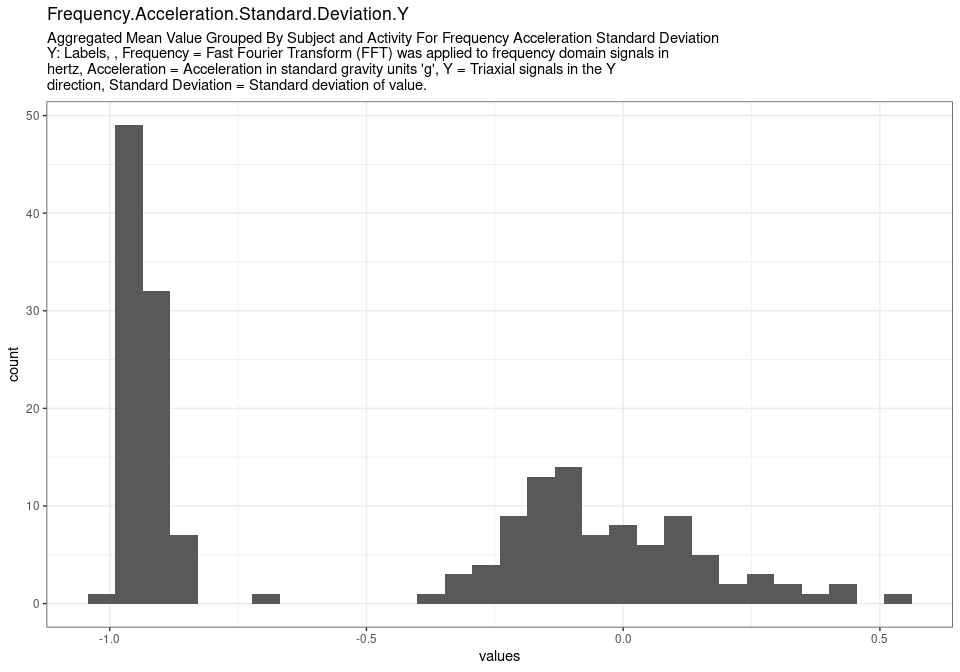

0 missing values.

#### Summary statistics {#Frequency_Acceleration_Standard_Deviation_Y_summary}

|name                                        |label                                                                                                                                                                                                                                                                                                                                                               |data_type | n_missing| complete_rate|min   |median |max  |       mean|        sd|hist  |
|:-------------------------------------------|:-------------------------------------------------------------------------------------------------------------------------------------------------------------------------------------------------------------------------------------------------------------------------------------------------------------------------------------------------------------------|:---------|---------:|-------------:|:-----|:------|:----|----------:|---------:|:-----|
|Frequency.Acceleration.Standard.Deviation.Y |Aggregated Mean Value Grouped By Subject and Activity For Frequency Acceleration Standard Deviation Y:  Labels,  , Frequency = Fast Fourier Transform (FFT) was applied to frequency domain signals in hertz, Acceleration = Acceleration in standard gravity units 'g', Y = Triaxial signals in the Y direction, Standard Deviation = Standard deviation of value. |numeric   |         0|             1|-0.99 |-0.51  |0.56 | -0.4814787| 0.4740277|▇▁▅▃▁ |


### Frequency.Acceleration.Standard.Deviation.Z {#Frequency_Acceleration_Standard_Deviation_Z .tabset}

Aggregated Mean Value Grouped By Subject and Activity For Frequency Acceleration Standard Deviation Z:  Labels,  , Frequency = Fast Fourier Transform (FFT) was applied to frequency domain signals in hertz, Acceleration = Acceleration in standard gravity units 'g', Z = Triaxialsignals in the Z direction, Standard Deviation = Standard deviation of value.

#### Distribution {#Frequency_Acceleration_Standard_Deviation_Z_distribution}

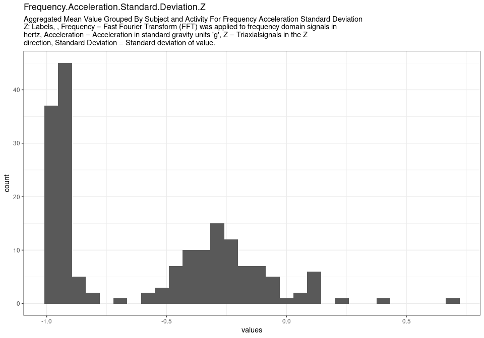

0 missing values.

#### Summary statistics {#Frequency_Acceleration_Standard_Deviation_Z_summary}

|name                                        |label                                                                                                                                                                                                                                                                                                                                                              |data_type | n_missing| complete_rate|min   |median |max  |       mean|        sd|hist  |
|:-------------------------------------------|:------------------------------------------------------------------------------------------------------------------------------------------------------------------------------------------------------------------------------------------------------------------------------------------------------------------------------------------------------------------|:---------|---------:|-------------:|:-----|:------|:----|----------:|---------:|:-----|
|Frequency.Acceleration.Standard.Deviation.Z |Aggregated Mean Value Grouped By Subject and Activity For Frequency Acceleration Standard Deviation Z:  Labels,  , Frequency = Fast Fourier Transform (FFT) was applied to frequency domain signals in hertz, Acceleration = Acceleration in standard gravity units 'g', Z = Triaxialsignals in the Z direction, Standard Deviation = Standard deviation of value. |numeric   |         0|             1|-0.99 |-0.64  |0.69 | -0.5823614| 0.3880902|▇▃▅▁▁ |


### Frequency.Acceleration.Mean.Frequency.X {#Frequency_Acceleration_Mean_Frequency_X .tabset}

Aggregated Mean Value Grouped By Subject and Activity For Frequency Acceleration Mean Frequency X:  Labels,  , Frequency = Fast Fourier Transform (FFT) was applied to frequency domain signals in hertz, Acceleration = Acceleration in standard gravity units 'g', X = Triaxial signals in the X direction, Mean = Mean of value.

#### Distribution {#Frequency_Acceleration_Mean_Frequency_X_distribution}

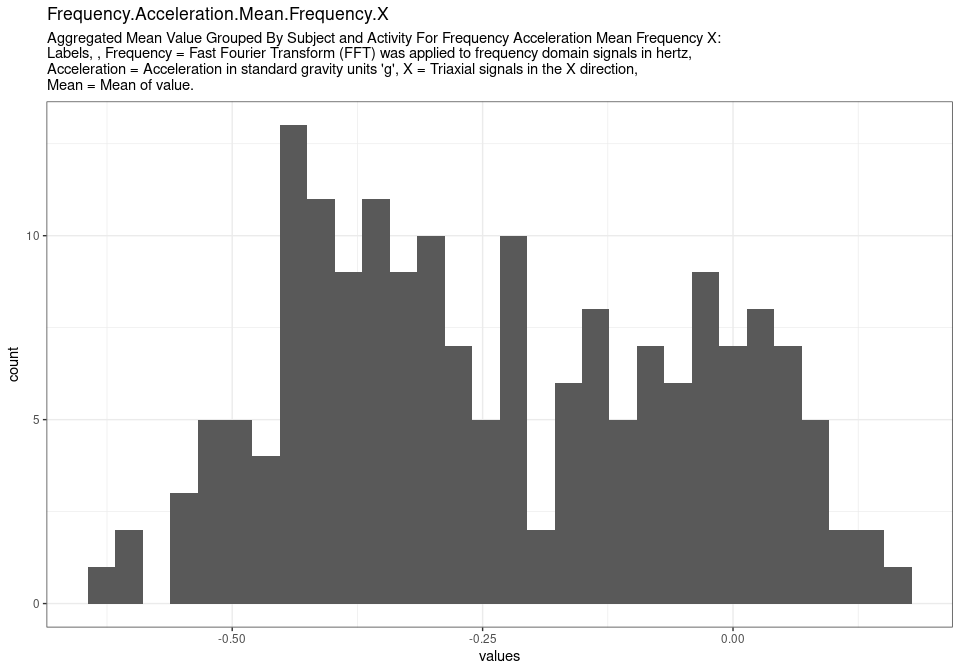

0 missing values.

#### Summary statistics {#Frequency_Acceleration_Mean_Frequency_X_summary}

|name                                    |label                                                                                                                                                                                                                                                                                                                               |data_type | n_missing| complete_rate|min   |median |max  |       mean|        sd|hist  |
|:---------------------------------------|:-----------------------------------------------------------------------------------------------------------------------------------------------------------------------------------------------------------------------------------------------------------------------------------------------------------------------------------|:---------|---------:|-------------:|:-----|:------|:----|----------:|---------:|:-----|
|Frequency.Acceleration.Mean.Frequency.X |Aggregated Mean Value Grouped By Subject and Activity For Frequency Acceleration Mean Frequency X:  Labels,  , Frequency = Fast Fourier Transform (FFT) was applied to frequency domain signals in hertz, Acceleration = Acceleration in standard gravity units 'g', X = Triaxial signals in the X direction, Mean = Mean of value. |numeric   |         0|             1|-0.64 |-0.26  |0.16 | -0.2322661| 0.1935684|▂▇▆▆▃ |


### Frequency.Acceleration.Mean.Frequency.Y {#Frequency_Acceleration_Mean_Frequency_Y .tabset}

Aggregated Mean Value Grouped By Subject and Activity For Frequency Acceleration Mean Frequency Y:  Labels,  , Frequency = Fast Fourier Transform (FFT) was applied to frequency domain signals in hertz, Acceleration = Acceleration in standard gravity units 'g', Y = Triaxial signals in the Y direction, Mean = Mean of value.

#### Distribution {#Frequency_Acceleration_Mean_Frequency_Y_distribution}

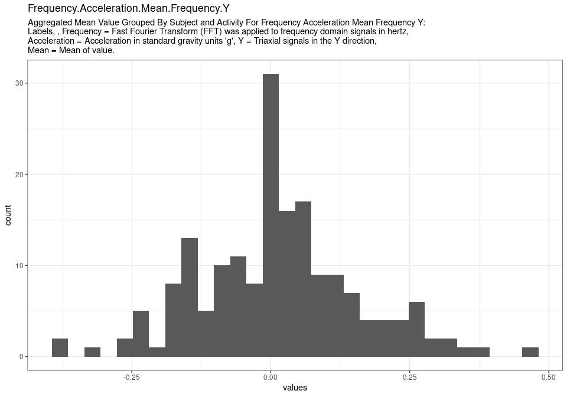

0 missing values.

#### Summary statistics {#Frequency_Acceleration_Mean_Frequency_Y_summary}

|name                                    |label                                                                                                                                                                                                                                                                                                                               |data_type | n_missing| complete_rate|min   |median |max  |      mean|        sd|hist  |
|:---------------------------------------|:-----------------------------------------------------------------------------------------------------------------------------------------------------------------------------------------------------------------------------------------------------------------------------------------------------------------------------------|:---------|---------:|-------------:|:-----|:------|:----|---------:|---------:|:-----|
|Frequency.Acceleration.Mean.Frequency.Y |Aggregated Mean Value Grouped By Subject and Activity For Frequency Acceleration Mean Frequency Y:  Labels,  , Frequency = Fast Fourier Transform (FFT) was applied to frequency domain signals in hertz, Acceleration = Acceleration in standard gravity units 'g', Y = Triaxial signals in the Y direction, Mean = Mean of value. |numeric   |         0|             1|-0.38 |0.0079 |0.47 | 0.0115289| 0.1447051|▁▅▇▂▁ |


### Frequency.Acceleration.Mean.Frequency.Z {#Frequency_Acceleration_Mean_Frequency_Z .tabset}

Aggregated Mean Value Grouped By Subject and Activity For Frequency Acceleration Mean Frequency Z:  Labels,  , Frequency = Fast Fourier Transform (FFT) was applied to frequency domain signals in hertz, Acceleration = Acceleration in standard gravity units 'g', Z = Triaxialsignals in the Z direction, Mean = Mean of value.

#### Distribution {#Frequency_Acceleration_Mean_Frequency_Z_distribution}

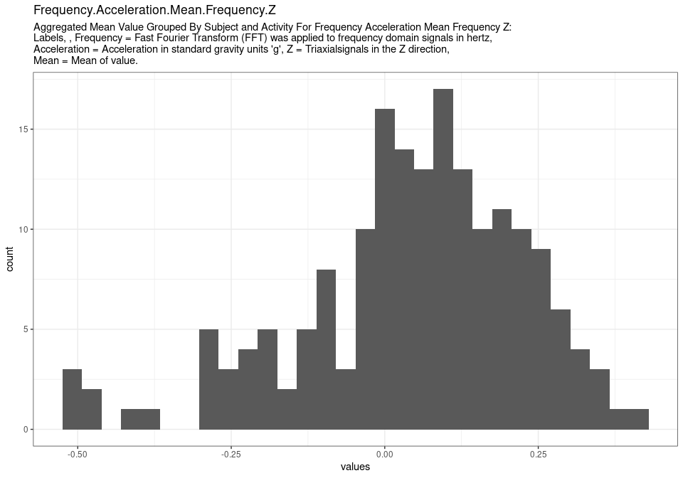

0 missing values.

#### Summary statistics {#Frequency_Acceleration_Mean_Frequency_Z_summary}

|name                                    |label                                                                                                                                                                                                                                                                                                                              |data_type | n_missing| complete_rate|min   |median |max |      mean|        sd|hist  |
|:---------------------------------------|:----------------------------------------------------------------------------------------------------------------------------------------------------------------------------------------------------------------------------------------------------------------------------------------------------------------------------------|:---------|---------:|-------------:|:-----|:------|:---|---------:|---------:|:-----|
|Frequency.Acceleration.Mean.Frequency.Z |Aggregated Mean Value Grouped By Subject and Activity For Frequency Acceleration Mean Frequency Z:  Labels,  , Frequency = Fast Fourier Transform (FFT) was applied to frequency domain signals in hertz, Acceleration = Acceleration in standard gravity units 'g', Z = Triaxialsignals in the Z direction, Mean = Mean of value. |numeric   |         0|             1|-0.52 |0.066  |0.4 | 0.0437174| 0.1850113|▁▂▆▇▃ |


### Frequency.Acceleration.Jerk.Mean.X {#Frequency_Acceleration_Jerk_Mean_X .tabset}

Aggregated Mean Value Grouped By Subject and Activity For Frequency Acceleration Jerk Mean X:  Labels,  , Frequency = Fast Fourier Transform (FFT) was applied to frequency domain signals in hertz, Acceleration = Acceleration in standard gravity units 'g', Jerk = Jerk signals in standard gravity units 'g', X = Triaxial signals in the X direction, Mean = Mean of value.

#### Distribution {#Frequency_Acceleration_Jerk_Mean_X_distribution}

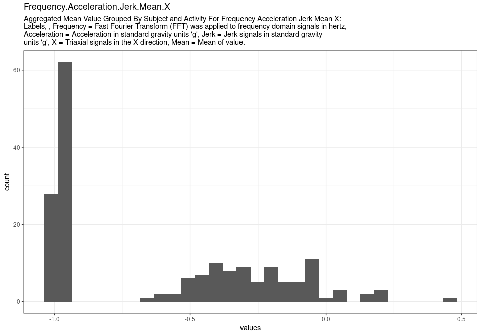

0 missing values.

#### Summary statistics {#Frequency_Acceleration_Jerk_Mean_X_summary}

|name                               |label                                                                                                                                                                                                                                                                                                                                                                             |data_type | n_missing| complete_rate|min   |median |max  |       mean|        sd|hist  |
|:----------------------------------|:---------------------------------------------------------------------------------------------------------------------------------------------------------------------------------------------------------------------------------------------------------------------------------------------------------------------------------------------------------------------------------|:---------|---------:|-------------:|:-----|:------|:----|----------:|---------:|:-----|
|Frequency.Acceleration.Jerk.Mean.X |Aggregated Mean Value Grouped By Subject and Activity For Frequency Acceleration Jerk Mean X:  Labels,  , Frequency = Fast Fourier Transform (FFT) was applied to frequency domain signals in hertz, Acceleration = Acceleration in standard gravity units 'g', Jerk = Jerk signals in standard gravity units 'g', X = Triaxial signals in the X direction, Mean = Mean of value. |numeric   |         0|             1|-0.99 |-0.81  |0.47 | -0.6139282| 0.3982896|▇▂▃▂▁ |


### Frequency.Acceleration.Jerk.Mean.Y {#Frequency_Acceleration_Jerk_Mean_Y .tabset}

Aggregated Mean Value Grouped By Subject and Activity For Frequency Acceleration Jerk Mean Y:  Labels,  , Frequency = Fast Fourier Transform (FFT) was applied to frequency domain signals in hertz, Acceleration = Acceleration in standard gravity units 'g', Jerk = Jerk signals in standard gravity units 'g', Y = Triaxial signals in the Y direction, Mean = Mean of value.

#### Distribution {#Frequency_Acceleration_Jerk_Mean_Y_distribution}

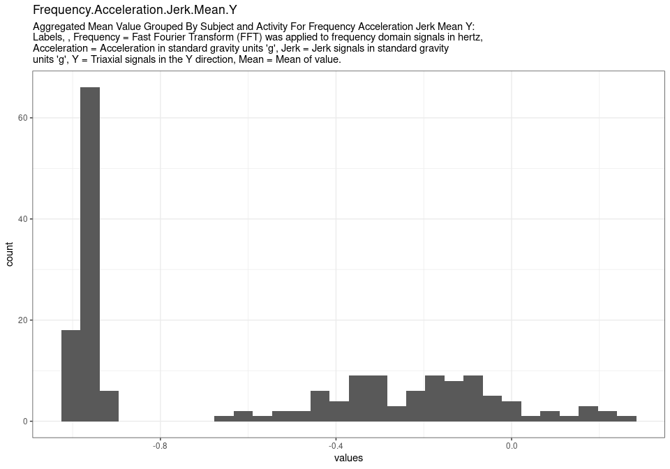

0 missing values.

#### Summary statistics {#Frequency_Acceleration_Jerk_Mean_Y_summary}

|name                               |label                                                                                                                                                                                                                                                                                                                                                                             |data_type | n_missing| complete_rate|min   |median |max  |       mean|        sd|hist  |
|:----------------------------------|:---------------------------------------------------------------------------------------------------------------------------------------------------------------------------------------------------------------------------------------------------------------------------------------------------------------------------------------------------------------------------------|:---------|---------:|-------------:|:-----|:------|:----|----------:|---------:|:-----|
|Frequency.Acceleration.Jerk.Mean.Y |Aggregated Mean Value Grouped By Subject and Activity For Frequency Acceleration Jerk Mean Y:  Labels,  , Frequency = Fast Fourier Transform (FFT) was applied to frequency domain signals in hertz, Acceleration = Acceleration in standard gravity units 'g', Jerk = Jerk signals in standard gravity units 'g', Y = Triaxial signals in the Y direction, Mean = Mean of value. |numeric   |         0|             1|-0.99 |-0.78  |0.28 | -0.5881631| 0.4077491|▇▁▃▃▁ |


### Frequency.Acceleration.Jerk.Mean.Z {#Frequency_Acceleration_Jerk_Mean_Z .tabset}

Aggregated Mean Value Grouped By Subject and Activity For Frequency Acceleration Jerk Mean Z:  Labels,  , Frequency = Fast Fourier Transform (FFT) was applied to frequency domain signals in hertz, Acceleration = Acceleration in standard gravity units 'g', Jerk = Jerk signals in standard gravity units 'g', Z = Triaxialsignals in the Z direction, Mean = Mean of value.

#### Distribution {#Frequency_Acceleration_Jerk_Mean_Z_distribution}

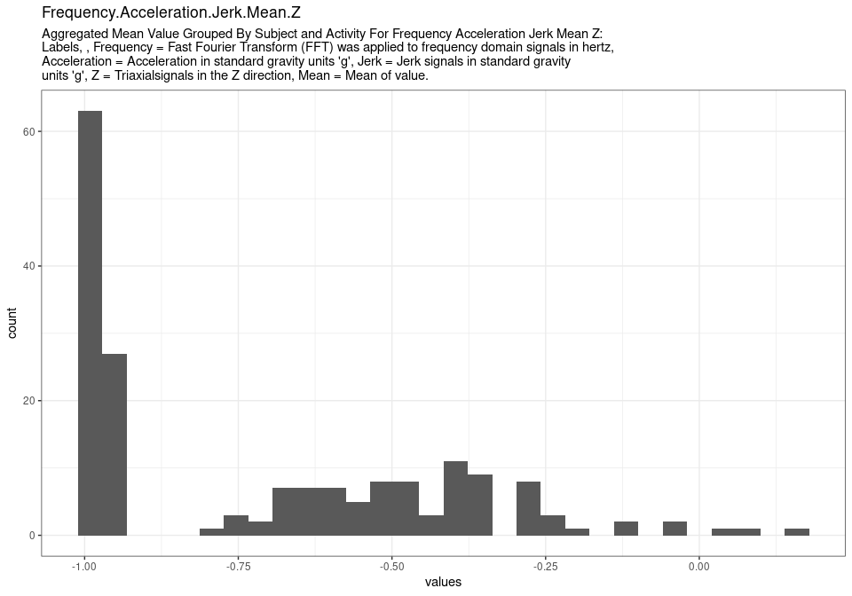

0 missing values.

#### Summary statistics {#Frequency_Acceleration_Jerk_Mean_Z_summary}

|name                               |label                                                                                                                                                                                                                                                                                                                                                                            |data_type | n_missing| complete_rate|min   |median |max  |       mean|        sd|hist  |
|:----------------------------------|:--------------------------------------------------------------------------------------------------------------------------------------------------------------------------------------------------------------------------------------------------------------------------------------------------------------------------------------------------------------------------------|:---------|---------:|-------------:|:-----|:------|:----|----------:|---------:|:-----|
|Frequency.Acceleration.Jerk.Mean.Z |Aggregated Mean Value Grouped By Subject and Activity For Frequency Acceleration Jerk Mean Z:  Labels,  , Frequency = Fast Fourier Transform (FFT) was applied to frequency domain signals in hertz, Acceleration = Acceleration in standard gravity units 'g', Jerk = Jerk signals in standard gravity units 'g', Z = Triaxialsignals in the Z direction, Mean = Mean of value. |numeric   |         0|             1|-0.99 |-0.87  |0.16 | -0.7143585| 0.2970225|▇▂▃▁▁ |


### Frequency.Acceleration.Jerk.Standard.Deviation.X {#Frequency_Acceleration_Jerk_Standard_Deviation_X .tabset}

Aggregated Mean Value Grouped By Subject and Activity For Frequency Acceleration Jerk Standard Deviation X:  Labels,  , Frequency = Fast Fourier Transform (FFT) was applied to frequency domain signals in hertz, Acceleration = Acceleration in standard gravity units 'g', Jerk = Jerk signals in standard gravity units 'g', X = Triaxial signals in the X direction, Standard Deviation = Standard deviation of value.

#### Distribution {#Frequency_Acceleration_Jerk_Standard_Deviation_X_distribution}

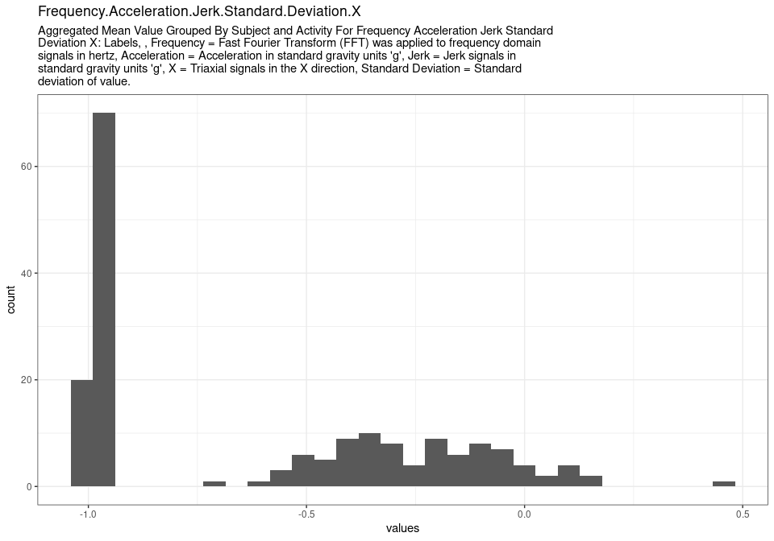

0 missing values.

#### Summary statistics {#Frequency_Acceleration_Jerk_Standard_Deviation_X_summary}

|name                                             |label                                                                                                                                                                                                                                                                                                                                                                                                                       |data_type | n_missing| complete_rate|min |median |max  |       mean|        sd|hist  |
|:------------------------------------------------|:---------------------------------------------------------------------------------------------------------------------------------------------------------------------------------------------------------------------------------------------------------------------------------------------------------------------------------------------------------------------------------------------------------------------------|:---------|---------:|-------------:|:---|:------|:----|----------:|---------:|:-----|
|Frequency.Acceleration.Jerk.Standard.Deviation.X |Aggregated Mean Value Grouped By Subject and Activity For Frequency Acceleration Jerk Standard Deviation X:  Labels,  , Frequency = Fast Fourier Transform (FFT) was applied to frequency domain signals in hertz, Acceleration = Acceleration in standard gravity units 'g', Jerk = Jerk signals in standard gravity units 'g', X = Triaxial signals in the X direction, Standard Deviation = Standard deviation of value. |numeric   |         0|             1|-1  |-0.83  |0.48 | -0.6121033| 0.4004506|▇▂▃▂▁ |


### Frequency.Acceleration.Jerk.Standard.Deviation.Y {#Frequency_Acceleration_Jerk_Standard_Deviation_Y .tabset}

Aggregated Mean Value Grouped By Subject and Activity For Frequency Acceleration Jerk Standard Deviation Y:  Labels,  , Frequency = Fast Fourier Transform (FFT) was applied to frequency domain signals in hertz, Acceleration = Acceleration in standard gravity units 'g', Jerk = Jerk signals in standard gravity units 'g', Y = Triaxial signals in the Y direction, Standard Deviation = Standard deviation of value.

#### Distribution {#Frequency_Acceleration_Jerk_Standard_Deviation_Y_distribution}

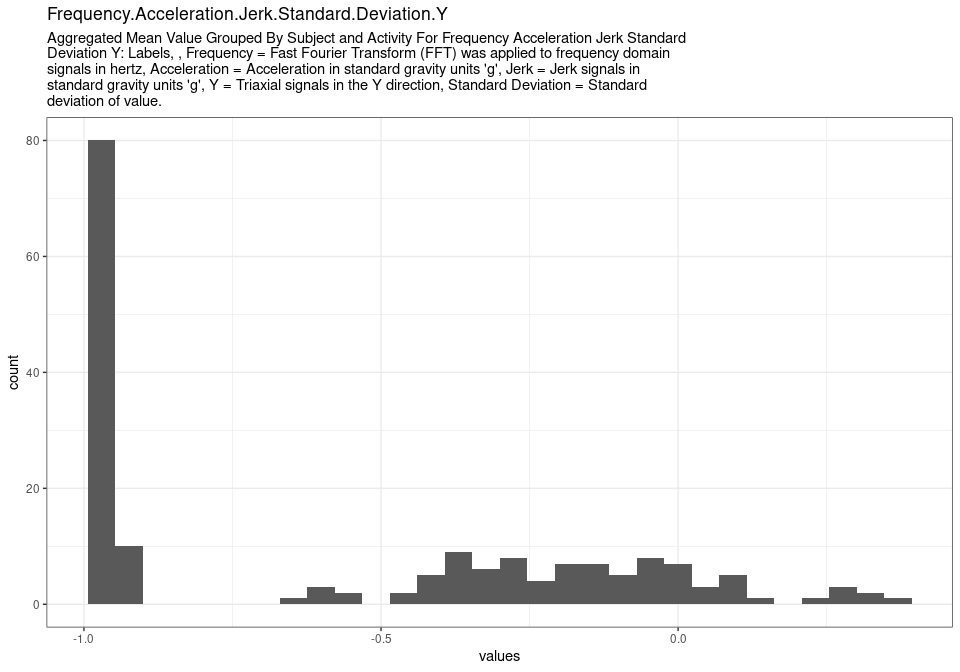

0 missing values.

#### Summary statistics {#Frequency_Acceleration_Jerk_Standard_Deviation_Y_summary}

|name                                             |label                                                                                                                                                                                                                                                                                                                                                                                                                       |data_type | n_missing| complete_rate|min   |median |max  |      mean|        sd|hist  |
|:------------------------------------------------|:---------------------------------------------------------------------------------------------------------------------------------------------------------------------------------------------------------------------------------------------------------------------------------------------------------------------------------------------------------------------------------------------------------------------------|:---------|---------:|-------------:|:-----|:------|:----|---------:|---------:|:-----|
|Frequency.Acceleration.Jerk.Standard.Deviation.Y |Aggregated Mean Value Grouped By Subject and Activity For Frequency Acceleration Jerk Standard Deviation Y:  Labels,  , Frequency = Fast Fourier Transform (FFT) was applied to frequency domain signals in hertz, Acceleration = Acceleration in standard gravity units 'g', Jerk = Jerk signals in standard gravity units 'g', Y = Triaxial signals in the Y direction, Standard Deviation = Standard deviation of value. |numeric   |         0|             1|-0.99 |-0.79  |0.35 | -0.570731| 0.4319873|▇▁▃▃▁ |


### Frequency.Acceleration.Jerk.Standard.Deviation.Z {#Frequency_Acceleration_Jerk_Standard_Deviation_Z .tabset}

Aggregated Mean Value Grouped By Subject and Activity For Frequency Acceleration Jerk Standard Deviation Z:  Labels,  , Frequency = Fast Fourier Transform (FFT) was applied to frequency domain signals in hertz, Acceleration = Acceleration in standard gravity units 'g', Jerk = Jerk signals in standard gravity units 'g', Z = Triaxialsignals in the Z direction, Standard Deviation = Standard deviation of value.

#### Distribution {#Frequency_Acceleration_Jerk_Standard_Deviation_Z_distribution}

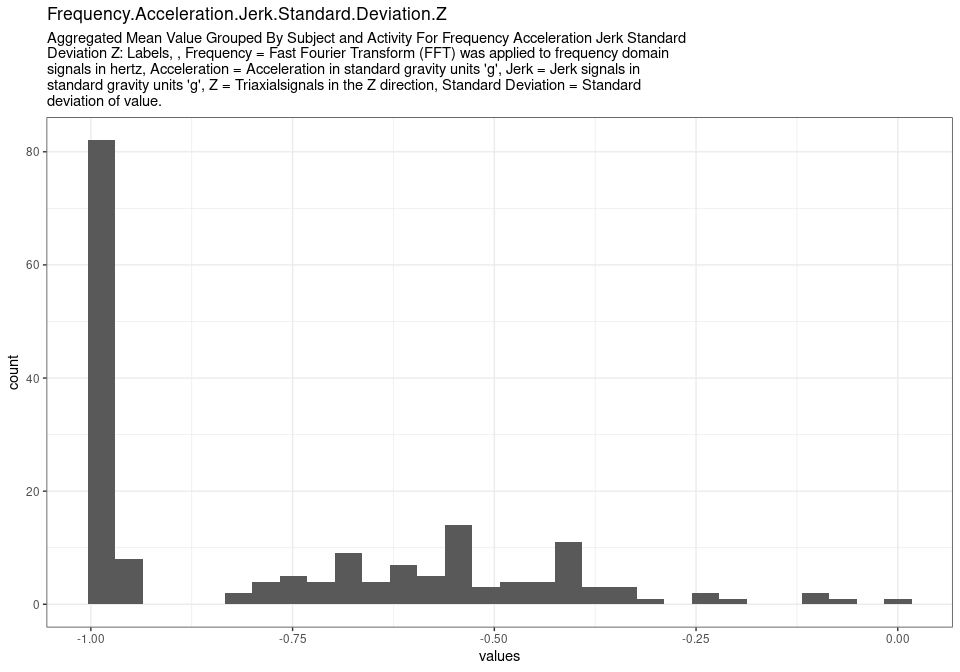

0 missing values.

#### Summary statistics {#Frequency_Acceleration_Jerk_Standard_Deviation_Z_summary}

|name                                             |label                                                                                                                                                                                                                                                                                                                                                                                                                      |data_type | n_missing| complete_rate|min   |median |max     |       mean|        sd|hist  |
|:------------------------------------------------|:--------------------------------------------------------------------------------------------------------------------------------------------------------------------------------------------------------------------------------------------------------------------------------------------------------------------------------------------------------------------------------------------------------------------------|:---------|---------:|-------------:|:-----|:------|:-------|----------:|---------:|:-----|
|Frequency.Acceleration.Jerk.Standard.Deviation.Z |Aggregated Mean Value Grouped By Subject and Activity For Frequency Acceleration Jerk Standard Deviation Z:  Labels,  , Frequency = Fast Fourier Transform (FFT) was applied to frequency domain signals in hertz, Acceleration = Acceleration in standard gravity units 'g', Jerk = Jerk signals in standard gravity units 'g', Z = Triaxialsignals in the Z direction, Standard Deviation = Standard deviation of value. |numeric   |         0|             1|-0.99 |-0.9   |-0.0062 | -0.7564894| 0.2570577|▇▃▃▁▁ |


### Frequency.Acceleration.Jerk.Mean.Frequency.X {#Frequency_Acceleration_Jerk_Mean_Frequency_X .tabset}

Aggregated Mean Value Grouped By Subject and Activity For Frequency Acceleration Jerk Mean Frequency X:  Labels,  , Frequency = Fast Fourier Transform (FFT) was applied to frequency domain signals in hertz, Acceleration = Acceleration in standard gravity units 'g', Jerk = Jerk signals in standard gravity units 'g', X = Triaxial signals in the X direction, Mean = Mean of value.

#### Distribution {#Frequency_Acceleration_Jerk_Mean_Frequency_X_distribution}

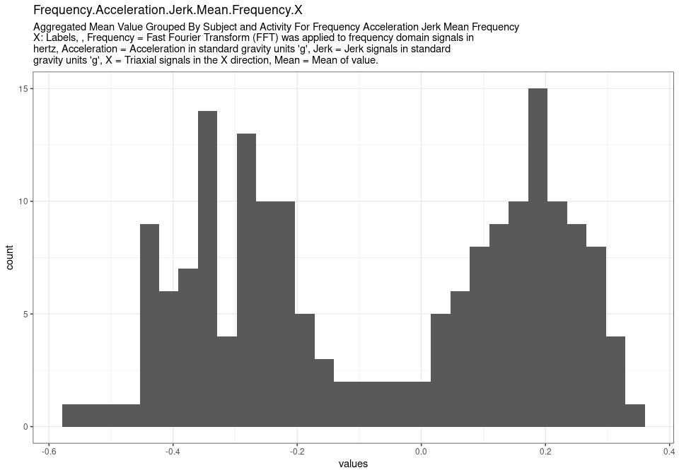

0 missing values.

#### Summary statistics {#Frequency_Acceleration_Jerk_Mean_Frequency_X_summary}

|name                                         |label                                                                                                                                                                                                                                                                                                                                                                                       |data_type | n_missing| complete_rate|min   |median |max  |       mean|        sd|hist  |
|:--------------------------------------------|:-------------------------------------------------------------------------------------------------------------------------------------------------------------------------------------------------------------------------------------------------------------------------------------------------------------------------------------------------------------------------------------------|:---------|---------:|-------------:|:-----|:------|:----|----------:|---------:|:-----|
|Frequency.Acceleration.Jerk.Mean.Frequency.X |Aggregated Mean Value Grouped By Subject and Activity For Frequency Acceleration Jerk Mean Frequency X:  Labels,  , Frequency = Fast Fourier Transform (FFT) was applied to frequency domain signals in hertz, Acceleration = Acceleration in standard gravity units 'g', Jerk = Jerk signals in standard gravity units 'g', X = Triaxial signals in the X direction, Mean = Mean of value. |numeric   |         0|             1|-0.58 |-0.061 |0.33 | -0.0691018| 0.2541022|▂▇▂▅▇ |


### Frequency.Acceleration.Jerk.Mean.Frequency.Y {#Frequency_Acceleration_Jerk_Mean_Frequency_Y .tabset}

Aggregated Mean Value Grouped By Subject and Activity For Frequency Acceleration Jerk Mean Frequency Y:  Labels,  , Frequency = Fast Fourier Transform (FFT) was applied to frequency domain signals in hertz, Acceleration = Acceleration in standard gravity units 'g', Jerk = Jerk signals in standard gravity units 'g', Y = Triaxial signals in the Y direction, Mean = Mean of value.

#### Distribution {#Frequency_Acceleration_Jerk_Mean_Frequency_Y_distribution}

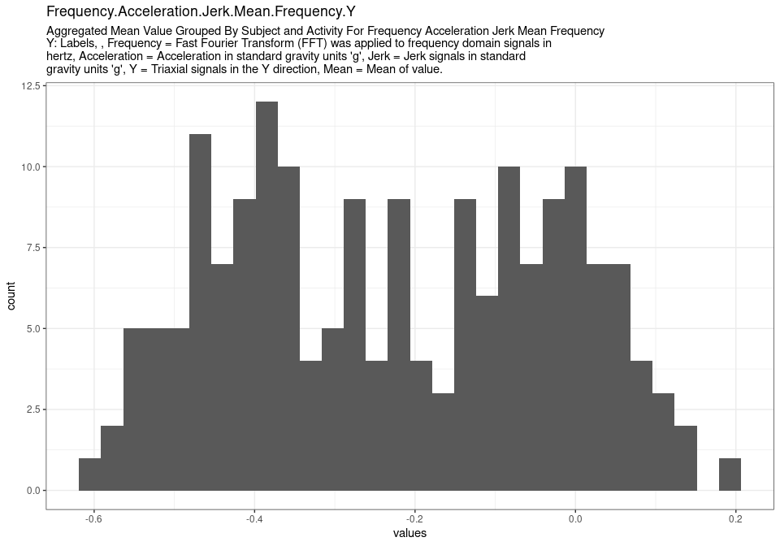

0 missing values.

#### Summary statistics {#Frequency_Acceleration_Jerk_Mean_Frequency_Y_summary}

|name                                         |label                                                                                                                                                                                                                                                                                                                                                                                       |data_type | n_missing| complete_rate|min  |median |max |       mean|        sd|hist  |
|:--------------------------------------------|:-------------------------------------------------------------------------------------------------------------------------------------------------------------------------------------------------------------------------------------------------------------------------------------------------------------------------------------------------------------------------------------------|:---------|---------:|-------------:|:----|:------|:---|----------:|---------:|:-----|
|Frequency.Acceleration.Jerk.Mean.Frequency.Y |Aggregated Mean Value Grouped By Subject and Activity For Frequency Acceleration Jerk Mean Frequency Y:  Labels,  , Frequency = Fast Fourier Transform (FFT) was applied to frequency domain signals in hertz, Acceleration = Acceleration in standard gravity units 'g', Jerk = Jerk signals in standard gravity units 'g', Y = Triaxial signals in the Y direction, Mean = Mean of value. |numeric   |         0|             1|-0.6 |-0.23  |0.2 | -0.2281021| 0.1998647|▅▇▆▇▃ |


### Frequency.Acceleration.Jerk.Mean.Frequency.Z {#Frequency_Acceleration_Jerk_Mean_Frequency_Z .tabset}

Aggregated Mean Value Grouped By Subject and Activity For Frequency Acceleration Jerk Mean Frequency Z:  Labels,  , Frequency = Fast Fourier Transform (FFT) was applied to frequency domain signals in hertz, Acceleration = Acceleration in standard gravity units 'g', Jerk = Jerk signals in standard gravity units 'g', Z = Triaxialsignals in the Z direction, Mean = Mean of value.

#### Distribution {#Frequency_Acceleration_Jerk_Mean_Frequency_Z_distribution}

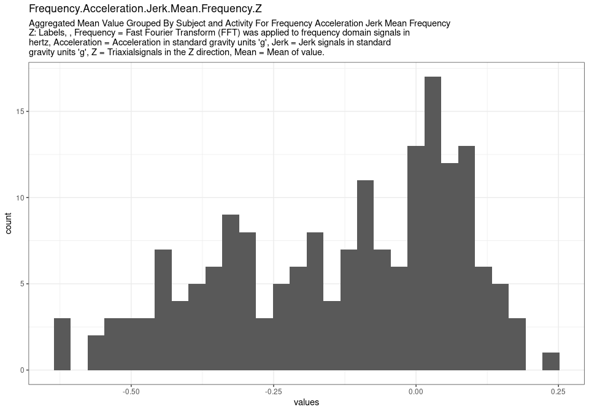

0 missing values.

#### Summary statistics {#Frequency_Acceleration_Jerk_Mean_Frequency_Z_summary}

|name                                         |label                                                                                                                                                                                                                                                                                                                                                                                      |data_type | n_missing| complete_rate|min   |median |max  |       mean|        sd|hist  |
|:--------------------------------------------|:------------------------------------------------------------------------------------------------------------------------------------------------------------------------------------------------------------------------------------------------------------------------------------------------------------------------------------------------------------------------------------------|:---------|---------:|-------------:|:-----|:------|:----|----------:|---------:|:-----|
|Frequency.Acceleration.Jerk.Mean.Frequency.Z |Aggregated Mean Value Grouped By Subject and Activity For Frequency Acceleration Jerk Mean Frequency Z:  Labels,  , Frequency = Fast Fourier Transform (FFT) was applied to frequency domain signals in hertz, Acceleration = Acceleration in standard gravity units 'g', Jerk = Jerk signals in standard gravity units 'g', Z = Triaxialsignals in the Z direction, Mean = Mean of value. |numeric   |         0|             1|-0.63 |-0.092 |0.23 | -0.1376023| 0.2078722|▂▅▃▇▅ |


### Frequency.Gyroscope.Mean.X {#Frequency_Gyroscope_Mean_X .tabset}

Aggregated Mean Value Grouped By Subject and Activity For Frequency Gyroscope Mean X:  Labels,  , Frequency = Fast Fourier Transform (FFT) was applied to frequency domain signals in hertz, Gyroscope = The gyroscope sensor signals in radians/second, X = Triaxial signals in the X direction, Mean = Mean of value.

#### Distribution {#Frequency_Gyroscope_Mean_X_distribution}

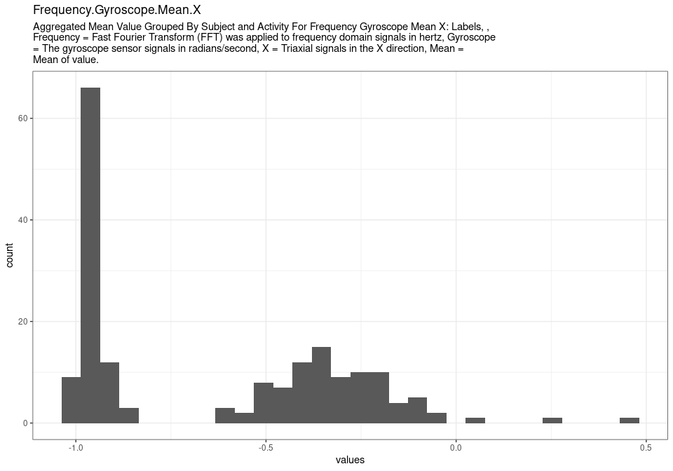

0 missing values.

#### Summary statistics {#Frequency_Gyroscope_Mean_X_summary}

|name                       |label                                                                                                                                                                                                                                                                                                                   |data_type | n_missing| complete_rate|min   |median |max  |       mean|        sd|hist  |
|:--------------------------|:-----------------------------------------------------------------------------------------------------------------------------------------------------------------------------------------------------------------------------------------------------------------------------------------------------------------------|:---------|---------:|-------------:|:-----|:------|:----|----------:|---------:|:-----|
|Frequency.Gyroscope.Mean.X |Aggregated Mean Value Grouped By Subject and Activity For Frequency Gyroscope Mean X:  Labels,  , Frequency = Fast Fourier Transform (FFT) was applied to frequency domain signals in hertz, Gyroscope = The gyroscope sensor signals in radians/second, X = Triaxial signals in the X direction, Mean = Mean of value. |numeric   |         0|             1|-0.99 |-0.73  |0.47 | -0.6367396| 0.3467628|▇▂▅▁▁ |


### Frequency.Gyroscope.Mean.Y {#Frequency_Gyroscope_Mean_Y .tabset}

Aggregated Mean Value Grouped By Subject and Activity For Frequency Gyroscope Mean Y:  Labels,  , Frequency = Fast Fourier Transform (FFT) was applied to frequency domain signals in hertz, Gyroscope = The gyroscope sensor signals in radians/second, Y = Triaxial signals in the Y direction, Mean = Mean of value.

#### Distribution {#Frequency_Gyroscope_Mean_Y_distribution}


0 missing values.

#### Summary statistics {#Frequency_Gyroscope_Mean_Y_summary}

|name                       |label                                                                                                                                                                                                                                                                                                                   |data_type | n_missing| complete_rate|min   |median |max  |       mean|        sd|hist  |
|:--------------------------|:-----------------------------------------------------------------------------------------------------------------------------------------------------------------------------------------------------------------------------------------------------------------------------------------------------------------------|:---------|---------:|-------------:|:-----|:------|:----|----------:|---------:|:-----|
|Frequency.Gyroscope.Mean.Y |Aggregated Mean Value Grouped By Subject and Activity For Frequency Gyroscope Mean Y:  Labels,  , Frequency = Fast Fourier Transform (FFT) was applied to frequency domain signals in hertz, Gyroscope = The gyroscope sensor signals in radians/second, Y = Triaxial signals in the Y direction, Mean = Mean of value. |numeric   |         0|             1|-0.99 |-0.81  |0.33 | -0.6766868| 0.3319182|▇▃▃▁▁ |


### Frequency.Gyroscope.Mean.Z {#Frequency_Gyroscope_Mean_Z .tabset}

Aggregated Mean Value Grouped By Subject and Activity For Frequency Gyroscope Mean Z:  Labels,  , Frequency = Fast Fourier Transform (FFT) was applied to frequency domain signals in hertz, Gyroscope = The gyroscope sensor signals in radians/second, Z = Triaxialsignals in the Z direction, Mean = Mean of value.

#### Distribution {#Frequency_Gyroscope_Mean_Z_distribution}

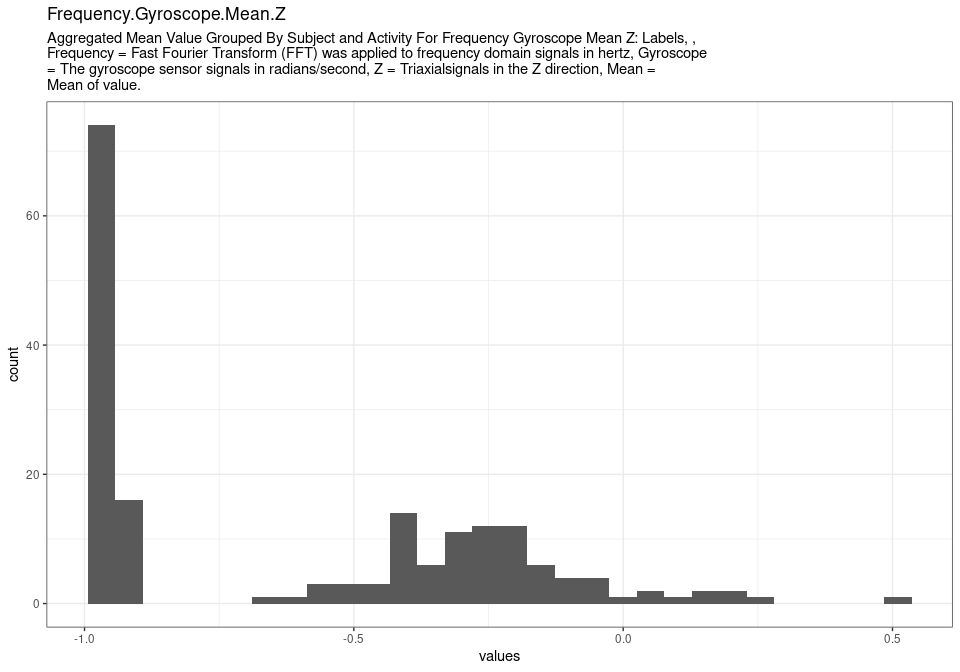

0 missing values.

#### Summary statistics {#Frequency_Gyroscope_Mean_Z_summary}

|name                       |label                                                                                                                                                                                                                                                                                                                  |data_type | n_missing| complete_rate|min   |median |max  |       mean|        sd|hist  |
|:--------------------------|:----------------------------------------------------------------------------------------------------------------------------------------------------------------------------------------------------------------------------------------------------------------------------------------------------------------------|:---------|---------:|-------------:|:-----|:------|:----|----------:|---------:|:-----|
|Frequency.Gyroscope.Mean.Z |Aggregated Mean Value Grouped By Subject and Activity For Frequency Gyroscope Mean Z:  Labels,  , Frequency = Fast Fourier Transform (FFT) was applied to frequency domain signals in hertz, Gyroscope = The gyroscope sensor signals in radians/second, Z = Triaxialsignals in the Z direction, Mean = Mean of value. |numeric   |         0|             1|-0.99 |-0.79  |0.49 | -0.6043912| 0.3842603|▇▂▅▁▁ |


### Frequency.Gyroscope.Standard.Deviation.X {#Frequency_Gyroscope_Standard_Deviation_X .tabset}

Aggregated Mean Value Grouped By Subject and Activity For Frequency Gyroscope Standard Deviation X:  Labels,  , Frequency = Fast Fourier Transform (FFT) was applied to frequency domain signals in hertz, Gyroscope = The gyroscope sensor signals in radians/second, X = Triaxial signals in the X direction, Standard Deviation = Standard deviation of value.

#### Distribution {#Frequency_Gyroscope_Standard_Deviation_X_distribution}

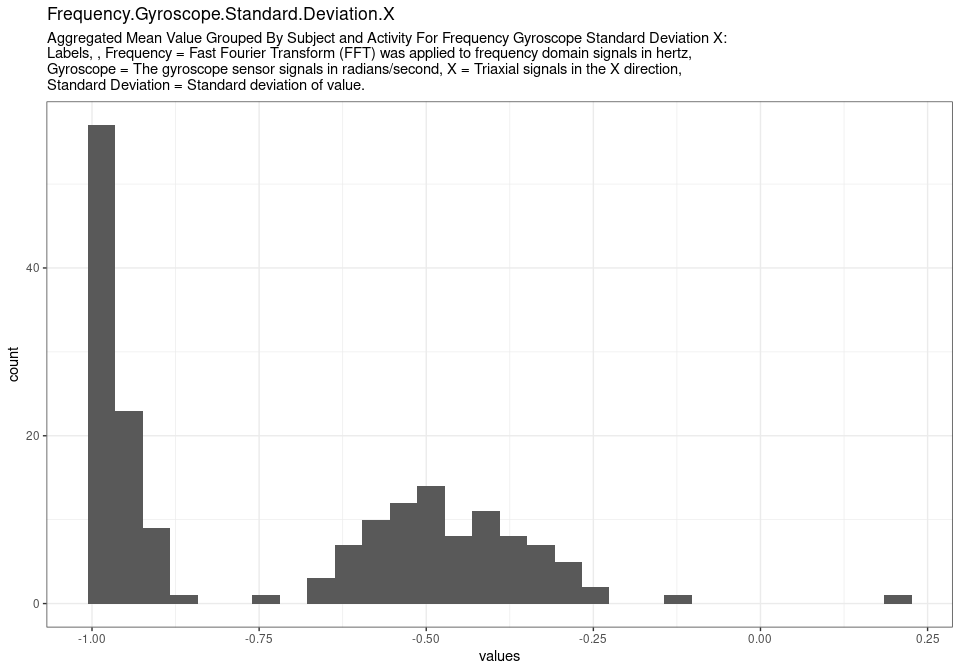

0 missing values.

#### Summary statistics {#Frequency_Gyroscope_Standard_Deviation_X_summary}

|name                                     |label                                                                                                                                                                                                                                                                                                                                                             |data_type | n_missing| complete_rate|min   |median |max |       mean|       sd|hist  |
|:----------------------------------------|:-----------------------------------------------------------------------------------------------------------------------------------------------------------------------------------------------------------------------------------------------------------------------------------------------------------------------------------------------------------------|:---------|---------:|-------------:|:-----|:------|:---|----------:|--------:|:-----|
|Frequency.Gyroscope.Standard.Deviation.X |Aggregated Mean Value Grouped By Subject and Activity For Frequency Gyroscope Standard Deviation X:  Labels,  , Frequency = Fast Fourier Transform (FFT) was applied to frequency domain signals in hertz, Gyroscope = The gyroscope sensor signals in radians/second, X = Triaxial signals in the X direction, Standard Deviation = Standard deviation of value. |numeric   |         0|             1|-0.99 |-0.81  |0.2 | -0.7110357| 0.272789|▇▂▅▁▁ |


### Frequency.Gyroscope.Standard.Deviation.Y {#Frequency_Gyroscope_Standard_Deviation_Y .tabset}

Aggregated Mean Value Grouped By Subject and Activity For Frequency Gyroscope Standard Deviation Y:  Labels,  , Frequency = Fast Fourier Transform (FFT) was applied to frequency domain signals in hertz, Gyroscope = The gyroscope sensor signals in radians/second, Y = Triaxial signals in the Y direction, Standard Deviation = Standard deviation of value.

#### Distribution {#Frequency_Gyroscope_Standard_Deviation_Y_distribution}

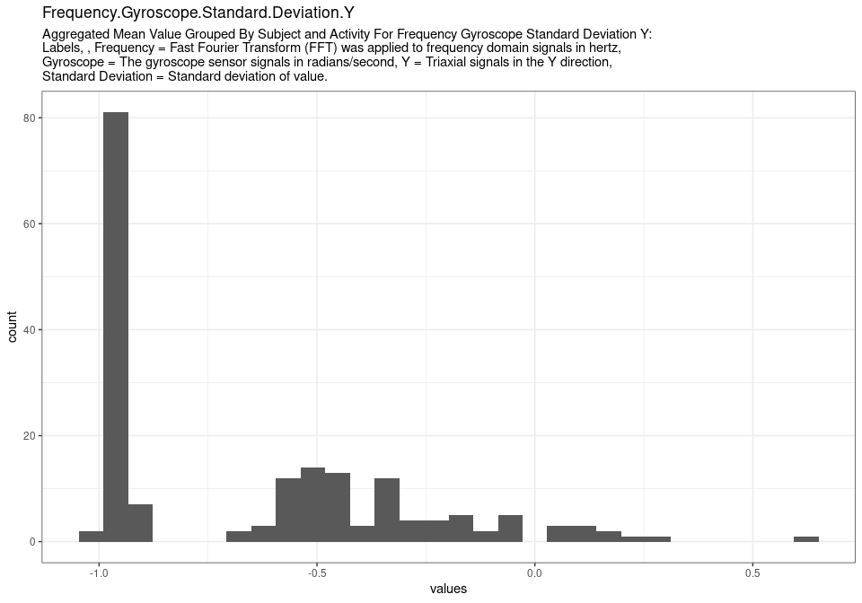

0 missing values.

#### Summary statistics {#Frequency_Gyroscope_Standard_Deviation_Y_summary}

|name                                     |label                                                                                                                                                                                                                                                                                                                                                             |data_type | n_missing| complete_rate|min   |median |max  |       mean|        sd|hist  |
|:----------------------------------------|:-----------------------------------------------------------------------------------------------------------------------------------------------------------------------------------------------------------------------------------------------------------------------------------------------------------------------------------------------------------------|:---------|---------:|-------------:|:-----|:------|:----|----------:|---------:|:-----|
|Frequency.Gyroscope.Standard.Deviation.Y |Aggregated Mean Value Grouped By Subject and Activity For Frequency Gyroscope Standard Deviation Y:  Labels,  , Frequency = Fast Fourier Transform (FFT) was applied to frequency domain signals in hertz, Gyroscope = The gyroscope sensor signals in radians/second, Y = Triaxial signals in the Y direction, Standard Deviation = Standard deviation of value. |numeric   |         0|             1|-0.99 |-0.8   |0.65 | -0.6454334| 0.3634445|▇▅▂▁▁ |


### Frequency.Gyroscope.Standard.Deviation.Z {#Frequency_Gyroscope_Standard_Deviation_Z .tabset}

Aggregated Mean Value Grouped By Subject and Activity For Frequency Gyroscope Standard Deviation Z:  Labels,  , Frequency = Fast Fourier Transform (FFT) was applied to frequency domain signals in hertz, Gyroscope = The gyroscope sensor signals in radians/second, Z = Triaxialsignals in the Z direction, Standard Deviation = Standard deviation of value.

#### Distribution {#Frequency_Gyroscope_Standard_Deviation_Z_distribution}

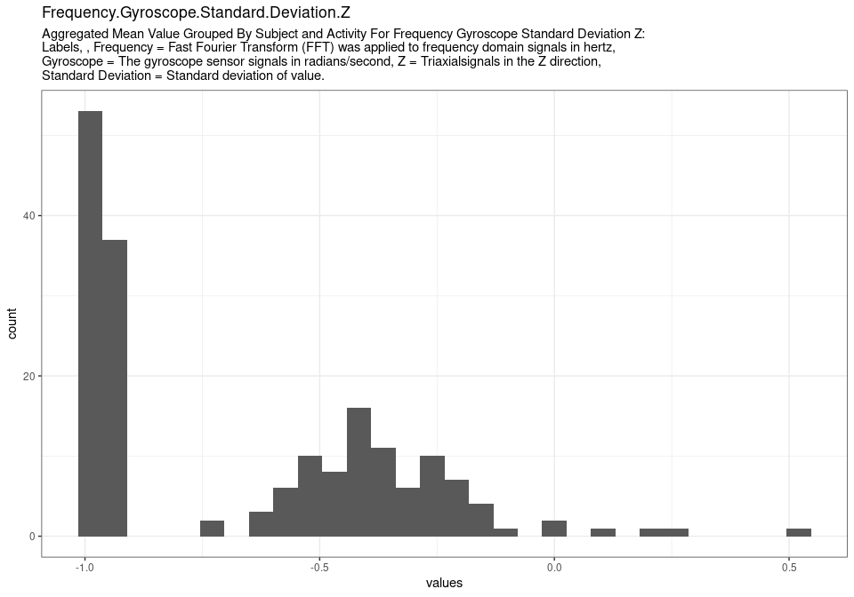

0 missing values.

#### Summary statistics {#Frequency_Gyroscope_Standard_Deviation_Z_summary}

|name                                     |label                                                                                                                                                                                                                                                                                                                                                            |data_type | n_missing| complete_rate|min   |median |max  |       mean|        sd|hist  |
|:----------------------------------------|:----------------------------------------------------------------------------------------------------------------------------------------------------------------------------------------------------------------------------------------------------------------------------------------------------------------------------------------------------------------|:---------|---------:|-------------:|:-----|:------|:----|----------:|---------:|:-----|
|Frequency.Gyroscope.Standard.Deviation.Z |Aggregated Mean Value Grouped By Subject and Activity For Frequency Gyroscope Standard Deviation Z:  Labels,  , Frequency = Fast Fourier Transform (FFT) was applied to frequency domain signals in hertz, Gyroscope = The gyroscope sensor signals in radians/second, Z = Triaxialsignals in the Z direction, Standard Deviation = Standard deviation of value. |numeric   |         0|             1|-0.99 |-0.82  |0.52 | -0.6577466| 0.3362014|▇▃▃▁▁ |


### Frequency.Gyroscope.Mean.Frequency.X {#Frequency_Gyroscope_Mean_Frequency_X .tabset}

Aggregated Mean Value Grouped By Subject and Activity For Frequency Gyroscope Mean Frequency X:  Labels,  , Frequency = Fast Fourier Transform (FFT) was applied to frequency domain signals in hertz, Gyroscope = The gyroscope sensor signals in radians/second, X = Triaxial signals in the X direction, Mean = Mean of value.

#### Distribution {#Frequency_Gyroscope_Mean_Frequency_X_distribution}

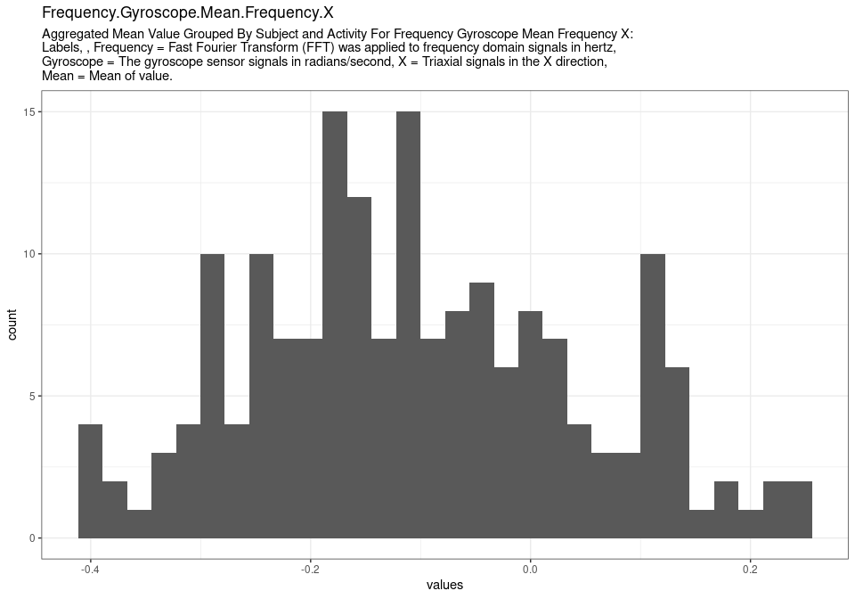

0 missing values.

#### Summary statistics {#Frequency_Gyroscope_Mean_Frequency_X_summary}

|name                                 |label                                                                                                                                                                                                                                                                                                                             |data_type | n_missing| complete_rate|min  |median |max  |      mean|        sd|hist  |
|:------------------------------------|:---------------------------------------------------------------------------------------------------------------------------------------------------------------------------------------------------------------------------------------------------------------------------------------------------------------------------------|:---------|---------:|-------------:|:----|:------|:----|---------:|---------:|:-----|
|Frequency.Gyroscope.Mean.Frequency.X |Aggregated Mean Value Grouped By Subject and Activity For Frequency Gyroscope Mean Frequency X:  Labels,  , Frequency = Fast Fourier Transform (FFT) was applied to frequency domain signals in hertz, Gyroscope = The gyroscope sensor signals in radians/second, X = Triaxial signals in the X direction, Mean = Mean of value. |numeric   |         0|             1|-0.4 |-0.12  |0.25 | -0.104551| 0.1480975|▃▇▇▅▂ |


### Frequency.Gyroscope.Mean.Frequency.Y {#Frequency_Gyroscope_Mean_Frequency_Y .tabset}

Aggregated Mean Value Grouped By Subject and Activity For Frequency Gyroscope Mean Frequency Y:  Labels,  , Frequency = Fast Fourier Transform (FFT) was applied to frequency domain signals in hertz, Gyroscope = The gyroscope sensor signals in radians/second, Y = Triaxial signals in the Y direction, Mean = Mean of value.

#### Distribution {#Frequency_Gyroscope_Mean_Frequency_Y_distribution}

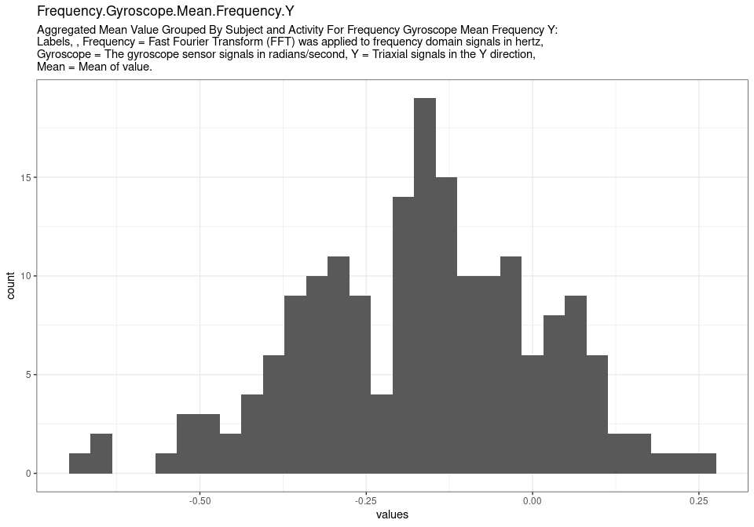

0 missing values.

#### Summary statistics {#Frequency_Gyroscope_Mean_Frequency_Y_summary}

|name                                 |label                                                                                                                                                                                                                                                                                                                             |data_type | n_missing| complete_rate|min   |median |max  |       mean|        sd|hist  |
|:------------------------------------|:---------------------------------------------------------------------------------------------------------------------------------------------------------------------------------------------------------------------------------------------------------------------------------------------------------------------------------|:---------|---------:|-------------:|:-----|:------|:----|----------:|---------:|:-----|
|Frequency.Gyroscope.Mean.Frequency.Y |Aggregated Mean Value Grouped By Subject and Activity For Frequency Gyroscope Mean Frequency Y:  Labels,  , Frequency = Fast Fourier Transform (FFT) was applied to frequency domain signals in hertz, Gyroscope = The gyroscope sensor signals in radians/second, Y = Triaxial signals in the Y direction, Mean = Mean of value. |numeric   |         0|             1|-0.67 |-0.16  |0.27 | -0.1674075| 0.1788011|▁▅▇▆▂ |


### Frequency.Gyroscope.Mean.Frequency.Z {#Frequency_Gyroscope_Mean_Frequency_Z .tabset}

Aggregated Mean Value Grouped By Subject and Activity For Frequency Gyroscope Mean Frequency Z:  Labels,  , Frequency = Fast Fourier Transform (FFT) was applied to frequency domain signals in hertz, Gyroscope = The gyroscope sensor signals in radians/second, Z = Triaxialsignals in the Z direction, Mean = Mean of value.

#### Distribution {#Frequency_Gyroscope_Mean_Frequency_Z_distribution}

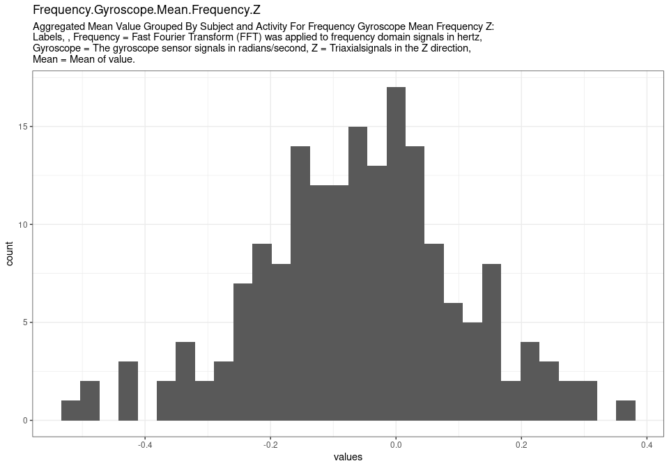

0 missing values.

#### Summary statistics {#Frequency_Gyroscope_Mean_Frequency_Z_summary}

|name                                 |label                                                                                                                                                                                                                                                                                                                            |data_type | n_missing| complete_rate|min   |median |max  |       mean|        sd|hist  |
|:------------------------------------|:--------------------------------------------------------------------------------------------------------------------------------------------------------------------------------------------------------------------------------------------------------------------------------------------------------------------------------|:---------|---------:|-------------:|:-----|:------|:----|----------:|---------:|:-----|
|Frequency.Gyroscope.Mean.Frequency.Z |Aggregated Mean Value Grouped By Subject and Activity For Frequency Gyroscope Mean Frequency Z:  Labels,  , Frequency = Fast Fourier Transform (FFT) was applied to frequency domain signals in hertz, Gyroscope = The gyroscope sensor signals in radians/second, Z = Triaxialsignals in the Z direction, Mean = Mean of value. |numeric   |         0|             1|-0.51 |-0.051 |0.38 | -0.0571809| 0.1652298|▁▃▇▃▁ |


### Frequency.Acceleration.Magnitude.Mean {#Frequency_Acceleration_Magnitude_Mean .tabset}

Aggregated Mean Value Grouped By Subject and Activity For Frequency Acceleration Magnitude Mean:  Labels,  , Frequency = Fast Fourier Transform (FFT) was applied to frequency domain signals in hertz, Acceleration = Acceleration in standard gravity units 'g', Magnitude = The magnitude measured in the Euclidean norm, Mean = Mean of value.

#### Distribution {#Frequency_Acceleration_Magnitude_Mean_distribution}

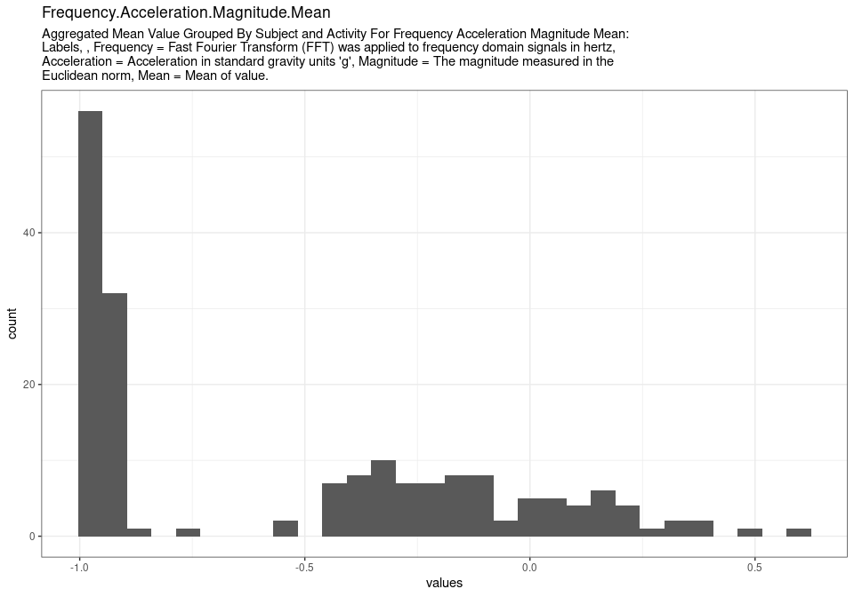

0 missing values.

#### Summary statistics {#Frequency_Acceleration_Magnitude_Mean_summary}

|name                                  |label                                                                                                                                                                                                                                                                                                                                              |data_type | n_missing| complete_rate|min   |median |max  |       mean|        sd|hist  |
|:-------------------------------------|:--------------------------------------------------------------------------------------------------------------------------------------------------------------------------------------------------------------------------------------------------------------------------------------------------------------------------------------------------|:---------|---------:|-------------:|:-----|:------|:----|----------:|---------:|:-----|
|Frequency.Acceleration.Magnitude.Mean |Aggregated Mean Value Grouped By Subject and Activity For Frequency Acceleration Magnitude Mean:  Labels,  , Frequency = Fast Fourier Transform (FFT) was applied to frequency domain signals in hertz, Acceleration = Acceleration in standard gravity units 'g', Magnitude = The magnitude measured in the Euclidean norm, Mean = Mean of value. |numeric   |         0|             1|-0.99 |-0.67  |0.59 | -0.5365167| 0.4516451|▇▂▃▂▁ |


### Frequency.Acceleration.Magnitude.Standard.Deviation {#Frequency_Acceleration_Magnitude_Standard_Deviation .tabset}

Aggregated Mean Value Grouped By Subject and Activity For Frequency Acceleration Magnitude Standard Deviation:  Labels,  , Frequency = Fast Fourier Transform (FFT) was applied to frequency domain signals in hertz, Acceleration = Acceleration in standard gravity units 'g', Magnitude = The magnitude measured in the Euclidean norm, Standard Deviation = Standard deviation of value.

#### Distribution {#Frequency_Acceleration_Magnitude_Standard_Deviation_distribution}

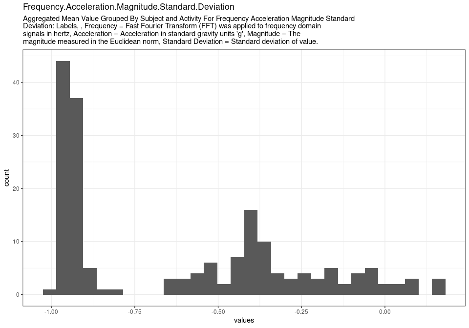

0 missing values.

#### Summary statistics {#Frequency_Acceleration_Magnitude_Standard_Deviation_summary}

|name                                                |label                                                                                                                                                                                                                                                                                                                                                                                        |data_type | n_missing| complete_rate|min   |median |max  |       mean|        sd|hist  |
|:---------------------------------------------------|:--------------------------------------------------------------------------------------------------------------------------------------------------------------------------------------------------------------------------------------------------------------------------------------------------------------------------------------------------------------------------------------------|:---------|---------:|-------------:|:-----|:------|:----|----------:|---------:|:-----|
|Frequency.Acceleration.Magnitude.Standard.Deviation |Aggregated Mean Value Grouped By Subject and Activity For Frequency Acceleration Magnitude Standard Deviation:  Labels,  , Frequency = Fast Fourier Transform (FFT) was applied to frequency domain signals in hertz, Acceleration = Acceleration in standard gravity units 'g', Magnitude = The magnitude measured in the Euclidean norm, Standard Deviation = Standard deviation of value. |numeric   |         0|             1|-0.99 |-0.65  |0.18 | -0.6209633| 0.3529148|▇▁▃▂▁ |


### Frequency.Acceleration.Magnitude.Mean.Frequency {#Frequency_Acceleration_Magnitude_Mean_Frequency .tabset}

Aggregated Mean Value Grouped By Subject and Activity For Frequency Acceleration Magnitude Mean Frequency:  Labels,  , Frequency = Fast Fourier Transform (FFT) was applied to frequency domain signals in hertz, Acceleration = Acceleration in standard gravity units 'g', Magnitude = The magnitude measured in the Euclidean norm, Mean = Mean of value.

#### Distribution {#Frequency_Acceleration_Magnitude_Mean_Frequency_distribution}

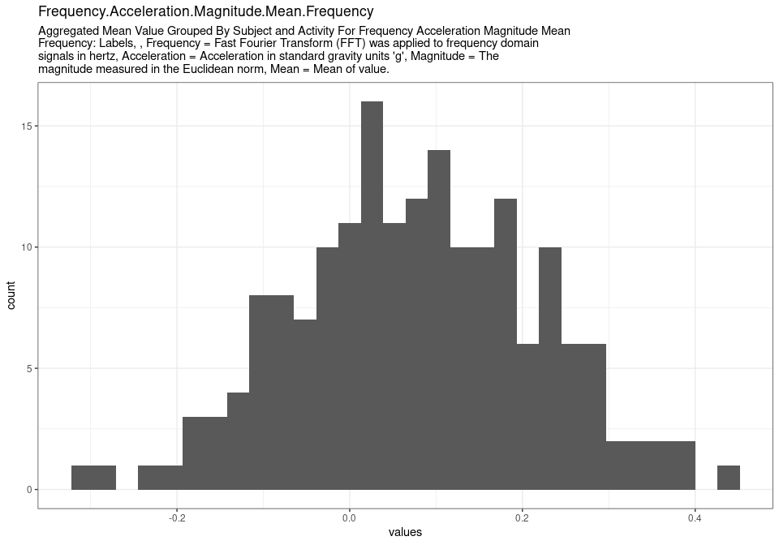

0 missing values.

#### Summary statistics {#Frequency_Acceleration_Magnitude_Mean_Frequency_summary}

|name                                            |label                                                                                                                                                                                                                                                                                                                                                        |data_type | n_missing| complete_rate|min   |median |max  |      mean|        sd|hist  |
|:-----------------------------------------------|:------------------------------------------------------------------------------------------------------------------------------------------------------------------------------------------------------------------------------------------------------------------------------------------------------------------------------------------------------------|:---------|---------:|-------------:|:-----|:------|:----|---------:|---------:|:-----|
|Frequency.Acceleration.Magnitude.Mean.Frequency |Aggregated Mean Value Grouped By Subject and Activity For Frequency Acceleration Magnitude Mean Frequency:  Labels,  , Frequency = Fast Fourier Transform (FFT) was applied to frequency domain signals in hertz, Acceleration = Acceleration in standard gravity units 'g', Magnitude = The magnitude measured in the Euclidean norm, Mean = Mean of value. |numeric   |         0|             1|-0.31 |0.081  |0.44 | 0.0761282| 0.1404479|▁▅▇▅▁ |


### Frequency.Acceleration.Jerk.Magnitude.Mean {#Frequency_Acceleration_Jerk_Magnitude_Mean .tabset}

Aggregated Mean Value Grouped By Subject and Activity For Frequency Acceleration Jerk Magnitude Mean:  Labels,  , Frequency = Fast Fourier Transform (FFT) was applied to frequency domain signals in hertz, Acceleration = Acceleration in standard gravity units 'g', Jerk = Jerk signals in standard gravity units 'g', Magnitude = The magnitude measured in the Euclidean norm, Mean = Mean of value.

#### Distribution {#Frequency_Acceleration_Jerk_Magnitude_Mean_distribution}

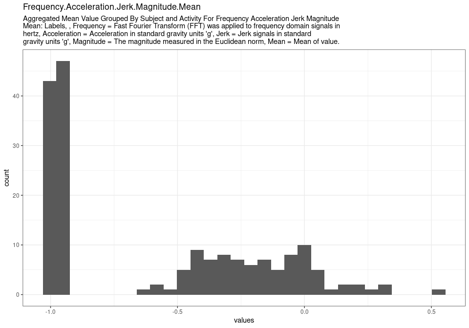

0 missing values.

#### Summary statistics {#Frequency_Acceleration_Jerk_Magnitude_Mean_summary}

|name                                       |label                                                                                                                                                                                                                                                                                                                                                                                                      |data_type | n_missing| complete_rate|min   |median |max  |       mean|        sd|hist  |
|:------------------------------------------|:----------------------------------------------------------------------------------------------------------------------------------------------------------------------------------------------------------------------------------------------------------------------------------------------------------------------------------------------------------------------------------------------------------|:---------|---------:|-------------:|:-----|:------|:----|----------:|---------:|:-----|
|Frequency.Acceleration.Jerk.Magnitude.Mean |Aggregated Mean Value Grouped By Subject and Activity For Frequency Acceleration Jerk Magnitude Mean:  Labels,  , Frequency = Fast Fourier Transform (FFT) was applied to frequency domain signals in hertz, Acceleration = Acceleration in standard gravity units 'g', Jerk = Jerk signals in standard gravity units 'g', Magnitude = The magnitude measured in the Euclidean norm, Mean = Mean of value. |numeric   |         0|             1|-0.99 |-0.79  |0.54 | -0.5756175| 0.4312321|▇▂▃▂▁ |


### Frequency.Acceleration.Jerk.Magnitude.Standard.Deviation {#Frequency_Acceleration_Jerk_Magnitude_Standard_Deviation .tabset}

Aggregated Mean Value Grouped By Subject and Activity For Frequency Acceleration Jerk Magnitude Standard Deviation:  Labels,  , Frequency = Fast Fourier Transform (FFT) was applied to frequency domain signals in hertz, Acceleration = Acceleration in standard gravity units 'g', Jerk = Jerk signals in standard gravity units 'g', Magnitude = The magnitude measured in the Euclidean norm, Standard Deviation = Standard deviation of value.

#### Distribution {#Frequency_Acceleration_Jerk_Magnitude_Standard_Deviation_distribution}

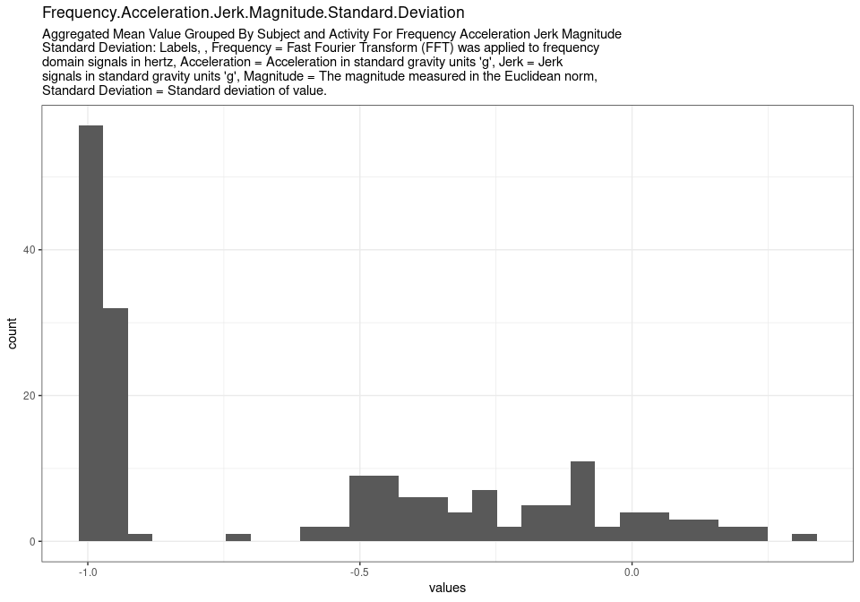

0 missing values.

#### Summary statistics {#Frequency_Acceleration_Jerk_Magnitude_Standard_Deviation_summary}

|name                                                     |label                                                                                                                                                                                                                                                                                                                                                                                                                                                |data_type | n_missing| complete_rate|min   |median |max  |       mean|        sd|hist  |
|:--------------------------------------------------------|:----------------------------------------------------------------------------------------------------------------------------------------------------------------------------------------------------------------------------------------------------------------------------------------------------------------------------------------------------------------------------------------------------------------------------------------------------|:---------|---------:|-------------:|:-----|:------|:----|----------:|---------:|:-----|
|Frequency.Acceleration.Jerk.Magnitude.Standard.Deviation |Aggregated Mean Value Grouped By Subject and Activity For Frequency Acceleration Jerk Magnitude Standard Deviation:  Labels,  , Frequency = Fast Fourier Transform (FFT) was applied to frequency domain signals in hertz, Acceleration = Acceleration in standard gravity units 'g', Jerk = Jerk signals in standard gravity units 'g', Magnitude = The magnitude measured in the Euclidean norm, Standard Deviation = Standard deviation of value. |numeric   |         0|             1|-0.99 |-0.81  |0.32 | -0.5991609| 0.4086668|▇▁▃▂▁ |


### Frequency.Acceleration.Jerk.Magnitude.Mean.Frequency {#Frequency_Acceleration_Jerk_Magnitude_Mean_Frequency .tabset}

Aggregated Mean Value Grouped By Subject and Activity For Frequency Acceleration Jerk Magnitude Mean Frequency:  Labels,  , Frequency = Fast Fourier Transform (FFT) was applied to frequency domain signals in hertz, Acceleration = Acceleration in standard gravity units 'g', Jerk = Jerk signals in standard gravity units 'g', Magnitude = The magnitude measured in the Euclidean norm, Mean = Mean of value.

#### Distribution {#Frequency_Acceleration_Jerk_Magnitude_Mean_Frequency_distribution}

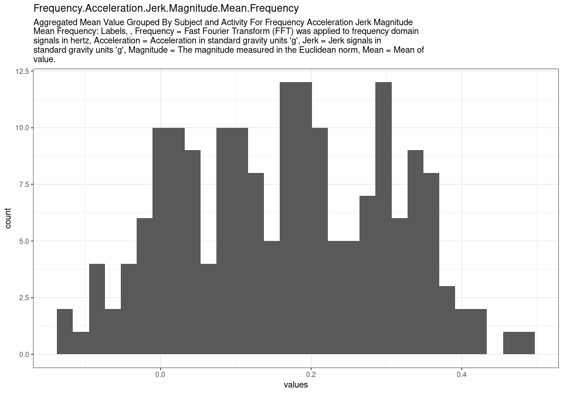

0 missing values.

#### Summary statistics {#Frequency_Acceleration_Jerk_Magnitude_Mean_Frequency_summary}

|name                                                 |label                                                                                                                                                                                                                                                                                                                                                                                                                |data_type | n_missing| complete_rate|min   |median |max  |      mean|      sd|hist  |
|:----------------------------------------------------|:--------------------------------------------------------------------------------------------------------------------------------------------------------------------------------------------------------------------------------------------------------------------------------------------------------------------------------------------------------------------------------------------------------------------|:---------|---------:|-------------:|:-----|:------|:----|---------:|-------:|:-----|
|Frequency.Acceleration.Jerk.Magnitude.Mean.Frequency |Aggregated Mean Value Grouped By Subject and Activity For Frequency Acceleration Jerk Magnitude Mean Frequency:  Labels,  , Frequency = Fast Fourier Transform (FFT) was applied to frequency domain signals in hertz, Acceleration = Acceleration in standard gravity units 'g', Jerk = Jerk signals in standard gravity units 'g', Magnitude = The magnitude measured in the Euclidean norm, Mean = Mean of value. |numeric   |         0|             1|-0.13 |0.17   |0.49 | 0.1625459| 0.13783|▃▇▇▇▂ |


### Frequency.Gyroscope.Magnitude.Mean {#Frequency_Gyroscope_Magnitude_Mean .tabset}

Aggregated Mean Value Grouped By Subject and Activity For Frequency Gyroscope Magnitude Mean:  Labels,  , Frequency = Fast Fourier Transform (FFT) was applied to frequency domain signals in hertz, Gyroscope = The gyroscope sensor signals in radians/second, Magnitude = The magnitude measured in the Euclidean norm, Mean = Mean of value.

#### Distribution {#Frequency_Gyroscope_Magnitude_Mean_distribution}

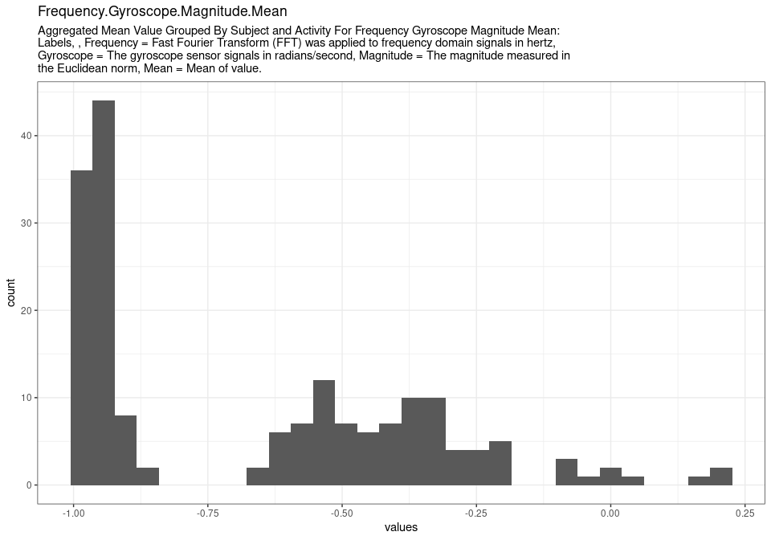

0 missing values.

#### Summary statistics {#Frequency_Gyroscope_Magnitude_Mean_summary}

|name                               |label                                                                                                                                                                                                                                                                                                                                            |data_type | n_missing| complete_rate|min   |median |max |       mean|        sd|hist  |
|:----------------------------------|:------------------------------------------------------------------------------------------------------------------------------------------------------------------------------------------------------------------------------------------------------------------------------------------------------------------------------------------------|:---------|---------:|-------------:|:-----|:------|:---|----------:|---------:|:-----|
|Frequency.Gyroscope.Magnitude.Mean |Aggregated Mean Value Grouped By Subject and Activity For Frequency Gyroscope Magnitude Mean:  Labels,  , Frequency = Fast Fourier Transform (FFT) was applied to frequency domain signals in hertz, Gyroscope = The gyroscope sensor signals in radians/second, Magnitude = The magnitude measured in the Euclidean norm, Mean = Mean of value. |numeric   |         0|             1|-0.99 |-0.77  |0.2 | -0.6670991| 0.3181183|▇▂▃▁▁ |


### Frequency.Gyroscope.Magnitude.Standard.Deviation {#Frequency_Gyroscope_Magnitude_Standard_Deviation .tabset}

Aggregated Mean Value Grouped By Subject and Activity For Frequency Gyroscope Magnitude Standard Deviation:  Labels,  , Frequency = Fast Fourier Transform (FFT) was applied to frequency domain signals in hertz, Gyroscope = The gyroscope sensor signals in radians/second, Magnitude = The magnitude measured in the Euclidean norm, Standard Deviation = Standard deviation of value.

#### Distribution {#Frequency_Gyroscope_Magnitude_Standard_Deviation_distribution}

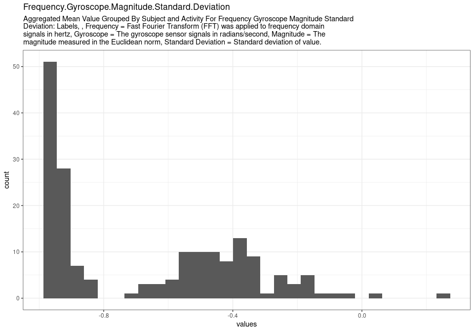

0 missing values.

#### Summary statistics {#Frequency_Gyroscope_Magnitude_Standard_Deviation_summary}

|name                                             |label                                                                                                                                                                                                                                                                                                                                                                                      |data_type | n_missing| complete_rate|min   |median |max  |       mean|        sd|hist  |
|:------------------------------------------------|:------------------------------------------------------------------------------------------------------------------------------------------------------------------------------------------------------------------------------------------------------------------------------------------------------------------------------------------------------------------------------------------|:---------|---------:|-------------:|:-----|:------|:----|----------:|---------:|:-----|
|Frequency.Gyroscope.Magnitude.Standard.Deviation |Aggregated Mean Value Grouped By Subject and Activity For Frequency Gyroscope Magnitude Standard Deviation:  Labels,  , Frequency = Fast Fourier Transform (FFT) was applied to frequency domain signals in hertz, Gyroscope = The gyroscope sensor signals in radians/second, Magnitude = The magnitude measured in the Euclidean norm, Standard Deviation = Standard deviation of value. |numeric   |         0|             1|-0.98 |-0.77  |0.24 | -0.6723223| 0.2931842|▇▂▅▁▁ |


### Frequency.Gyroscope.Magnitude.Mean.Frequency {#Frequency_Gyroscope_Magnitude_Mean_Frequency .tabset}

Aggregated Mean Value Grouped By Subject and Activity For Frequency Gyroscope Magnitude Mean Frequency:  Labels,  , Frequency = Fast Fourier Transform (FFT) was applied to frequency domain signals in hertz, Gyroscope = The gyroscope sensor signals in radians/second, Magnitude = The magnitude measured in the Euclidean norm, Mean = Mean of value.

#### Distribution {#Frequency_Gyroscope_Magnitude_Mean_Frequency_distribution}

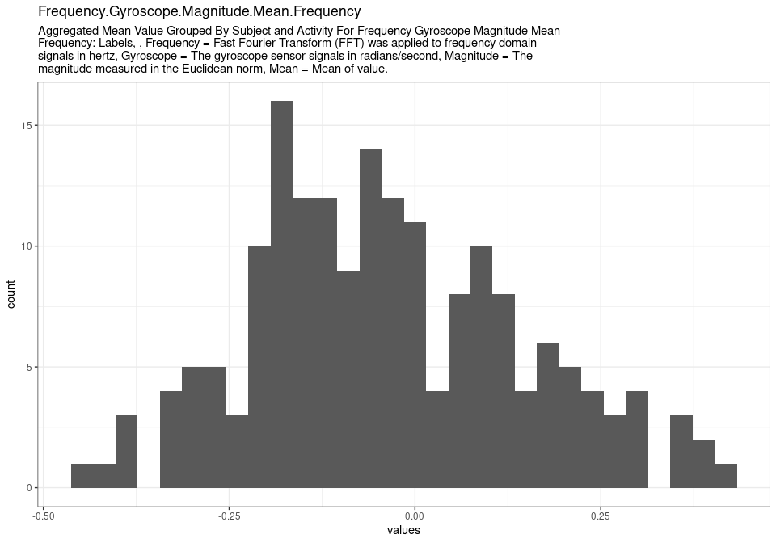

0 missing values.

#### Summary statistics {#Frequency_Gyroscope_Magnitude_Mean_Frequency_summary}

|name                                         |label                                                                                                                                                                                                                                                                                                                                                      |data_type | n_missing| complete_rate|min   |median |max  |       mean|        sd|hist  |
|:--------------------------------------------|:----------------------------------------------------------------------------------------------------------------------------------------------------------------------------------------------------------------------------------------------------------------------------------------------------------------------------------------------------------|:---------|---------:|-------------:|:-----|:------|:----|----------:|---------:|:-----|
|Frequency.Gyroscope.Magnitude.Mean.Frequency |Aggregated Mean Value Grouped By Subject and Activity For Frequency Gyroscope Magnitude Mean Frequency:  Labels,  , Frequency = Fast Fourier Transform (FFT) was applied to frequency domain signals in hertz, Gyroscope = The gyroscope sensor signals in radians/second, Magnitude = The magnitude measured in the Euclidean norm, Mean = Mean of value. |numeric   |         0|             1|-0.46 |-0.054 |0.41 | -0.0360322| 0.1807351|▂▇▇▅▂ |


### Frequency.Gyroscope.Jerk.Magnitude.Mean {#Frequency_Gyroscope_Jerk_Magnitude_Mean .tabset}

Aggregated Mean Value Grouped By Subject and Activity For Frequency Gyroscope Jerk Magnitude Mean:  Labels,  , Frequency = Fast Fourier Transform (FFT) was applied to frequency domain signals in hertz, Gyroscope = The gyroscope sensor signals in radians/second, Jerk = Jerk signals in standard gravity units 'g', Magnitude = The magnitude measured in the Euclidean norm, Mean = Mean of value.

#### Distribution {#Frequency_Gyroscope_Jerk_Magnitude_Mean_distribution}

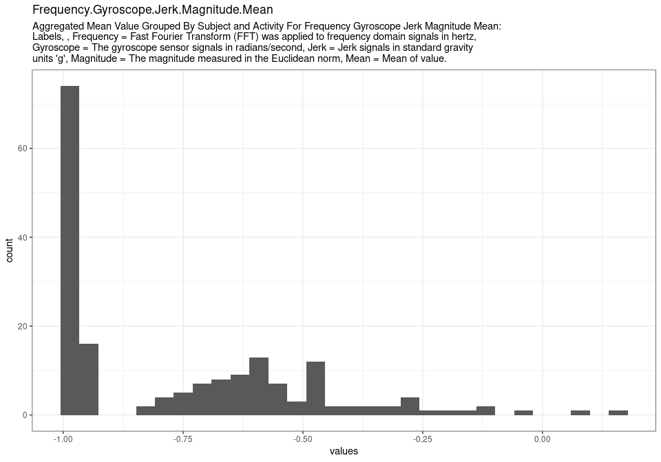

0 missing values.

#### Summary statistics {#Frequency_Gyroscope_Jerk_Magnitude_Mean_summary}

|name                                    |label                                                                                                                                                                                                                                                                                                                                                                                                    |data_type | n_missing| complete_rate|min |median |max  |       mean|        sd|hist  |
|:---------------------------------------|:--------------------------------------------------------------------------------------------------------------------------------------------------------------------------------------------------------------------------------------------------------------------------------------------------------------------------------------------------------------------------------------------------------|:---------|---------:|-------------:|:---|:------|:----|----------:|---------:|:-----|
|Frequency.Gyroscope.Jerk.Magnitude.Mean |Aggregated Mean Value Grouped By Subject and Activity For Frequency Gyroscope Jerk Magnitude Mean:  Labels,  , Frequency = Fast Fourier Transform (FFT) was applied to frequency domain signals in hertz, Gyroscope = The gyroscope sensor signals in radians/second, Jerk = Jerk signals in standard gravity units 'g', Magnitude = The magnitude measured in the Euclidean norm, Mean = Mean of value. |numeric   |         0|             1|-1  |-0.88  |0.15 | -0.7563853| 0.2628722|▇▅▂▁▁ |


### Frequency.Gyroscope.Jerk.Magnitude.Standard.Deviation {#Frequency_Gyroscope_Jerk_Magnitude_Standard_Deviation .tabset}

Aggregated Mean Value Grouped By Subject and Activity For Frequency Gyroscope Jerk Magnitude Standard Deviation:  Labels,  , Frequency = Fast Fourier Transform (FFT) was applied to frequency domain signals in hertz, Gyroscope = The gyroscope sensor signals in radians/second, Jerk = Jerk signals in standard gravity units 'g', Magnitude = The magnitude measured in the Euclidean norm, Standard Deviation = Standard deviation of value.

#### Distribution {#Frequency_Gyroscope_Jerk_Magnitude_Standard_Deviation_distribution}

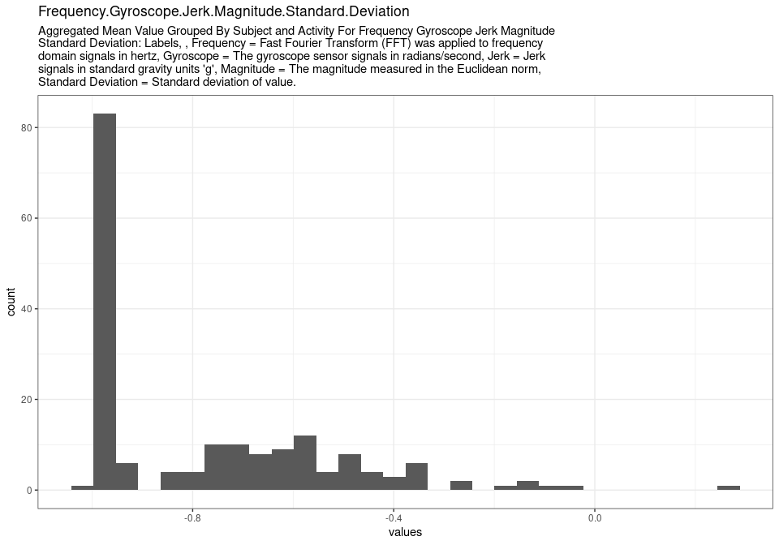

0 missing values.

#### Summary statistics {#Frequency_Gyroscope_Jerk_Magnitude_Standard_Deviation_summary}

|name                                                  |label                                                                                                                                                                                                                                                                                                                                                                                                                                              |data_type | n_missing| complete_rate|min |median |max  |       mean|        sd|hist  |
|:-----------------------------------------------------|:--------------------------------------------------------------------------------------------------------------------------------------------------------------------------------------------------------------------------------------------------------------------------------------------------------------------------------------------------------------------------------------------------------------------------------------------------|:---------|---------:|-------------:|:---|:------|:----|----------:|---------:|:-----|
|Frequency.Gyroscope.Jerk.Magnitude.Standard.Deviation |Aggregated Mean Value Grouped By Subject and Activity For Frequency Gyroscope Jerk Magnitude Standard Deviation:  Labels,  , Frequency = Fast Fourier Transform (FFT) was applied to frequency domain signals in hertz, Gyroscope = The gyroscope sensor signals in radians/second, Jerk = Jerk signals in standard gravity units 'g', Magnitude = The magnitude measured in the Euclidean norm, Standard Deviation = Standard deviation of value. |numeric   |         0|             1|-1  |-0.89  |0.29 | -0.7715171| 0.2504248|▇▃▁▁▁ |


### Frequency.Gyroscope.Jerk.Magnitude.Mean.Frequency {#Frequency_Gyroscope_Jerk_Magnitude_Mean_Frequency .tabset}

Aggregated Mean Value Grouped By Subject and Activity For Frequency Gyroscope Jerk Magnitude Mean Frequency:  Labels,  , Frequency = Fast Fourier Transform (FFT) was applied to frequency domain signals in hertz, Gyroscope = The gyroscope sensor signals in radians/second, Jerk = Jerk signals in standard gravity units 'g', Magnitude = The magnitude measured in the Euclidean norm, Mean = Mean of value.

#### Distribution {#Frequency_Gyroscope_Jerk_Magnitude_Mean_Frequency_distribution}

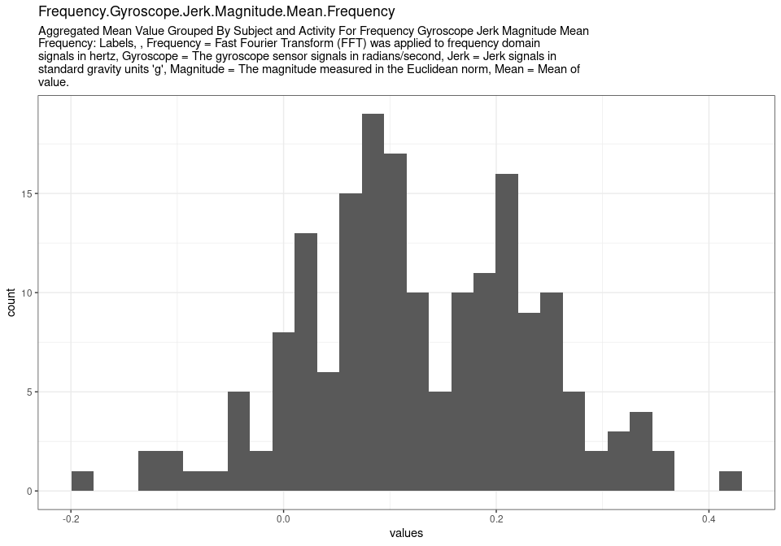

0 missing values.

#### Summary statistics {#Frequency_Gyroscope_Jerk_Magnitude_Mean_Frequency_summary}

|name                                              |label                                                                                                                                                                                                                                                                                                                                                                                                              |data_type | n_missing| complete_rate|min   |median |max  |      mean|        sd|hist  |
|:-------------------------------------------------|:------------------------------------------------------------------------------------------------------------------------------------------------------------------------------------------------------------------------------------------------------------------------------------------------------------------------------------------------------------------------------------------------------------------|:---------|---------:|-------------:|:-----|:------|:----|---------:|---------:|:-----|
|Frequency.Gyroscope.Jerk.Magnitude.Mean.Frequency |Aggregated Mean Value Grouped By Subject and Activity For Frequency Gyroscope Jerk Magnitude Mean Frequency:  Labels,  , Frequency = Fast Fourier Transform (FFT) was applied to frequency domain signals in hertz, Gyroscope = The gyroscope sensor signals in radians/second, Jerk = Jerk signals in standard gravity units 'g', Magnitude = The magnitude measured in the Euclidean norm, Mean = Mean of value. |numeric   |         0|             1|-0.18 |0.11   |0.43 | 0.1259225| 0.1083232|▁▅▇▆▁ |


### Angle.Time.Acceleration.Mean.Gravity {#Angle_Time_Acceleration_Mean_Gravity .tabset}

Aggregated Mean Value Grouped By Subject and Activity For Angle Time Acceleration Mean Gravity:  Labels,  Time = Time Domain Signal, captured at a constant rate of 50 Hz, Angle = Angle between to vectors, Gravity = Sensor gravity in standard units 'g', Acceleration = Acceleration in standard gravity units 'g', Mean = Mean of value.

#### Distribution {#Angle_Time_Acceleration_Mean_Gravity_distribution}

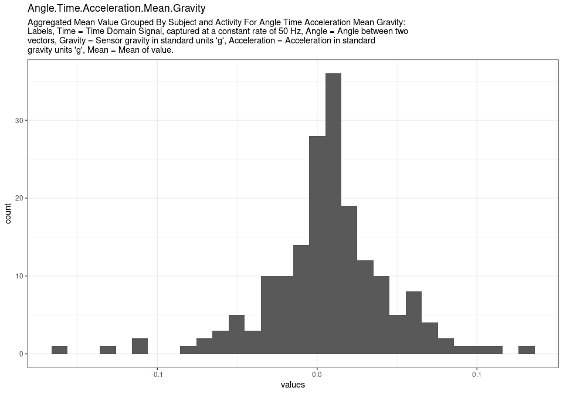

0 missing values.

#### Summary statistics {#Angle_Time_Acceleration_Mean_Gravity_summary}

|name                                 |label                                                                                                                                                                                                                                                                                                                                         |data_type | n_missing| complete_rate|min   |median |max  |      mean|        sd|hist  |
|:------------------------------------|:---------------------------------------------------------------------------------------------------------------------------------------------------------------------------------------------------------------------------------------------------------------------------------------------------------------------------------------------|:---------|---------:|-------------:|:-----|:------|:----|---------:|---------:|:-----|
|Angle.Time.Acceleration.Mean.Gravity |Aggregated Mean Value Grouped By Subject and Activity For Angle Time Acceleration Mean Gravity:  Labels,  Time = Time Domain Signal, captured at a constant rate of 50 Hz, Angle = Angle between to vectors, Gravity = Sensor gravity in standard units 'g', Acceleration = Acceleration in standard gravity units 'g', Mean = Mean of value. |numeric   |         0|             1|-0.16 |0.0079 |0.13 | 0.0065557| 0.0396044|▁▁▇▇▁ |


### Angle.Time.Acceleration.Jerk.Mean.Gravity.Mean {#Angle_Time_Acceleration_Jerk_Mean_Gravity_Mean .tabset}

Aggregated Mean Value Grouped By Subject and Activity For Angle Time Acceleration Jerk Mean Gravity Mean:  Labels,  Time = Time Domain Signal, captured at a constant rate of 50 Hz, Angle = Angle between to vectors, Gravity = Sensor gravity in standard units 'g', Acceleration = Acceleration in standard gravity units 'g', Jerk = Jerk signals in standard gravity units 'g', Mean = Mean of value.

#### Distribution {#Angle_Time_Acceleration_Jerk_Mean_Gravity_Mean_distribution}

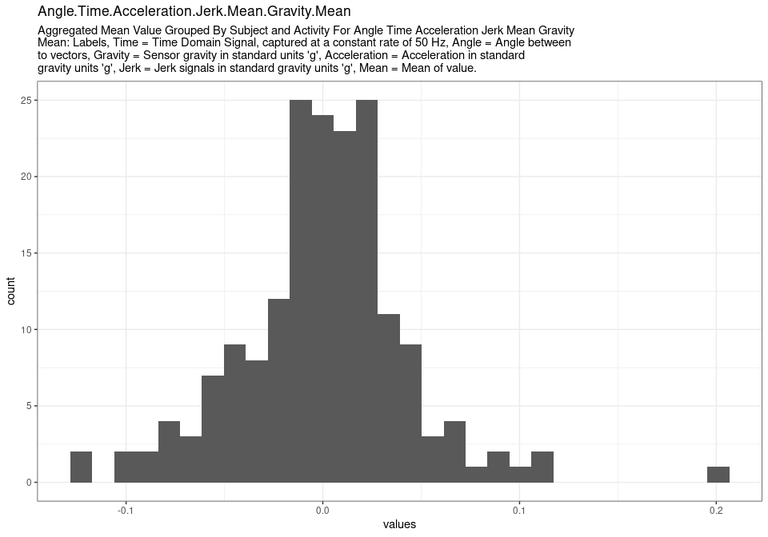

0 missing values.

#### Summary statistics {#Angle_Time_Acceleration_Jerk_Mean_Gravity_Mean_summary}

|name                                           |label                                                                                                                                                                                                                                                                                                                                                                                                      |data_type | n_missing| complete_rate|min   |median |max |      mean|        sd|hist  |
|:----------------------------------------------|:----------------------------------------------------------------------------------------------------------------------------------------------------------------------------------------------------------------------------------------------------------------------------------------------------------------------------------------------------------------------------------------------------------|:---------|---------:|-------------:|:-----|:------|:---|---------:|---------:|:-----|
|Angle.Time.Acceleration.Jerk.Mean.Gravity.Mean |Aggregated Mean Value Grouped By Subject and Activity For Angle Time Acceleration Jerk Mean Gravity Mean:  Labels,  Time = Time Domain Signal, captured at a constant rate of 50 Hz, Angle = Angle between to vectors, Gravity = Sensor gravity in standard units 'g', Acceleration = Acceleration in standard gravity units 'g', Jerk = Jerk signals in standard gravity units 'g', Mean = Mean of value. |numeric   |         0|             1|-0.12 |0.0031 |0.2 | 0.0006439| 0.0427632|▂▇▆▁▁ |


### Angle.Time.Gyroscope.Mean.Gravity.Mean {#Angle_Time_Gyroscope_Mean_Gravity_Mean .tabset}

Aggregated Mean Value Grouped By Subject and Activity For Angle Time Gyroscope Mean Gravity Mean:  Labels,  Time = Time Domain Signal, captured at a constant rate of 50 Hz, Angle = Angle between to vectors, Gravity = Sensor gravity in standard units 'g', Gyroscope = The gyroscope sensor signals in radians/second, Mean = Mean of value.

#### Distribution {#Angle_Time_Gyroscope_Mean_Gravity_Mean_distribution}

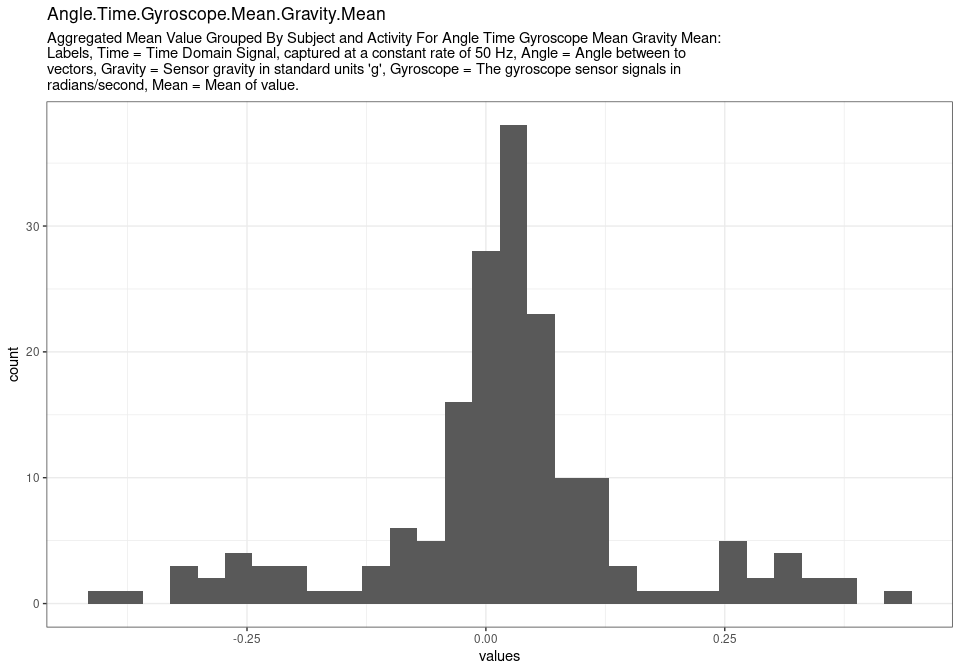

0 missing values.

#### Summary statistics {#Angle_Time_Gyroscope_Mean_Gravity_Mean_summary}

|name                                   |label                                                                                                                                                                                                                                                                                                                                            |data_type | n_missing| complete_rate|min   |median |max  |      mean|        sd|hist  |
|:--------------------------------------|:------------------------------------------------------------------------------------------------------------------------------------------------------------------------------------------------------------------------------------------------------------------------------------------------------------------------------------------------|:---------|---------:|-------------:|:-----|:------|:----|---------:|---------:|:-----|
|Angle.Time.Gyroscope.Mean.Gravity.Mean |Aggregated Mean Value Grouped By Subject and Activity For Angle Time Gyroscope Mean Gravity Mean:  Labels,  Time = Time Domain Signal, captured at a constant rate of 50 Hz, Angle = Angle between to vectors, Gravity = Sensor gravity in standard units 'g', Gyroscope = The gyroscope sensor signals in radians/second, Mean = Mean of value. |numeric   |         0|             1|-0.39 |0.021  |0.44 | 0.0219317| 0.1401276|▁▁▇▁▁ |


### Angle.Time.Gyroscope.Jerk.Mean.Gravity.Mean {#Angle_Time_Gyroscope_Jerk_Mean_Gravity_Mean .tabset}

Aggregated Mean Value Grouped By Subject and Activity For Angle Time Gyroscope Jerk Mean Gravity Mean:  Labels,  Time = Time Domain Signal, captured at a constant rate of 50 Hz, Angle = Angle between to vectors, Gravity = Sensor gravity in standard units 'g', Gyroscope = The gyroscope sensor signals in radians/second, Jerk = Jerk signals in standard gravity units 'g', Mean = Mean of value.

#### Distribution {#Angle_Time_Gyroscope_Jerk_Mean_Gravity_Mean_distribution}

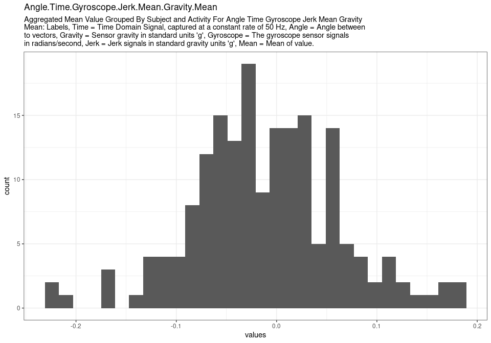

0 missing values.

#### Summary statistics {#Angle_Time_Gyroscope_Jerk_Mean_Gravity_Mean_summary}

|name                                        |label                                                                                                                                                                                                                                                                                                                                                                                                    |data_type | n_missing| complete_rate|min   |median |max  |       mean|        sd|hist  |
|:-------------------------------------------|:--------------------------------------------------------------------------------------------------------------------------------------------------------------------------------------------------------------------------------------------------------------------------------------------------------------------------------------------------------------------------------------------------------|:---------|---------:|-------------:|:-----|:------|:----|----------:|---------:|:-----|
|Angle.Time.Gyroscope.Jerk.Mean.Gravity.Mean |Aggregated Mean Value Grouped By Subject and Activity For Angle Time Gyroscope Jerk Mean Gravity Mean:  Labels,  Time = Time Domain Signal, captured at a constant rate of 50 Hz, Angle = Angle between to vectors, Gravity = Sensor gravity in standard units 'g', Gyroscope = The gyroscope sensor signals in radians/second, Jerk = Jerk signals in standard gravity units 'g', Mean = Mean of value. |numeric   |         0|             1|-0.22 |-0.016 |0.18 | -0.0113732| 0.0729629|▁▃▇▅▁ |


### Angle.X.Gravity.Mean {#Angle_X_Gravity_Mean .tabset}

Aggregated Mean Value Grouped By Subject and Activity For Angle X Gravity Mean:  Labels,  Angle = Angle between to vectors, Gravity = Sensor gravity in standard units 'g', X = Triaxial signals in the X direction, Mean = Mean of value.

#### Distribution {#Angle_X_Gravity_Mean_distribution}

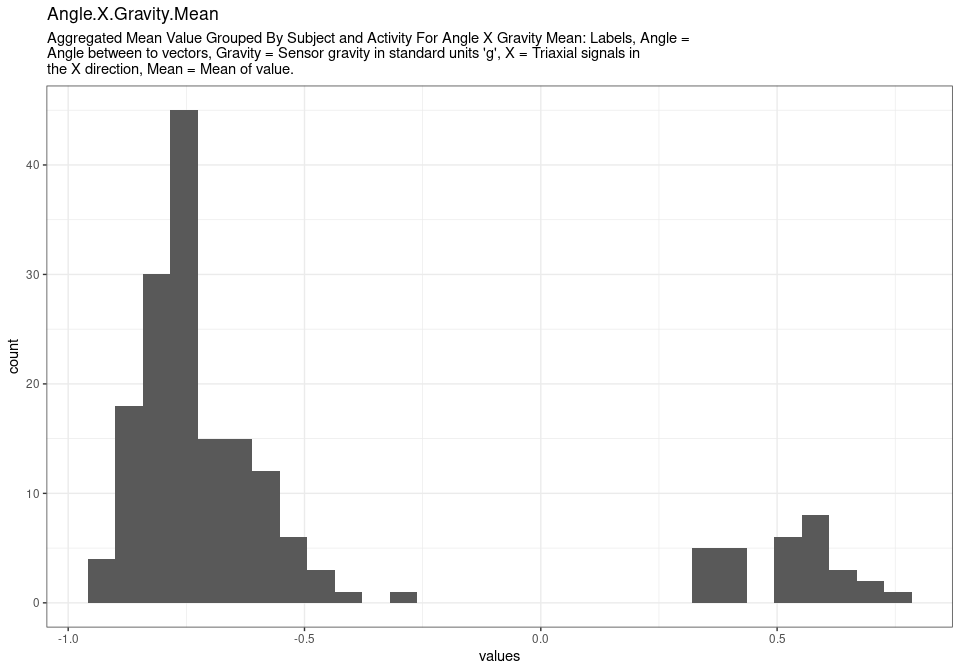

0 missing values.

#### Summary statistics {#Angle_X_Gravity_Mean_summary}

|name                 |label                                                                                                                                                                                                                                      |data_type | n_missing| complete_rate|min   |median |max  |       mean|       sd|hist  |
|:--------------------|:------------------------------------------------------------------------------------------------------------------------------------------------------------------------------------------------------------------------------------------|:---------|---------:|-------------:|:-----|:------|:----|----------:|--------:|:-----|
|Angle.X.Gravity.Mean |Aggregated Mean Value Grouped By Subject and Activity For Angle X Gravity Mean:  Labels,  Angle = Angle between to vectors, Gravity = Sensor gravity in standard units 'g', X = Triaxial signals in the X direction, Mean = Mean of value. |numeric   |         0|             1|-0.95 |-0.74  |0.74 | -0.5243065| 0.481228|▇▂▁▁▂ |


### Angle.Y.Gravity.Mean {#Angle_Y_Gravity_Mean .tabset}

Aggregated Mean Value Grouped By Subject and Activity For Angle Y Gravity Mean:  Labels,  Angle = Angle between to vectors, Gravity = Sensor gravity in standard units 'g', Y = Triaxial signals in the Y direction, Mean = Mean of value.

#### Distribution {#Angle_Y_Gravity_Mean_distribution}

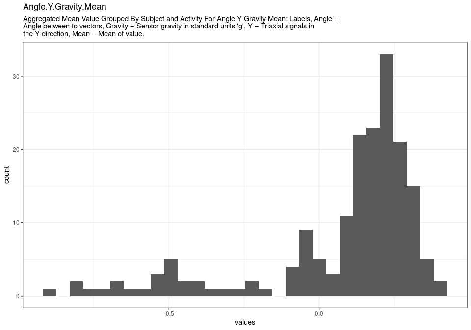

0 missing values.

#### Summary statistics {#Angle_Y_Gravity_Mean_summary}

|name                 |label                                                                                                                                                                                                                                      |data_type | n_missing| complete_rate|min   |median |max  |      mean|        sd|hist  |
|:--------------------|:------------------------------------------------------------------------------------------------------------------------------------------------------------------------------------------------------------------------------------------|:---------|---------:|-------------:|:-----|:------|:----|---------:|---------:|:-----|
|Angle.Y.Gravity.Mean |Aggregated Mean Value Grouped By Subject and Activity For Angle Y Gravity Mean:  Labels,  Angle = Angle between to vectors, Gravity = Sensor gravity in standard units 'g', Y = Triaxial signals in the Y direction, Mean = Mean of value. |numeric   |         0|             1|-0.87 |0.17   |0.42 | 0.0786534| 0.2784784|▁▁▁▅▇ |


### Angle.Z.Gravity.Mean {#Angle_Z_Gravity_Mean .tabset}

Aggregated Mean Value Grouped By Subject and Activity For Angle Z Gravity Mean:  Labels,  Angle = Angle between to vectors, Gravity = Sensor gravity in standard units 'g', Z = Triaxialsignals in the Z direction, Mean = Mean of value.

#### Distribution {#Angle_Z_Gravity_Mean_distribution}

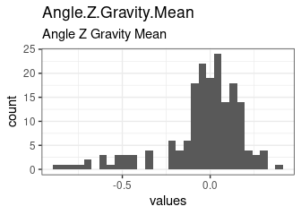

0 missing values.

#### Summary statistics {#Angle_Z_Gravity_Mean_summary}

|name                 |label                                                                                                                                                                                                                                     |data_type | n_missing| complete_rate|min   |median |max  |       mean|        sd|hist  |
|:--------------------|:-----------------------------------------------------------------------------------------------------------------------------------------------------------------------------------------------------------------------------------------|:---------|---------:|-------------:|:-----|:------|:----|----------:|---------:|:-----|
|Angle.Z.Gravity.Mean |Aggregated Mean Value Grouped By Subject and Activity For Angle Z Gravity Mean:  Labels,  Angle = Angle between to vectors, Gravity = Sensor gravity in standard units 'g', Z = Triaxialsignals in the Z direction, Mean = Mean of value. |numeric   |         0|             1|-0.87 |0.0051 |0.39 | -0.0404362| 0.2308332|▁▁▁▇▂ |


## Missingness report


## Codebook table


|name                                                                                                                             |label                                                                                                                                                                                                                                                                                                                                                                                                                                                |data_type | n_missing| complete_rate| n_unique| empty|min    |median  |max     |       mean|        sd| whitespace|hist  |
|:--------------------------------------------------------------------------------------------------------------------------------|:----------------------------------------------------------------------------------------------------------------------------------------------------------------------------------------------------------------------------------------------------------------------------------------------------------------------------------------------------------------------------------------------------------------------------------------------------|:---------|---------:|-------------:|--------:|-----:|:------|:-------|:-------|----------:|---------:|----------:|:-----|
|<a href="#Subject">Subject</a>                                                                                                   |Subject:  Labels,  Subject = The identifier of the subject who carried out the experiment, numbered from 1 to 30                                                                                                                                                                                                                                                                                                                                     |numeric   |         0|             1|       NA|    NA|1.000  |15.5000 |30.0000 | 15.5000000| 8.6795850|         NA|▇▇▇▇▇ |
|<a href="#Activity">Activity</a>                                                                                                 |Activity:  Labels,  Activity = One of six activities performed by subjects, WALKIN, WALKING_UPSTAIRS, WALKING_DOWNSTAIRS, SITTING, STANDING, and LAYING                                                                                                                                                                                                                                                                                              |character |         0|             1|        6|     0|6      |NA      |18      |         NA|        NA|          0|NA    |
|<a href="#Time_Acceleration_Mean_X">Time.Acceleration.Mean.X</a>                                                                 |Aggregated Mean Value Grouped By Subject and Activity For Time Acceleration Mean X:  Labels,  Time = Time Domain Signal, captured at a constant rate of 50 Hz, Acceleration = Acceleration in standard gravity units 'g', X = Triaxial signals in the X direction, Mean = Mean of value.                                                                                                                                                             |numeric   |         0|             1|       NA|    NA|0.222  |0.2770  |0.3015  |  0.2743027| 0.0121646|         NA|▁▁▂▇▂ |
|<a href="#Time_Acceleration_Mean_Y">Time.Acceleration.Mean.Y</a>                                                                 |Aggregated Mean Value Grouped By Subject and Activity For Time Acceleration Mean Y:  Labels,  Time = Time Domain Signal, captured at a constant rate of 50 Hz, Acceleration = Acceleration in standard gravity units 'g', Y = Triaxial signals in the Y direction, Mean = Mean of value.                                                                                                                                                             |numeric   |         0|             1|       NA|    NA|-0.041 |-0.0173 |-0.0013 | -0.0178755| 0.0057712|         NA|▁▂▇▇▁ |
|<a href="#Time_Acceleration_Mean_Z">Time.Acceleration.Mean.Z</a>                                                                 |Aggregated Mean Value Grouped By Subject and Activity For Time Acceleration Mean Z:  Labels,  Time = Time Domain Signal, captured at a constant rate of 50 Hz, Acceleration = Acceleration in standard gravity units 'g', Z = Triaxialsignals in the Z direction, Mean = Mean of value.                                                                                                                                                              |numeric   |         0|             1|       NA|    NA|-0.153 |-0.1082 |-0.0754 | -0.1091638| 0.0095820|         NA|▁▁▇▅▁ |
|<a href="#Time_Acceleration_Standard_Deviation_X">Time.Acceleration.Standard.Deviation.X</a>                                     |Aggregated Mean Value Grouped By Subject and Activity For Time Acceleration Standard Deviation X:  Labels,  Time = Time Domain Signal, captured at a constant rate of 50 Hz, Acceleration = Acceleration in standard gravity units 'g', X = Triaxial signals in the X direction, Standard Deviation = Standard deviation of value.                                                                                                                   |numeric   |         0|             1|       NA|    NA|-0.996 |-0.7526 |0.6269  | -0.5576901| 0.4516911|         NA|▇▂▅▂▁ |
|<a href="#Time_Acceleration_Standard_Deviation_Y">Time.Acceleration.Standard.Deviation.Y</a>                                     |Aggregated Mean Value Grouped By Subject and Activity For Time Acceleration Standard Deviation Y:  Labels,  Time = Time Domain Signal, captured at a constant rate of 50 Hz, Acceleration = Acceleration in standard gravity units 'g', Y = Triaxial signals in the Y direction, Standard Deviation = Standard deviation of value.                                                                                                                   |numeric   |         0|             1|       NA|    NA|-0.990 |-0.5090 |0.6169  | -0.4604626| 0.4965650|         NA|▇▁▅▃▁ |
|<a href="#Time_Acceleration_Standard_Deviation_Z">Time.Acceleration.Standard.Deviation.Z</a>                                     |Aggregated Mean Value Grouped By Subject and Activity For Time Acceleration Standard Deviation Z:  Labels,  Time = Time Domain Signal, captured at a constant rate of 50 Hz, Acceleration = Acceleration in standard gravity units 'g', Z = Triaxialsignals in the Z direction, Standard Deviation = Standard deviation of value.                                                                                                                    |numeric   |         0|             1|       NA|    NA|-0.988 |-0.6518 |0.6090  | -0.5755602| 0.3955439|         NA|▇▂▅▁▁ |
|<a href="#Time_Gravity_Acceleration_Mean_X">Time.Gravity.Acceleration.Mean.X</a>                                                 |Aggregated Mean Value Grouped By Subject and Activity For Time Gravity Acceleration Mean X:  Labels,  Time = Time Domain Signal, captured at a constant rate of 50 Hz, Gravity = Sensor gravity in standard units 'g', Acceleration = Acceleration in standard gravity units 'g', X = Triaxial signals in the X direction, Mean = Mean of value.                                                                                                     |numeric   |         0|             1|       NA|    NA|-0.680 |0.9208  |0.9745  |  0.6974775| 0.4872534|         NA|▁▁▁▁▇ |
|<a href="#Time_Gravity_Acceleration_Mean_Y">Time.Gravity.Acceleration.Mean.Y</a>                                                 |Aggregated Mean Value Grouped By Subject and Activity For Time Gravity Acceleration Mean Y:  Labels,  Time = Time Domain Signal, captured at a constant rate of 50 Hz, Gravity = Sensor gravity in standard units 'g', Acceleration = Acceleration in standard gravity units 'g', Y = Triaxial signals in the Y direction, Mean = Mean of value.                                                                                                     |numeric   |         0|             1|       NA|    NA|-0.480 |-0.1278 |0.9566  | -0.0162128| 0.3452376|         NA|▇▇▂▁▂ |
|<a href="#Time_Gravity_Acceleration_Mean_Z">Time.Gravity.Acceleration.Mean.Z</a>                                                 |Aggregated Mean Value Grouped By Subject and Activity For Time Gravity Acceleration Mean Z:  Labels,  Time = Time Domain Signal, captured at a constant rate of 50 Hz, Gravity = Sensor gravity in standard units 'g', Acceleration = Acceleration in standard gravity units 'g', Z = Triaxialsignals in the Z direction, Mean = Mean of value.                                                                                                      |numeric   |         0|             1|       NA|    NA|-0.495 |0.0238  |0.9579  |  0.0741279| 0.2887919|         NA|▂▇▃▁▁ |
|<a href="#Time_Gravity_Acceleration_Standard_Deviation_X">Time.Gravity.Acceleration.Standard.Deviation.X</a>                     |Aggregated Mean Value Grouped By Subject and Activity For Time Gravity Acceleration Standard Deviation X:  Labels,  Time = Time Domain Signal, captured at a constant rate of 50 Hz, Gravity = Sensor gravity in standard units 'g', Acceleration = Acceleration in standard gravity units 'g', X = Triaxial signals in the X direction, Standard Deviation = Standard deviation of value.                                                           |numeric   |         0|             1|       NA|    NA|-0.997 |-0.9695 |-0.8296 | -0.9637525| 0.0250344|         NA|▇▆▁▁▁ |
|<a href="#Time_Gravity_Acceleration_Standard_Deviation_Y">Time.Gravity.Acceleration.Standard.Deviation.Y</a>                     |Aggregated Mean Value Grouped By Subject and Activity For Time Gravity Acceleration Standard Deviation Y:  Labels,  Time = Time Domain Signal, captured at a constant rate of 50 Hz, Gravity = Sensor gravity in standard units 'g', Acceleration = Acceleration in standard gravity units 'g', Y = Triaxial signals in the Y direction, Standard Deviation = Standard deviation of value.                                                           |numeric   |         0|             1|       NA|    NA|-0.994 |-0.9590 |-0.6436 | -0.9524296| 0.0326557|         NA|▇▁▁▁▁ |
|<a href="#Time_Gravity_Acceleration_Standard_Deviation_Z">Time.Gravity.Acceleration.Standard.Deviation.Z</a>                     |Aggregated Mean Value Grouped By Subject and Activity For Time Gravity Acceleration Standard Deviation Z:  Labels,  Time = Time Domain Signal, captured at a constant rate of 50 Hz, Gravity = Sensor gravity in standard units 'g', Acceleration = Acceleration in standard gravity units 'g', Z = Triaxialsignals in the Z direction, Standard Deviation = Standard deviation of value.                                                            |numeric   |         0|             1|       NA|    NA|-0.991 |-0.9450 |-0.6102 | -0.9364010| 0.0402912|         NA|▇▂▁▁▁ |
|<a href="#Time_Acceleration_Jerk_Mean_X">Time.Acceleration.Jerk.Mean.X</a>                                                       |Aggregated Mean Value Grouped By Subject and Activity For Time Acceleration Jerk Mean X:  Labels,  Time = Time Domain Signal, captured at a constant rate of 50 Hz, Acceleration = Acceleration in standard gravity units 'g', Jerk = Jerk signals in standard gravity units 'g', X = Triaxial signals in the X direction, Mean = Mean of value.                                                                                                     |numeric   |         0|             1|       NA|    NA|0.043  |0.0764  |0.1302  |  0.0794736| 0.0125880|         NA|▁▇▃▂▁ |
|<a href="#Time_Acceleration_Jerk_Mean_Y">Time.Acceleration.Jerk.Mean.Y</a>                                                       |Aggregated Mean Value Grouped By Subject and Activity For Time Acceleration Jerk Mean Y:  Labels,  Time = Time Domain Signal, captured at a constant rate of 50 Hz, Acceleration = Acceleration in standard gravity units 'g', Jerk = Jerk signals in standard gravity units 'g', Y = Triaxial signals in the Y direction, Mean = Mean of value.                                                                                                     |numeric   |         0|             1|       NA|    NA|-0.039 |0.0095  |0.0568  |  0.0075652| 0.0135764|         NA|▁▃▇▂▁ |
|<a href="#Time_Acceleration_Jerk_Mean_Z">Time.Acceleration.Jerk.Mean.Z</a>                                                       |Aggregated Mean Value Grouped By Subject and Activity For Time Acceleration Jerk Mean Z:  Labels,  Time = Time Domain Signal, captured at a constant rate of 50 Hz, Acceleration = Acceleration in standard gravity units 'g', Jerk = Jerk signals in standard gravity units 'g', Z = Triaxialsignals in the Z direction, Mean = Mean of value.                                                                                                      |numeric   |         0|             1|       NA|    NA|-0.067 |-0.0039 |0.0381  | -0.0049534| 0.0134621|         NA|▁▁▇▇▁ |
|<a href="#Time_Acceleration_Jerk_Standard_Deviation_X">Time.Acceleration.Jerk.Standard.Deviation.X</a>                           |Aggregated Mean Value Grouped By Subject and Activity For Time Acceleration Jerk Standard Deviation X:  Labels,  Time = Time Domain Signal, captured at a constant rate of 50 Hz, Acceleration = Acceleration in standard gravity units 'g', Jerk = Jerk signals in standard gravity units 'g', X = Triaxial signals in the X direction, Standard Deviation = Standard deviation of value.                                                           |numeric   |         0|             1|       NA|    NA|-0.995 |-0.8104 |0.5443  | -0.5949467| 0.4175865|         NA|▇▂▅▂▁ |
|<a href="#Time_Acceleration_Jerk_Standard_Deviation_Y">Time.Acceleration.Jerk.Standard.Deviation.Y</a>                           |Aggregated Mean Value Grouped By Subject and Activity For Time Acceleration Jerk Standard Deviation Y:  Labels,  Time = Time Domain Signal, captured at a constant rate of 50 Hz, Acceleration = Acceleration in standard gravity units 'g', Jerk = Jerk signals in standard gravity units 'g', Y = Triaxial signals in the Y direction, Standard Deviation = Standard deviation of value.                                                           |numeric   |         0|             1|       NA|    NA|-0.990 |-0.7756 |0.3553  | -0.5654147| 0.4330871|         NA|▇▁▃▃▁ |
|<a href="#Time_Acceleration_Jerk_Standard_Deviation_Z">Time.Acceleration.Jerk.Standard.Deviation.Z</a>                           |Aggregated Mean Value Grouped By Subject and Activity For Time Acceleration Jerk Standard Deviation Z:  Labels,  Time = Time Domain Signal, captured at a constant rate of 50 Hz, Acceleration = Acceleration in standard gravity units 'g', Jerk = Jerk signals in standard gravity units 'g', Z = Triaxialsignals in the Z direction, Standard Deviation = Standard deviation of value.                                                            |numeric   |         0|             1|       NA|    NA|-0.993 |-0.8837 |0.0310  | -0.7359577| 0.2768479|         NA|▇▂▃▁▁ |
|<a href="#Time_Gyroscope_Mean_X">Time.Gyroscope.Mean.X</a>                                                                       |Aggregated Mean Value Grouped By Subject and Activity For Time Gyroscope Mean X:  Labels,  Time = Time Domain Signal, captured at a constant rate of 50 Hz, Gyroscope = The gyroscope sensor signals in radians/second, X = Triaxial signals in the X direction, Mean = Mean of value.                                                                                                                                                               |numeric   |         0|             1|       NA|    NA|-0.206 |-0.0287 |0.1927  | -0.0324372| 0.0540518|         NA|▁▂▇▁▁ |
|<a href="#Time_Gyroscope_Mean_Y">Time.Gyroscope.Mean.Y</a>                                                                       |Aggregated Mean Value Grouped By Subject and Activity For Time Gyroscope Mean Y:  Labels,  Time = Time Domain Signal, captured at a constant rate of 50 Hz, Gyroscope = The gyroscope sensor signals in radians/second, Y = Triaxial signals in the Y direction, Mean = Mean of value.                                                                                                                                                               |numeric   |         0|             1|       NA|    NA|-0.204 |-0.0732 |0.0275  | -0.0742596| 0.0355415|         NA|▁▁▇▃▁ |
|<a href="#Time_Gyroscope_Mean_Z">Time.Gyroscope.Mean.Z</a>                                                                       |Aggregated Mean Value Grouped By Subject and Activity For Time Gyroscope Mean Z:  Labels,  Time = Time Domain Signal, captured at a constant rate of 50 Hz, Gyroscope = The gyroscope sensor signals in radians/second, Z = Triaxialsignals in the Z direction, Mean = Mean of value.                                                                                                                                                                |numeric   |         0|             1|       NA|    NA|-0.072 |0.0851  |0.1791  |  0.0874446| 0.0362125|         NA|▁▁▃▇▂ |
|<a href="#Time_Gyroscope_Standard_Deviation_X">Time.Gyroscope.Standard.Deviation.X</a>                                           |Aggregated Mean Value Grouped By Subject and Activity For Time Gyroscope Standard Deviation X:  Labels,  Time = Time Domain Signal, captured at a constant rate of 50 Hz, Gyroscope = The gyroscope sensor signals in radians/second, X = Triaxial signals in the X direction, Standard Deviation = Standard deviation of value.                                                                                                                     |numeric   |         0|             1|       NA|    NA|-0.994 |-0.7890 |0.2677  | -0.6916399| 0.2910189|         NA|▇▃▅▁▁ |
|<a href="#Time_Gyroscope_Standard_Deviation_Y">Time.Gyroscope.Standard.Deviation.Y</a>                                           |Aggregated Mean Value Grouped By Subject and Activity For Time Gyroscope Standard Deviation Y:  Labels,  Time = Time Domain Signal, captured at a constant rate of 50 Hz, Gyroscope = The gyroscope sensor signals in radians/second, Y = Triaxial signals in the Y direction, Standard Deviation = Standard deviation of value.                                                                                                                     |numeric   |         0|             1|       NA|    NA|-0.994 |-0.8017 |0.4765  | -0.6533020| 0.3520252|         NA|▇▅▂▁▁ |
|<a href="#Time_Gyroscope_Standard_Deviation_Z">Time.Gyroscope.Standard.Deviation.Z</a>                                           |Aggregated Mean Value Grouped By Subject and Activity For Time Gyroscope Standard Deviation Z:  Labels,  Time = Time Domain Signal, captured at a constant rate of 50 Hz, Gyroscope = The gyroscope sensor signals in radians/second, Z = Triaxialsignals in the Z direction, Standard Deviation = Standard deviation of value.                                                                                                                      |numeric   |         0|             1|       NA|    NA|-0.986 |-0.8010 |0.5649  | -0.6164353| 0.3730264|         NA|▇▂▅▁▁ |
|<a href="#Time_Gyroscope_Jerk_Mean_X">Time.Gyroscope.Jerk.Mean.X</a>                                                             |Aggregated Mean Value Grouped By Subject and Activity For Time Gyroscope Jerk Mean X:  Labels,  Time = Time Domain Signal, captured at a constant rate of 50 Hz, Gyroscope = The gyroscope sensor signals in radians/second, Jerk = Jerk signals in standard gravity units 'g', X = Triaxial signals in the X direction, Mean = Mean of value.                                                                                                       |numeric   |         0|             1|       NA|    NA|-0.157 |-0.0987 |-0.0221 | -0.0960568| 0.0233458|         NA|▁▂▇▁▁ |
|<a href="#Time_Gyroscope_Jerk_Mean_Y">Time.Gyroscope.Jerk.Mean.Y</a>                                                             |Aggregated Mean Value Grouped By Subject and Activity For Time Gyroscope Jerk Mean Y:  Labels,  Time = Time Domain Signal, captured at a constant rate of 50 Hz, Gyroscope = The gyroscope sensor signals in radians/second, Jerk = Jerk signals in standard gravity units 'g', Y = Triaxial signals in the Y direction, Mean = Mean of value.                                                                                                       |numeric   |         0|             1|       NA|    NA|-0.077 |-0.0411 |-0.0132 | -0.0426928| 0.0095320|         NA|▁▂▇▃▁ |
|<a href="#Time_Gyroscope_Jerk_Mean_Z">Time.Gyroscope.Jerk.Mean.Z</a>                                                             |Aggregated Mean Value Grouped By Subject and Activity For Time Gyroscope Jerk Mean Z:  Labels,  Time = Time Domain Signal, captured at a constant rate of 50 Hz, Gyroscope = The gyroscope sensor signals in radians/second, Jerk = Jerk signals in standard gravity units 'g', Z = Triaxialsignals in the Z direction, Mean = Mean of value.                                                                                                        |numeric   |         0|             1|       NA|    NA|-0.092 |-0.0534 |-0.0069 | -0.0548019| 0.0123470|         NA|▁▅▇▁▁ |
|<a href="#Time_Gyroscope_Jerk_Standard_Deviation_X">Time.Gyroscope.Jerk.Standard.Deviation.X</a>                                 |Aggregated Mean Value Grouped By Subject and Activity For Time Gyroscope Jerk Standard Deviation X:  Labels,  Time = Time Domain Signal, captured at a constant rate of 50 Hz, Gyroscope = The gyroscope sensor signals in radians/second, Jerk = Jerk signals in standard gravity units 'g', X = Triaxial signals in the X direction, Standard Deviation = Standard deviation of value.                                                             |numeric   |         0|             1|       NA|    NA|-0.997 |-0.8396 |0.1791  | -0.7036327| 0.3008361|         NA|▇▂▃▂▁ |
|<a href="#Time_Gyroscope_Jerk_Standard_Deviation_Y">Time.Gyroscope.Jerk.Standard.Deviation.Y</a>                                 |Aggregated Mean Value Grouped By Subject and Activity For Time Gyroscope Jerk Standard Deviation Y:  Labels,  Time = Time Domain Signal, captured at a constant rate of 50 Hz, Gyroscope = The gyroscope sensor signals in radians/second, Jerk = Jerk signals in standard gravity units 'g', Y = Triaxial signals in the Y direction, Standard Deviation = Standard deviation of value.                                                             |numeric   |         0|             1|       NA|    NA|-0.997 |-0.8942 |0.2959  | -0.7635518| 0.2672885|         NA|▇▃▂▁▁ |
|<a href="#Time_Gyroscope_Jerk_Standard_Deviation_Z">Time.Gyroscope.Jerk.Standard.Deviation.Z</a>                                 |Aggregated Mean Value Grouped By Subject and Activity For Time Gyroscope Jerk Standard Deviation Z:  Labels,  Time = Time Domain Signal, captured at a constant rate of 50 Hz, Gyroscope = The gyroscope sensor signals in radians/second, Jerk = Jerk signals in standard gravity units 'g', Z = Triaxialsignals in the Z direction, Standard Deviation = Standard deviation of value.                                                              |numeric   |         0|             1|       NA|    NA|-0.995 |-0.8610 |0.1932  | -0.7095592| 0.3045394|         NA|▇▃▃▁▁ |
|<a href="#Time_Acceleration_Magnitude_Mean">Time.Acceleration.Magnitude.Mean</a>                                                 |Aggregated Mean Value Grouped By Subject and Activity For Time Acceleration Magnitude Mean:  Labels,  Time = Time Domain Signal, captured at a constant rate of 50 Hz, Acceleration = Acceleration in standard gravity units 'g', Magnitude = The magnitude measured in the Euclidean norm, Mean = Mean of value.                                                                                                                                    |numeric   |         0|             1|       NA|    NA|-0.986 |-0.4829 |0.6446  | -0.4972897| 0.4728834|         NA|▇▁▅▃▁ |
|<a href="#Time_Acceleration_Magnitude_Standard_Deviation">Time.Acceleration.Magnitude.Standard.Deviation</a>                     |Aggregated Mean Value Grouped By Subject and Activity For Time Acceleration Magnitude Standard Deviation:  Labels,  Time = Time Domain Signal, captured at a constant rate of 50 Hz, Acceleration = Acceleration in standard gravity units 'g', Magnitude = The magnitude measured in the Euclidean norm, Standard Deviation = Standard deviation of value.                                                                                          |numeric   |         0|             1|       NA|    NA|-0.986 |-0.6074 |0.4284  | -0.5439087| 0.4310448|         NA|▇▁▅▂▁ |
|<a href="#Time_Gravity_Acceleration_Magnitude_Mean">Time.Gravity.Acceleration.Magnitude.Mean</a>                                 |Aggregated Mean Value Grouped By Subject and Activity For Time Gravity Acceleration Magnitude Mean:  Labels,  Time = Time Domain Signal, captured at a constant rate of 50 Hz, Gravity = Sensor gravity in standard units 'g', Acceleration = Acceleration in standard gravity units 'g', Magnitude = The magnitude measured in the Euclidean norm, Mean = Mean of value.                                                                            |numeric   |         0|             1|       NA|    NA|-0.986 |-0.4829 |0.6446  | -0.4972897| 0.4728834|         NA|▇▁▅▃▁ |
|<a href="#Time_Gravity_Acceleration_Magnitude_Standard_Deviation">Time.Gravity.Acceleration.Magnitude.Standard.Deviation</a>     |Aggregated Mean Value Grouped By Subject and Activity For Time Gravity Acceleration Magnitude Standard Deviation:  Labels,  Time = Time Domain Signal, captured at a constant rate of 50 Hz, Gravity = Sensor gravity in standard units 'g', Acceleration = Acceleration in standard gravity units 'g', Magnitude = The magnitude measured in the Euclidean norm, Standard Deviation = Standard deviation of value.                                  |numeric   |         0|             1|       NA|    NA|-0.986 |-0.6074 |0.4284  | -0.5439087| 0.4310448|         NA|▇▁▅▂▁ |
|<a href="#Time_Acceleration_Jerk_Magnitude_Mean">Time.Acceleration.Jerk.Magnitude.Mean</a>                                       |Aggregated Mean Value Grouped By Subject and Activity For Time Acceleration Jerk Magnitude Mean:  Labels,  Time = Time Domain Signal, captured at a constant rate of 50 Hz, Acceleration = Acceleration in standard gravity units 'g', Jerk = Jerk signals in standard gravity units 'g', Magnitude = The magnitude measured in the Euclidean norm, Mean = Mean of value.                                                                            |numeric   |         0|             1|       NA|    NA|-0.993 |-0.8168 |0.4345  | -0.6079296| 0.3965272|         NA|▇▂▅▂▁ |
|<a href="#Time_Acceleration_Jerk_Magnitude_Standard_Deviation">Time.Acceleration.Jerk.Magnitude.Standard.Deviation</a>           |Aggregated Mean Value Grouped By Subject and Activity For Time Acceleration Jerk Magnitude Standard Deviation:  Labels,  Time = Time Domain Signal, captured at a constant rate of 50 Hz, Acceleration = Acceleration in standard gravity units 'g', Jerk = Jerk signals in standard gravity units 'g', Magnitude = The magnitude measured in the Euclidean norm, Standard Deviation = Standard deviation of value.                                  |numeric   |         0|             1|       NA|    NA|-0.995 |-0.8014 |0.4506  | -0.5841756| 0.4227953|         NA|▇▂▃▂▁ |
|<a href="#Time_Gyroscope_Magnitude_Mean">Time.Gyroscope.Magnitude.Mean</a>                                                       |Aggregated Mean Value Grouped By Subject and Activity For Time Gyroscope Magnitude Mean:  Labels,  Time = Time Domain Signal, captured at a constant rate of 50 Hz, Gyroscope = The gyroscope sensor signals in radians/second, Magnitude = The magnitude measured in the Euclidean norm, Mean = Mean of value.                                                                                                                                      |numeric   |         0|             1|       NA|    NA|-0.981 |-0.6551 |0.4180  | -0.5651631| 0.3977338|         NA|▇▁▅▂▁ |
|<a href="#Time_Gyroscope_Magnitude_Standard_Deviation">Time.Gyroscope.Magnitude.Standard.Deviation</a>                           |Aggregated Mean Value Grouped By Subject and Activity For Time Gyroscope Magnitude Standard Deviation:  Labels,  Time = Time Domain Signal, captured at a constant rate of 50 Hz, Gyroscope = The gyroscope sensor signals in radians/second, Magnitude = The magnitude measured in the Euclidean norm, Standard Deviation = Standard deviation of value.                                                                                            |numeric   |         0|             1|       NA|    NA|-0.981 |-0.7420 |0.3000  | -0.6303947| 0.3368827|         NA|▇▂▅▂▁ |
|<a href="#Time_Gyroscope_Jerk_Magnitude_Mean">Time.Gyroscope.Jerk.Magnitude.Mean</a>                                             |Aggregated Mean Value Grouped By Subject and Activity For Time Gyroscope Jerk Magnitude Mean:  Labels,  Time = Time Domain Signal, captured at a constant rate of 50 Hz, Gyroscope = The gyroscope sensor signals in radians/second, Jerk = Jerk signals in standard gravity units 'g', Magnitude = The magnitude measured in the Euclidean norm, Mean = Mean of value.                                                                              |numeric   |         0|             1|       NA|    NA|-0.997 |-0.8648 |0.0876  | -0.7363693| 0.2767541|         NA|▇▃▃▁▁ |
|<a href="#Time_Gyroscope_Jerk_Magnitude_Standard_Deviation">Time.Gyroscope.Jerk.Magnitude.Standard.Deviation</a>                 |Aggregated Mean Value Grouped By Subject and Activity For Time Gyroscope Jerk Magnitude Standard Deviation:  Labels,  Time = Time Domain Signal, captured at a constant rate of 50 Hz, Gyroscope = The gyroscope sensor signals in radians/second, Jerk = Jerk signals in standard gravity units 'g', Magnitude = The magnitude measured in the Euclidean norm, Standard Deviation = Standard deviation of value.                                    |numeric   |         0|             1|       NA|    NA|-0.998 |-0.8809 |0.2502  | -0.7550152| 0.2655057|         NA|▇▃▂▁▁ |
|<a href="#Frequency_Acceleration_Mean_X">Frequency.Acceleration.Mean.X</a>                                                       |Aggregated Mean Value Grouped By Subject and Activity For Frequency Acceleration Mean X:  Labels,  , Frequency = Fast Fourier Transform (FFT) was applied to frequency domain signals in hertz, Acceleration = Acceleration in standard gravity units 'g', X = Triaxial signals in the X direction, Mean = Mean of value.                                                                                                                            |numeric   |         0|             1|       NA|    NA|-0.995 |-0.7691 |0.5370  | -0.5758000| 0.4300214|         NA|▇▁▃▂▁ |
|<a href="#Frequency_Acceleration_Mean_Y">Frequency.Acceleration.Mean.Y</a>                                                       |Aggregated Mean Value Grouped By Subject and Activity For Frequency Acceleration Mean Y:  Labels,  , Frequency = Fast Fourier Transform (FFT) was applied to frequency domain signals in hertz, Acceleration = Acceleration in standard gravity units 'g', Y = Triaxial signals in the Y direction, Mean = Mean of value.                                                                                                                            |numeric   |         0|             1|       NA|    NA|-0.989 |-0.5950 |0.5242  | -0.4887327| 0.4806496|         NA|▇▁▃▃▁ |
|<a href="#Frequency_Acceleration_Mean_Z">Frequency.Acceleration.Mean.Z</a>                                                       |Aggregated Mean Value Grouped By Subject and Activity For Frequency Acceleration Mean Z:  Labels,  , Frequency = Fast Fourier Transform (FFT) was applied to frequency domain signals in hertz, Acceleration = Acceleration in standard gravity units 'g', Z = Triaxialsignals in the Z direction, Mean = Mean of value.                                                                                                                             |numeric   |         0|             1|       NA|    NA|-0.989 |-0.7236 |0.2807  | -0.6297388| 0.3556469|         NA|▇▂▅▁▁ |
|<a href="#Frequency_Acceleration_Standard_Deviation_X">Frequency.Acceleration.Standard.Deviation.X</a>                           |Aggregated Mean Value Grouped By Subject and Activity For Frequency Acceleration Standard Deviation X:  Labels,  , Frequency = Fast Fourier Transform (FFT) was applied to frequency domain signals in hertz, Acceleration = Acceleration in standard gravity units 'g', X = Triaxial signals in the X direction, Standard Deviation = Standard deviation of value.                                                                                  |numeric   |         0|             1|       NA|    NA|-0.997 |-0.7470 |0.6585  | -0.5522011| 0.4600233|         NA|▇▂▅▂▁ |
|<a href="#Frequency_Acceleration_Standard_Deviation_Y">Frequency.Acceleration.Standard.Deviation.Y</a>                           |Aggregated Mean Value Grouped By Subject and Activity For Frequency Acceleration Standard Deviation Y:  Labels,  , Frequency = Fast Fourier Transform (FFT) was applied to frequency domain signals in hertz, Acceleration = Acceleration in standard gravity units 'g', Y = Triaxial signals in the Y direction, Standard Deviation = Standard deviation of value.                                                                                  |numeric   |         0|             1|       NA|    NA|-0.991 |-0.5134 |0.5602  | -0.4814787| 0.4740277|         NA|▇▁▅▃▁ |
|<a href="#Frequency_Acceleration_Standard_Deviation_Z">Frequency.Acceleration.Standard.Deviation.Z</a>                           |Aggregated Mean Value Grouped By Subject and Activity For Frequency Acceleration Standard Deviation Z:  Labels,  , Frequency = Fast Fourier Transform (FFT) was applied to frequency domain signals in hertz, Acceleration = Acceleration in standard gravity units 'g', Z = Triaxialsignals in the Z direction, Standard Deviation = Standard deviation of value.                                                                                   |numeric   |         0|             1|       NA|    NA|-0.987 |-0.6441 |0.6871  | -0.5823614| 0.3880902|         NA|▇▃▅▁▁ |
|<a href="#Frequency_Acceleration_Mean_Frequency_X">Frequency.Acceleration.Mean.Frequency.X</a>                                   |Aggregated Mean Value Grouped By Subject and Activity For Frequency Acceleration Mean Frequency X:  Labels,  , Frequency = Fast Fourier Transform (FFT) was applied to frequency domain signals in hertz, Acceleration = Acceleration in standard gravity units 'g', X = Triaxial signals in the X direction, Mean = Mean of value.                                                                                                                  |numeric   |         0|             1|       NA|    NA|-0.636 |-0.2573 |0.1591  | -0.2322661| 0.1935684|         NA|▂▇▆▆▃ |
|<a href="#Frequency_Acceleration_Mean_Frequency_Y">Frequency.Acceleration.Mean.Frequency.Y</a>                                   |Aggregated Mean Value Grouped By Subject and Activity For Frequency Acceleration Mean Frequency Y:  Labels,  , Frequency = Fast Fourier Transform (FFT) was applied to frequency domain signals in hertz, Acceleration = Acceleration in standard gravity units 'g', Y = Triaxial signals in the Y direction, Mean = Mean of value.                                                                                                                  |numeric   |         0|             1|       NA|    NA|-0.380 |0.0079  |0.4665  |  0.0115289| 0.1447051|         NA|▁▅▇▂▁ |
|<a href="#Frequency_Acceleration_Mean_Frequency_Z">Frequency.Acceleration.Mean.Frequency.Z</a>                                   |Aggregated Mean Value Grouped By Subject and Activity For Frequency Acceleration Mean Frequency Z:  Labels,  , Frequency = Fast Fourier Transform (FFT) was applied to frequency domain signals in hertz, Acceleration = Acceleration in standard gravity units 'g', Z = Triaxialsignals in the Z direction, Mean = Mean of value.                                                                                                                   |numeric   |         0|             1|       NA|    NA|-0.520 |0.0658  |0.4025  |  0.0437174| 0.1850113|         NA|▁▂▆▇▃ |
|<a href="#Frequency_Acceleration_Jerk_Mean_X">Frequency.Acceleration.Jerk.Mean.X</a>                                             |Aggregated Mean Value Grouped By Subject and Activity For Frequency Acceleration Jerk Mean X:  Labels,  , Frequency = Fast Fourier Transform (FFT) was applied to frequency domain signals in hertz, Acceleration = Acceleration in standard gravity units 'g', Jerk = Jerk signals in standard gravity units 'g', X = Triaxial signals in the X direction, Mean = Mean of value.                                                                    |numeric   |         0|             1|       NA|    NA|-0.995 |-0.8126 |0.4743  | -0.6139282| 0.3982896|         NA|▇▂▃▂▁ |
|<a href="#Frequency_Acceleration_Jerk_Mean_Y">Frequency.Acceleration.Jerk.Mean.Y</a>                                             |Aggregated Mean Value Grouped By Subject and Activity For Frequency Acceleration Jerk Mean Y:  Labels,  , Frequency = Fast Fourier Transform (FFT) was applied to frequency domain signals in hertz, Acceleration = Acceleration in standard gravity units 'g', Jerk = Jerk signals in standard gravity units 'g', Y = Triaxial signals in the Y direction, Mean = Mean of value.                                                                    |numeric   |         0|             1|       NA|    NA|-0.989 |-0.7817 |0.2767  | -0.5881631| 0.4077491|         NA|▇▁▃▃▁ |
|<a href="#Frequency_Acceleration_Jerk_Mean_Z">Frequency.Acceleration.Jerk.Mean.Z</a>                                             |Aggregated Mean Value Grouped By Subject and Activity For Frequency Acceleration Jerk Mean Z:  Labels,  , Frequency = Fast Fourier Transform (FFT) was applied to frequency domain signals in hertz, Acceleration = Acceleration in standard gravity units 'g', Jerk = Jerk signals in standard gravity units 'g', Z = Triaxialsignals in the Z direction, Mean = Mean of value.                                                                     |numeric   |         0|             1|       NA|    NA|-0.992 |-0.8707 |0.1578  | -0.7143585| 0.2970225|         NA|▇▂▃▁▁ |
|<a href="#Frequency_Acceleration_Jerk_Standard_Deviation_X">Frequency.Acceleration.Jerk.Standard.Deviation.X</a>                 |Aggregated Mean Value Grouped By Subject and Activity For Frequency Acceleration Jerk Standard Deviation X:  Labels,  , Frequency = Fast Fourier Transform (FFT) was applied to frequency domain signals in hertz, Acceleration = Acceleration in standard gravity units 'g', Jerk = Jerk signals in standard gravity units 'g', X = Triaxial signals in the X direction, Standard Deviation = Standard deviation of value.                          |numeric   |         0|             1|       NA|    NA|-0.995 |-0.8254 |0.4768  | -0.6121033| 0.4004506|         NA|▇▂▃▂▁ |
|<a href="#Frequency_Acceleration_Jerk_Standard_Deviation_Y">Frequency.Acceleration.Jerk.Standard.Deviation.Y</a>                 |Aggregated Mean Value Grouped By Subject and Activity For Frequency Acceleration Jerk Standard Deviation Y:  Labels,  , Frequency = Fast Fourier Transform (FFT) was applied to frequency domain signals in hertz, Acceleration = Acceleration in standard gravity units 'g', Jerk = Jerk signals in standard gravity units 'g', Y = Triaxial signals in the Y direction, Standard Deviation = Standard deviation of value.                          |numeric   |         0|             1|       NA|    NA|-0.990 |-0.7852 |0.3498  | -0.5707310| 0.4319873|         NA|▇▁▃▃▁ |
|<a href="#Frequency_Acceleration_Jerk_Standard_Deviation_Z">Frequency.Acceleration.Jerk.Standard.Deviation.Z</a>                 |Aggregated Mean Value Grouped By Subject and Activity For Frequency Acceleration Jerk Standard Deviation Z:  Labels,  , Frequency = Fast Fourier Transform (FFT) was applied to frequency domain signals in hertz, Acceleration = Acceleration in standard gravity units 'g', Jerk = Jerk signals in standard gravity units 'g', Z = Triaxialsignals in the Z direction, Standard Deviation = Standard deviation of value.                           |numeric   |         0|             1|       NA|    NA|-0.993 |-0.8951 |-0.0062 | -0.7564894| 0.2570577|         NA|▇▃▃▁▁ |
|<a href="#Frequency_Acceleration_Jerk_Mean_Frequency_X">Frequency.Acceleration.Jerk.Mean.Frequency.X</a>                         |Aggregated Mean Value Grouped By Subject and Activity For Frequency Acceleration Jerk Mean Frequency X:  Labels,  , Frequency = Fast Fourier Transform (FFT) was applied to frequency domain signals in hertz, Acceleration = Acceleration in standard gravity units 'g', Jerk = Jerk signals in standard gravity units 'g', X = Triaxial signals in the X direction, Mean = Mean of value.                                                          |numeric   |         0|             1|       NA|    NA|-0.576 |-0.0609 |0.3314  | -0.0691018| 0.2541022|         NA|▂▇▂▅▇ |
|<a href="#Frequency_Acceleration_Jerk_Mean_Frequency_Y">Frequency.Acceleration.Jerk.Mean.Frequency.Y</a>                         |Aggregated Mean Value Grouped By Subject and Activity For Frequency Acceleration Jerk Mean Frequency Y:  Labels,  , Frequency = Fast Fourier Transform (FFT) was applied to frequency domain signals in hertz, Acceleration = Acceleration in standard gravity units 'g', Jerk = Jerk signals in standard gravity units 'g', Y = Triaxial signals in the Y direction, Mean = Mean of value.                                                          |numeric   |         0|             1|       NA|    NA|-0.602 |-0.2321 |0.1957  | -0.2281021| 0.1998647|         NA|▅▇▆▇▃ |
|<a href="#Frequency_Acceleration_Jerk_Mean_Frequency_Z">Frequency.Acceleration.Jerk.Mean.Frequency.Z</a>                         |Aggregated Mean Value Grouped By Subject and Activity For Frequency Acceleration Jerk Mean Frequency Z:  Labels,  , Frequency = Fast Fourier Transform (FFT) was applied to frequency domain signals in hertz, Acceleration = Acceleration in standard gravity units 'g', Jerk = Jerk signals in standard gravity units 'g', Z = Triaxialsignals in the Z direction, Mean = Mean of value.                                                           |numeric   |         0|             1|       NA|    NA|-0.628 |-0.0919 |0.2301  | -0.1376023| 0.2078722|         NA|▂▅▃▇▅ |
|<a href="#Frequency_Gyroscope_Mean_X">Frequency.Gyroscope.Mean.X</a>                                                             |Aggregated Mean Value Grouped By Subject and Activity For Frequency Gyroscope Mean X:  Labels,  , Frequency = Fast Fourier Transform (FFT) was applied to frequency domain signals in hertz, Gyroscope = The gyroscope sensor signals in radians/second, X = Triaxial signals in the X direction, Mean = Mean of value.                                                                                                                              |numeric   |         0|             1|       NA|    NA|-0.993 |-0.7300 |0.4750  | -0.6367396| 0.3467628|         NA|▇▂▅▁▁ |
|<a href="#Frequency_Gyroscope_Mean_Y">Frequency.Gyroscope.Mean.Y</a>                                                             |Aggregated Mean Value Grouped By Subject and Activity For Frequency Gyroscope Mean Y:  Labels,  , Frequency = Fast Fourier Transform (FFT) was applied to frequency domain signals in hertz, Gyroscope = The gyroscope sensor signals in radians/second, Y = Triaxial signals in the Y direction, Mean = Mean of value.                                                                                                                              |numeric   |         0|             1|       NA|    NA|-0.994 |-0.8141 |0.3288  | -0.6766868| 0.3319182|         NA|▇▃▃▁▁ |
|<a href="#Frequency_Gyroscope_Mean_Z">Frequency.Gyroscope.Mean.Z</a>                                                             |Aggregated Mean Value Grouped By Subject and Activity For Frequency Gyroscope Mean Z:  Labels,  , Frequency = Fast Fourier Transform (FFT) was applied to frequency domain signals in hertz, Gyroscope = The gyroscope sensor signals in radians/second, Z = Triaxialsignals in the Z direction, Mean = Mean of value.                                                                                                                               |numeric   |         0|             1|       NA|    NA|-0.986 |-0.7909 |0.4924  | -0.6043912| 0.3842603|         NA|▇▂▅▁▁ |
|<a href="#Frequency_Gyroscope_Standard_Deviation_X">Frequency.Gyroscope.Standard.Deviation.X</a>                                 |Aggregated Mean Value Grouped By Subject and Activity For Frequency Gyroscope Standard Deviation X:  Labels,  , Frequency = Fast Fourier Transform (FFT) was applied to frequency domain signals in hertz, Gyroscope = The gyroscope sensor signals in radians/second, X = Triaxial signals in the X direction, Standard Deviation = Standard deviation of value.                                                                                    |numeric   |         0|             1|       NA|    NA|-0.995 |-0.8086 |0.1966  | -0.7110357| 0.2727890|         NA|▇▂▅▁▁ |
|<a href="#Frequency_Gyroscope_Standard_Deviation_Y">Frequency.Gyroscope.Standard.Deviation.Y</a>                                 |Aggregated Mean Value Grouped By Subject and Activity For Frequency Gyroscope Standard Deviation Y:  Labels,  , Frequency = Fast Fourier Transform (FFT) was applied to frequency domain signals in hertz, Gyroscope = The gyroscope sensor signals in radians/second, Y = Triaxial signals in the Y direction, Standard Deviation = Standard deviation of value.                                                                                    |numeric   |         0|             1|       NA|    NA|-0.994 |-0.7964 |0.6462  | -0.6454334| 0.3634445|         NA|▇▅▂▁▁ |
|<a href="#Frequency_Gyroscope_Standard_Deviation_Z">Frequency.Gyroscope.Standard.Deviation.Z</a>                                 |Aggregated Mean Value Grouped By Subject and Activity For Frequency Gyroscope Standard Deviation Z:  Labels,  , Frequency = Fast Fourier Transform (FFT) was applied to frequency domain signals in hertz, Gyroscope = The gyroscope sensor signals in radians/second, Z = Triaxialsignals in the Z direction, Standard Deviation = Standard deviation of value.                                                                                     |numeric   |         0|             1|       NA|    NA|-0.987 |-0.8224 |0.5225  | -0.6577466| 0.3362014|         NA|▇▃▃▁▁ |
|<a href="#Frequency_Gyroscope_Mean_Frequency_X">Frequency.Gyroscope.Mean.Frequency.X</a>                                         |Aggregated Mean Value Grouped By Subject and Activity For Frequency Gyroscope Mean Frequency X:  Labels,  , Frequency = Fast Fourier Transform (FFT) was applied to frequency domain signals in hertz, Gyroscope = The gyroscope sensor signals in radians/second, X = Triaxial signals in the X direction, Mean = Mean of value.                                                                                                                    |numeric   |         0|             1|       NA|    NA|-0.396 |-0.1155 |0.2492  | -0.1045510| 0.1480975|         NA|▃▇▇▅▂ |
|<a href="#Frequency_Gyroscope_Mean_Frequency_Y">Frequency.Gyroscope.Mean.Frequency.Y</a>                                         |Aggregated Mean Value Grouped By Subject and Activity For Frequency Gyroscope Mean Frequency Y:  Labels,  , Frequency = Fast Fourier Transform (FFT) was applied to frequency domain signals in hertz, Gyroscope = The gyroscope sensor signals in radians/second, Y = Triaxial signals in the Y direction, Mean = Mean of value.                                                                                                                    |numeric   |         0|             1|       NA|    NA|-0.667 |-0.1579 |0.2731  | -0.1674075| 0.1788011|         NA|▁▅▇▆▂ |
|<a href="#Frequency_Gyroscope_Mean_Frequency_Z">Frequency.Gyroscope.Mean.Frequency.Z</a>                                         |Aggregated Mean Value Grouped By Subject and Activity For Frequency Gyroscope Mean Frequency Z:  Labels,  , Frequency = Fast Fourier Transform (FFT) was applied to frequency domain signals in hertz, Gyroscope = The gyroscope sensor signals in radians/second, Z = Triaxialsignals in the Z direction, Mean = Mean of value.                                                                                                                     |numeric   |         0|             1|       NA|    NA|-0.507 |-0.0508 |0.3771  | -0.0571809| 0.1652298|         NA|▁▃▇▃▁ |
|<a href="#Frequency_Acceleration_Magnitude_Mean">Frequency.Acceleration.Magnitude.Mean</a>                                       |Aggregated Mean Value Grouped By Subject and Activity For Frequency Acceleration Magnitude Mean:  Labels,  , Frequency = Fast Fourier Transform (FFT) was applied to frequency domain signals in hertz, Acceleration = Acceleration in standard gravity units 'g', Magnitude = The magnitude measured in the Euclidean norm, Mean = Mean of value.                                                                                                   |numeric   |         0|             1|       NA|    NA|-0.987 |-0.6703 |0.5866  | -0.5365167| 0.4516451|         NA|▇▂▃▂▁ |
|<a href="#Frequency_Acceleration_Magnitude_Standard_Deviation">Frequency.Acceleration.Magnitude.Standard.Deviation</a>           |Aggregated Mean Value Grouped By Subject and Activity For Frequency Acceleration Magnitude Standard Deviation:  Labels,  , Frequency = Fast Fourier Transform (FFT) was applied to frequency domain signals in hertz, Acceleration = Acceleration in standard gravity units 'g', Magnitude = The magnitude measured in the Euclidean norm, Standard Deviation = Standard deviation of value.                                                         |numeric   |         0|             1|       NA|    NA|-0.988 |-0.6513 |0.1787  | -0.6209633| 0.3529148|         NA|▇▁▃▂▁ |
|<a href="#Frequency_Acceleration_Magnitude_Mean_Frequency">Frequency.Acceleration.Magnitude.Mean.Frequency</a>                   |Aggregated Mean Value Grouped By Subject and Activity For Frequency Acceleration Magnitude Mean Frequency:  Labels,  , Frequency = Fast Fourier Transform (FFT) was applied to frequency domain signals in hertz, Acceleration = Acceleration in standard gravity units 'g', Magnitude = The magnitude measured in the Euclidean norm, Mean = Mean of value.                                                                                         |numeric   |         0|             1|       NA|    NA|-0.312 |0.0813  |0.4358  |  0.0761282| 0.1404479|         NA|▁▅▇▅▁ |
|<a href="#Frequency_Acceleration_Jerk_Magnitude_Mean">Frequency.Acceleration.Jerk.Magnitude.Mean</a>                             |Aggregated Mean Value Grouped By Subject and Activity For Frequency Acceleration Jerk Magnitude Mean:  Labels,  , Frequency = Fast Fourier Transform (FFT) was applied to frequency domain signals in hertz, Acceleration = Acceleration in standard gravity units 'g', Jerk = Jerk signals in standard gravity units 'g', Magnitude = The magnitude measured in the Euclidean norm, Mean = Mean of value.                                           |numeric   |         0|             1|       NA|    NA|-0.994 |-0.7940 |0.5384  | -0.5756175| 0.4312321|         NA|▇▂▃▂▁ |
|<a href="#Frequency_Acceleration_Jerk_Magnitude_Standard_Deviation">Frequency.Acceleration.Jerk.Magnitude.Standard.Deviation</a> |Aggregated Mean Value Grouped By Subject and Activity For Frequency Acceleration Jerk Magnitude Standard Deviation:  Labels,  , Frequency = Fast Fourier Transform (FFT) was applied to frequency domain signals in hertz, Acceleration = Acceleration in standard gravity units 'g', Jerk = Jerk signals in standard gravity units 'g', Magnitude = The magnitude measured in the Euclidean norm, Standard Deviation = Standard deviation of value. |numeric   |         0|             1|       NA|    NA|-0.994 |-0.8126 |0.3163  | -0.5991609| 0.4086668|         NA|▇▁▃▂▁ |
|<a href="#Frequency_Acceleration_Jerk_Magnitude_Mean_Frequency">Frequency.Acceleration.Jerk.Magnitude.Mean.Frequency</a>         |Aggregated Mean Value Grouped By Subject and Activity For Frequency Acceleration Jerk Magnitude Mean Frequency:  Labels,  , Frequency = Fast Fourier Transform (FFT) was applied to frequency domain signals in hertz, Acceleration = Acceleration in standard gravity units 'g', Jerk = Jerk signals in standard gravity units 'g', Magnitude = The magnitude measured in the Euclidean norm, Mean = Mean of value.                                 |numeric   |         0|             1|       NA|    NA|-0.125 |0.1720  |0.4881  |  0.1625459| 0.1378300|         NA|▃▇▇▇▂ |
|<a href="#Frequency_Gyroscope_Magnitude_Mean">Frequency.Gyroscope.Magnitude.Mean</a>                                             |Aggregated Mean Value Grouped By Subject and Activity For Frequency Gyroscope Magnitude Mean:  Labels,  , Frequency = Fast Fourier Transform (FFT) was applied to frequency domain signals in hertz, Gyroscope = The gyroscope sensor signals in radians/second, Magnitude = The magnitude measured in the Euclidean norm, Mean = Mean of value.                                                                                                     |numeric   |         0|             1|       NA|    NA|-0.987 |-0.7657 |0.2040  | -0.6670991| 0.3181183|         NA|▇▂▃▁▁ |
|<a href="#Frequency_Gyroscope_Magnitude_Standard_Deviation">Frequency.Gyroscope.Magnitude.Standard.Deviation</a>                 |Aggregated Mean Value Grouped By Subject and Activity For Frequency Gyroscope Magnitude Standard Deviation:  Labels,  , Frequency = Fast Fourier Transform (FFT) was applied to frequency domain signals in hertz, Gyroscope = The gyroscope sensor signals in radians/second, Magnitude = The magnitude measured in the Euclidean norm, Standard Deviation = Standard deviation of value.                                                           |numeric   |         0|             1|       NA|    NA|-0.981 |-0.7727 |0.2367  | -0.6723223| 0.2931842|         NA|▇▂▅▁▁ |
|<a href="#Frequency_Gyroscope_Magnitude_Mean_Frequency">Frequency.Gyroscope.Magnitude.Mean.Frequency</a>                         |Aggregated Mean Value Grouped By Subject and Activity For Frequency Gyroscope Magnitude Mean Frequency:  Labels,  , Frequency = Fast Fourier Transform (FFT) was applied to frequency domain signals in hertz, Gyroscope = The gyroscope sensor signals in radians/second, Magnitude = The magnitude measured in the Euclidean norm, Mean = Mean of value.                                                                                           |numeric   |         0|             1|       NA|    NA|-0.457 |-0.0535 |0.4095  | -0.0360322| 0.1807351|         NA|▂▇▇▅▂ |
|<a href="#Frequency_Gyroscope_Jerk_Magnitude_Mean">Frequency.Gyroscope.Jerk.Magnitude.Mean</a>                                   |Aggregated Mean Value Grouped By Subject and Activity For Frequency Gyroscope Jerk Magnitude Mean:  Labels,  , Frequency = Fast Fourier Transform (FFT) was applied to frequency domain signals in hertz, Gyroscope = The gyroscope sensor signals in radians/second, Jerk = Jerk signals in standard gravity units 'g', Magnitude = The magnitude measured in the Euclidean norm, Mean = Mean of value.                                             |numeric   |         0|             1|       NA|    NA|-0.998 |-0.8779 |0.1466  | -0.7563853| 0.2628722|         NA|▇▅▂▁▁ |
|<a href="#Frequency_Gyroscope_Jerk_Magnitude_Standard_Deviation">Frequency.Gyroscope.Jerk.Magnitude.Standard.Deviation</a>       |Aggregated Mean Value Grouped By Subject and Activity For Frequency Gyroscope Jerk Magnitude Standard Deviation:  Labels,  , Frequency = Fast Fourier Transform (FFT) was applied to frequency domain signals in hertz, Gyroscope = The gyroscope sensor signals in radians/second, Jerk = Jerk signals in standard gravity units 'g', Magnitude = The magnitude measured in the Euclidean norm, Standard Deviation = Standard deviation of value.   |numeric   |         0|             1|       NA|    NA|-0.998 |-0.8941 |0.2878  | -0.7715171| 0.2504248|         NA|▇▃▁▁▁ |
|<a href="#Frequency_Gyroscope_Jerk_Magnitude_Mean_Frequency">Frequency.Gyroscope.Jerk.Magnitude.Mean.Frequency</a>               |Aggregated Mean Value Grouped By Subject and Activity For Frequency Gyroscope Jerk Magnitude Mean Frequency:  Labels,  , Frequency = Fast Fourier Transform (FFT) was applied to frequency domain signals in hertz, Gyroscope = The gyroscope sensor signals in radians/second, Jerk = Jerk signals in standard gravity units 'g', Magnitude = The magnitude measured in the Euclidean norm, Mean = Mean of value.                                   |numeric   |         0|             1|       NA|    NA|-0.183 |0.1116  |0.4263  |  0.1259225| 0.1083232|         NA|▁▅▇▆▁ |
|<a href="#Angle_Time_Acceleration_Mean_Gravity">Angle.Time.Acceleration.Mean.Gravity</a>                                         |Aggregated Mean Value Grouped By Subject and Activity For Angle Time Acceleration Mean Gravity:  Labels,  Time = Time Domain Signal, captured at a constant rate of 50 Hz, Angle = Angle between to vectors, Gravity = Sensor gravity in standard units 'g', Acceleration = Acceleration in standard gravity units 'g', Mean = Mean of value.                                                                                                        |numeric   |         0|             1|       NA|    NA|-0.163 |0.0079  |0.1292  |  0.0065557| 0.0396044|         NA|▁▁▇▇▁ |
|<a href="#Angle_Time_Acceleration_Jerk_Mean_Gravity_Mean">Angle.Time.Acceleration.Jerk.Mean.Gravity.Mean</a>                     |Aggregated Mean Value Grouped By Subject and Activity For Angle Time Acceleration Jerk Mean Gravity Mean:  Labels,  Time = Time Domain Signal, captured at a constant rate of 50 Hz, Angle = Angle between to vectors, Gravity = Sensor gravity in standard units 'g', Acceleration = Acceleration in standard gravity units 'g', Jerk = Jerk signals in standard gravity units 'g', Mean = Mean of value.                                           |numeric   |         0|             1|       NA|    NA|-0.121 |0.0031  |0.2033  |  0.0006439| 0.0427632|         NA|▂▇▆▁▁ |
|<a href="#Angle_Time_Gyroscope_Mean_Gravity_Mean">Angle.Time.Gyroscope.Mean.Gravity.Mean</a>                                     |Aggregated Mean Value Grouped By Subject and Activity For Angle Time Gyroscope Mean Gravity Mean:  Labels,  Time = Time Domain Signal, captured at a constant rate of 50 Hz, Angle = Angle between to vectors, Gravity = Sensor gravity in standard units 'g', Gyroscope = The gyroscope sensor signals in radians/second, Mean = Mean of value.                                                                                                     |numeric   |         0|             1|       NA|    NA|-0.389 |0.0209  |0.4441  |  0.0219317| 0.1401276|         NA|▁▁▇▁▁ |
|<a href="#Angle_Time_Gyroscope_Jerk_Mean_Gravity_Mean">Angle.Time.Gyroscope.Jerk.Mean.Gravity.Mean</a>                           |Aggregated Mean Value Grouped By Subject and Activity For Angle Time Gyroscope Jerk Mean Gravity Mean:  Labels,  Time = Time Domain Signal, captured at a constant rate of 50 Hz, Angle = Angle between to vectors, Gravity = Sensor gravity in standard units 'g', Gyroscope = The gyroscope sensor signals in radians/second, Jerk = Jerk signals in standard gravity units 'g', Mean = Mean of value.                                             |numeric   |         0|             1|       NA|    NA|-0.224 |-0.0160 |0.1824  | -0.0113732| 0.0729629|         NA|▁▃▇▅▁ |
|<a href="#Angle_X_Gravity_Mean">Angle.X.Gravity.Mean</a>                                                                         |Aggregated Mean Value Grouped By Subject and Activity For Angle X Gravity Mean:  Labels,  Angle = Angle between to vectors, Gravity = Sensor gravity in standard units 'g', X = Triaxial signals in the X direction, Mean = Mean of value.                                                                                                                                                                                                           |numeric   |         0|             1|       NA|    NA|-0.947 |-0.7377 |0.7378  | -0.5243065| 0.4812280|         NA|▇▂▁▁▂ |
|<a href="#Angle_Y_Gravity_Mean">Angle.Y.Gravity.Mean</a>                                                                         |Aggregated Mean Value Grouped By Subject and Activity For Angle Y Gravity Mean:  Labels,  Angle = Angle between to vectors, Gravity = Sensor gravity in standard units 'g', Y = Triaxial signals in the Y direction, Mean = Mean of value.                                                                                                                                                                                                           |numeric   |         0|             1|       NA|    NA|-0.875 |0.1714  |0.4248  |  0.0786534| 0.2784784|         NA|▁▁▁▅▇ |
|<a href="#Angle_Z_Gravity_Mean">Angle.Z.Gravity.Mean</a>                                                                         |Aggregated Mean Value Grouped By Subject and Activity For Angle Z Gravity Mean:  Labels,  Angle = Angle between to vectors, Gravity = Sensor gravity in standard units 'g', Z = Triaxialsignals in the Z direction, Mean = Mean of value.                                                                                                                                                                                                            |numeric   |         0|             1|       NA|    NA|-0.874 |0.0051  |0.3904  | -0.0404362| 0.2308332|         NA|▁▁▁▇▂ |


<script type="application/ld+json">
{
  "name": "Grouped Accelerometer Standard Deviation and Mean Data by Student and Activity",
  "description": "This data set contains the standard deviation and mean of the original data. See the README.txt found in the original data, \"sample_data/getdata_projectfiles_UCI_HAR_Dataset/UCI HAR Dataset/README.txt\", for more information. Features value are normalized and bounded within -1.0 and 1.0.\n\n\n## Table of variables\nThis table contains variable names, labels, and number of missing values.\nSee the complete codebook for more.\n\n[truncated]\n\n### Note\nThis dataset was automatically described using the [codebook R package](https://rubenarslan.github.io/codebook/) (version 0.9.2).",
  "creator": "Robert de Lorimier",
  "citation": "Davide Anguita, Alessandro Ghio, Luca Oneto, Xavier Parra and Jorge L. Reyes-Ortiz. Human Activity Recognition on Smartphones using a Multiclass Hardware-Friendly Support Vector Machine. International Workshop of Ambient Assisted Living (IWAAL 2012). Vitoria-Gasteiz, Spain. Dec 2012",
  "url": "https://github.com/rodelor97/GettingCleaningDataWeek4Project",
  "datePublished": "2021-02-07",
  "spatialCoverage": "Online",
  "keywords": ["Subject", "Activity", "Time.Acceleration.Mean.X", "Time.Acceleration.Mean.Y", "Time.Acceleration.Mean.Z", "Time.Acceleration.Standard.Deviation.X", "Time.Acceleration.Standard.Deviation.Y", "Time.Acceleration.Standard.Deviation.Z", "Time.Gravity.Acceleration.Mean.X", "Time.Gravity.Acceleration.Mean.Y", "Time.Gravity.Acceleration.Mean.Z", "Time.Gravity.Acceleration.Standard.Deviation.X", "Time.Gravity.Acceleration.Standard.Deviation.Y", "Time.Gravity.Acceleration.Standard.Deviation.Z", "Time.Acceleration.Jerk.Mean.X", "Time.Acceleration.Jerk.Mean.Y", "Time.Acceleration.Jerk.Mean.Z", "Time.Acceleration.Jerk.Standard.Deviation.X", "Time.Acceleration.Jerk.Standard.Deviation.Y", "Time.Acceleration.Jerk.Standard.Deviation.Z", "Time.Gyroscope.Mean.X", "Time.Gyroscope.Mean.Y", "Time.Gyroscope.Mean.Z", "Time.Gyroscope.Standard.Deviation.X", "Time.Gyroscope.Standard.Deviation.Y", "Time.Gyroscope.Standard.Deviation.Z", "Time.Gyroscope.Jerk.Mean.X", "Time.Gyroscope.Jerk.Mean.Y", "Time.Gyroscope.Jerk.Mean.Z", "Time.Gyroscope.Jerk.Standard.Deviation.X", "Time.Gyroscope.Jerk.Standard.Deviation.Y", "Time.Gyroscope.Jerk.Standard.Deviation.Z", "Time.Acceleration.Magnitude.Mean", "Time.Acceleration.Magnitude.Standard.Deviation", "Time.Gravity.Acceleration.Magnitude.Mean", "Time.Gravity.Acceleration.Magnitude.Standard.Deviation", "Time.Acceleration.Jerk.Magnitude.Mean", "Time.Acceleration.Jerk.Magnitude.Standard.Deviation", "Time.Gyroscope.Magnitude.Mean", "Time.Gyroscope.Magnitude.Standard.Deviation", "Time.Gyroscope.Jerk.Magnitude.Mean", "Time.Gyroscope.Jerk.Magnitude.Standard.Deviation", "Frequency.Acceleration.Mean.X", "Frequency.Acceleration.Mean.Y", "Frequency.Acceleration.Mean.Z", "Frequency.Acceleration.Standard.Deviation.X", "Frequency.Acceleration.Standard.Deviation.Y", "Frequency.Acceleration.Standard.Deviation.Z", "Frequency.Acceleration.Mean.Frequency.X", "Frequency.Acceleration.Mean.Frequency.Y", "Frequency.Acceleration.Mean.Frequency.Z", "Frequency.Acceleration.Jerk.Mean.X", "Frequency.Acceleration.Jerk.Mean.Y", "Frequency.Acceleration.Jerk.Mean.Z", "Frequency.Acceleration.Jerk.Standard.Deviation.X", "Frequency.Acceleration.Jerk.Standard.Deviation.Y", "Frequency.Acceleration.Jerk.Standard.Deviation.Z", "Frequency.Acceleration.Jerk.Mean.Frequency.X", "Frequency.Acceleration.Jerk.Mean.Frequency.Y", "Frequency.Acceleration.Jerk.Mean.Frequency.Z", "Frequency.Gyroscope.Mean.X", "Frequency.Gyroscope.Mean.Y", "Frequency.Gyroscope.Mean.Z", "Frequency.Gyroscope.Standard.Deviation.X", "Frequency.Gyroscope.Standard.Deviation.Y", "Frequency.Gyroscope.Standard.Deviation.Z", "Frequency.Gyroscope.Mean.Frequency.X", "Frequency.Gyroscope.Mean.Frequency.Y", "Frequency.Gyroscope.Mean.Frequency.Z", "Frequency.Acceleration.Magnitude.Mean", "Frequency.Acceleration.Magnitude.Standard.Deviation", "Frequency.Acceleration.Magnitude.Mean.Frequency", "Frequency.Acceleration.Jerk.Magnitude.Mean", "Frequency.Acceleration.Jerk.Magnitude.Standard.Deviation", "Frequency.Acceleration.Jerk.Magnitude.Mean.Frequency", "Frequency.Gyroscope.Magnitude.Mean", "Frequency.Gyroscope.Magnitude.Standard.Deviation", "Frequency.Gyroscope.Magnitude.Mean.Frequency", "Frequency.Gyroscope.Jerk.Magnitude.Mean", "Frequency.Gyroscope.Jerk.Magnitude.Standard.Deviation", "Frequency.Gyroscope.Jerk.Magnitude.Mean.Frequency", "Angle.Time.Acceleration.Mean.Gravity", "Angle.Time.Acceleration.Jerk.Mean.Gravity.Mean", "Angle.Time.Gyroscope.Mean.Gravity.Mean", "Angle.Time.Gyroscope.Jerk.Mean.Gravity.Mean", "Angle.X.Gravity.Mean", "Angle.Y.Gravity.Mean", "Angle.Z.Gravity.Mean"],
  "@context": "http://schema.org/",
  "@type": "Dataset",
  "variableMeasured": [
    {
      "name": "Subject",
      "description": "Subject:  Labels,  Subject = The identifier of the subject who carried out the experiment, numbered from 1 to 30",
      "@type": "propertyValue"
    },
    {
      "name": "Activity",
      "description": "Activity:  Labels,  Activity = One of six activities performed by subjects, WALKIN, WALKING_UPSTAIRS, WALKING_DOWNSTAIRS, SITTING, STANDING, and LAYING",
      "@type": "propertyValue"
    },
    {
      "name": "Time.Acceleration.Mean.X",
      "description": "Aggregated Mean Value Grouped By Subject and Activity For Time Acceleration Mean X:  Labels,  Time = Time Domain Signal, captured at a constant rate of 50 Hz, Acceleration = Acceleration in standard gravity units 'g', X = Triaxial signals in the X direction, Mean = Mean of value.",
      "@type": "propertyValue"
    },
    {
      "name": "Time.Acceleration.Mean.Y",
      "description": "Aggregated Mean Value Grouped By Subject and Activity For Time Acceleration Mean Y:  Labels,  Time = Time Domain Signal, captured at a constant rate of 50 Hz, Acceleration = Acceleration in standard gravity units 'g', Y = Triaxial signals in the Y direction, Mean = Mean of value.",
      "@type": "propertyValue"
    },
    {
      "name": "Time.Acceleration.Mean.Z",
      "description": "Aggregated Mean Value Grouped By Subject and Activity For Time Acceleration Mean Z:  Labels,  Time = Time Domain Signal, captured at a constant rate of 50 Hz, Acceleration = Acceleration in standard gravity units 'g', Z = Triaxialsignals in the Z direction, Mean = Mean of value.",
      "@type": "propertyValue"
    },
    {
      "name": "Time.Acceleration.Standard.Deviation.X",
      "description": "Aggregated Mean Value Grouped By Subject and Activity For Time Acceleration Standard Deviation X:  Labels,  Time = Time Domain Signal, captured at a constant rate of 50 Hz, Acceleration = Acceleration in standard gravity units 'g', X = Triaxial signals in the X direction, Standard Deviation = Standard deviation of value.",
      "@type": "propertyValue"
    },
    {
      "name": "Time.Acceleration.Standard.Deviation.Y",
      "description": "Aggregated Mean Value Grouped By Subject and Activity For Time Acceleration Standard Deviation Y:  Labels,  Time = Time Domain Signal, captured at a constant rate of 50 Hz, Acceleration = Acceleration in standard gravity units 'g', Y = Triaxial signals in the Y direction, Standard Deviation = Standard deviation of value.",
      "@type": "propertyValue"
    },
    {
      "name": "Time.Acceleration.Standard.Deviation.Z",
      "description": "Aggregated Mean Value Grouped By Subject and Activity For Time Acceleration Standard Deviation Z:  Labels,  Time = Time Domain Signal, captured at a constant rate of 50 Hz, Acceleration = Acceleration in standard gravity units 'g', Z = Triaxialsignals in the Z direction, Standard Deviation = Standard deviation of value.",
      "@type": "propertyValue"
    },
    {
      "name": "Time.Gravity.Acceleration.Mean.X",
      "description": "Aggregated Mean Value Grouped By Subject and Activity For Time Gravity Acceleration Mean X:  Labels,  Time = Time Domain Signal, captured at a constant rate of 50 Hz, Gravity = Sensor gravity in standard units 'g', Acceleration = Acceleration in standard gravity units 'g', X = Triaxial signals in the X direction, Mean = Mean of value.",
      "@type": "propertyValue"
    },
    {
      "name": "Time.Gravity.Acceleration.Mean.Y",
      "description": "Aggregated Mean Value Grouped By Subject and Activity For Time Gravity Acceleration Mean Y:  Labels,  Time = Time Domain Signal, captured at a constant rate of 50 Hz, Gravity = Sensor gravity in standard units 'g', Acceleration = Acceleration in standard gravity units 'g', Y = Triaxial signals in the Y direction, Mean = Mean of value.",
      "@type": "propertyValue"
    },
    {
      "name": "Time.Gravity.Acceleration.Mean.Z",
      "description": "Aggregated Mean Value Grouped By Subject and Activity For Time Gravity Acceleration Mean Z:  Labels,  Time = Time Domain Signal, captured at a constant rate of 50 Hz, Gravity = Sensor gravity in standard units 'g', Acceleration = Acceleration in standard gravity units 'g', Z = Triaxialsignals in the Z direction, Mean = Mean of value.",
      "@type": "propertyValue"
    },
    {
      "name": "Time.Gravity.Acceleration.Standard.Deviation.X",
      "description": "Aggregated Mean Value Grouped By Subject and Activity For Time Gravity Acceleration Standard Deviation X:  Labels,  Time = Time Domain Signal, captured at a constant rate of 50 Hz, Gravity = Sensor gravity in standard units 'g', Acceleration = Acceleration in standard gravity units 'g', X = Triaxial signals in the X direction, Standard Deviation = Standard deviation of value.",
      "@type": "propertyValue"
    },
    {
      "name": "Time.Gravity.Acceleration.Standard.Deviation.Y",
      "description": "Aggregated Mean Value Grouped By Subject and Activity For Time Gravity Acceleration Standard Deviation Y:  Labels,  Time = Time Domain Signal, captured at a constant rate of 50 Hz, Gravity = Sensor gravity in standard units 'g', Acceleration = Acceleration in standard gravity units 'g', Y = Triaxial signals in the Y direction, Standard Deviation = Standard deviation of value.",
      "@type": "propertyValue"
    },
    {
      "name": "Time.Gravity.Acceleration.Standard.Deviation.Z",
      "description": "Aggregated Mean Value Grouped By Subject and Activity For Time Gravity Acceleration Standard Deviation Z:  Labels,  Time = Time Domain Signal, captured at a constant rate of 50 Hz, Gravity = Sensor gravity in standard units 'g', Acceleration = Acceleration in standard gravity units 'g', Z = Triaxialsignals in the Z direction, Standard Deviation = Standard deviation of value.",
      "@type": "propertyValue"
    },
    {
      "name": "Time.Acceleration.Jerk.Mean.X",
      "description": "Aggregated Mean Value Grouped By Subject and Activity For Time Acceleration Jerk Mean X:  Labels,  Time = Time Domain Signal, captured at a constant rate of 50 Hz, Acceleration = Acceleration in standard gravity units 'g', Jerk = Jerk signals in standard gravity units 'g', X = Triaxial signals in the X direction, Mean = Mean of value.",
      "@type": "propertyValue"
    },
    {
      "name": "Time.Acceleration.Jerk.Mean.Y",
      "description": "Aggregated Mean Value Grouped By Subject and Activity For Time Acceleration Jerk Mean Y:  Labels,  Time = Time Domain Signal, captured at a constant rate of 50 Hz, Acceleration = Acceleration in standard gravity units 'g', Jerk = Jerk signals in standard gravity units 'g', Y = Triaxial signals in the Y direction, Mean = Mean of value.",
      "@type": "propertyValue"
    },
    {
      "name": "Time.Acceleration.Jerk.Mean.Z",
      "description": "Aggregated Mean Value Grouped By Subject and Activity For Time Acceleration Jerk Mean Z:  Labels,  Time = Time Domain Signal, captured at a constant rate of 50 Hz, Acceleration = Acceleration in standard gravity units 'g', Jerk = Jerk signals in standard gravity units 'g', Z = Triaxialsignals in the Z direction, Mean = Mean of value.",
      "@type": "propertyValue"
    },
    {
      "name": "Time.Acceleration.Jerk.Standard.Deviation.X",
      "description": "Aggregated Mean Value Grouped By Subject and Activity For Time Acceleration Jerk Standard Deviation X:  Labels,  Time = Time Domain Signal, captured at a constant rate of 50 Hz, Acceleration = Acceleration in standard gravity units 'g', Jerk = Jerk signals in standard gravity units 'g', X = Triaxial signals in the X direction, Standard Deviation = Standard deviation of value.",
      "@type": "propertyValue"
    },
    {
      "name": "Time.Acceleration.Jerk.Standard.Deviation.Y",
      "description": "Aggregated Mean Value Grouped By Subject and Activity For Time Acceleration Jerk Standard Deviation Y:  Labels,  Time = Time Domain Signal, captured at a constant rate of 50 Hz, Acceleration = Acceleration in standard gravity units 'g', Jerk = Jerk signals in standard gravity units 'g', Y = Triaxial signals in the Y direction, Standard Deviation = Standard deviation of value.",
      "@type": "propertyValue"
    },
    {
      "name": "Time.Acceleration.Jerk.Standard.Deviation.Z",
      "description": "Aggregated Mean Value Grouped By Subject and Activity For Time Acceleration Jerk Standard Deviation Z:  Labels,  Time = Time Domain Signal, captured at a constant rate of 50 Hz, Acceleration = Acceleration in standard gravity units 'g', Jerk = Jerk signals in standard gravity units 'g', Z = Triaxialsignals in the Z direction, Standard Deviation = Standard deviation of value.",
      "@type": "propertyValue"
    },
    {
      "name": "Time.Gyroscope.Mean.X",
      "description": "Aggregated Mean Value Grouped By Subject and Activity For Time Gyroscope Mean X:  Labels,  Time = Time Domain Signal, captured at a constant rate of 50 Hz, Gyroscope = The gyroscope sensor signals in radians/second, X = Triaxial signals in the X direction, Mean = Mean of value.",
      "@type": "propertyValue"
    },
    {
      "name": "Time.Gyroscope.Mean.Y",
      "description": "Aggregated Mean Value Grouped By Subject and Activity For Time Gyroscope Mean Y:  Labels,  Time = Time Domain Signal, captured at a constant rate of 50 Hz, Gyroscope = The gyroscope sensor signals in radians/second, Y = Triaxial signals in the Y direction, Mean = Mean of value.",
      "@type": "propertyValue"
    },
    {
      "name": "Time.Gyroscope.Mean.Z",
      "description": "Aggregated Mean Value Grouped By Subject and Activity For Time Gyroscope Mean Z:  Labels,  Time = Time Domain Signal, captured at a constant rate of 50 Hz, Gyroscope = The gyroscope sensor signals in radians/second, Z = Triaxialsignals in the Z direction, Mean = Mean of value.",
      "@type": "propertyValue"
    },
    {
      "name": "Time.Gyroscope.Standard.Deviation.X",
      "description": "Aggregated Mean Value Grouped By Subject and Activity For Time Gyroscope Standard Deviation X:  Labels,  Time = Time Domain Signal, captured at a constant rate of 50 Hz, Gyroscope = The gyroscope sensor signals in radians/second, X = Triaxial signals in the X direction, Standard Deviation = Standard deviation of value.",
      "@type": "propertyValue"
    },
    {
      "name": "Time.Gyroscope.Standard.Deviation.Y",
      "description": "Aggregated Mean Value Grouped By Subject and Activity For Time Gyroscope Standard Deviation Y:  Labels,  Time = Time Domain Signal, captured at a constant rate of 50 Hz, Gyroscope = The gyroscope sensor signals in radians/second, Y = Triaxial signals in the Y direction, Standard Deviation = Standard deviation of value.",
      "@type": "propertyValue"
    },
    {
      "name": "Time.Gyroscope.Standard.Deviation.Z",
      "description": "Aggregated Mean Value Grouped By Subject and Activity For Time Gyroscope Standard Deviation Z:  Labels,  Time = Time Domain Signal, captured at a constant rate of 50 Hz, Gyroscope = The gyroscope sensor signals in radians/second, Z = Triaxialsignals in the Z direction, Standard Deviation = Standard deviation of value.",
      "@type": "propertyValue"
    },
    {
      "name": "Time.Gyroscope.Jerk.Mean.X",
      "description": "Aggregated Mean Value Grouped By Subject and Activity For Time Gyroscope Jerk Mean X:  Labels,  Time = Time Domain Signal, captured at a constant rate of 50 Hz, Gyroscope = The gyroscope sensor signals in radians/second, Jerk = Jerk signals in standard gravity units 'g', X = Triaxial signals in the X direction, Mean = Mean of value.",
      "@type": "propertyValue"
    },
    {
      "name": "Time.Gyroscope.Jerk.Mean.Y",
      "description": "Aggregated Mean Value Grouped By Subject and Activity For Time Gyroscope Jerk Mean Y:  Labels,  Time = Time Domain Signal, captured at a constant rate of 50 Hz, Gyroscope = The gyroscope sensor signals in radians/second, Jerk = Jerk signals in standard gravity units 'g', Y = Triaxial signals in the Y direction, Mean = Mean of value.",
      "@type": "propertyValue"
    },
    {
      "name": "Time.Gyroscope.Jerk.Mean.Z",
      "description": "Aggregated Mean Value Grouped By Subject and Activity For Time Gyroscope Jerk Mean Z:  Labels,  Time = Time Domain Signal, captured at a constant rate of 50 Hz, Gyroscope = The gyroscope sensor signals in radians/second, Jerk = Jerk signals in standard gravity units 'g', Z = Triaxialsignals in the Z direction, Mean = Mean of value.",
      "@type": "propertyValue"
    },
    {
      "name": "Time.Gyroscope.Jerk.Standard.Deviation.X",
      "description": "Aggregated Mean Value Grouped By Subject and Activity For Time Gyroscope Jerk Standard Deviation X:  Labels,  Time = Time Domain Signal, captured at a constant rate of 50 Hz, Gyroscope = The gyroscope sensor signals in radians/second, Jerk = Jerk signals in standard gravity units 'g', X = Triaxial signals in the X direction, Standard Deviation = Standard deviation of value.",
      "@type": "propertyValue"
    },
    {
      "name": "Time.Gyroscope.Jerk.Standard.Deviation.Y",
      "description": "Aggregated Mean Value Grouped By Subject and Activity For Time Gyroscope Jerk Standard Deviation Y:  Labels,  Time = Time Domain Signal, captured at a constant rate of 50 Hz, Gyroscope = The gyroscope sensor signals in radians/second, Jerk = Jerk signals in standard gravity units 'g', Y = Triaxial signals in the Y direction, Standard Deviation = Standard deviation of value.",
      "@type": "propertyValue"
    },
    {
      "name": "Time.Gyroscope.Jerk.Standard.Deviation.Z",
      "description": "Aggregated Mean Value Grouped By Subject and Activity For Time Gyroscope Jerk Standard Deviation Z:  Labels,  Time = Time Domain Signal, captured at a constant rate of 50 Hz, Gyroscope = The gyroscope sensor signals in radians/second, Jerk = Jerk signals in standard gravity units 'g', Z = Triaxialsignals in the Z direction, Standard Deviation = Standard deviation of value.",
      "@type": "propertyValue"
    },
    {
      "name": "Time.Acceleration.Magnitude.Mean",
      "description": "Aggregated Mean Value Grouped By Subject and Activity For Time Acceleration Magnitude Mean:  Labels,  Time = Time Domain Signal, captured at a constant rate of 50 Hz, Acceleration = Acceleration in standard gravity units 'g', Magnitude = The magnitude measured in the Euclidean norm, Mean = Mean of value.",
      "@type": "propertyValue"
    },
    {
      "name": "Time.Acceleration.Magnitude.Standard.Deviation",
      "description": "Aggregated Mean Value Grouped By Subject and Activity For Time Acceleration Magnitude Standard Deviation:  Labels,  Time = Time Domain Signal, captured at a constant rate of 50 Hz, Acceleration = Acceleration in standard gravity units 'g', Magnitude = The magnitude measured in the Euclidean norm, Standard Deviation = Standard deviation of value.",
      "@type": "propertyValue"
    },
    {
      "name": "Time.Gravity.Acceleration.Magnitude.Mean",
      "description": "Aggregated Mean Value Grouped By Subject and Activity For Time Gravity Acceleration Magnitude Mean:  Labels,  Time = Time Domain Signal, captured at a constant rate of 50 Hz, Gravity = Sensor gravity in standard units 'g', Acceleration = Acceleration in standard gravity units 'g', Magnitude = The magnitude measured in the Euclidean norm, Mean = Mean of value.",
      "@type": "propertyValue"
    },
    {
      "name": "Time.Gravity.Acceleration.Magnitude.Standard.Deviation",
      "description": "Aggregated Mean Value Grouped By Subject and Activity For Time Gravity Acceleration Magnitude Standard Deviation:  Labels,  Time = Time Domain Signal, captured at a constant rate of 50 Hz, Gravity = Sensor gravity in standard units 'g', Acceleration = Acceleration in standard gravity units 'g', Magnitude = The magnitude measured in the Euclidean norm, Standard Deviation = Standard deviation of value.",
      "@type": "propertyValue"
    },
    {
      "name": "Time.Acceleration.Jerk.Magnitude.Mean",
      "description": "Aggregated Mean Value Grouped By Subject and Activity For Time Acceleration Jerk Magnitude Mean:  Labels,  Time = Time Domain Signal, captured at a constant rate of 50 Hz, Acceleration = Acceleration in standard gravity units 'g', Jerk = Jerk signals in standard gravity units 'g', Magnitude = The magnitude measured in the Euclidean norm, Mean = Mean of value.",
      "@type": "propertyValue"
    },
    {
      "name": "Time.Acceleration.Jerk.Magnitude.Standard.Deviation",
      "description": "Aggregated Mean Value Grouped By Subject and Activity For Time Acceleration Jerk Magnitude Standard Deviation:  Labels,  Time = Time Domain Signal, captured at a constant rate of 50 Hz, Acceleration = Acceleration in standard gravity units 'g', Jerk = Jerk signals in standard gravity units 'g', Magnitude = The magnitude measured in the Euclidean norm, Standard Deviation = Standard deviation of value.",
      "@type": "propertyValue"
    },
    {
      "name": "Time.Gyroscope.Magnitude.Mean",
      "description": "Aggregated Mean Value Grouped By Subject and Activity For Time Gyroscope Magnitude Mean:  Labels,  Time = Time Domain Signal, captured at a constant rate of 50 Hz, Gyroscope = The gyroscope sensor signals in radians/second, Magnitude = The magnitude measured in the Euclidean norm, Mean = Mean of value.",
      "@type": "propertyValue"
    },
    {
      "name": "Time.Gyroscope.Magnitude.Standard.Deviation",
      "description": "Aggregated Mean Value Grouped By Subject and Activity For Time Gyroscope Magnitude Standard Deviation:  Labels,  Time = Time Domain Signal, captured at a constant rate of 50 Hz, Gyroscope = The gyroscope sensor signals in radians/second, Magnitude = The magnitude measured in the Euclidean norm, Standard Deviation = Standard deviation of value.",
      "@type": "propertyValue"
    },
    {
      "name": "Time.Gyroscope.Jerk.Magnitude.Mean",
      "description": "Aggregated Mean Value Grouped By Subject and Activity For Time Gyroscope Jerk Magnitude Mean:  Labels,  Time = Time Domain Signal, captured at a constant rate of 50 Hz, Gyroscope = The gyroscope sensor signals in radians/second, Jerk = Jerk signals in standard gravity units 'g', Magnitude = The magnitude measured in the Euclidean norm, Mean = Mean of value.",
      "@type": "propertyValue"
    },
    {
      "name": "Time.Gyroscope.Jerk.Magnitude.Standard.Deviation",
      "description": "Aggregated Mean Value Grouped By Subject and Activity For Time Gyroscope Jerk Magnitude Standard Deviation:  Labels,  Time = Time Domain Signal, captured at a constant rate of 50 Hz, Gyroscope = The gyroscope sensor signals in radians/second, Jerk = Jerk signals in standard gravity units 'g', Magnitude = The magnitude measured in the Euclidean norm, Standard Deviation = Standard deviation of value.",
      "@type": "propertyValue"
    },
    {
      "name": "Frequency.Acceleration.Mean.X",
      "description": "Aggregated Mean Value Grouped By Subject and Activity For Frequency Acceleration Mean X:  Labels,  , Frequency = Fast Fourier Transform (FFT) was applied to frequency domain signals in hertz, Acceleration = Acceleration in standard gravity units 'g', X = Triaxial signals in the X direction, Mean = Mean of value.",
      "@type": "propertyValue"
    },
    {
      "name": "Frequency.Acceleration.Mean.Y",
      "description": "Aggregated Mean Value Grouped By Subject and Activity For Frequency Acceleration Mean Y:  Labels,  , Frequency = Fast Fourier Transform (FFT) was applied to frequency domain signals in hertz, Acceleration = Acceleration in standard gravity units 'g', Y = Triaxial signals in the Y direction, Mean = Mean of value.",
      "@type": "propertyValue"
    },
    {
      "name": "Frequency.Acceleration.Mean.Z",
      "description": "Aggregated Mean Value Grouped By Subject and Activity For Frequency Acceleration Mean Z:  Labels,  , Frequency = Fast Fourier Transform (FFT) was applied to frequency domain signals in hertz, Acceleration = Acceleration in standard gravity units 'g', Z = Triaxialsignals in the Z direction, Mean = Mean of value.",
      "@type": "propertyValue"
    },
    {
      "name": "Frequency.Acceleration.Standard.Deviation.X",
      "description": "Aggregated Mean Value Grouped By Subject and Activity For Frequency Acceleration Standard Deviation X:  Labels,  , Frequency = Fast Fourier Transform (FFT) was applied to frequency domain signals in hertz, Acceleration = Acceleration in standard gravity units 'g', X = Triaxial signals in the X direction, Standard Deviation = Standard deviation of value.",
      "@type": "propertyValue"
    },
    {
      "name": "Frequency.Acceleration.Standard.Deviation.Y",
      "description": "Aggregated Mean Value Grouped By Subject and Activity For Frequency Acceleration Standard Deviation Y:  Labels,  , Frequency = Fast Fourier Transform (FFT) was applied to frequency domain signals in hertz, Acceleration = Acceleration in standard gravity units 'g', Y = Triaxial signals in the Y direction, Standard Deviation = Standard deviation of value.",
      "@type": "propertyValue"
    },
    {
      "name": "Frequency.Acceleration.Standard.Deviation.Z",
      "description": "Aggregated Mean Value Grouped By Subject and Activity For Frequency Acceleration Standard Deviation Z:  Labels,  , Frequency = Fast Fourier Transform (FFT) was applied to frequency domain signals in hertz, Acceleration = Acceleration in standard gravity units 'g', Z = Triaxialsignals in the Z direction, Standard Deviation = Standard deviation of value.",
      "@type": "propertyValue"
    },
    {
      "name": "Frequency.Acceleration.Mean.Frequency.X",
      "description": "Aggregated Mean Value Grouped By Subject and Activity For Frequency Acceleration Mean Frequency X:  Labels,  , Frequency = Fast Fourier Transform (FFT) was applied to frequency domain signals in hertz, Acceleration = Acceleration in standard gravity units 'g', X = Triaxial signals in the X direction, Mean = Mean of value.",
      "@type": "propertyValue"
    },
    {
      "name": "Frequency.Acceleration.Mean.Frequency.Y",
      "description": "Aggregated Mean Value Grouped By Subject and Activity For Frequency Acceleration Mean Frequency Y:  Labels,  , Frequency = Fast Fourier Transform (FFT) was applied to frequency domain signals in hertz, Acceleration = Acceleration in standard gravity units 'g', Y = Triaxial signals in the Y direction, Mean = Mean of value.",
      "@type": "propertyValue"
    },
    {
      "name": "Frequency.Acceleration.Mean.Frequency.Z",
      "description": "Aggregated Mean Value Grouped By Subject and Activity For Frequency Acceleration Mean Frequency Z:  Labels,  , Frequency = Fast Fourier Transform (FFT) was applied to frequency domain signals in hertz, Acceleration = Acceleration in standard gravity units 'g', Z = Triaxialsignals in the Z direction, Mean = Mean of value.",
      "@type": "propertyValue"
    },
    {
      "name": "Frequency.Acceleration.Jerk.Mean.X",
      "description": "Aggregated Mean Value Grouped By Subject and Activity For Frequency Acceleration Jerk Mean X:  Labels,  , Frequency = Fast Fourier Transform (FFT) was applied to frequency domain signals in hertz, Acceleration = Acceleration in standard gravity units 'g', Jerk = Jerk signals in standard gravity units 'g', X = Triaxial signals in the X direction, Mean = Mean of value.",
      "@type": "propertyValue"
    },
    {
      "name": "Frequency.Acceleration.Jerk.Mean.Y",
      "description": "Aggregated Mean Value Grouped By Subject and Activity For Frequency Acceleration Jerk Mean Y:  Labels,  , Frequency = Fast Fourier Transform (FFT) was applied to frequency domain signals in hertz, Acceleration = Acceleration in standard gravity units 'g', Jerk = Jerk signals in standard gravity units 'g', Y = Triaxial signals in the Y direction, Mean = Mean of value.",
      "@type": "propertyValue"
    },
    {
      "name": "Frequency.Acceleration.Jerk.Mean.Z",
      "description": "Aggregated Mean Value Grouped By Subject and Activity For Frequency Acceleration Jerk Mean Z:  Labels,  , Frequency = Fast Fourier Transform (FFT) was applied to frequency domain signals in hertz, Acceleration = Acceleration in standard gravity units 'g', Jerk = Jerk signals in standard gravity units 'g', Z = Triaxialsignals in the Z direction, Mean = Mean of value.",
      "@type": "propertyValue"
    },
    {
      "name": "Frequency.Acceleration.Jerk.Standard.Deviation.X",
      "description": "Aggregated Mean Value Grouped By Subject and Activity For Frequency Acceleration Jerk Standard Deviation X:  Labels,  , Frequency = Fast Fourier Transform (FFT) was applied to frequency domain signals in hertz, Acceleration = Acceleration in standard gravity units 'g', Jerk = Jerk signals in standard gravity units 'g', X = Triaxial signals in the X direction, Standard Deviation = Standard deviation of value.",
      "@type": "propertyValue"
    },
    {
      "name": "Frequency.Acceleration.Jerk.Standard.Deviation.Y",
      "description": "Aggregated Mean Value Grouped By Subject and Activity For Frequency Acceleration Jerk Standard Deviation Y:  Labels,  , Frequency = Fast Fourier Transform (FFT) was applied to frequency domain signals in hertz, Acceleration = Acceleration in standard gravity units 'g', Jerk = Jerk signals in standard gravity units 'g', Y = Triaxial signals in the Y direction, Standard Deviation = Standard deviation of value.",
      "@type": "propertyValue"
    },
    {
      "name": "Frequency.Acceleration.Jerk.Standard.Deviation.Z",
      "description": "Aggregated Mean Value Grouped By Subject and Activity For Frequency Acceleration Jerk Standard Deviation Z:  Labels,  , Frequency = Fast Fourier Transform (FFT) was applied to frequency domain signals in hertz, Acceleration = Acceleration in standard gravity units 'g', Jerk = Jerk signals in standard gravity units 'g', Z = Triaxialsignals in the Z direction, Standard Deviation = Standard deviation of value.",
      "@type": "propertyValue"
    },
    {
      "name": "Frequency.Acceleration.Jerk.Mean.Frequency.X",
      "description": "Aggregated Mean Value Grouped By Subject and Activity For Frequency Acceleration Jerk Mean Frequency X:  Labels,  , Frequency = Fast Fourier Transform (FFT) was applied to frequency domain signals in hertz, Acceleration = Acceleration in standard gravity units 'g', Jerk = Jerk signals in standard gravity units 'g', X = Triaxial signals in the X direction, Mean = Mean of value.",
      "@type": "propertyValue"
    },
    {
      "name": "Frequency.Acceleration.Jerk.Mean.Frequency.Y",
      "description": "Aggregated Mean Value Grouped By Subject and Activity For Frequency Acceleration Jerk Mean Frequency Y:  Labels,  , Frequency = Fast Fourier Transform (FFT) was applied to frequency domain signals in hertz, Acceleration = Acceleration in standard gravity units 'g', Jerk = Jerk signals in standard gravity units 'g', Y = Triaxial signals in the Y direction, Mean = Mean of value.",
      "@type": "propertyValue"
    },
    {
      "name": "Frequency.Acceleration.Jerk.Mean.Frequency.Z",
      "description": "Aggregated Mean Value Grouped By Subject and Activity For Frequency Acceleration Jerk Mean Frequency Z:  Labels,  , Frequency = Fast Fourier Transform (FFT) was applied to frequency domain signals in hertz, Acceleration = Acceleration in standard gravity units 'g', Jerk = Jerk signals in standard gravity units 'g', Z = Triaxialsignals in the Z direction, Mean = Mean of value.",
      "@type": "propertyValue"
    },
    {
      "name": "Frequency.Gyroscope.Mean.X",
      "description": "Aggregated Mean Value Grouped By Subject and Activity For Frequency Gyroscope Mean X:  Labels,  , Frequency = Fast Fourier Transform (FFT) was applied to frequency domain signals in hertz, Gyroscope = The gyroscope sensor signals in radians/second, X = Triaxial signals in the X direction, Mean = Mean of value.",
      "@type": "propertyValue"
    },
    {
      "name": "Frequency.Gyroscope.Mean.Y",
      "description": "Aggregated Mean Value Grouped By Subject and Activity For Frequency Gyroscope Mean Y:  Labels,  , Frequency = Fast Fourier Transform (FFT) was applied to frequency domain signals in hertz, Gyroscope = The gyroscope sensor signals in radians/second, Y = Triaxial signals in the Y direction, Mean = Mean of value.",
      "@type": "propertyValue"
    },
    {
      "name": "Frequency.Gyroscope.Mean.Z",
      "description": "Aggregated Mean Value Grouped By Subject and Activity For Frequency Gyroscope Mean Z:  Labels,  , Frequency = Fast Fourier Transform (FFT) was applied to frequency domain signals in hertz, Gyroscope = The gyroscope sensor signals in radians/second, Z = Triaxialsignals in the Z direction, Mean = Mean of value.",
      "@type": "propertyValue"
    },
    {
      "name": "Frequency.Gyroscope.Standard.Deviation.X",
      "description": "Aggregated Mean Value Grouped By Subject and Activity For Frequency Gyroscope Standard Deviation X:  Labels,  , Frequency = Fast Fourier Transform (FFT) was applied to frequency domain signals in hertz, Gyroscope = The gyroscope sensor signals in radians/second, X = Triaxial signals in the X direction, Standard Deviation = Standard deviation of value.",
      "@type": "propertyValue"
    },
    {
      "name": "Frequency.Gyroscope.Standard.Deviation.Y",
      "description": "Aggregated Mean Value Grouped By Subject and Activity For Frequency Gyroscope Standard Deviation Y:  Labels,  , Frequency = Fast Fourier Transform (FFT) was applied to frequency domain signals in hertz, Gyroscope = The gyroscope sensor signals in radians/second, Y = Triaxial signals in the Y direction, Standard Deviation = Standard deviation of value.",
      "@type": "propertyValue"
    },
    {
      "name": "Frequency.Gyroscope.Standard.Deviation.Z",
      "description": "Aggregated Mean Value Grouped By Subject and Activity For Frequency Gyroscope Standard Deviation Z:  Labels,  , Frequency = Fast Fourier Transform (FFT) was applied to frequency domain signals in hertz, Gyroscope = The gyroscope sensor signals in radians/second, Z = Triaxialsignals in the Z direction, Standard Deviation = Standard deviation of value.",
      "@type": "propertyValue"
    },
    {
      "name": "Frequency.Gyroscope.Mean.Frequency.X",
      "description": "Aggregated Mean Value Grouped By Subject and Activity For Frequency Gyroscope Mean Frequency X:  Labels,  , Frequency = Fast Fourier Transform (FFT) was applied to frequency domain signals in hertz, Gyroscope = The gyroscope sensor signals in radians/second, X = Triaxial signals in the X direction, Mean = Mean of value.",
      "@type": "propertyValue"
    },
    {
      "name": "Frequency.Gyroscope.Mean.Frequency.Y",
      "description": "Aggregated Mean Value Grouped By Subject and Activity For Frequency Gyroscope Mean Frequency Y:  Labels,  , Frequency = Fast Fourier Transform (FFT) was applied to frequency domain signals in hertz, Gyroscope = The gyroscope sensor signals in radians/second, Y = Triaxial signals in the Y direction, Mean = Mean of value.",
      "@type": "propertyValue"
    },
    {
      "name": "Frequency.Gyroscope.Mean.Frequency.Z",
      "description": "Aggregated Mean Value Grouped By Subject and Activity For Frequency Gyroscope Mean Frequency Z:  Labels,  , Frequency = Fast Fourier Transform (FFT) was applied to frequency domain signals in hertz, Gyroscope = The gyroscope sensor signals in radians/second, Z = Triaxialsignals in the Z direction, Mean = Mean of value.",
      "@type": "propertyValue"
    },
    {
      "name": "Frequency.Acceleration.Magnitude.Mean",
      "description": "Aggregated Mean Value Grouped By Subject and Activity For Frequency Acceleration Magnitude Mean:  Labels,  , Frequency = Fast Fourier Transform (FFT) was applied to frequency domain signals in hertz, Acceleration = Acceleration in standard gravity units 'g', Magnitude = The magnitude measured in the Euclidean norm, Mean = Mean of value.",
      "@type": "propertyValue"
    },
    {
      "name": "Frequency.Acceleration.Magnitude.Standard.Deviation",
      "description": "Aggregated Mean Value Grouped By Subject and Activity For Frequency Acceleration Magnitude Standard Deviation:  Labels,  , Frequency = Fast Fourier Transform (FFT) was applied to frequency domain signals in hertz, Acceleration = Acceleration in standard gravity units 'g', Magnitude = The magnitude measured in the Euclidean norm, Standard Deviation = Standard deviation of value.",
      "@type": "propertyValue"
    },
    {
      "name": "Frequency.Acceleration.Magnitude.Mean.Frequency",
      "description": "Aggregated Mean Value Grouped By Subject and Activity For Frequency Acceleration Magnitude Mean Frequency:  Labels,  , Frequency = Fast Fourier Transform (FFT) was applied to frequency domain signals in hertz, Acceleration = Acceleration in standard gravity units 'g', Magnitude = The magnitude measured in the Euclidean norm, Mean = Mean of value.",
      "@type": "propertyValue"
    },
    {
      "name": "Frequency.Acceleration.Jerk.Magnitude.Mean",
      "description": "Aggregated Mean Value Grouped By Subject and Activity For Frequency Acceleration Jerk Magnitude Mean:  Labels,  , Frequency = Fast Fourier Transform (FFT) was applied to frequency domain signals in hertz, Acceleration = Acceleration in standard gravity units 'g', Jerk = Jerk signals in standard gravity units 'g', Magnitude = The magnitude measured in the Euclidean norm, Mean = Mean of value.",
      "@type": "propertyValue"
    },
    {
      "name": "Frequency.Acceleration.Jerk.Magnitude.Standard.Deviation",
      "description": "Aggregated Mean Value Grouped By Subject and Activity For Frequency Acceleration Jerk Magnitude Standard Deviation:  Labels,  , Frequency = Fast Fourier Transform (FFT) was applied to frequency domain signals in hertz, Acceleration = Acceleration in standard gravity units 'g', Jerk = Jerk signals in standard gravity units 'g', Magnitude = The magnitude measured in the Euclidean norm, Standard Deviation = Standard deviation of value.",
      "@type": "propertyValue"
    },
    {
      "name": "Frequency.Acceleration.Jerk.Magnitude.Mean.Frequency",
      "description": "Aggregated Mean Value Grouped By Subject and Activity For Frequency Acceleration Jerk Magnitude Mean Frequency:  Labels,  , Frequency = Fast Fourier Transform (FFT) was applied to frequency domain signals in hertz, Acceleration = Acceleration in standard gravity units 'g', Jerk = Jerk signals in standard gravity units 'g', Magnitude = The magnitude measured in the Euclidean norm, Mean = Mean of value.",
      "@type": "propertyValue"
    },
    {
      "name": "Frequency.Gyroscope.Magnitude.Mean",
      "description": "Aggregated Mean Value Grouped By Subject and Activity For Frequency Gyroscope Magnitude Mean:  Labels,  , Frequency = Fast Fourier Transform (FFT) was applied to frequency domain signals in hertz, Gyroscope = The gyroscope sensor signals in radians/second, Magnitude = The magnitude measured in the Euclidean norm, Mean = Mean of value.",
      "@type": "propertyValue"
    },
    {
      "name": "Frequency.Gyroscope.Magnitude.Standard.Deviation",
      "description": "Aggregated Mean Value Grouped By Subject and Activity For Frequency Gyroscope Magnitude Standard Deviation:  Labels,  , Frequency = Fast Fourier Transform (FFT) was applied to frequency domain signals in hertz, Gyroscope = The gyroscope sensor signals in radians/second, Magnitude = The magnitude measured in the Euclidean norm, Standard Deviation = Standard deviation of value.",
      "@type": "propertyValue"
    },
    {
      "name": "Frequency.Gyroscope.Magnitude.Mean.Frequency",
      "description": "Aggregated Mean Value Grouped By Subject and Activity For Frequency Gyroscope Magnitude Mean Frequency:  Labels,  , Frequency = Fast Fourier Transform (FFT) was applied to frequency domain signals in hertz, Gyroscope = The gyroscope sensor signals in radians/second, Magnitude = The magnitude measured in the Euclidean norm, Mean = Mean of value.",
      "@type": "propertyValue"
    },
    {
      "name": "Frequency.Gyroscope.Jerk.Magnitude.Mean",
      "description": "Aggregated Mean Value Grouped By Subject and Activity For Frequency Gyroscope Jerk Magnitude Mean:  Labels,  , Frequency = Fast Fourier Transform (FFT) was applied to frequency domain signals in hertz, Gyroscope = The gyroscope sensor signals in radians/second, Jerk = Jerk signals in standard gravity units 'g', Magnitude = The magnitude measured in the Euclidean norm, Mean = Mean of value.",
      "@type": "propertyValue"
    },
    {
      "name": "Frequency.Gyroscope.Jerk.Magnitude.Standard.Deviation",
      "description": "Aggregated Mean Value Grouped By Subject and Activity For Frequency Gyroscope Jerk Magnitude Standard Deviation:  Labels,  , Frequency = Fast Fourier Transform (FFT) was applied to frequency domain signals in hertz, Gyroscope = The gyroscope sensor signals in radians/second, Jerk = Jerk signals in standard gravity units 'g', Magnitude = The magnitude measured in the Euclidean norm, Standard Deviation = Standard deviation of value.",
      "@type": "propertyValue"
    },
    {
      "name": "Frequency.Gyroscope.Jerk.Magnitude.Mean.Frequency",
      "description": "Aggregated Mean Value Grouped By Subject and Activity For Frequency Gyroscope Jerk Magnitude Mean Frequency:  Labels,  , Frequency = Fast Fourier Transform (FFT) was applied to frequency domain signals in hertz, Gyroscope = The gyroscope sensor signals in radians/second, Jerk = Jerk signals in standard gravity units 'g', Magnitude = The magnitude measured in the Euclidean norm, Mean = Mean of value.",
      "@type": "propertyValue"
    },
    {
      "name": "Angle.Time.Acceleration.Mean.Gravity",
      "description": "Aggregated Mean Value Grouped By Subject and Activity For Angle Time Acceleration Mean Gravity:  Labels,  Time = Time Domain Signal, captured at a constant rate of 50 Hz, Angle = Angle between to vectors, Gravity = Sensor gravity in standard units 'g', Acceleration = Acceleration in standard gravity units 'g', Mean = Mean of value.",
      "@type": "propertyValue"
    },
    {
      "name": "Angle.Time.Acceleration.Jerk.Mean.Gravity.Mean",
      "description": "Aggregated Mean Value Grouped By Subject and Activity For Angle Time Acceleration Jerk Mean Gravity Mean:  Labels,  Time = Time Domain Signal, captured at a constant rate of 50 Hz, Angle = Angle between to vectors, Gravity = Sensor gravity in standard units 'g', Acceleration = Acceleration in standard gravity units 'g', Jerk = Jerk signals in standard gravity units 'g', Mean = Mean of value.",
      "@type": "propertyValue"
    },
    {
      "name": "Angle.Time.Gyroscope.Mean.Gravity.Mean",
      "description": "Aggregated Mean Value Grouped By Subject and Activity For Angle Time Gyroscope Mean Gravity Mean:  Labels,  Time = Time Domain Signal, captured at a constant rate of 50 Hz, Angle = Angle between to vectors, Gravity = Sensor gravity in standard units 'g', Gyroscope = The gyroscope sensor signals in radians/second, Mean = Mean of value.",
      "@type": "propertyValue"
    },
    {
      "name": "Angle.Time.Gyroscope.Jerk.Mean.Gravity.Mean",
      "description": "Aggregated Mean Value Grouped By Subject and Activity For Angle Time Gyroscope Jerk Mean Gravity Mean:  Labels,  Time = Time Domain Signal, captured at a constant rate of 50 Hz, Angle = Angle between to vectors, Gravity = Sensor gravity in standard units 'g', Gyroscope = The gyroscope sensor signals in radians/second, Jerk = Jerk signals in standard gravity units 'g', Mean = Mean of value.",
      "@type": "propertyValue"
    },
    {
      "name": "Angle.X.Gravity.Mean",
      "description": "Aggregated Mean Value Grouped By Subject and Activity For Angle X Gravity Mean:  Labels,  Angle = Angle between to vectors, Gravity = Sensor gravity in standard units 'g', X = Triaxial signals in the X direction, Mean = Mean of value.",
      "@type": "propertyValue"
    },
    {
      "name": "Angle.Y.Gravity.Mean",
      "description": "Aggregated Mean Value Grouped By Subject and Activity For Angle Y Gravity Mean:  Labels,  Angle = Angle between to vectors, Gravity = Sensor gravity in standard units 'g', Y = Triaxial signals in the Y direction, Mean = Mean of value.",
      "@type": "propertyValue"
    },
    {
      "name": "Angle.Z.Gravity.Mean",
      "description": "Aggregated Mean Value Grouped By Subject and Activity For Angle Z Gravity Mean:  Labels,  Angle = Angle between to vectors, Gravity = Sensor gravity in standard units 'g', Z = Triaxialsignals in the Z direction, Mean = Mean of value.",
      "@type": "propertyValue"
    }
  ]
}
</script>

<details><summary>JSON-LD metadata</summary>
The following JSON-LD can be found by search engines, if you share this codebook
publicly on the web.

```json
{
  "name": "Grouped Accelerometer Standard Deviation and Mean Data by Student and Activity",
  "description": "This data set contains the standard deviation and mean of the original data. See the README.txt found in the original data, \"sample_data/getdata_projectfiles_UCI_HAR_Dataset/UCI HAR Dataset/README.txt\", for more information. Features value are normalized and bounded within -1.0 and 1.0.\n\n\n## Table of variables\nThis table contains variable names, labels, and number of missing values.\nSee the complete codebook for more.\n\n[truncated]\n\n### Note\nThis dataset was automatically described using the [codebook R package](https://rubenarslan.github.io/codebook/) (version 0.9.2).",
  "creator": "Robert de Lorimier",
  "citation": "Davide Anguita, Alessandro Ghio, Luca Oneto, Xavier Parra and Jorge L. Reyes-Ortiz. Human Activity Recognition on Smartphones using a Multiclass Hardware-Friendly Support Vector Machine. International Workshop of Ambient Assisted Living (IWAAL 2012). Vitoria-Gasteiz, Spain. Dec 2012",
  "url": "https://github.com/rodelor97/GettingCleaningDataWeek4Project",
  "datePublished": "2021-02-07",
  "spatialCoverage": "Online",
  "keywords": ["Subject", "Activity", "Time.Acceleration.Mean.X", "Time.Acceleration.Mean.Y", "Time.Acceleration.Mean.Z", "Time.Acceleration.Standard.Deviation.X", "Time.Acceleration.Standard.Deviation.Y", "Time.Acceleration.Standard.Deviation.Z", "Time.Gravity.Acceleration.Mean.X", "Time.Gravity.Acceleration.Mean.Y", "Time.Gravity.Acceleration.Mean.Z", "Time.Gravity.Acceleration.Standard.Deviation.X", "Time.Gravity.Acceleration.Standard.Deviation.Y", "Time.Gravity.Acceleration.Standard.Deviation.Z", "Time.Acceleration.Jerk.Mean.X", "Time.Acceleration.Jerk.Mean.Y", "Time.Acceleration.Jerk.Mean.Z", "Time.Acceleration.Jerk.Standard.Deviation.X", "Time.Acceleration.Jerk.Standard.Deviation.Y", "Time.Acceleration.Jerk.Standard.Deviation.Z", "Time.Gyroscope.Mean.X", "Time.Gyroscope.Mean.Y", "Time.Gyroscope.Mean.Z", "Time.Gyroscope.Standard.Deviation.X", "Time.Gyroscope.Standard.Deviation.Y", "Time.Gyroscope.Standard.Deviation.Z", "Time.Gyroscope.Jerk.Mean.X", "Time.Gyroscope.Jerk.Mean.Y", "Time.Gyroscope.Jerk.Mean.Z", "Time.Gyroscope.Jerk.Standard.Deviation.X", "Time.Gyroscope.Jerk.Standard.Deviation.Y", "Time.Gyroscope.Jerk.Standard.Deviation.Z", "Time.Acceleration.Magnitude.Mean", "Time.Acceleration.Magnitude.Standard.Deviation", "Time.Gravity.Acceleration.Magnitude.Mean", "Time.Gravity.Acceleration.Magnitude.Standard.Deviation", "Time.Acceleration.Jerk.Magnitude.Mean", "Time.Acceleration.Jerk.Magnitude.Standard.Deviation", "Time.Gyroscope.Magnitude.Mean", "Time.Gyroscope.Magnitude.Standard.Deviation", "Time.Gyroscope.Jerk.Magnitude.Mean", "Time.Gyroscope.Jerk.Magnitude.Standard.Deviation", "Frequency.Acceleration.Mean.X", "Frequency.Acceleration.Mean.Y", "Frequency.Acceleration.Mean.Z", "Frequency.Acceleration.Standard.Deviation.X", "Frequency.Acceleration.Standard.Deviation.Y", "Frequency.Acceleration.Standard.Deviation.Z", "Frequency.Acceleration.Mean.Frequency.X", "Frequency.Acceleration.Mean.Frequency.Y", "Frequency.Acceleration.Mean.Frequency.Z", "Frequency.Acceleration.Jerk.Mean.X", "Frequency.Acceleration.Jerk.Mean.Y", "Frequency.Acceleration.Jerk.Mean.Z", "Frequency.Acceleration.Jerk.Standard.Deviation.X", "Frequency.Acceleration.Jerk.Standard.Deviation.Y", "Frequency.Acceleration.Jerk.Standard.Deviation.Z", "Frequency.Acceleration.Jerk.Mean.Frequency.X", "Frequency.Acceleration.Jerk.Mean.Frequency.Y", "Frequency.Acceleration.Jerk.Mean.Frequency.Z", "Frequency.Gyroscope.Mean.X", "Frequency.Gyroscope.Mean.Y", "Frequency.Gyroscope.Mean.Z", "Frequency.Gyroscope.Standard.Deviation.X", "Frequency.Gyroscope.Standard.Deviation.Y", "Frequency.Gyroscope.Standard.Deviation.Z", "Frequency.Gyroscope.Mean.Frequency.X", "Frequency.Gyroscope.Mean.Frequency.Y", "Frequency.Gyroscope.Mean.Frequency.Z", "Frequency.Acceleration.Magnitude.Mean", "Frequency.Acceleration.Magnitude.Standard.Deviation", "Frequency.Acceleration.Magnitude.Mean.Frequency", "Frequency.Acceleration.Jerk.Magnitude.Mean", "Frequency.Acceleration.Jerk.Magnitude.Standard.Deviation", "Frequency.Acceleration.Jerk.Magnitude.Mean.Frequency", "Frequency.Gyroscope.Magnitude.Mean", "Frequency.Gyroscope.Magnitude.Standard.Deviation", "Frequency.Gyroscope.Magnitude.Mean.Frequency", "Frequency.Gyroscope.Jerk.Magnitude.Mean", "Frequency.Gyroscope.Jerk.Magnitude.Standard.Deviation", "Frequency.Gyroscope.Jerk.Magnitude.Mean.Frequency", "Angle.Time.Acceleration.Mean.Gravity", "Angle.Time.Acceleration.Jerk.Mean.Gravity.Mean", "Angle.Time.Gyroscope.Mean.Gravity.Mean", "Angle.Time.Gyroscope.Jerk.Mean.Gravity.Mean", "Angle.X.Gravity.Mean", "Angle.Y.Gravity.Mean", "Angle.Z.Gravity.Mean"],
  "@context": "http://schema.org/",
  "@type": "Dataset",
  "variableMeasured": [
    {
      "name": "Subject",
      "description": "Subject:  Labels,  Subject = The identifier of the subject who carried out the experiment, numbered from 1 to 30",
      "@type": "propertyValue"
    },
    {
      "name": "Activity",
      "description": "Activity:  Labels,  Activity = One of six activities performed by subjects, WALKIN, WALKING_UPSTAIRS, WALKING_DOWNSTAIRS, SITTING, STANDING, and LAYING",
      "@type": "propertyValue"
    },
    {
      "name": "Time.Acceleration.Mean.X",
      "description": "Aggregated Mean Value Grouped By Subject and Activity For Time Acceleration Mean X:  Labels,  Time = Time Domain Signal, captured at a constant rate of 50 Hz, Acceleration = Acceleration in standard gravity units 'g', X = Triaxial signals in the X direction, Mean = Mean of value.",
      "@type": "propertyValue"
    },
    {
      "name": "Time.Acceleration.Mean.Y",
      "description": "Aggregated Mean Value Grouped By Subject and Activity For Time Acceleration Mean Y:  Labels,  Time = Time Domain Signal, captured at a constant rate of 50 Hz, Acceleration = Acceleration in standard gravity units 'g', Y = Triaxial signals in the Y direction, Mean = Mean of value.",
      "@type": "propertyValue"
    },
    {
      "name": "Time.Acceleration.Mean.Z",
      "description": "Aggregated Mean Value Grouped By Subject and Activity For Time Acceleration Mean Z:  Labels,  Time = Time Domain Signal, captured at a constant rate of 50 Hz, Acceleration = Acceleration in standard gravity units 'g', Z = Triaxialsignals in the Z direction, Mean = Mean of value.",
      "@type": "propertyValue"
    },
    {
      "name": "Time.Acceleration.Standard.Deviation.X",
      "description": "Aggregated Mean Value Grouped By Subject and Activity For Time Acceleration Standard Deviation X:  Labels,  Time = Time Domain Signal, captured at a constant rate of 50 Hz, Acceleration = Acceleration in standard gravity units 'g', X = Triaxial signals in the X direction, Standard Deviation = Standard deviation of value.",
      "@type": "propertyValue"
    },
    {
      "name": "Time.Acceleration.Standard.Deviation.Y",
      "description": "Aggregated Mean Value Grouped By Subject and Activity For Time Acceleration Standard Deviation Y:  Labels,  Time = Time Domain Signal, captured at a constant rate of 50 Hz, Acceleration = Acceleration in standard gravity units 'g', Y = Triaxial signals in the Y direction, Standard Deviation = Standard deviation of value.",
      "@type": "propertyValue"
    },
    {
      "name": "Time.Acceleration.Standard.Deviation.Z",
      "description": "Aggregated Mean Value Grouped By Subject and Activity For Time Acceleration Standard Deviation Z:  Labels,  Time = Time Domain Signal, captured at a constant rate of 50 Hz, Acceleration = Acceleration in standard gravity units 'g', Z = Triaxialsignals in the Z direction, Standard Deviation = Standard deviation of value.",
      "@type": "propertyValue"
    },
    {
      "name": "Time.Gravity.Acceleration.Mean.X",
      "description": "Aggregated Mean Value Grouped By Subject and Activity For Time Gravity Acceleration Mean X:  Labels,  Time = Time Domain Signal, captured at a constant rate of 50 Hz, Gravity = Sensor gravity in standard units 'g', Acceleration = Acceleration in standard gravity units 'g', X = Triaxial signals in the X direction, Mean = Mean of value.",
      "@type": "propertyValue"
    },
    {
      "name": "Time.Gravity.Acceleration.Mean.Y",
      "description": "Aggregated Mean Value Grouped By Subject and Activity For Time Gravity Acceleration Mean Y:  Labels,  Time = Time Domain Signal, captured at a constant rate of 50 Hz, Gravity = Sensor gravity in standard units 'g', Acceleration = Acceleration in standard gravity units 'g', Y = Triaxial signals in the Y direction, Mean = Mean of value.",
      "@type": "propertyValue"
    },
    {
      "name": "Time.Gravity.Acceleration.Mean.Z",
      "description": "Aggregated Mean Value Grouped By Subject and Activity For Time Gravity Acceleration Mean Z:  Labels,  Time = Time Domain Signal, captured at a constant rate of 50 Hz, Gravity = Sensor gravity in standard units 'g', Acceleration = Acceleration in standard gravity units 'g', Z = Triaxialsignals in the Z direction, Mean = Mean of value.",
      "@type": "propertyValue"
    },
    {
      "name": "Time.Gravity.Acceleration.Standard.Deviation.X",
      "description": "Aggregated Mean Value Grouped By Subject and Activity For Time Gravity Acceleration Standard Deviation X:  Labels,  Time = Time Domain Signal, captured at a constant rate of 50 Hz, Gravity = Sensor gravity in standard units 'g', Acceleration = Acceleration in standard gravity units 'g', X = Triaxial signals in the X direction, Standard Deviation = Standard deviation of value.",
      "@type": "propertyValue"
    },
    {
      "name": "Time.Gravity.Acceleration.Standard.Deviation.Y",
      "description": "Aggregated Mean Value Grouped By Subject and Activity For Time Gravity Acceleration Standard Deviation Y:  Labels,  Time = Time Domain Signal, captured at a constant rate of 50 Hz, Gravity = Sensor gravity in standard units 'g', Acceleration = Acceleration in standard gravity units 'g', Y = Triaxial signals in the Y direction, Standard Deviation = Standard deviation of value.",
      "@type": "propertyValue"
    },
    {
      "name": "Time.Gravity.Acceleration.Standard.Deviation.Z",
      "description": "Aggregated Mean Value Grouped By Subject and Activity For Time Gravity Acceleration Standard Deviation Z:  Labels,  Time = Time Domain Signal, captured at a constant rate of 50 Hz, Gravity = Sensor gravity in standard units 'g', Acceleration = Acceleration in standard gravity units 'g', Z = Triaxialsignals in the Z direction, Standard Deviation = Standard deviation of value.",
      "@type": "propertyValue"
    },
    {
      "name": "Time.Acceleration.Jerk.Mean.X",
      "description": "Aggregated Mean Value Grouped By Subject and Activity For Time Acceleration Jerk Mean X:  Labels,  Time = Time Domain Signal, captured at a constant rate of 50 Hz, Acceleration = Acceleration in standard gravity units 'g', Jerk = Jerk signals in standard gravity units 'g', X = Triaxial signals in the X direction, Mean = Mean of value.",
      "@type": "propertyValue"
    },
    {
      "name": "Time.Acceleration.Jerk.Mean.Y",
      "description": "Aggregated Mean Value Grouped By Subject and Activity For Time Acceleration Jerk Mean Y:  Labels,  Time = Time Domain Signal, captured at a constant rate of 50 Hz, Acceleration = Acceleration in standard gravity units 'g', Jerk = Jerk signals in standard gravity units 'g', Y = Triaxial signals in the Y direction, Mean = Mean of value.",
      "@type": "propertyValue"
    },
    {
      "name": "Time.Acceleration.Jerk.Mean.Z",
      "description": "Aggregated Mean Value Grouped By Subject and Activity For Time Acceleration Jerk Mean Z:  Labels,  Time = Time Domain Signal, captured at a constant rate of 50 Hz, Acceleration = Acceleration in standard gravity units 'g', Jerk = Jerk signals in standard gravity units 'g', Z = Triaxialsignals in the Z direction, Mean = Mean of value.",
      "@type": "propertyValue"
    },
    {
      "name": "Time.Acceleration.Jerk.Standard.Deviation.X",
      "description": "Aggregated Mean Value Grouped By Subject and Activity For Time Acceleration Jerk Standard Deviation X:  Labels,  Time = Time Domain Signal, captured at a constant rate of 50 Hz, Acceleration = Acceleration in standard gravity units 'g', Jerk = Jerk signals in standard gravity units 'g', X = Triaxial signals in the X direction, Standard Deviation = Standard deviation of value.",
      "@type": "propertyValue"
    },
    {
      "name": "Time.Acceleration.Jerk.Standard.Deviation.Y",
      "description": "Aggregated Mean Value Grouped By Subject and Activity For Time Acceleration Jerk Standard Deviation Y:  Labels,  Time = Time Domain Signal, captured at a constant rate of 50 Hz, Acceleration = Acceleration in standard gravity units 'g', Jerk = Jerk signals in standard gravity units 'g', Y = Triaxial signals in the Y direction, Standard Deviation = Standard deviation of value.",
      "@type": "propertyValue"
    },
    {
      "name": "Time.Acceleration.Jerk.Standard.Deviation.Z",
      "description": "Aggregated Mean Value Grouped By Subject and Activity For Time Acceleration Jerk Standard Deviation Z:  Labels,  Time = Time Domain Signal, captured at a constant rate of 50 Hz, Acceleration = Acceleration in standard gravity units 'g', Jerk = Jerk signals in standard gravity units 'g', Z = Triaxialsignals in the Z direction, Standard Deviation = Standard deviation of value.",
      "@type": "propertyValue"
    },
    {
      "name": "Time.Gyroscope.Mean.X",
      "description": "Aggregated Mean Value Grouped By Subject and Activity For Time Gyroscope Mean X:  Labels,  Time = Time Domain Signal, captured at a constant rate of 50 Hz, Gyroscope = The gyroscope sensor signals in radians/second, X = Triaxial signals in the X direction, Mean = Mean of value.",
      "@type": "propertyValue"
    },
    {
      "name": "Time.Gyroscope.Mean.Y",
      "description": "Aggregated Mean Value Grouped By Subject and Activity For Time Gyroscope Mean Y:  Labels,  Time = Time Domain Signal, captured at a constant rate of 50 Hz, Gyroscope = The gyroscope sensor signals in radians/second, Y = Triaxial signals in the Y direction, Mean = Mean of value.",
      "@type": "propertyValue"
    },
    {
      "name": "Time.Gyroscope.Mean.Z",
      "description": "Aggregated Mean Value Grouped By Subject and Activity For Time Gyroscope Mean Z:  Labels,  Time = Time Domain Signal, captured at a constant rate of 50 Hz, Gyroscope = The gyroscope sensor signals in radians/second, Z = Triaxialsignals in the Z direction, Mean = Mean of value.",
      "@type": "propertyValue"
    },
    {
      "name": "Time.Gyroscope.Standard.Deviation.X",
      "description": "Aggregated Mean Value Grouped By Subject and Activity For Time Gyroscope Standard Deviation X:  Labels,  Time = Time Domain Signal, captured at a constant rate of 50 Hz, Gyroscope = The gyroscope sensor signals in radians/second, X = Triaxial signals in the X direction, Standard Deviation = Standard deviation of value.",
      "@type": "propertyValue"
    },
    {
      "name": "Time.Gyroscope.Standard.Deviation.Y",
      "description": "Aggregated Mean Value Grouped By Subject and Activity For Time Gyroscope Standard Deviation Y:  Labels,  Time = Time Domain Signal, captured at a constant rate of 50 Hz, Gyroscope = The gyroscope sensor signals in radians/second, Y = Triaxial signals in the Y direction, Standard Deviation = Standard deviation of value.",
      "@type": "propertyValue"
    },
    {
      "name": "Time.Gyroscope.Standard.Deviation.Z",
      "description": "Aggregated Mean Value Grouped By Subject and Activity For Time Gyroscope Standard Deviation Z:  Labels,  Time = Time Domain Signal, captured at a constant rate of 50 Hz, Gyroscope = The gyroscope sensor signals in radians/second, Z = Triaxialsignals in the Z direction, Standard Deviation = Standard deviation of value.",
      "@type": "propertyValue"
    },
    {
      "name": "Time.Gyroscope.Jerk.Mean.X",
      "description": "Aggregated Mean Value Grouped By Subject and Activity For Time Gyroscope Jerk Mean X:  Labels,  Time = Time Domain Signal, captured at a constant rate of 50 Hz, Gyroscope = The gyroscope sensor signals in radians/second, Jerk = Jerk signals in standard gravity units 'g', X = Triaxial signals in the X direction, Mean = Mean of value.",
      "@type": "propertyValue"
    },
    {
      "name": "Time.Gyroscope.Jerk.Mean.Y",
      "description": "Aggregated Mean Value Grouped By Subject and Activity For Time Gyroscope Jerk Mean Y:  Labels,  Time = Time Domain Signal, captured at a constant rate of 50 Hz, Gyroscope = The gyroscope sensor signals in radians/second, Jerk = Jerk signals in standard gravity units 'g', Y = Triaxial signals in the Y direction, Mean = Mean of value.",
      "@type": "propertyValue"
    },
    {
      "name": "Time.Gyroscope.Jerk.Mean.Z",
      "description": "Aggregated Mean Value Grouped By Subject and Activity For Time Gyroscope Jerk Mean Z:  Labels,  Time = Time Domain Signal, captured at a constant rate of 50 Hz, Gyroscope = The gyroscope sensor signals in radians/second, Jerk = Jerk signals in standard gravity units 'g', Z = Triaxialsignals in the Z direction, Mean = Mean of value.",
      "@type": "propertyValue"
    },
    {
      "name": "Time.Gyroscope.Jerk.Standard.Deviation.X",
      "description": "Aggregated Mean Value Grouped By Subject and Activity For Time Gyroscope Jerk Standard Deviation X:  Labels,  Time = Time Domain Signal, captured at a constant rate of 50 Hz, Gyroscope = The gyroscope sensor signals in radians/second, Jerk = Jerk signals in standard gravity units 'g', X = Triaxial signals in the X direction, Standard Deviation = Standard deviation of value.",
      "@type": "propertyValue"
    },
    {
      "name": "Time.Gyroscope.Jerk.Standard.Deviation.Y",
      "description": "Aggregated Mean Value Grouped By Subject and Activity For Time Gyroscope Jerk Standard Deviation Y:  Labels,  Time = Time Domain Signal, captured at a constant rate of 50 Hz, Gyroscope = The gyroscope sensor signals in radians/second, Jerk = Jerk signals in standard gravity units 'g', Y = Triaxial signals in the Y direction, Standard Deviation = Standard deviation of value.",
      "@type": "propertyValue"
    },
    {
      "name": "Time.Gyroscope.Jerk.Standard.Deviation.Z",
      "description": "Aggregated Mean Value Grouped By Subject and Activity For Time Gyroscope Jerk Standard Deviation Z:  Labels,  Time = Time Domain Signal, captured at a constant rate of 50 Hz, Gyroscope = The gyroscope sensor signals in radians/second, Jerk = Jerk signals in standard gravity units 'g', Z = Triaxialsignals in the Z direction, Standard Deviation = Standard deviation of value.",
      "@type": "propertyValue"
    },
    {
      "name": "Time.Acceleration.Magnitude.Mean",
      "description": "Aggregated Mean Value Grouped By Subject and Activity For Time Acceleration Magnitude Mean:  Labels,  Time = Time Domain Signal, captured at a constant rate of 50 Hz, Acceleration = Acceleration in standard gravity units 'g', Magnitude = The magnitude measured in the Euclidean norm, Mean = Mean of value.",
      "@type": "propertyValue"
    },
    {
      "name": "Time.Acceleration.Magnitude.Standard.Deviation",
      "description": "Aggregated Mean Value Grouped By Subject and Activity For Time Acceleration Magnitude Standard Deviation:  Labels,  Time = Time Domain Signal, captured at a constant rate of 50 Hz, Acceleration = Acceleration in standard gravity units 'g', Magnitude = The magnitude measured in the Euclidean norm, Standard Deviation = Standard deviation of value.",
      "@type": "propertyValue"
    },
    {
      "name": "Time.Gravity.Acceleration.Magnitude.Mean",
      "description": "Aggregated Mean Value Grouped By Subject and Activity For Time Gravity Acceleration Magnitude Mean:  Labels,  Time = Time Domain Signal, captured at a constant rate of 50 Hz, Gravity = Sensor gravity in standard units 'g', Acceleration = Acceleration in standard gravity units 'g', Magnitude = The magnitude measured in the Euclidean norm, Mean = Mean of value.",
      "@type": "propertyValue"
    },
    {
      "name": "Time.Gravity.Acceleration.Magnitude.Standard.Deviation",
      "description": "Aggregated Mean Value Grouped By Subject and Activity For Time Gravity Acceleration Magnitude Standard Deviation:  Labels,  Time = Time Domain Signal, captured at a constant rate of 50 Hz, Gravity = Sensor gravity in standard units 'g', Acceleration = Acceleration in standard gravity units 'g', Magnitude = The magnitude measured in the Euclidean norm, Standard Deviation = Standard deviation of value.",
      "@type": "propertyValue"
    },
    {
      "name": "Time.Acceleration.Jerk.Magnitude.Mean",
      "description": "Aggregated Mean Value Grouped By Subject and Activity For Time Acceleration Jerk Magnitude Mean:  Labels,  Time = Time Domain Signal, captured at a constant rate of 50 Hz, Acceleration = Acceleration in standard gravity units 'g', Jerk = Jerk signals in standard gravity units 'g', Magnitude = The magnitude measured in the Euclidean norm, Mean = Mean of value.",
      "@type": "propertyValue"
    },
    {
      "name": "Time.Acceleration.Jerk.Magnitude.Standard.Deviation",
      "description": "Aggregated Mean Value Grouped By Subject and Activity For Time Acceleration Jerk Magnitude Standard Deviation:  Labels,  Time = Time Domain Signal, captured at a constant rate of 50 Hz, Acceleration = Acceleration in standard gravity units 'g', Jerk = Jerk signals in standard gravity units 'g', Magnitude = The magnitude measured in the Euclidean norm, Standard Deviation = Standard deviation of value.",
      "@type": "propertyValue"
    },
    {
      "name": "Time.Gyroscope.Magnitude.Mean",
      "description": "Aggregated Mean Value Grouped By Subject and Activity For Time Gyroscope Magnitude Mean:  Labels,  Time = Time Domain Signal, captured at a constant rate of 50 Hz, Gyroscope = The gyroscope sensor signals in radians/second, Magnitude = The magnitude measured in the Euclidean norm, Mean = Mean of value.",
      "@type": "propertyValue"
    },
    {
      "name": "Time.Gyroscope.Magnitude.Standard.Deviation",
      "description": "Aggregated Mean Value Grouped By Subject and Activity For Time Gyroscope Magnitude Standard Deviation:  Labels,  Time = Time Domain Signal, captured at a constant rate of 50 Hz, Gyroscope = The gyroscope sensor signals in radians/second, Magnitude = The magnitude measured in the Euclidean norm, Standard Deviation = Standard deviation of value.",
      "@type": "propertyValue"
    },
    {
      "name": "Time.Gyroscope.Jerk.Magnitude.Mean",
      "description": "Aggregated Mean Value Grouped By Subject and Activity For Time Gyroscope Jerk Magnitude Mean:  Labels,  Time = Time Domain Signal, captured at a constant rate of 50 Hz, Gyroscope = The gyroscope sensor signals in radians/second, Jerk = Jerk signals in standard gravity units 'g', Magnitude = The magnitude measured in the Euclidean norm, Mean = Mean of value.",
      "@type": "propertyValue"
    },
    {
      "name": "Time.Gyroscope.Jerk.Magnitude.Standard.Deviation",
      "description": "Aggregated Mean Value Grouped By Subject and Activity For Time Gyroscope Jerk Magnitude Standard Deviation:  Labels,  Time = Time Domain Signal, captured at a constant rate of 50 Hz, Gyroscope = The gyroscope sensor signals in radians/second, Jerk = Jerk signals in standard gravity units 'g', Magnitude = The magnitude measured in the Euclidean norm, Standard Deviation = Standard deviation of value.",
      "@type": "propertyValue"
    },
    {
      "name": "Frequency.Acceleration.Mean.X",
      "description": "Aggregated Mean Value Grouped By Subject and Activity For Frequency Acceleration Mean X:  Labels,  , Frequency = Fast Fourier Transform (FFT) was applied to frequency domain signals in hertz, Acceleration = Acceleration in standard gravity units 'g', X = Triaxial signals in the X direction, Mean = Mean of value.",
      "@type": "propertyValue"
    },
    {
      "name": "Frequency.Acceleration.Mean.Y",
      "description": "Aggregated Mean Value Grouped By Subject and Activity For Frequency Acceleration Mean Y:  Labels,  , Frequency = Fast Fourier Transform (FFT) was applied to frequency domain signals in hertz, Acceleration = Acceleration in standard gravity units 'g', Y = Triaxial signals in the Y direction, Mean = Mean of value.",
      "@type": "propertyValue"
    },
    {
      "name": "Frequency.Acceleration.Mean.Z",
      "description": "Aggregated Mean Value Grouped By Subject and Activity For Frequency Acceleration Mean Z:  Labels,  , Frequency = Fast Fourier Transform (FFT) was applied to frequency domain signals in hertz, Acceleration = Acceleration in standard gravity units 'g', Z = Triaxialsignals in the Z direction, Mean = Mean of value.",
      "@type": "propertyValue"
    },
    {
      "name": "Frequency.Acceleration.Standard.Deviation.X",
      "description": "Aggregated Mean Value Grouped By Subject and Activity For Frequency Acceleration Standard Deviation X:  Labels,  , Frequency = Fast Fourier Transform (FFT) was applied to frequency domain signals in hertz, Acceleration = Acceleration in standard gravity units 'g', X = Triaxial signals in the X direction, Standard Deviation = Standard deviation of value.",
      "@type": "propertyValue"
    },
    {
      "name": "Frequency.Acceleration.Standard.Deviation.Y",
      "description": "Aggregated Mean Value Grouped By Subject and Activity For Frequency Acceleration Standard Deviation Y:  Labels,  , Frequency = Fast Fourier Transform (FFT) was applied to frequency domain signals in hertz, Acceleration = Acceleration in standard gravity units 'g', Y = Triaxial signals in the Y direction, Standard Deviation = Standard deviation of value.",
      "@type": "propertyValue"
    },
    {
      "name": "Frequency.Acceleration.Standard.Deviation.Z",
      "description": "Aggregated Mean Value Grouped By Subject and Activity For Frequency Acceleration Standard Deviation Z:  Labels,  , Frequency = Fast Fourier Transform (FFT) was applied to frequency domain signals in hertz, Acceleration = Acceleration in standard gravity units 'g', Z = Triaxialsignals in the Z direction, Standard Deviation = Standard deviation of value.",
      "@type": "propertyValue"
    },
    {
      "name": "Frequency.Acceleration.Mean.Frequency.X",
      "description": "Aggregated Mean Value Grouped By Subject and Activity For Frequency Acceleration Mean Frequency X:  Labels,  , Frequency = Fast Fourier Transform (FFT) was applied to frequency domain signals in hertz, Acceleration = Acceleration in standard gravity units 'g', X = Triaxial signals in the X direction, Mean = Mean of value.",
      "@type": "propertyValue"
    },
    {
      "name": "Frequency.Acceleration.Mean.Frequency.Y",
      "description": "Aggregated Mean Value Grouped By Subject and Activity For Frequency Acceleration Mean Frequency Y:  Labels,  , Frequency = Fast Fourier Transform (FFT) was applied to frequency domain signals in hertz, Acceleration = Acceleration in standard gravity units 'g', Y = Triaxial signals in the Y direction, Mean = Mean of value.",
      "@type": "propertyValue"
    },
    {
      "name": "Frequency.Acceleration.Mean.Frequency.Z",
      "description": "Aggregated Mean Value Grouped By Subject and Activity For Frequency Acceleration Mean Frequency Z:  Labels,  , Frequency = Fast Fourier Transform (FFT) was applied to frequency domain signals in hertz, Acceleration = Acceleration in standard gravity units 'g', Z = Triaxialsignals in the Z direction, Mean = Mean of value.",
      "@type": "propertyValue"
    },
    {
      "name": "Frequency.Acceleration.Jerk.Mean.X",
      "description": "Aggregated Mean Value Grouped By Subject and Activity For Frequency Acceleration Jerk Mean X:  Labels,  , Frequency = Fast Fourier Transform (FFT) was applied to frequency domain signals in hertz, Acceleration = Acceleration in standard gravity units 'g', Jerk = Jerk signals in standard gravity units 'g', X = Triaxial signals in the X direction, Mean = Mean of value.",
      "@type": "propertyValue"
    },
    {
      "name": "Frequency.Acceleration.Jerk.Mean.Y",
      "description": "Aggregated Mean Value Grouped By Subject and Activity For Frequency Acceleration Jerk Mean Y:  Labels,  , Frequency = Fast Fourier Transform (FFT) was applied to frequency domain signals in hertz, Acceleration = Acceleration in standard gravity units 'g', Jerk = Jerk signals in standard gravity units 'g', Y = Triaxial signals in the Y direction, Mean = Mean of value.",
      "@type": "propertyValue"
    },
    {
      "name": "Frequency.Acceleration.Jerk.Mean.Z",
      "description": "Aggregated Mean Value Grouped By Subject and Activity For Frequency Acceleration Jerk Mean Z:  Labels,  , Frequency = Fast Fourier Transform (FFT) was applied to frequency domain signals in hertz, Acceleration = Acceleration in standard gravity units 'g', Jerk = Jerk signals in standard gravity units 'g', Z = Triaxialsignals in the Z direction, Mean = Mean of value.",
      "@type": "propertyValue"
    },
    {
      "name": "Frequency.Acceleration.Jerk.Standard.Deviation.X",
      "description": "Aggregated Mean Value Grouped By Subject and Activity For Frequency Acceleration Jerk Standard Deviation X:  Labels,  , Frequency = Fast Fourier Transform (FFT) was applied to frequency domain signals in hertz, Acceleration = Acceleration in standard gravity units 'g', Jerk = Jerk signals in standard gravity units 'g', X = Triaxial signals in the X direction, Standard Deviation = Standard deviation of value.",
      "@type": "propertyValue"
    },
    {
      "name": "Frequency.Acceleration.Jerk.Standard.Deviation.Y",
      "description": "Aggregated Mean Value Grouped By Subject and Activity For Frequency Acceleration Jerk Standard Deviation Y:  Labels,  , Frequency = Fast Fourier Transform (FFT) was applied to frequency domain signals in hertz, Acceleration = Acceleration in standard gravity units 'g', Jerk = Jerk signals in standard gravity units 'g', Y = Triaxial signals in the Y direction, Standard Deviation = Standard deviation of value.",
      "@type": "propertyValue"
    },
    {
      "name": "Frequency.Acceleration.Jerk.Standard.Deviation.Z",
      "description": "Aggregated Mean Value Grouped By Subject and Activity For Frequency Acceleration Jerk Standard Deviation Z:  Labels,  , Frequency = Fast Fourier Transform (FFT) was applied to frequency domain signals in hertz, Acceleration = Acceleration in standard gravity units 'g', Jerk = Jerk signals in standard gravity units 'g', Z = Triaxialsignals in the Z direction, Standard Deviation = Standard deviation of value.",
      "@type": "propertyValue"
    },
    {
      "name": "Frequency.Acceleration.Jerk.Mean.Frequency.X",
      "description": "Aggregated Mean Value Grouped By Subject and Activity For Frequency Acceleration Jerk Mean Frequency X:  Labels,  , Frequency = Fast Fourier Transform (FFT) was applied to frequency domain signals in hertz, Acceleration = Acceleration in standard gravity units 'g', Jerk = Jerk signals in standard gravity units 'g', X = Triaxial signals in the X direction, Mean = Mean of value.",
      "@type": "propertyValue"
    },
    {
      "name": "Frequency.Acceleration.Jerk.Mean.Frequency.Y",
      "description": "Aggregated Mean Value Grouped By Subject and Activity For Frequency Acceleration Jerk Mean Frequency Y:  Labels,  , Frequency = Fast Fourier Transform (FFT) was applied to frequency domain signals in hertz, Acceleration = Acceleration in standard gravity units 'g', Jerk = Jerk signals in standard gravity units 'g', Y = Triaxial signals in the Y direction, Mean = Mean of value.",
      "@type": "propertyValue"
    },
    {
      "name": "Frequency.Acceleration.Jerk.Mean.Frequency.Z",
      "description": "Aggregated Mean Value Grouped By Subject and Activity For Frequency Acceleration Jerk Mean Frequency Z:  Labels,  , Frequency = Fast Fourier Transform (FFT) was applied to frequency domain signals in hertz, Acceleration = Acceleration in standard gravity units 'g', Jerk = Jerk signals in standard gravity units 'g', Z = Triaxialsignals in the Z direction, Mean = Mean of value.",
      "@type": "propertyValue"
    },
    {
      "name": "Frequency.Gyroscope.Mean.X",
      "description": "Aggregated Mean Value Grouped By Subject and Activity For Frequency Gyroscope Mean X:  Labels,  , Frequency = Fast Fourier Transform (FFT) was applied to frequency domain signals in hertz, Gyroscope = The gyroscope sensor signals in radians/second, X = Triaxial signals in the X direction, Mean = Mean of value.",
      "@type": "propertyValue"
    },
    {
      "name": "Frequency.Gyroscope.Mean.Y",
      "description": "Aggregated Mean Value Grouped By Subject and Activity For Frequency Gyroscope Mean Y:  Labels,  , Frequency = Fast Fourier Transform (FFT) was applied to frequency domain signals in hertz, Gyroscope = The gyroscope sensor signals in radians/second, Y = Triaxial signals in the Y direction, Mean = Mean of value.",
      "@type": "propertyValue"
    },
    {
      "name": "Frequency.Gyroscope.Mean.Z",
      "description": "Aggregated Mean Value Grouped By Subject and Activity For Frequency Gyroscope Mean Z:  Labels,  , Frequency = Fast Fourier Transform (FFT) was applied to frequency domain signals in hertz, Gyroscope = The gyroscope sensor signals in radians/second, Z = Triaxialsignals in the Z direction, Mean = Mean of value.",
      "@type": "propertyValue"
    },
    {
      "name": "Frequency.Gyroscope.Standard.Deviation.X",
      "description": "Aggregated Mean Value Grouped By Subject and Activity For Frequency Gyroscope Standard Deviation X:  Labels,  , Frequency = Fast Fourier Transform (FFT) was applied to frequency domain signals in hertz, Gyroscope = The gyroscope sensor signals in radians/second, X = Triaxial signals in the X direction, Standard Deviation = Standard deviation of value.",
      "@type": "propertyValue"
    },
    {
      "name": "Frequency.Gyroscope.Standard.Deviation.Y",
      "description": "Aggregated Mean Value Grouped By Subject and Activity For Frequency Gyroscope Standard Deviation Y:  Labels,  , Frequency = Fast Fourier Transform (FFT) was applied to frequency domain signals in hertz, Gyroscope = The gyroscope sensor signals in radians/second, Y = Triaxial signals in the Y direction, Standard Deviation = Standard deviation of value.",
      "@type": "propertyValue"
    },
    {
      "name": "Frequency.Gyroscope.Standard.Deviation.Z",
      "description": "Aggregated Mean Value Grouped By Subject and Activity For Frequency Gyroscope Standard Deviation Z:  Labels,  , Frequency = Fast Fourier Transform (FFT) was applied to frequency domain signals in hertz, Gyroscope = The gyroscope sensor signals in radians/second, Z = Triaxialsignals in the Z direction, Standard Deviation = Standard deviation of value.",
      "@type": "propertyValue"
    },
    {
      "name": "Frequency.Gyroscope.Mean.Frequency.X",
      "description": "Aggregated Mean Value Grouped By Subject and Activity For Frequency Gyroscope Mean Frequency X:  Labels,  , Frequency = Fast Fourier Transform (FFT) was applied to frequency domain signals in hertz, Gyroscope = The gyroscope sensor signals in radians/second, X = Triaxial signals in the X direction, Mean = Mean of value.",
      "@type": "propertyValue"
    },
    {
      "name": "Frequency.Gyroscope.Mean.Frequency.Y",
      "description": "Aggregated Mean Value Grouped By Subject and Activity For Frequency Gyroscope Mean Frequency Y:  Labels,  , Frequency = Fast Fourier Transform (FFT) was applied to frequency domain signals in hertz, Gyroscope = The gyroscope sensor signals in radians/second, Y = Triaxial signals in the Y direction, Mean = Mean of value.",
      "@type": "propertyValue"
    },
    {
      "name": "Frequency.Gyroscope.Mean.Frequency.Z",
      "description": "Aggregated Mean Value Grouped By Subject and Activity For Frequency Gyroscope Mean Frequency Z:  Labels,  , Frequency = Fast Fourier Transform (FFT) was applied to frequency domain signals in hertz, Gyroscope = The gyroscope sensor signals in radians/second, Z = Triaxialsignals in the Z direction, Mean = Mean of value.",
      "@type": "propertyValue"
    },
    {
      "name": "Frequency.Acceleration.Magnitude.Mean",
      "description": "Aggregated Mean Value Grouped By Subject and Activity For Frequency Acceleration Magnitude Mean:  Labels,  , Frequency = Fast Fourier Transform (FFT) was applied to frequency domain signals in hertz, Acceleration = Acceleration in standard gravity units 'g', Magnitude = The magnitude measured in the Euclidean norm, Mean = Mean of value.",
      "@type": "propertyValue"
    },
    {
      "name": "Frequency.Acceleration.Magnitude.Standard.Deviation",
      "description": "Aggregated Mean Value Grouped By Subject and Activity For Frequency Acceleration Magnitude Standard Deviation:  Labels,  , Frequency = Fast Fourier Transform (FFT) was applied to frequency domain signals in hertz, Acceleration = Acceleration in standard gravity units 'g', Magnitude = The magnitude measured in the Euclidean norm, Standard Deviation = Standard deviation of value.",
      "@type": "propertyValue"
    },
    {
      "name": "Frequency.Acceleration.Magnitude.Mean.Frequency",
      "description": "Aggregated Mean Value Grouped By Subject and Activity For Frequency Acceleration Magnitude Mean Frequency:  Labels,  , Frequency = Fast Fourier Transform (FFT) was applied to frequency domain signals in hertz, Acceleration = Acceleration in standard gravity units 'g', Magnitude = The magnitude measured in the Euclidean norm, Mean = Mean of value.",
      "@type": "propertyValue"
    },
    {
      "name": "Frequency.Acceleration.Jerk.Magnitude.Mean",
      "description": "Aggregated Mean Value Grouped By Subject and Activity For Frequency Acceleration Jerk Magnitude Mean:  Labels,  , Frequency = Fast Fourier Transform (FFT) was applied to frequency domain signals in hertz, Acceleration = Acceleration in standard gravity units 'g', Jerk = Jerk signals in standard gravity units 'g', Magnitude = The magnitude measured in the Euclidean norm, Mean = Mean of value.",
      "@type": "propertyValue"
    },
    {
      "name": "Frequency.Acceleration.Jerk.Magnitude.Standard.Deviation",
      "description": "Aggregated Mean Value Grouped By Subject and Activity For Frequency Acceleration Jerk Magnitude Standard Deviation:  Labels,  , Frequency = Fast Fourier Transform (FFT) was applied to frequency domain signals in hertz, Acceleration = Acceleration in standard gravity units 'g', Jerk = Jerk signals in standard gravity units 'g', Magnitude = The magnitude measured in the Euclidean norm, Standard Deviation = Standard deviation of value.",
      "@type": "propertyValue"
    },
    {
      "name": "Frequency.Acceleration.Jerk.Magnitude.Mean.Frequency",
      "description": "Aggregated Mean Value Grouped By Subject and Activity For Frequency Acceleration Jerk Magnitude Mean Frequency:  Labels,  , Frequency = Fast Fourier Transform (FFT) was applied to frequency domain signals in hertz, Acceleration = Acceleration in standard gravity units 'g', Jerk = Jerk signals in standard gravity units 'g', Magnitude = The magnitude measured in the Euclidean norm, Mean = Mean of value.",
      "@type": "propertyValue"
    },
    {
      "name": "Frequency.Gyroscope.Magnitude.Mean",
      "description": "Aggregated Mean Value Grouped By Subject and Activity For Frequency Gyroscope Magnitude Mean:  Labels,  , Frequency = Fast Fourier Transform (FFT) was applied to frequency domain signals in hertz, Gyroscope = The gyroscope sensor signals in radians/second, Magnitude = The magnitude measured in the Euclidean norm, Mean = Mean of value.",
      "@type": "propertyValue"
    },
    {
      "name": "Frequency.Gyroscope.Magnitude.Standard.Deviation",
      "description": "Aggregated Mean Value Grouped By Subject and Activity For Frequency Gyroscope Magnitude Standard Deviation:  Labels,  , Frequency = Fast Fourier Transform (FFT) was applied to frequency domain signals in hertz, Gyroscope = The gyroscope sensor signals in radians/second, Magnitude = The magnitude measured in the Euclidean norm, Standard Deviation = Standard deviation of value.",
      "@type": "propertyValue"
    },
    {
      "name": "Frequency.Gyroscope.Magnitude.Mean.Frequency",
      "description": "Aggregated Mean Value Grouped By Subject and Activity For Frequency Gyroscope Magnitude Mean Frequency:  Labels,  , Frequency = Fast Fourier Transform (FFT) was applied to frequency domain signals in hertz, Gyroscope = The gyroscope sensor signals in radians/second, Magnitude = The magnitude measured in the Euclidean norm, Mean = Mean of value.",
      "@type": "propertyValue"
    },
    {
      "name": "Frequency.Gyroscope.Jerk.Magnitude.Mean",
      "description": "Aggregated Mean Value Grouped By Subject and Activity For Frequency Gyroscope Jerk Magnitude Mean:  Labels,  , Frequency = Fast Fourier Transform (FFT) was applied to frequency domain signals in hertz, Gyroscope = The gyroscope sensor signals in radians/second, Jerk = Jerk signals in standard gravity units 'g', Magnitude = The magnitude measured in the Euclidean norm, Mean = Mean of value.",
      "@type": "propertyValue"
    },
    {
      "name": "Frequency.Gyroscope.Jerk.Magnitude.Standard.Deviation",
      "description": "Aggregated Mean Value Grouped By Subject and Activity For Frequency Gyroscope Jerk Magnitude Standard Deviation:  Labels,  , Frequency = Fast Fourier Transform (FFT) was applied to frequency domain signals in hertz, Gyroscope = The gyroscope sensor signals in radians/second, Jerk = Jerk signals in standard gravity units 'g', Magnitude = The magnitude measured in the Euclidean norm, Standard Deviation = Standard deviation of value.",
      "@type": "propertyValue"
    },
    {
      "name": "Frequency.Gyroscope.Jerk.Magnitude.Mean.Frequency",
      "description": "Aggregated Mean Value Grouped By Subject and Activity For Frequency Gyroscope Jerk Magnitude Mean Frequency:  Labels,  , Frequency = Fast Fourier Transform (FFT) was applied to frequency domain signals in hertz, Gyroscope = The gyroscope sensor signals in radians/second, Jerk = Jerk signals in standard gravity units 'g', Magnitude = The magnitude measured in the Euclidean norm, Mean = Mean of value.",
      "@type": "propertyValue"
    },
    {
      "name": "Angle.Time.Acceleration.Mean.Gravity",
      "description": "Aggregated Mean Value Grouped By Subject and Activity For Angle Time Acceleration Mean Gravity:  Labels,  Time = Time Domain Signal, captured at a constant rate of 50 Hz, Angle = Angle between to vectors, Gravity = Sensor gravity in standard units 'g', Acceleration = Acceleration in standard gravity units 'g', Mean = Mean of value.",
      "@type": "propertyValue"
    },
    {
      "name": "Angle.Time.Acceleration.Jerk.Mean.Gravity.Mean",
      "description": "Aggregated Mean Value Grouped By Subject and Activity For Angle Time Acceleration Jerk Mean Gravity Mean:  Labels,  Time = Time Domain Signal, captured at a constant rate of 50 Hz, Angle = Angle between to vectors, Gravity = Sensor gravity in standard units 'g', Acceleration = Acceleration in standard gravity units 'g', Jerk = Jerk signals in standard gravity units 'g', Mean = Mean of value.",
      "@type": "propertyValue"
    },
    {
      "name": "Angle.Time.Gyroscope.Mean.Gravity.Mean",
      "description": "Aggregated Mean Value Grouped By Subject and Activity For Angle Time Gyroscope Mean Gravity Mean:  Labels,  Time = Time Domain Signal, captured at a constant rate of 50 Hz, Angle = Angle between to vectors, Gravity = Sensor gravity in standard units 'g', Gyroscope = The gyroscope sensor signals in radians/second, Mean = Mean of value.",
      "@type": "propertyValue"
    },
    {
      "name": "Angle.Time.Gyroscope.Jerk.Mean.Gravity.Mean",
      "description": "Aggregated Mean Value Grouped By Subject and Activity For Angle Time Gyroscope Jerk Mean Gravity Mean:  Labels,  Time = Time Domain Signal, captured at a constant rate of 50 Hz, Angle = Angle between to vectors, Gravity = Sensor gravity in standard units 'g', Gyroscope = The gyroscope sensor signals in radians/second, Jerk = Jerk signals in standard gravity units 'g', Mean = Mean of value.",
      "@type": "propertyValue"
    },
    {
      "name": "Angle.X.Gravity.Mean",
      "description": "Aggregated Mean Value Grouped By Subject and Activity For Angle X Gravity Mean:  Labels,  Angle = Angle between to vectors, Gravity = Sensor gravity in standard units 'g', X = Triaxial signals in the X direction, Mean = Mean of value.",
      "@type": "propertyValue"
    },
    {
      "name": "Angle.Y.Gravity.Mean",
      "description": "Aggregated Mean Value Grouped By Subject and Activity For Angle Y Gravity Mean:  Labels,  Angle = Angle between to vectors, Gravity = Sensor gravity in standard units 'g', Y = Triaxial signals in the Y direction, Mean = Mean of value.",
      "@type": "propertyValue"
    },
    {
      "name": "Angle.Z.Gravity.Mean",
      "description": "Aggregated Mean Value Grouped By Subject and Activity For Angle Z Gravity Mean:  Labels,  Angle = Angle between to vectors, Gravity = Sensor gravity in standard units 'g', Z = Triaxialsignals in the Z direction, Mean = Mean of value.",
      "@type": "propertyValue"
    }
  ]
}`
```
</details>
