Set up Code book options


```r
knitr::opts_chunk$set(
  warning = TRUE, # show warnings during codebook generation
  message = TRUE, # show messages during codebook generation
  error = TRUE, # do not interrupt codebook generation in case of errors,
                # usually better for debugging
  echo = TRUE  # show R code
)
ggplot2::theme_set(ggplot2::theme_bw())
```

Code book preparation


```r
library(codebook)

codebook_data <- rio::import("codebook_source/tidyset.rds")

# omit the following lines, if your missing values are already properly labelled
codebook_data <- detect_missing(codebook_data,
    only_labelled = TRUE, # only labelled values are autodetected as
                                   # missing
    negative_values_are_missing = FALSE, # negative values are missing values
    ninety_nine_problems = TRUE,   # 99/999 are missing values, if they
                                   # are more than 5 MAD from the median
    )

codebook_data <- detect_scales(codebook_data)
```


Create codebook


```r
codebook(codebook_data)
```

```
## No missing values.
```


### Metadata

#### Description
__Dataset name__: Grouped Accelerometer Standard Deviation and Mean Data by Student and Activity

This data set contains the standard deviation and mean of the original data. See the README.txt found in the original data, "sample_data/getdata_projectfiles_UCI_HAR_Dataset/UCI HAR Dataset/README.txt", for more information.

<details>
<summary title="Expand this section to see some additional metadata in a structured format that is useful for search engines">Metadata for search engines</summary>


- __Spatial Coverage__: Online
- __Citation__: Davide Anguita, Alessandro Ghio, Luca Oneto, Xavier Parra and Jorge L. Reyes-Ortiz. Human Activity Recognition on Smartphones using a Multiclass Hardware-Friendly Support Vector Machine. International Workshop of Ambient Assisted Living (IWAAL 2012). Vitoria-Gasteiz, Spain. Dec 2012
- __URL__: [https://github.com/rodelor97/GettingCleaningDataWeek4Project](https://github.com/rodelor97/GettingCleaningDataWeek4Project)

- __Date published__: 2021-02-07

- __Creator__:

| name|value              |
|----:|:------------------|
|    1|Robert de Lorimier |


<table class="kable_wrapper">
<tbody>
  <tr>
   <td> 

|x                                                              |
|:--------------------------------------------------------------|
|subject                                                        |
|activity                                                       |
|Time.Body.Accelerometer.Mean.X                                 |
|Time.Body.Accelerometer.Mean.Y                                 |
|Time.Body.Accelerometer.Mean.Z                                 |
|Time.Body.Accelerometer.Standard.Deviation.X                   |
|Time.Body.Accelerometer.Standard.Deviation.Y                   |
|Time.Body.Accelerometer.Standard.Deviation.Z                   |
|Time.Gravity.Accelerometer.Mean.X                              |
|Time.Gravity.Accelerometer.Mean.Y                              |
|Time.Gravity.Accelerometer.Mean.Z                              |
|Time.Gravity.Accelerometer.Standard.Deviation.X                |
|Time.Gravity.Accelerometer.Standard.Deviation.Y                |
|Time.Gravity.Accelerometer.Standard.Deviation.Z                |
|Time.Body.Accelerometer.Jerk.Mean.X                            |
|Time.Body.Accelerometer.Jerk.Mean.Y                            |
|Time.Body.Accelerometer.Jerk.Mean.Z                            |
|Time.Body.Accelerometer.Jerk.Standard.Deviation.X              |
|Time.Body.Accelerometer.Jerk.Standard.Deviation.Y              |
|Time.Body.Accelerometer.Jerk.Standard.Deviation.Z              |
|Time.Body.Gyroscope.Mean.X                                     |
|Time.Body.Gyroscope.Mean.Y                                     |
|Time.Body.Gyroscope.Mean.Z                                     |
|Time.Body.Gyroscope.Standard.Deviation.X                       |
|Time.Body.Gyroscope.Standard.Deviation.Y                       |
|Time.Body.Gyroscope.Standard.Deviation.Z                       |
|Time.Body.Gyroscope.Jerk.Mean.X                                |
|Time.Body.Gyroscope.Jerk.Mean.Y                                |
|Time.Body.Gyroscope.Jerk.Mean.Z                                |
|Time.Body.Gyroscope.Jerk.Standard.Deviation.X                  |
|Time.Body.Gyroscope.Jerk.Standard.Deviation.Y                  |
|Time.Body.Gyroscope.Jerk.Standard.Deviation.Z                  |
|Time.Body.Accelerometer.Magnitude.Mean                         |
|Time.Body.Accelerometer.Magnitude.Standard.Deviation           |
|Time.Gravity.Accelerometer.Magnitude.Mean                      |
|Time.Gravity.Accelerometer.Magnitude.Standard.Deviation        |
|Time.Body.Accelerometer.Jerk.Magnitude.Mean                    |
|Time.Body.Accelerometer.Jerk.Magnitude.Standard.Deviation      |
|Time.Body.Gyroscope.Magnitude.Mean                             |
|Time.Body.Gyroscope.Magnitude.Standard.Deviation               |
|Time.Body.Gyroscope.Jerk.Magnitude.Mean                        |
|Time.Body.Gyroscope.Jerk.Magnitude.Standard.Deviation          |
|Frequency.Body.Accelerometer.Mean.X                            |
|Frequency.Body.Accelerometer.Mean.Y                            |
|Frequency.Body.Accelerometer.Mean.Z                            |
|Frequency.Body.Accelerometer.Standard.Deviation.X              |
|Frequency.Body.Accelerometer.Standard.Deviation.Y              |
|Frequency.Body.Accelerometer.Standard.Deviation.Z              |
|Frequency.Body.Accelerometer.Mean.Frequency.X                  |
|Frequency.Body.Accelerometer.Mean.Frequency.Y                  |
|Frequency.Body.Accelerometer.Mean.Frequency.Z                  |
|Frequency.Body.Accelerometer.Jerk.Mean.X                       |
|Frequency.Body.Accelerometer.Jerk.Mean.Y                       |
|Frequency.Body.Accelerometer.Jerk.Mean.Z                       |
|Frequency.Body.Accelerometer.Jerk.Standard.Deviation.X         |
|Frequency.Body.Accelerometer.Jerk.Standard.Deviation.Y         |
|Frequency.Body.Accelerometer.Jerk.Standard.Deviation.Z         |
|Frequency.Body.Accelerometer.Jerk.Mean.Frequency.X             |
|Frequency.Body.Accelerometer.Jerk.Mean.Frequency.Y             |
|Frequency.Body.Accelerometer.Jerk.Mean.Frequency.Z             |
|Frequency.Body.Gyroscope.Mean.X                                |
|Frequency.Body.Gyroscope.Mean.Y                                |
|Frequency.Body.Gyroscope.Mean.Z                                |
|Frequency.Body.Gyroscope.Standard.Deviation.X                  |
|Frequency.Body.Gyroscope.Standard.Deviation.Y                  |
|Frequency.Body.Gyroscope.Standard.Deviation.Z                  |
|Frequency.Body.Gyroscope.Mean.Frequency.X                      |
|Frequency.Body.Gyroscope.Mean.Frequency.Y                      |
|Frequency.Body.Gyroscope.Mean.Frequency.Z                      |
|Frequency.Body.Accelerometer.Magnitude.Mean                    |
|Frequency.Body.Accelerometer.Magnitude.Standard.Deviation      |
|Frequency.Body.Accelerometer.Magnitude.Mean.Frequency          |
|Frequency.Body.Accelerometer.Jerk.Magnitude.Mean               |
|Frequency.Body.Accelerometer.Jerk.Magnitude.Standard.Deviation |
|Frequency.Body.Accelerometer.Jerk.Magnitude.Mean.Frequency     |
|Frequency.Body.Gyroscope.Magnitude.Mean                        |
|Frequency.Body.Gyroscope.Magnitude.Standard.Deviation          |
|Frequency.Body.Gyroscope.Magnitude.Mean.Frequency              |
|Frequency.Body.Gyroscope.Jerk.Magnitude.Mean                   |
|Frequency.Body.Gyroscope.Jerk.Magnitude.Standard.Deviation     |
|Frequency.Body.Gyroscope.Jerk.Magnitude.Mean.Frequency         |
|Angle.Time.Body.Accelerometer.Mean.Gravity                     |
|Angle.Time.Body.Accelerometer.Jerk.Mean.Gravity.Mean           |
|Angle.Time.Body.Gyroscope.Mean.Gravity.Mean                    |
|Angle.Time.Body.Gyroscope.Jerk.Mean.Gravity.Mean               |
|Angle.X.Gravity.Mean                                           |
|Angle.Y.Gravity.Mean                                           |
|Angle.Z.Gravity.Mean                                           |

 </td>
  </tr>
</tbody>
</table>

</details>


#Variables


### subject {#subject .tabset}

subject

#### Distribution {#subject_distribution}

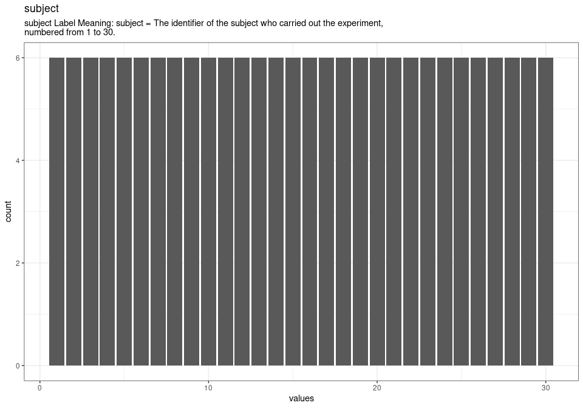

0 missing values.

#### Summary statistics {#subject_summary}

|name    |label   |data_type | n_missing| complete_rate|min |median |max | mean|       sd|hist  |
|:-------|:-------|:---------|---------:|-------------:|:---|:------|:---|----:|--------:|:-----|
|subject |subject |numeric   |         0|             1|1   |16     |30  | 15.5| 8.679585|▇▇▇▇▇ |


### activity {#activity .tabset}

activity

#### Distribution {#activity_distribution}

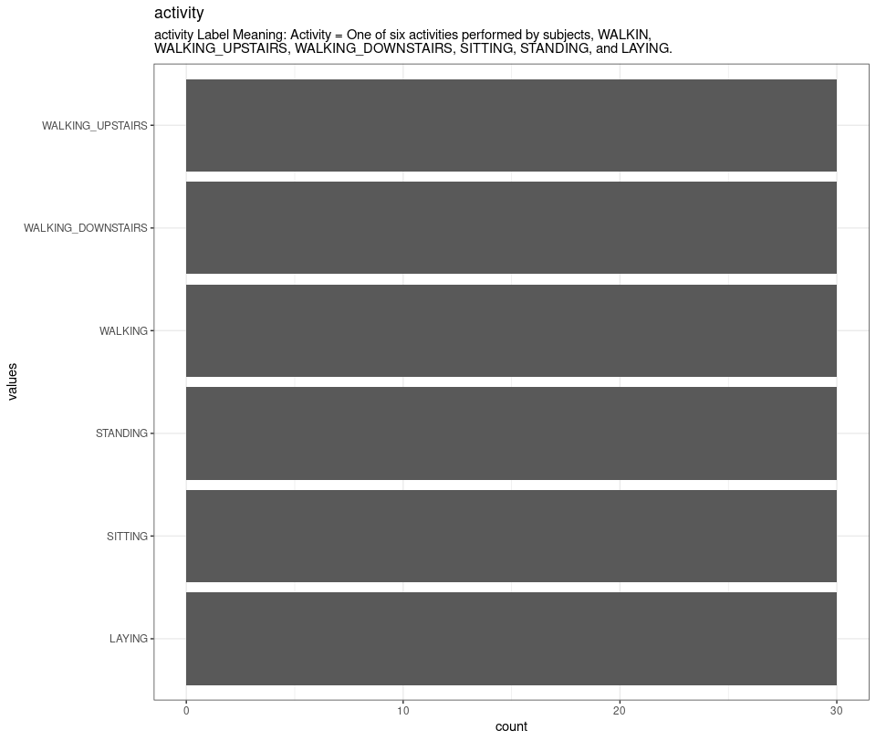

0 missing values.

#### Summary statistics {#activity_summary}

|name     |label    |data_type | n_missing| complete_rate| n_unique| empty|min |max | whitespace|
|:--------|:--------|:---------|---------:|-------------:|--------:|-----:|:---|:---|----------:|
|activity |activity |character |         0|             1|        6|     0|6   |18  |          0|


### Time.Body.Accelerometer.Mean.X {#Time_Body_Accelerometer_Mean_X .tabset}

Time Body Accelerometer Mean X

#### Distribution {#Time_Body_Accelerometer_Mean_X_distribution}


0 missing values.

#### Summary statistics {#Time_Body_Accelerometer_Mean_X_summary}

|name                           |label                          |data_type | n_missing| complete_rate|min  |median |max |      mean|        sd|hist  |
|:------------------------------|:------------------------------|:---------|---------:|-------------:|:----|:------|:---|---------:|---------:|:-----|
|Time.Body.Accelerometer.Mean.X |Time Body Accelerometer Mean X |numeric   |         0|             1|0.22 |0.28   |0.3 | 0.2743027| 0.0121646|▁▁▂▇▂ |


### Time.Body.Accelerometer.Mean.Y {#Time_Body_Accelerometer_Mean_Y .tabset}

Time Body Accelerometer Mean Y

#### Distribution {#Time_Body_Accelerometer_Mean_Y_distribution}


0 missing values.

#### Summary statistics {#Time_Body_Accelerometer_Mean_Y_summary}

|name                           |label                          |data_type | n_missing| complete_rate|min    |median |max     |       mean|        sd|hist  |
|:------------------------------|:------------------------------|:---------|---------:|-------------:|:------|:------|:-------|----------:|---------:|:-----|
|Time.Body.Accelerometer.Mean.Y |Time Body Accelerometer Mean Y |numeric   |         0|             1|-0.041 |-0.017 |-0.0013 | -0.0178755| 0.0057712|▁▂▇▇▁ |


### Time.Body.Accelerometer.Mean.Z {#Time_Body_Accelerometer_Mean_Z .tabset}

Time Body Accelerometer Mean Z

#### Distribution {#Time_Body_Accelerometer_Mean_Z_distribution}


0 missing values.

#### Summary statistics {#Time_Body_Accelerometer_Mean_Z_summary}

|name                           |label                          |data_type | n_missing| complete_rate|min   |median |max    |       mean|       sd|hist  |
|:------------------------------|:------------------------------|:---------|---------:|-------------:|:-----|:------|:------|----------:|--------:|:-----|
|Time.Body.Accelerometer.Mean.Z |Time Body Accelerometer Mean Z |numeric   |         0|             1|-0.15 |-0.11  |-0.075 | -0.1091638| 0.009582|▁▁▇▅▁ |


### Time.Body.Accelerometer.Standard.Deviation.X {#Time_Body_Accelerometer_Standard_Deviation_X .tabset}

Time Body Accelerometer Standard Deviation X

#### Distribution {#Time_Body_Accelerometer_Standard_Deviation_X_distribution}


0 missing values.

#### Summary statistics {#Time_Body_Accelerometer_Standard_Deviation_X_summary}

|name                                         |label                                        |data_type | n_missing| complete_rate|min |median |max  |       mean|        sd|hist  |
|:--------------------------------------------|:--------------------------------------------|:---------|---------:|-------------:|:---|:------|:----|----------:|---------:|:-----|
|Time.Body.Accelerometer.Standard.Deviation.X |Time Body Accelerometer Standard Deviation X |numeric   |         0|             1|-1  |-0.75  |0.63 | -0.5576901| 0.4516911|▇▂▅▂▁ |


### Time.Body.Accelerometer.Standard.Deviation.Y {#Time_Body_Accelerometer_Standard_Deviation_Y .tabset}

Time Body Accelerometer Standard Deviation Y

#### Distribution {#Time_Body_Accelerometer_Standard_Deviation_Y_distribution}


0 missing values.

#### Summary statistics {#Time_Body_Accelerometer_Standard_Deviation_Y_summary}

|name                                         |label                                        |data_type | n_missing| complete_rate|min   |median |max  |       mean|       sd|hist  |
|:--------------------------------------------|:--------------------------------------------|:---------|---------:|-------------:|:-----|:------|:----|----------:|--------:|:-----|
|Time.Body.Accelerometer.Standard.Deviation.Y |Time Body Accelerometer Standard Deviation Y |numeric   |         0|             1|-0.99 |-0.51  |0.62 | -0.4604626| 0.496565|▇▁▅▃▁ |


### Time.Body.Accelerometer.Standard.Deviation.Z {#Time_Body_Accelerometer_Standard_Deviation_Z .tabset}

Time Body Accelerometer Standard Deviation Z

#### Distribution {#Time_Body_Accelerometer_Standard_Deviation_Z_distribution}


0 missing values.

#### Summary statistics {#Time_Body_Accelerometer_Standard_Deviation_Z_summary}

|name                                         |label                                        |data_type | n_missing| complete_rate|min   |median |max  |       mean|        sd|hist  |
|:--------------------------------------------|:--------------------------------------------|:---------|---------:|-------------:|:-----|:------|:----|----------:|---------:|:-----|
|Time.Body.Accelerometer.Standard.Deviation.Z |Time Body Accelerometer Standard Deviation Z |numeric   |         0|             1|-0.99 |-0.65  |0.61 | -0.5755602| 0.3955439|▇▂▅▁▁ |


### Time.Gravity.Accelerometer.Mean.X {#Time_Gravity_Accelerometer_Mean_X .tabset}

Time Gravity Accelerometer Mean X

#### Distribution {#Time_Gravity_Accelerometer_Mean_X_distribution}


0 missing values.

#### Summary statistics {#Time_Gravity_Accelerometer_Mean_X_summary}

|name                              |label                             |data_type | n_missing| complete_rate|min   |median |max  |      mean|        sd|hist  |
|:---------------------------------|:---------------------------------|:---------|---------:|-------------:|:-----|:------|:----|---------:|---------:|:-----|
|Time.Gravity.Accelerometer.Mean.X |Time Gravity Accelerometer Mean X |numeric   |         0|             1|-0.68 |0.92   |0.97 | 0.6974775| 0.4872534|▁▁▁▁▇ |


### Time.Gravity.Accelerometer.Mean.Y {#Time_Gravity_Accelerometer_Mean_Y .tabset}

Time Gravity Accelerometer Mean Y

#### Distribution {#Time_Gravity_Accelerometer_Mean_Y_distribution}


0 missing values.

#### Summary statistics {#Time_Gravity_Accelerometer_Mean_Y_summary}

|name                              |label                             |data_type | n_missing| complete_rate|min   |median |max  |       mean|        sd|hist  |
|:---------------------------------|:---------------------------------|:---------|---------:|-------------:|:-----|:------|:----|----------:|---------:|:-----|
|Time.Gravity.Accelerometer.Mean.Y |Time Gravity Accelerometer Mean Y |numeric   |         0|             1|-0.48 |-0.13  |0.96 | -0.0162128| 0.3452376|▇▇▂▁▂ |


### Time.Gravity.Accelerometer.Mean.Z {#Time_Gravity_Accelerometer_Mean_Z .tabset}

Time Gravity Accelerometer Mean Z

#### Distribution {#Time_Gravity_Accelerometer_Mean_Z_distribution}


0 missing values.

#### Summary statistics {#Time_Gravity_Accelerometer_Mean_Z_summary}

|name                              |label                             |data_type | n_missing| complete_rate|min  |median |max  |      mean|        sd|hist  |
|:---------------------------------|:---------------------------------|:---------|---------:|-------------:|:----|:------|:----|---------:|---------:|:-----|
|Time.Gravity.Accelerometer.Mean.Z |Time Gravity Accelerometer Mean Z |numeric   |         0|             1|-0.5 |0.024  |0.96 | 0.0741279| 0.2887919|▂▇▃▁▁ |


### Time.Gravity.Accelerometer.Standard.Deviation.X {#Time_Gravity_Accelerometer_Standard_Deviation_X .tabset}

Time Gravity Accelerometer Standard Deviation X

#### Distribution {#Time_Gravity_Accelerometer_Standard_Deviation_X_distribution}


0 missing values.

#### Summary statistics {#Time_Gravity_Accelerometer_Standard_Deviation_X_summary}

|name                                            |label                                           |data_type | n_missing| complete_rate|min |median |max   |       mean|        sd|hist  |
|:-----------------------------------------------|:-----------------------------------------------|:---------|---------:|-------------:|:---|:------|:-----|----------:|---------:|:-----|
|Time.Gravity.Accelerometer.Standard.Deviation.X |Time Gravity Accelerometer Standard Deviation X |numeric   |         0|             1|-1  |-0.97  |-0.83 | -0.9637525| 0.0250344|▇▆▁▁▁ |


### Time.Gravity.Accelerometer.Standard.Deviation.Y {#Time_Gravity_Accelerometer_Standard_Deviation_Y .tabset}

Time Gravity Accelerometer Standard Deviation Y

#### Distribution {#Time_Gravity_Accelerometer_Standard_Deviation_Y_distribution}


0 missing values.

#### Summary statistics {#Time_Gravity_Accelerometer_Standard_Deviation_Y_summary}

|name                                            |label                                           |data_type | n_missing| complete_rate|min   |median |max   |       mean|        sd|hist  |
|:-----------------------------------------------|:-----------------------------------------------|:---------|---------:|-------------:|:-----|:------|:-----|----------:|---------:|:-----|
|Time.Gravity.Accelerometer.Standard.Deviation.Y |Time Gravity Accelerometer Standard Deviation Y |numeric   |         0|             1|-0.99 |-0.96  |-0.64 | -0.9524296| 0.0326557|▇▁▁▁▁ |


### Time.Gravity.Accelerometer.Standard.Deviation.Z {#Time_Gravity_Accelerometer_Standard_Deviation_Z .tabset}

Time Gravity Accelerometer Standard Deviation Z

#### Distribution {#Time_Gravity_Accelerometer_Standard_Deviation_Z_distribution}


0 missing values.

#### Summary statistics {#Time_Gravity_Accelerometer_Standard_Deviation_Z_summary}

|name                                            |label                                           |data_type | n_missing| complete_rate|min   |median |max   |      mean|        sd|hist  |
|:-----------------------------------------------|:-----------------------------------------------|:---------|---------:|-------------:|:-----|:------|:-----|---------:|---------:|:-----|
|Time.Gravity.Accelerometer.Standard.Deviation.Z |Time Gravity Accelerometer Standard Deviation Z |numeric   |         0|             1|-0.99 |-0.95  |-0.61 | -0.936401| 0.0402912|▇▂▁▁▁ |


### Time.Body.Accelerometer.Jerk.Mean.X {#Time_Body_Accelerometer_Jerk_Mean_X .tabset}

Time Body Accelerometer Jerk Mean X

#### Distribution {#Time_Body_Accelerometer_Jerk_Mean_X_distribution}


0 missing values.

#### Summary statistics {#Time_Body_Accelerometer_Jerk_Mean_X_summary}

|name                                |label                               |data_type | n_missing| complete_rate|min   |median |max  |      mean|       sd|hist  |
|:-----------------------------------|:-----------------------------------|:---------|---------:|-------------:|:-----|:------|:----|---------:|--------:|:-----|
|Time.Body.Accelerometer.Jerk.Mean.X |Time Body Accelerometer Jerk Mean X |numeric   |         0|             1|0.043 |0.076  |0.13 | 0.0794736| 0.012588|▁▇▃▂▁ |


### Time.Body.Accelerometer.Jerk.Mean.Y {#Time_Body_Accelerometer_Jerk_Mean_Y .tabset}

Time Body Accelerometer Jerk Mean Y

#### Distribution {#Time_Body_Accelerometer_Jerk_Mean_Y_distribution}


0 missing values.

#### Summary statistics {#Time_Body_Accelerometer_Jerk_Mean_Y_summary}

|name                                |label                               |data_type | n_missing| complete_rate|min    |median |max   |      mean|        sd|hist  |
|:-----------------------------------|:-----------------------------------|:---------|---------:|-------------:|:------|:------|:-----|---------:|---------:|:-----|
|Time.Body.Accelerometer.Jerk.Mean.Y |Time Body Accelerometer Jerk Mean Y |numeric   |         0|             1|-0.039 |0.0095 |0.057 | 0.0075652| 0.0135764|▁▃▇▂▁ |


### Time.Body.Accelerometer.Jerk.Mean.Z {#Time_Body_Accelerometer_Jerk_Mean_Z .tabset}

Time Body Accelerometer Jerk Mean Z

#### Distribution {#Time_Body_Accelerometer_Jerk_Mean_Z_distribution}


0 missing values.

#### Summary statistics {#Time_Body_Accelerometer_Jerk_Mean_Z_summary}

|name                                |label                               |data_type | n_missing| complete_rate|min    |median  |max   |       mean|        sd|hist  |
|:-----------------------------------|:-----------------------------------|:---------|---------:|-------------:|:------|:-------|:-----|----------:|---------:|:-----|
|Time.Body.Accelerometer.Jerk.Mean.Z |Time Body Accelerometer Jerk Mean Z |numeric   |         0|             1|-0.067 |-0.0039 |0.038 | -0.0049534| 0.0134621|▁▁▇▇▁ |


### Time.Body.Accelerometer.Jerk.Standard.Deviation.X {#Time_Body_Accelerometer_Jerk_Standard_Deviation_X .tabset}

Time Body Accelerometer Jerk Standard Deviation X

#### Distribution {#Time_Body_Accelerometer_Jerk_Standard_Deviation_X_distribution}


0 missing values.

#### Summary statistics {#Time_Body_Accelerometer_Jerk_Standard_Deviation_X_summary}

|name                                              |label                                             |data_type | n_missing| complete_rate|min   |median |max  |       mean|        sd|hist  |
|:-------------------------------------------------|:-------------------------------------------------|:---------|---------:|-------------:|:-----|:------|:----|----------:|---------:|:-----|
|Time.Body.Accelerometer.Jerk.Standard.Deviation.X |Time Body Accelerometer Jerk Standard Deviation X |numeric   |         0|             1|-0.99 |-0.81  |0.54 | -0.5949467| 0.4175865|▇▂▅▂▁ |


### Time.Body.Accelerometer.Jerk.Standard.Deviation.Y {#Time_Body_Accelerometer_Jerk_Standard_Deviation_Y .tabset}

Time Body Accelerometer Jerk Standard Deviation Y

#### Distribution {#Time_Body_Accelerometer_Jerk_Standard_Deviation_Y_distribution}


0 missing values.

#### Summary statistics {#Time_Body_Accelerometer_Jerk_Standard_Deviation_Y_summary}

|name                                              |label                                             |data_type | n_missing| complete_rate|min   |median |max  |       mean|        sd|hist  |
|:-------------------------------------------------|:-------------------------------------------------|:---------|---------:|-------------:|:-----|:------|:----|----------:|---------:|:-----|
|Time.Body.Accelerometer.Jerk.Standard.Deviation.Y |Time Body Accelerometer Jerk Standard Deviation Y |numeric   |         0|             1|-0.99 |-0.78  |0.36 | -0.5654147| 0.4330871|▇▁▃▃▁ |


### Time.Body.Accelerometer.Jerk.Standard.Deviation.Z {#Time_Body_Accelerometer_Jerk_Standard_Deviation_Z .tabset}

Time Body Accelerometer Jerk Standard Deviation Z

#### Distribution {#Time_Body_Accelerometer_Jerk_Standard_Deviation_Z_distribution}


0 missing values.

#### Summary statistics {#Time_Body_Accelerometer_Jerk_Standard_Deviation_Z_summary}

|name                                              |label                                             |data_type | n_missing| complete_rate|min   |median |max   |       mean|        sd|hist  |
|:-------------------------------------------------|:-------------------------------------------------|:---------|---------:|-------------:|:-----|:------|:-----|----------:|---------:|:-----|
|Time.Body.Accelerometer.Jerk.Standard.Deviation.Z |Time Body Accelerometer Jerk Standard Deviation Z |numeric   |         0|             1|-0.99 |-0.88  |0.031 | -0.7359577| 0.2768479|▇▂▃▁▁ |


### Time.Body.Gyroscope.Mean.X {#Time_Body_Gyroscope_Mean_X .tabset}

Time Body Gyroscope Mean X

#### Distribution {#Time_Body_Gyroscope_Mean_X_distribution}

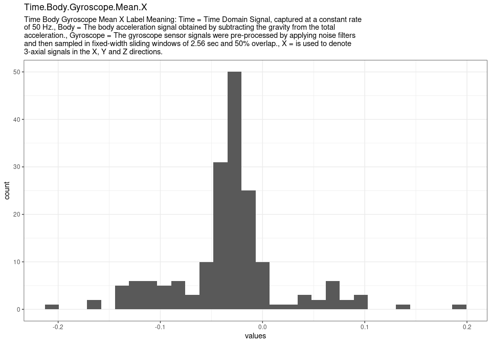

0 missing values.

#### Summary statistics {#Time_Body_Gyroscope_Mean_X_summary}

|name                       |label                      |data_type | n_missing| complete_rate|min   |median |max  |       mean|        sd|hist  |
|:--------------------------|:--------------------------|:---------|---------:|-------------:|:-----|:------|:----|----------:|---------:|:-----|
|Time.Body.Gyroscope.Mean.X |Time Body Gyroscope Mean X |numeric   |         0|             1|-0.21 |-0.029 |0.19 | -0.0324372| 0.0540518|▁▂▇▁▁ |


### Time.Body.Gyroscope.Mean.Y {#Time_Body_Gyroscope_Mean_Y .tabset}

Time Body Gyroscope Mean Y

#### Distribution {#Time_Body_Gyroscope_Mean_Y_distribution}

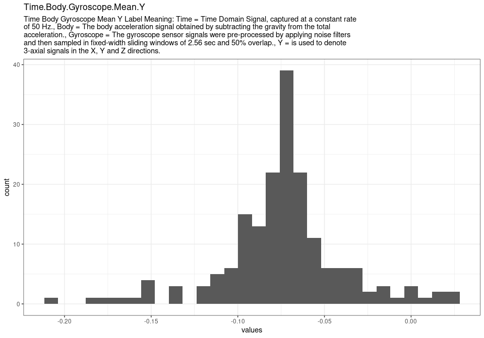

0 missing values.

#### Summary statistics {#Time_Body_Gyroscope_Mean_Y_summary}

|name                       |label                      |data_type | n_missing| complete_rate|min  |median |max   |       mean|        sd|hist  |
|:--------------------------|:--------------------------|:---------|---------:|-------------:|:----|:------|:-----|----------:|---------:|:-----|
|Time.Body.Gyroscope.Mean.Y |Time Body Gyroscope Mean Y |numeric   |         0|             1|-0.2 |-0.073 |0.027 | -0.0742596| 0.0355415|▁▁▇▃▁ |


### Time.Body.Gyroscope.Mean.Z {#Time_Body_Gyroscope_Mean_Z .tabset}

Time Body Gyroscope Mean Z

#### Distribution {#Time_Body_Gyroscope_Mean_Z_distribution}

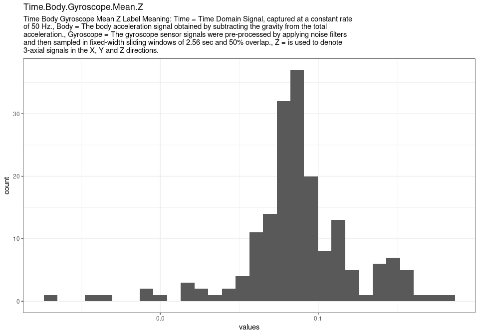

0 missing values.

#### Summary statistics {#Time_Body_Gyroscope_Mean_Z_summary}

|name                       |label                      |data_type | n_missing| complete_rate|min    |median |max  |      mean|        sd|hist  |
|:--------------------------|:--------------------------|:---------|---------:|-------------:|:------|:------|:----|---------:|---------:|:-----|
|Time.Body.Gyroscope.Mean.Z |Time Body Gyroscope Mean Z |numeric   |         0|             1|-0.072 |0.085  |0.18 | 0.0874446| 0.0362125|▁▁▃▇▂ |


### Time.Body.Gyroscope.Standard.Deviation.X {#Time_Body_Gyroscope_Standard_Deviation_X .tabset}

Time Body Gyroscope Standard Deviation X

#### Distribution {#Time_Body_Gyroscope_Standard_Deviation_X_distribution}

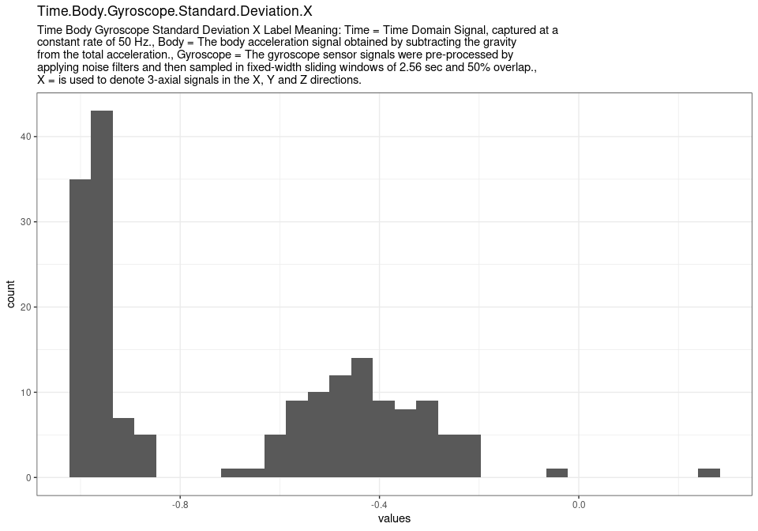

0 missing values.

#### Summary statistics {#Time_Body_Gyroscope_Standard_Deviation_X_summary}

|name                                     |label                                    |data_type | n_missing| complete_rate|min   |median |max  |       mean|        sd|hist  |
|:----------------------------------------|:----------------------------------------|:---------|---------:|-------------:|:-----|:------|:----|----------:|---------:|:-----|
|Time.Body.Gyroscope.Standard.Deviation.X |Time Body Gyroscope Standard Deviation X |numeric   |         0|             1|-0.99 |-0.79  |0.27 | -0.6916399| 0.2910189|▇▃▅▁▁ |


### Time.Body.Gyroscope.Standard.Deviation.Y {#Time_Body_Gyroscope_Standard_Deviation_Y .tabset}

Time Body Gyroscope Standard Deviation Y

#### Distribution {#Time_Body_Gyroscope_Standard_Deviation_Y_distribution}

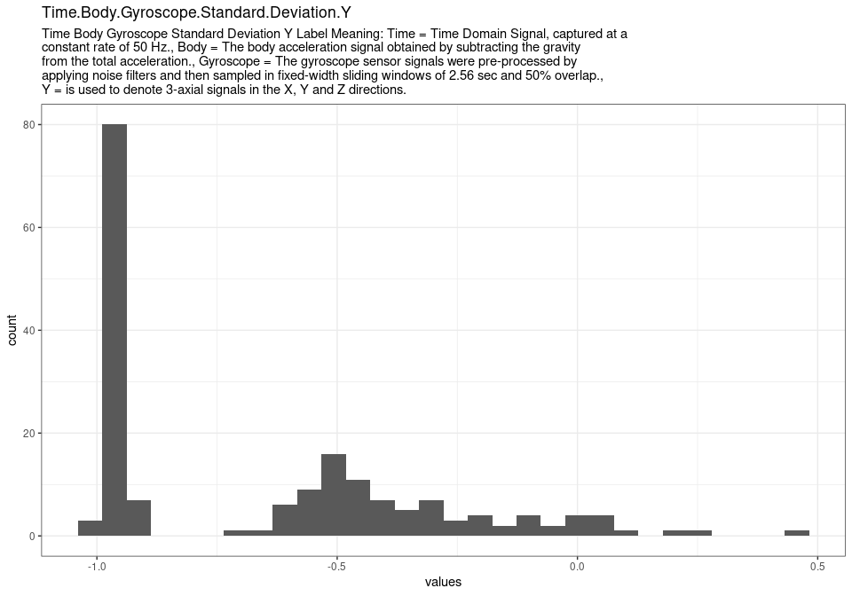

0 missing values.

#### Summary statistics {#Time_Body_Gyroscope_Standard_Deviation_Y_summary}

|name                                     |label                                    |data_type | n_missing| complete_rate|min   |median |max  |      mean|        sd|hist  |
|:----------------------------------------|:----------------------------------------|:---------|---------:|-------------:|:-----|:------|:----|---------:|---------:|:-----|
|Time.Body.Gyroscope.Standard.Deviation.Y |Time Body Gyroscope Standard Deviation Y |numeric   |         0|             1|-0.99 |-0.8   |0.48 | -0.653302| 0.3520252|▇▅▂▁▁ |


### Time.Body.Gyroscope.Standard.Deviation.Z {#Time_Body_Gyroscope_Standard_Deviation_Z .tabset}

Time Body Gyroscope Standard Deviation Z

#### Distribution {#Time_Body_Gyroscope_Standard_Deviation_Z_distribution}


0 missing values.

#### Summary statistics {#Time_Body_Gyroscope_Standard_Deviation_Z_summary}

|name                                     |label                                    |data_type | n_missing| complete_rate|min   |median |max  |       mean|        sd|hist  |
|:----------------------------------------|:----------------------------------------|:---------|---------:|-------------:|:-----|:------|:----|----------:|---------:|:-----|
|Time.Body.Gyroscope.Standard.Deviation.Z |Time Body Gyroscope Standard Deviation Z |numeric   |         0|             1|-0.99 |-0.8   |0.56 | -0.6164353| 0.3730264|▇▂▅▁▁ |


### Time.Body.Gyroscope.Jerk.Mean.X {#Time_Body_Gyroscope_Jerk_Mean_X .tabset}

Time Body Gyroscope Jerk Mean X

#### Distribution {#Time_Body_Gyroscope_Jerk_Mean_X_distribution}

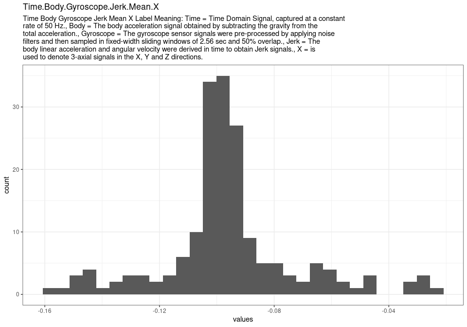

0 missing values.

#### Summary statistics {#Time_Body_Gyroscope_Jerk_Mean_X_summary}

|name                            |label                           |data_type | n_missing| complete_rate|min   |median |max    |       mean|        sd|hist  |
|:-------------------------------|:-------------------------------|:---------|---------:|-------------:|:-----|:------|:------|----------:|---------:|:-----|
|Time.Body.Gyroscope.Jerk.Mean.X |Time Body Gyroscope Jerk Mean X |numeric   |         0|             1|-0.16 |-0.099 |-0.022 | -0.0960568| 0.0233458|▁▂▇▁▁ |


### Time.Body.Gyroscope.Jerk.Mean.Y {#Time_Body_Gyroscope_Jerk_Mean_Y .tabset}

Time Body Gyroscope Jerk Mean Y

#### Distribution {#Time_Body_Gyroscope_Jerk_Mean_Y_distribution}

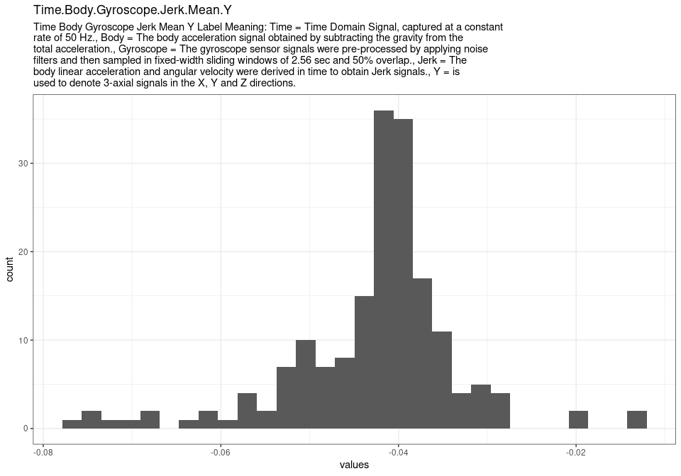

0 missing values.

#### Summary statistics {#Time_Body_Gyroscope_Jerk_Mean_Y_summary}

|name                            |label                           |data_type | n_missing| complete_rate|min    |median |max    |       mean|       sd|hist  |
|:-------------------------------|:-------------------------------|:---------|---------:|-------------:|:------|:------|:------|----------:|--------:|:-----|
|Time.Body.Gyroscope.Jerk.Mean.Y |Time Body Gyroscope Jerk Mean Y |numeric   |         0|             1|-0.077 |-0.041 |-0.013 | -0.0426928| 0.009532|▁▂▇▃▁ |


### Time.Body.Gyroscope.Jerk.Mean.Z {#Time_Body_Gyroscope_Jerk_Mean_Z .tabset}

Time Body Gyroscope Jerk Mean Z

#### Distribution {#Time_Body_Gyroscope_Jerk_Mean_Z_distribution}

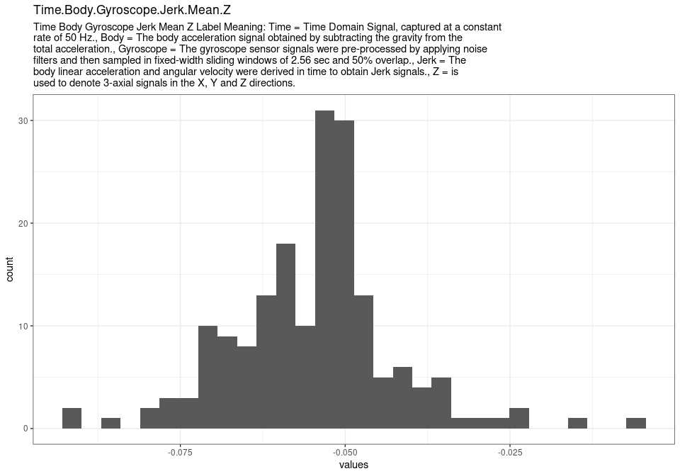

0 missing values.

#### Summary statistics {#Time_Body_Gyroscope_Jerk_Mean_Z_summary}

|name                            |label                           |data_type | n_missing| complete_rate|min    |median |max     |       mean|       sd|hist  |
|:-------------------------------|:-------------------------------|:---------|---------:|-------------:|:------|:------|:-------|----------:|--------:|:-----|
|Time.Body.Gyroscope.Jerk.Mean.Z |Time Body Gyroscope Jerk Mean Z |numeric   |         0|             1|-0.092 |-0.053 |-0.0069 | -0.0548019| 0.012347|▁▅▇▁▁ |


### Time.Body.Gyroscope.Jerk.Standard.Deviation.X {#Time_Body_Gyroscope_Jerk_Standard_Deviation_X .tabset}

Time Body Gyroscope Jerk Standard Deviation X

#### Distribution {#Time_Body_Gyroscope_Jerk_Standard_Deviation_X_distribution}

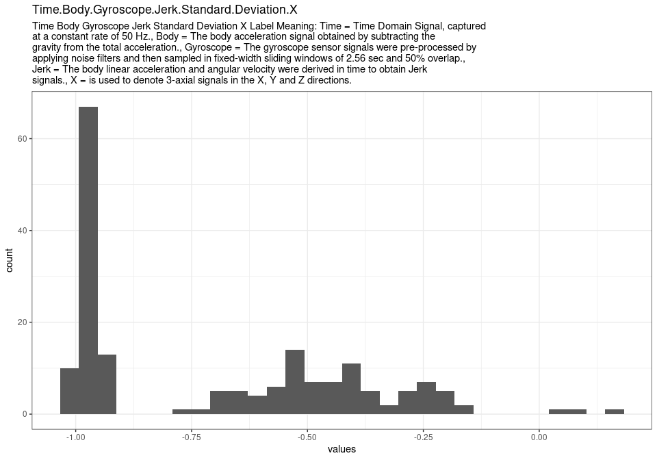

0 missing values.

#### Summary statistics {#Time_Body_Gyroscope_Jerk_Standard_Deviation_X_summary}

|name                                          |label                                         |data_type | n_missing| complete_rate|min |median |max  |       mean|        sd|hist  |
|:---------------------------------------------|:---------------------------------------------|:---------|---------:|-------------:|:---|:------|:----|----------:|---------:|:-----|
|Time.Body.Gyroscope.Jerk.Standard.Deviation.X |Time Body Gyroscope Jerk Standard Deviation X |numeric   |         0|             1|-1  |-0.84  |0.18 | -0.7036327| 0.3008361|▇▂▃▂▁ |


### Time.Body.Gyroscope.Jerk.Standard.Deviation.Y {#Time_Body_Gyroscope_Jerk_Standard_Deviation_Y .tabset}

Time Body Gyroscope Jerk Standard Deviation Y

#### Distribution {#Time_Body_Gyroscope_Jerk_Standard_Deviation_Y_distribution}

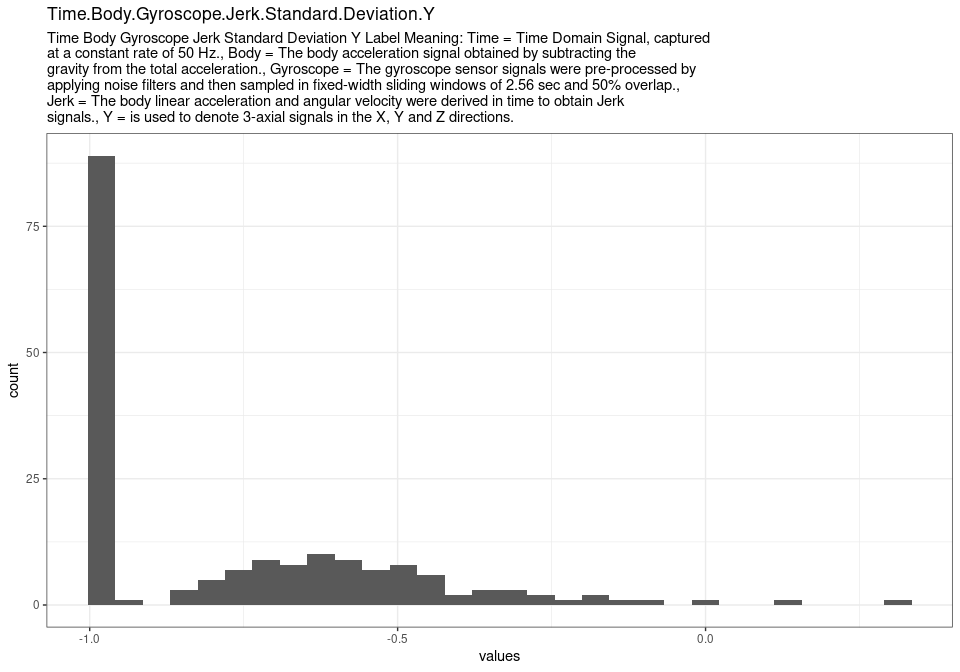

0 missing values.

#### Summary statistics {#Time_Body_Gyroscope_Jerk_Standard_Deviation_Y_summary}

|name                                          |label                                         |data_type | n_missing| complete_rate|min |median |max |       mean|        sd|hist  |
|:---------------------------------------------|:---------------------------------------------|:---------|---------:|-------------:|:---|:------|:---|----------:|---------:|:-----|
|Time.Body.Gyroscope.Jerk.Standard.Deviation.Y |Time Body Gyroscope Jerk Standard Deviation Y |numeric   |         0|             1|-1  |-0.89  |0.3 | -0.7635518| 0.2672885|▇▃▂▁▁ |


### Time.Body.Gyroscope.Jerk.Standard.Deviation.Z {#Time_Body_Gyroscope_Jerk_Standard_Deviation_Z .tabset}

Time Body Gyroscope Jerk Standard Deviation Z

#### Distribution {#Time_Body_Gyroscope_Jerk_Standard_Deviation_Z_distribution}


0 missing values.

#### Summary statistics {#Time_Body_Gyroscope_Jerk_Standard_Deviation_Z_summary}

|name                                          |label                                         |data_type | n_missing| complete_rate|min |median |max  |       mean|        sd|hist  |
|:---------------------------------------------|:---------------------------------------------|:---------|---------:|-------------:|:---|:------|:----|----------:|---------:|:-----|
|Time.Body.Gyroscope.Jerk.Standard.Deviation.Z |Time Body Gyroscope Jerk Standard Deviation Z |numeric   |         0|             1|-1  |-0.86  |0.19 | -0.7095592| 0.3045394|▇▃▃▁▁ |


### Time.Body.Accelerometer.Magnitude.Mean {#Time_Body_Accelerometer_Magnitude_Mean .tabset}

Time Body Accelerometer Magnitude Mean

#### Distribution {#Time_Body_Accelerometer_Magnitude_Mean_distribution}


0 missing values.

#### Summary statistics {#Time_Body_Accelerometer_Magnitude_Mean_summary}

|name                                   |label                                  |data_type | n_missing| complete_rate|min   |median |max  |       mean|        sd|hist  |
|:--------------------------------------|:--------------------------------------|:---------|---------:|-------------:|:-----|:------|:----|----------:|---------:|:-----|
|Time.Body.Accelerometer.Magnitude.Mean |Time Body Accelerometer Magnitude Mean |numeric   |         0|             1|-0.99 |-0.48  |0.64 | -0.4972897| 0.4728834|▇▁▅▃▁ |


### Time.Body.Accelerometer.Magnitude.Standard.Deviation {#Time_Body_Accelerometer_Magnitude_Standard_Deviation .tabset}

Time Body Accelerometer Magnitude Standard Deviation

#### Distribution {#Time_Body_Accelerometer_Magnitude_Standard_Deviation_distribution}


0 missing values.

#### Summary statistics {#Time_Body_Accelerometer_Magnitude_Standard_Deviation_summary}

|name                                                 |label                                                |data_type | n_missing| complete_rate|min   |median |max  |       mean|        sd|hist  |
|:----------------------------------------------------|:----------------------------------------------------|:---------|---------:|-------------:|:-----|:------|:----|----------:|---------:|:-----|
|Time.Body.Accelerometer.Magnitude.Standard.Deviation |Time Body Accelerometer Magnitude Standard Deviation |numeric   |         0|             1|-0.99 |-0.61  |0.43 | -0.5439087| 0.4310448|▇▁▅▂▁ |


### Time.Gravity.Accelerometer.Magnitude.Mean {#Time_Gravity_Accelerometer_Magnitude_Mean .tabset}

Time Gravity Accelerometer Magnitude Mean

#### Distribution {#Time_Gravity_Accelerometer_Magnitude_Mean_distribution}


0 missing values.

#### Summary statistics {#Time_Gravity_Accelerometer_Magnitude_Mean_summary}

|name                                      |label                                     |data_type | n_missing| complete_rate|min   |median |max  |       mean|        sd|hist  |
|:-----------------------------------------|:-----------------------------------------|:---------|---------:|-------------:|:-----|:------|:----|----------:|---------:|:-----|
|Time.Gravity.Accelerometer.Magnitude.Mean |Time Gravity Accelerometer Magnitude Mean |numeric   |         0|             1|-0.99 |-0.48  |0.64 | -0.4972897| 0.4728834|▇▁▅▃▁ |


### Time.Gravity.Accelerometer.Magnitude.Standard.Deviation {#Time_Gravity_Accelerometer_Magnitude_Standard_Deviation .tabset}

Time Gravity Accelerometer Magnitude Standard Deviation

#### Distribution {#Time_Gravity_Accelerometer_Magnitude_Standard_Deviation_distribution}


0 missing values.

#### Summary statistics {#Time_Gravity_Accelerometer_Magnitude_Standard_Deviation_summary}

|name                                                    |label                                                   |data_type | n_missing| complete_rate|min   |median |max  |       mean|        sd|hist  |
|:-------------------------------------------------------|:-------------------------------------------------------|:---------|---------:|-------------:|:-----|:------|:----|----------:|---------:|:-----|
|Time.Gravity.Accelerometer.Magnitude.Standard.Deviation |Time Gravity Accelerometer Magnitude Standard Deviation |numeric   |         0|             1|-0.99 |-0.61  |0.43 | -0.5439087| 0.4310448|▇▁▅▂▁ |


### Time.Body.Accelerometer.Jerk.Magnitude.Mean {#Time_Body_Accelerometer_Jerk_Magnitude_Mean .tabset}

Time Body Accelerometer Jerk Magnitude Mean

#### Distribution {#Time_Body_Accelerometer_Jerk_Magnitude_Mean_distribution}


0 missing values.

#### Summary statistics {#Time_Body_Accelerometer_Jerk_Magnitude_Mean_summary}

|name                                        |label                                       |data_type | n_missing| complete_rate|min   |median |max  |       mean|        sd|hist  |
|:-------------------------------------------|:-------------------------------------------|:---------|---------:|-------------:|:-----|:------|:----|----------:|---------:|:-----|
|Time.Body.Accelerometer.Jerk.Magnitude.Mean |Time Body Accelerometer Jerk Magnitude Mean |numeric   |         0|             1|-0.99 |-0.82  |0.43 | -0.6079296| 0.3965272|▇▂▅▂▁ |


### Time.Body.Accelerometer.Jerk.Magnitude.Standard.Deviation {#Time_Body_Accelerometer_Jerk_Magnitude_Standard_Deviation .tabset}

Time Body Accelerometer Jerk Magnitude Standard Deviation

#### Distribution {#Time_Body_Accelerometer_Jerk_Magnitude_Standard_Deviation_distribution}


0 missing values.

#### Summary statistics {#Time_Body_Accelerometer_Jerk_Magnitude_Standard_Deviation_summary}

|name                                                      |label                                                     |data_type | n_missing| complete_rate|min   |median |max  |       mean|        sd|hist  |
|:---------------------------------------------------------|:---------------------------------------------------------|:---------|---------:|-------------:|:-----|:------|:----|----------:|---------:|:-----|
|Time.Body.Accelerometer.Jerk.Magnitude.Standard.Deviation |Time Body Accelerometer Jerk Magnitude Standard Deviation |numeric   |         0|             1|-0.99 |-0.8   |0.45 | -0.5841756| 0.4227953|▇▂▃▂▁ |


### Time.Body.Gyroscope.Magnitude.Mean {#Time_Body_Gyroscope_Magnitude_Mean .tabset}

Time Body Gyroscope Magnitude Mean

#### Distribution {#Time_Body_Gyroscope_Magnitude_Mean_distribution}

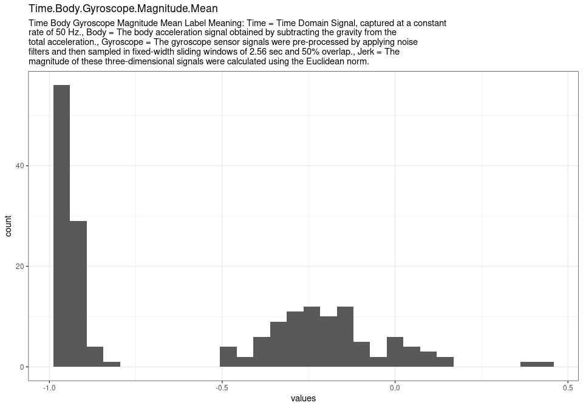

0 missing values.

#### Summary statistics {#Time_Body_Gyroscope_Magnitude_Mean_summary}

|name                               |label                              |data_type | n_missing| complete_rate|min   |median |max  |       mean|        sd|hist  |
|:----------------------------------|:----------------------------------|:---------|---------:|-------------:|:-----|:------|:----|----------:|---------:|:-----|
|Time.Body.Gyroscope.Magnitude.Mean |Time Body Gyroscope Magnitude Mean |numeric   |         0|             1|-0.98 |-0.66  |0.42 | -0.5651631| 0.3977338|▇▁▅▂▁ |


### Time.Body.Gyroscope.Magnitude.Standard.Deviation {#Time_Body_Gyroscope_Magnitude_Standard_Deviation .tabset}

Time Body Gyroscope Magnitude Standard Deviation

#### Distribution {#Time_Body_Gyroscope_Magnitude_Standard_Deviation_distribution}

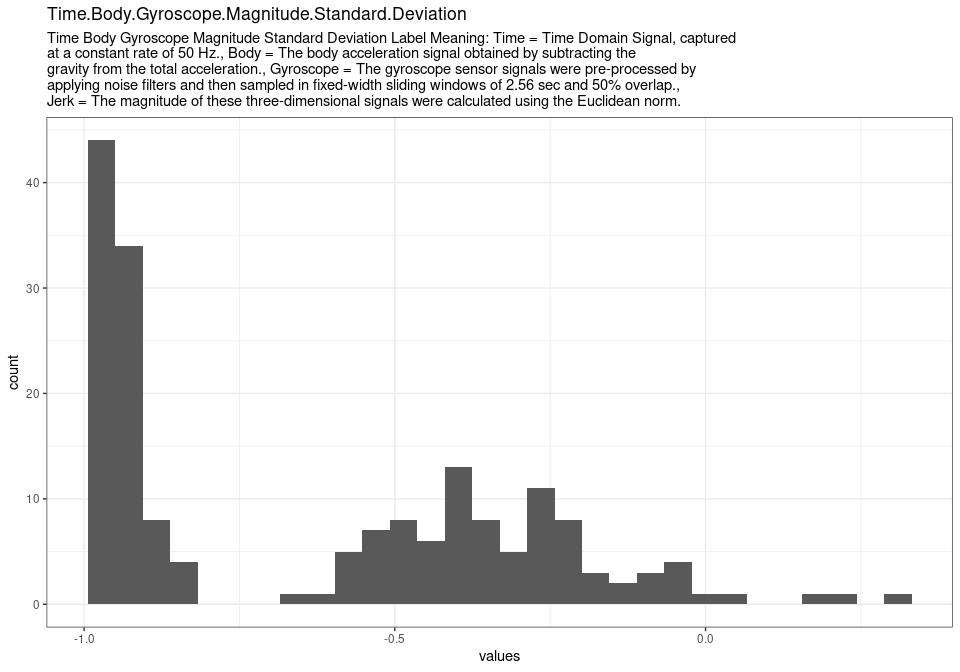

0 missing values.

#### Summary statistics {#Time_Body_Gyroscope_Magnitude_Standard_Deviation_summary}

|name                                             |label                                            |data_type | n_missing| complete_rate|min   |median |max |       mean|        sd|hist  |
|:------------------------------------------------|:------------------------------------------------|:---------|---------:|-------------:|:-----|:------|:---|----------:|---------:|:-----|
|Time.Body.Gyroscope.Magnitude.Standard.Deviation |Time Body Gyroscope Magnitude Standard Deviation |numeric   |         0|             1|-0.98 |-0.74  |0.3 | -0.6303947| 0.3368827|▇▂▅▂▁ |


### Time.Body.Gyroscope.Jerk.Magnitude.Mean {#Time_Body_Gyroscope_Jerk_Magnitude_Mean .tabset}

Time Body Gyroscope Jerk Magnitude Mean

#### Distribution {#Time_Body_Gyroscope_Jerk_Magnitude_Mean_distribution}

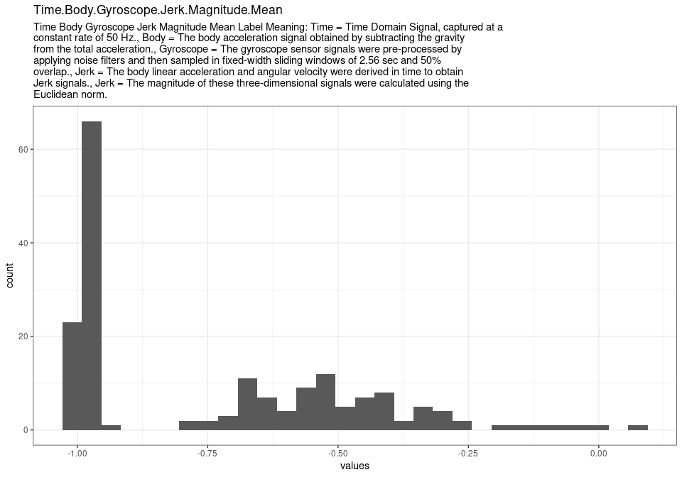

0 missing values.

#### Summary statistics {#Time_Body_Gyroscope_Jerk_Magnitude_Mean_summary}

|name                                    |label                                   |data_type | n_missing| complete_rate|min |median |max   |       mean|        sd|hist  |
|:---------------------------------------|:---------------------------------------|:---------|---------:|-------------:|:---|:------|:-----|----------:|---------:|:-----|
|Time.Body.Gyroscope.Jerk.Magnitude.Mean |Time Body Gyroscope Jerk Magnitude Mean |numeric   |         0|             1|-1  |-0.86  |0.088 | -0.7363693| 0.2767541|▇▃▃▁▁ |


### Time.Body.Gyroscope.Jerk.Magnitude.Standard.Deviation {#Time_Body_Gyroscope_Jerk_Magnitude_Standard_Deviation .tabset}

Time Body Gyroscope Jerk Magnitude Standard Deviation

#### Distribution {#Time_Body_Gyroscope_Jerk_Magnitude_Standard_Deviation_distribution}

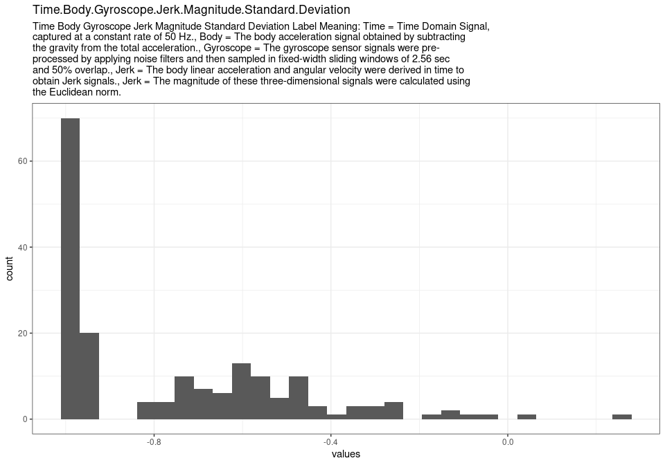

0 missing values.

#### Summary statistics {#Time_Body_Gyroscope_Jerk_Magnitude_Standard_Deviation_summary}

|name                                                  |label                                                 |data_type | n_missing| complete_rate|min |median |max  |       mean|        sd|hist  |
|:-----------------------------------------------------|:-----------------------------------------------------|:---------|---------:|-------------:|:---|:------|:----|----------:|---------:|:-----|
|Time.Body.Gyroscope.Jerk.Magnitude.Standard.Deviation |Time Body Gyroscope Jerk Magnitude Standard Deviation |numeric   |         0|             1|-1  |-0.88  |0.25 | -0.7550152| 0.2655057|▇▃▂▁▁ |


### Frequency.Body.Accelerometer.Mean.X {#Frequency_Body_Accelerometer_Mean_X .tabset}

Frequency Body Accelerometer Mean X

#### Distribution {#Frequency_Body_Accelerometer_Mean_X_distribution}


0 missing values.

#### Summary statistics {#Frequency_Body_Accelerometer_Mean_X_summary}

|name                                |label                               |data_type | n_missing| complete_rate|min |median |max  |    mean|        sd|hist  |
|:-----------------------------------|:-----------------------------------|:---------|---------:|-------------:|:---|:------|:----|-------:|---------:|:-----|
|Frequency.Body.Accelerometer.Mean.X |Frequency Body Accelerometer Mean X |numeric   |         0|             1|-1  |-0.77  |0.54 | -0.5758| 0.4300214|▇▁▃▂▁ |


### Frequency.Body.Accelerometer.Mean.Y {#Frequency_Body_Accelerometer_Mean_Y .tabset}

Frequency Body Accelerometer Mean Y

#### Distribution {#Frequency_Body_Accelerometer_Mean_Y_distribution}


0 missing values.

#### Summary statistics {#Frequency_Body_Accelerometer_Mean_Y_summary}

|name                                |label                               |data_type | n_missing| complete_rate|min   |median |max  |       mean|        sd|hist  |
|:-----------------------------------|:-----------------------------------|:---------|---------:|-------------:|:-----|:------|:----|----------:|---------:|:-----|
|Frequency.Body.Accelerometer.Mean.Y |Frequency Body Accelerometer Mean Y |numeric   |         0|             1|-0.99 |-0.59  |0.52 | -0.4887327| 0.4806496|▇▁▃▃▁ |


### Frequency.Body.Accelerometer.Mean.Z {#Frequency_Body_Accelerometer_Mean_Z .tabset}

Frequency Body Accelerometer Mean Z

#### Distribution {#Frequency_Body_Accelerometer_Mean_Z_distribution}


0 missing values.

#### Summary statistics {#Frequency_Body_Accelerometer_Mean_Z_summary}

|name                                |label                               |data_type | n_missing| complete_rate|min   |median |max  |       mean|        sd|hist  |
|:-----------------------------------|:-----------------------------------|:---------|---------:|-------------:|:-----|:------|:----|----------:|---------:|:-----|
|Frequency.Body.Accelerometer.Mean.Z |Frequency Body Accelerometer Mean Z |numeric   |         0|             1|-0.99 |-0.72  |0.28 | -0.6297388| 0.3556469|▇▂▅▁▁ |


### Frequency.Body.Accelerometer.Standard.Deviation.X {#Frequency_Body_Accelerometer_Standard_Deviation_X .tabset}

Frequency Body Accelerometer Standard Deviation X

#### Distribution {#Frequency_Body_Accelerometer_Standard_Deviation_X_distribution}


0 missing values.

#### Summary statistics {#Frequency_Body_Accelerometer_Standard_Deviation_X_summary}

|name                                              |label                                             |data_type | n_missing| complete_rate|min |median |max  |       mean|        sd|hist  |
|:-------------------------------------------------|:-------------------------------------------------|:---------|---------:|-------------:|:---|:------|:----|----------:|---------:|:-----|
|Frequency.Body.Accelerometer.Standard.Deviation.X |Frequency Body Accelerometer Standard Deviation X |numeric   |         0|             1|-1  |-0.75  |0.66 | -0.5522011| 0.4600233|▇▂▅▂▁ |


### Frequency.Body.Accelerometer.Standard.Deviation.Y {#Frequency_Body_Accelerometer_Standard_Deviation_Y .tabset}

Frequency Body Accelerometer Standard Deviation Y

#### Distribution {#Frequency_Body_Accelerometer_Standard_Deviation_Y_distribution}


0 missing values.

#### Summary statistics {#Frequency_Body_Accelerometer_Standard_Deviation_Y_summary}

|name                                              |label                                             |data_type | n_missing| complete_rate|min   |median |max  |       mean|        sd|hist  |
|:-------------------------------------------------|:-------------------------------------------------|:---------|---------:|-------------:|:-----|:------|:----|----------:|---------:|:-----|
|Frequency.Body.Accelerometer.Standard.Deviation.Y |Frequency Body Accelerometer Standard Deviation Y |numeric   |         0|             1|-0.99 |-0.51  |0.56 | -0.4814787| 0.4740277|▇▁▅▃▁ |


### Frequency.Body.Accelerometer.Standard.Deviation.Z {#Frequency_Body_Accelerometer_Standard_Deviation_Z .tabset}

Frequency Body Accelerometer Standard Deviation Z

#### Distribution {#Frequency_Body_Accelerometer_Standard_Deviation_Z_distribution}


0 missing values.

#### Summary statistics {#Frequency_Body_Accelerometer_Standard_Deviation_Z_summary}

|name                                              |label                                             |data_type | n_missing| complete_rate|min   |median |max  |       mean|        sd|hist  |
|:-------------------------------------------------|:-------------------------------------------------|:---------|---------:|-------------:|:-----|:------|:----|----------:|---------:|:-----|
|Frequency.Body.Accelerometer.Standard.Deviation.Z |Frequency Body Accelerometer Standard Deviation Z |numeric   |         0|             1|-0.99 |-0.64  |0.69 | -0.5823614| 0.3880902|▇▃▅▁▁ |


### Frequency.Body.Accelerometer.Mean.Frequency.X {#Frequency_Body_Accelerometer_Mean_Frequency_X .tabset}

Frequency Body Accelerometer Mean Frequency X

#### Distribution {#Frequency_Body_Accelerometer_Mean_Frequency_X_distribution}


0 missing values.

#### Summary statistics {#Frequency_Body_Accelerometer_Mean_Frequency_X_summary}

|name                                          |label                                         |data_type | n_missing| complete_rate|min   |median |max  |       mean|        sd|hist  |
|:---------------------------------------------|:---------------------------------------------|:---------|---------:|-------------:|:-----|:------|:----|----------:|---------:|:-----|
|Frequency.Body.Accelerometer.Mean.Frequency.X |Frequency Body Accelerometer Mean Frequency X |numeric   |         0|             1|-0.64 |-0.26  |0.16 | -0.2322661| 0.1935684|▂▇▆▆▃ |


### Frequency.Body.Accelerometer.Mean.Frequency.Y {#Frequency_Body_Accelerometer_Mean_Frequency_Y .tabset}

Frequency Body Accelerometer Mean Frequency Y

#### Distribution {#Frequency_Body_Accelerometer_Mean_Frequency_Y_distribution}


0 missing values.

#### Summary statistics {#Frequency_Body_Accelerometer_Mean_Frequency_Y_summary}

|name                                          |label                                         |data_type | n_missing| complete_rate|min   |median |max  |      mean|        sd|hist  |
|:---------------------------------------------|:---------------------------------------------|:---------|---------:|-------------:|:-----|:------|:----|---------:|---------:|:-----|
|Frequency.Body.Accelerometer.Mean.Frequency.Y |Frequency Body Accelerometer Mean Frequency Y |numeric   |         0|             1|-0.38 |0.0079 |0.47 | 0.0115289| 0.1447051|▁▅▇▂▁ |


### Frequency.Body.Accelerometer.Mean.Frequency.Z {#Frequency_Body_Accelerometer_Mean_Frequency_Z .tabset}

Frequency Body Accelerometer Mean Frequency Z

#### Distribution {#Frequency_Body_Accelerometer_Mean_Frequency_Z_distribution}


0 missing values.

#### Summary statistics {#Frequency_Body_Accelerometer_Mean_Frequency_Z_summary}

|name                                          |label                                         |data_type | n_missing| complete_rate|min   |median |max |      mean|        sd|hist  |
|:---------------------------------------------|:---------------------------------------------|:---------|---------:|-------------:|:-----|:------|:---|---------:|---------:|:-----|
|Frequency.Body.Accelerometer.Mean.Frequency.Z |Frequency Body Accelerometer Mean Frequency Z |numeric   |         0|             1|-0.52 |0.066  |0.4 | 0.0437174| 0.1850113|▁▂▆▇▃ |


### Frequency.Body.Accelerometer.Jerk.Mean.X {#Frequency_Body_Accelerometer_Jerk_Mean_X .tabset}

Frequency Body Accelerometer Jerk Mean X

#### Distribution {#Frequency_Body_Accelerometer_Jerk_Mean_X_distribution}


0 missing values.

#### Summary statistics {#Frequency_Body_Accelerometer_Jerk_Mean_X_summary}

|name                                     |label                                    |data_type | n_missing| complete_rate|min   |median |max  |       mean|        sd|hist  |
|:----------------------------------------|:----------------------------------------|:---------|---------:|-------------:|:-----|:------|:----|----------:|---------:|:-----|
|Frequency.Body.Accelerometer.Jerk.Mean.X |Frequency Body Accelerometer Jerk Mean X |numeric   |         0|             1|-0.99 |-0.81  |0.47 | -0.6139282| 0.3982896|▇▂▃▂▁ |


### Frequency.Body.Accelerometer.Jerk.Mean.Y {#Frequency_Body_Accelerometer_Jerk_Mean_Y .tabset}

Frequency Body Accelerometer Jerk Mean Y

#### Distribution {#Frequency_Body_Accelerometer_Jerk_Mean_Y_distribution}


0 missing values.

#### Summary statistics {#Frequency_Body_Accelerometer_Jerk_Mean_Y_summary}

|name                                     |label                                    |data_type | n_missing| complete_rate|min   |median |max  |       mean|        sd|hist  |
|:----------------------------------------|:----------------------------------------|:---------|---------:|-------------:|:-----|:------|:----|----------:|---------:|:-----|
|Frequency.Body.Accelerometer.Jerk.Mean.Y |Frequency Body Accelerometer Jerk Mean Y |numeric   |         0|             1|-0.99 |-0.78  |0.28 | -0.5881631| 0.4077491|▇▁▃▃▁ |


### Frequency.Body.Accelerometer.Jerk.Mean.Z {#Frequency_Body_Accelerometer_Jerk_Mean_Z .tabset}

Frequency Body Accelerometer Jerk Mean Z

#### Distribution {#Frequency_Body_Accelerometer_Jerk_Mean_Z_distribution}


0 missing values.

#### Summary statistics {#Frequency_Body_Accelerometer_Jerk_Mean_Z_summary}

|name                                     |label                                    |data_type | n_missing| complete_rate|min   |median |max  |       mean|        sd|hist  |
|:----------------------------------------|:----------------------------------------|:---------|---------:|-------------:|:-----|:------|:----|----------:|---------:|:-----|
|Frequency.Body.Accelerometer.Jerk.Mean.Z |Frequency Body Accelerometer Jerk Mean Z |numeric   |         0|             1|-0.99 |-0.87  |0.16 | -0.7143585| 0.2970225|▇▂▃▁▁ |


### Frequency.Body.Accelerometer.Jerk.Standard.Deviation.X {#Frequency_Body_Accelerometer_Jerk_Standard_Deviation_X .tabset}

Frequency Body Accelerometer Jerk Standard Deviation X

#### Distribution {#Frequency_Body_Accelerometer_Jerk_Standard_Deviation_X_distribution}


0 missing values.

#### Summary statistics {#Frequency_Body_Accelerometer_Jerk_Standard_Deviation_X_summary}

|name                                                   |label                                                  |data_type | n_missing| complete_rate|min |median |max  |       mean|        sd|hist  |
|:------------------------------------------------------|:------------------------------------------------------|:---------|---------:|-------------:|:---|:------|:----|----------:|---------:|:-----|
|Frequency.Body.Accelerometer.Jerk.Standard.Deviation.X |Frequency Body Accelerometer Jerk Standard Deviation X |numeric   |         0|             1|-1  |-0.83  |0.48 | -0.6121033| 0.4004506|▇▂▃▂▁ |


### Frequency.Body.Accelerometer.Jerk.Standard.Deviation.Y {#Frequency_Body_Accelerometer_Jerk_Standard_Deviation_Y .tabset}

Frequency Body Accelerometer Jerk Standard Deviation Y

#### Distribution {#Frequency_Body_Accelerometer_Jerk_Standard_Deviation_Y_distribution}


0 missing values.

#### Summary statistics {#Frequency_Body_Accelerometer_Jerk_Standard_Deviation_Y_summary}

|name                                                   |label                                                  |data_type | n_missing| complete_rate|min   |median |max  |      mean|        sd|hist  |
|:------------------------------------------------------|:------------------------------------------------------|:---------|---------:|-------------:|:-----|:------|:----|---------:|---------:|:-----|
|Frequency.Body.Accelerometer.Jerk.Standard.Deviation.Y |Frequency Body Accelerometer Jerk Standard Deviation Y |numeric   |         0|             1|-0.99 |-0.79  |0.35 | -0.570731| 0.4319873|▇▁▃▃▁ |


### Frequency.Body.Accelerometer.Jerk.Standard.Deviation.Z {#Frequency_Body_Accelerometer_Jerk_Standard_Deviation_Z .tabset}

Frequency Body Accelerometer Jerk Standard Deviation Z

#### Distribution {#Frequency_Body_Accelerometer_Jerk_Standard_Deviation_Z_distribution}


0 missing values.

#### Summary statistics {#Frequency_Body_Accelerometer_Jerk_Standard_Deviation_Z_summary}

|name                                                   |label                                                  |data_type | n_missing| complete_rate|min   |median |max     |       mean|        sd|hist  |
|:------------------------------------------------------|:------------------------------------------------------|:---------|---------:|-------------:|:-----|:------|:-------|----------:|---------:|:-----|
|Frequency.Body.Accelerometer.Jerk.Standard.Deviation.Z |Frequency Body Accelerometer Jerk Standard Deviation Z |numeric   |         0|             1|-0.99 |-0.9   |-0.0062 | -0.7564894| 0.2570577|▇▃▃▁▁ |


### Frequency.Body.Accelerometer.Jerk.Mean.Frequency.X {#Frequency_Body_Accelerometer_Jerk_Mean_Frequency_X .tabset}

Frequency Body Accelerometer Jerk Mean Frequency X

#### Distribution {#Frequency_Body_Accelerometer_Jerk_Mean_Frequency_X_distribution}


0 missing values.

#### Summary statistics {#Frequency_Body_Accelerometer_Jerk_Mean_Frequency_X_summary}

|name                                               |label                                              |data_type | n_missing| complete_rate|min   |median |max  |       mean|        sd|hist  |
|:--------------------------------------------------|:--------------------------------------------------|:---------|---------:|-------------:|:-----|:------|:----|----------:|---------:|:-----|
|Frequency.Body.Accelerometer.Jerk.Mean.Frequency.X |Frequency Body Accelerometer Jerk Mean Frequency X |numeric   |         0|             1|-0.58 |-0.061 |0.33 | -0.0691018| 0.2541022|▂▇▂▅▇ |


### Frequency.Body.Accelerometer.Jerk.Mean.Frequency.Y {#Frequency_Body_Accelerometer_Jerk_Mean_Frequency_Y .tabset}

Frequency Body Accelerometer Jerk Mean Frequency Y

#### Distribution {#Frequency_Body_Accelerometer_Jerk_Mean_Frequency_Y_distribution}


0 missing values.

#### Summary statistics {#Frequency_Body_Accelerometer_Jerk_Mean_Frequency_Y_summary}

|name                                               |label                                              |data_type | n_missing| complete_rate|min  |median |max |       mean|        sd|hist  |
|:--------------------------------------------------|:--------------------------------------------------|:---------|---------:|-------------:|:----|:------|:---|----------:|---------:|:-----|
|Frequency.Body.Accelerometer.Jerk.Mean.Frequency.Y |Frequency Body Accelerometer Jerk Mean Frequency Y |numeric   |         0|             1|-0.6 |-0.23  |0.2 | -0.2281021| 0.1998647|▅▇▆▇▃ |


### Frequency.Body.Accelerometer.Jerk.Mean.Frequency.Z {#Frequency_Body_Accelerometer_Jerk_Mean_Frequency_Z .tabset}

Frequency Body Accelerometer Jerk Mean Frequency Z

#### Distribution {#Frequency_Body_Accelerometer_Jerk_Mean_Frequency_Z_distribution}


0 missing values.

#### Summary statistics {#Frequency_Body_Accelerometer_Jerk_Mean_Frequency_Z_summary}

|name                                               |label                                              |data_type | n_missing| complete_rate|min   |median |max  |       mean|        sd|hist  |
|:--------------------------------------------------|:--------------------------------------------------|:---------|---------:|-------------:|:-----|:------|:----|----------:|---------:|:-----|
|Frequency.Body.Accelerometer.Jerk.Mean.Frequency.Z |Frequency Body Accelerometer Jerk Mean Frequency Z |numeric   |         0|             1|-0.63 |-0.092 |0.23 | -0.1376023| 0.2078722|▂▅▃▇▅ |


### Frequency.Body.Gyroscope.Mean.X {#Frequency_Body_Gyroscope_Mean_X .tabset}

Frequency Body Gyroscope Mean X

#### Distribution {#Frequency_Body_Gyroscope_Mean_X_distribution}

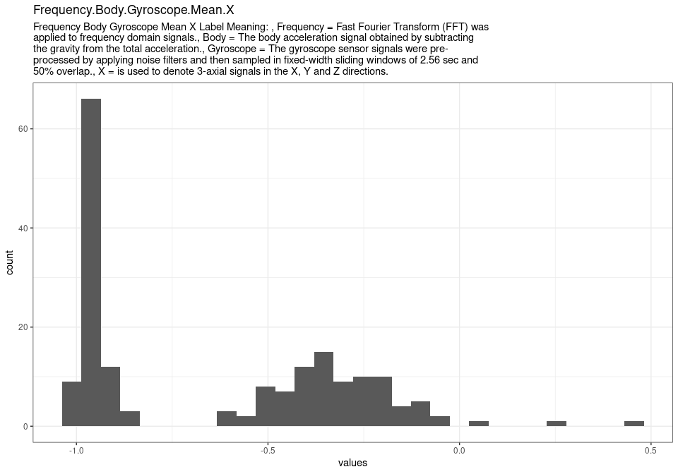

0 missing values.

#### Summary statistics {#Frequency_Body_Gyroscope_Mean_X_summary}

|name                            |label                           |data_type | n_missing| complete_rate|min   |median |max  |       mean|        sd|hist  |
|:-------------------------------|:-------------------------------|:---------|---------:|-------------:|:-----|:------|:----|----------:|---------:|:-----|
|Frequency.Body.Gyroscope.Mean.X |Frequency Body Gyroscope Mean X |numeric   |         0|             1|-0.99 |-0.73  |0.47 | -0.6367396| 0.3467628|▇▂▅▁▁ |


### Frequency.Body.Gyroscope.Mean.Y {#Frequency_Body_Gyroscope_Mean_Y .tabset}

Frequency Body Gyroscope Mean Y

#### Distribution {#Frequency_Body_Gyroscope_Mean_Y_distribution}

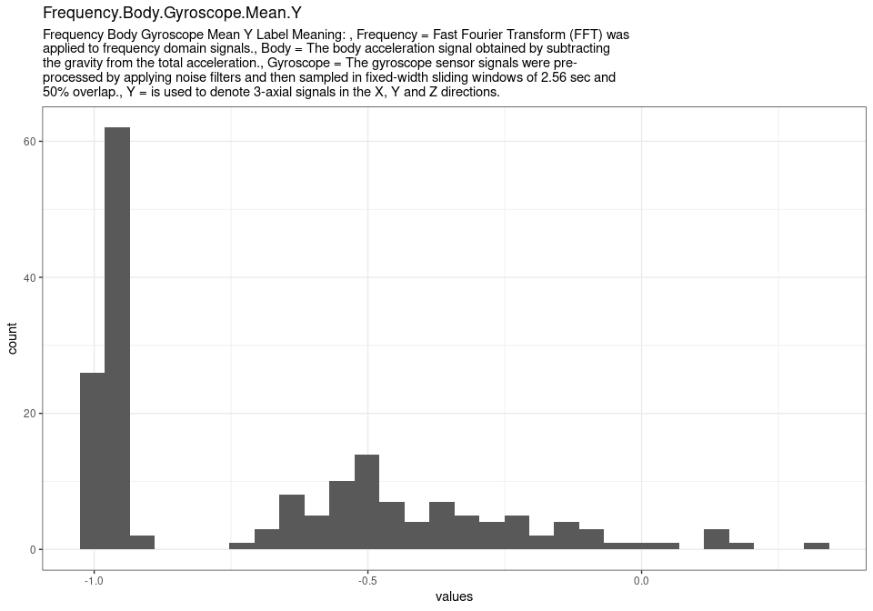

0 missing values.

#### Summary statistics {#Frequency_Body_Gyroscope_Mean_Y_summary}

|name                            |label                           |data_type | n_missing| complete_rate|min   |median |max  |       mean|        sd|hist  |
|:-------------------------------|:-------------------------------|:---------|---------:|-------------:|:-----|:------|:----|----------:|---------:|:-----|
|Frequency.Body.Gyroscope.Mean.Y |Frequency Body Gyroscope Mean Y |numeric   |         0|             1|-0.99 |-0.81  |0.33 | -0.6766868| 0.3319182|▇▃▃▁▁ |


### Frequency.Body.Gyroscope.Mean.Z {#Frequency_Body_Gyroscope_Mean_Z .tabset}

Frequency Body Gyroscope Mean Z

#### Distribution {#Frequency_Body_Gyroscope_Mean_Z_distribution}

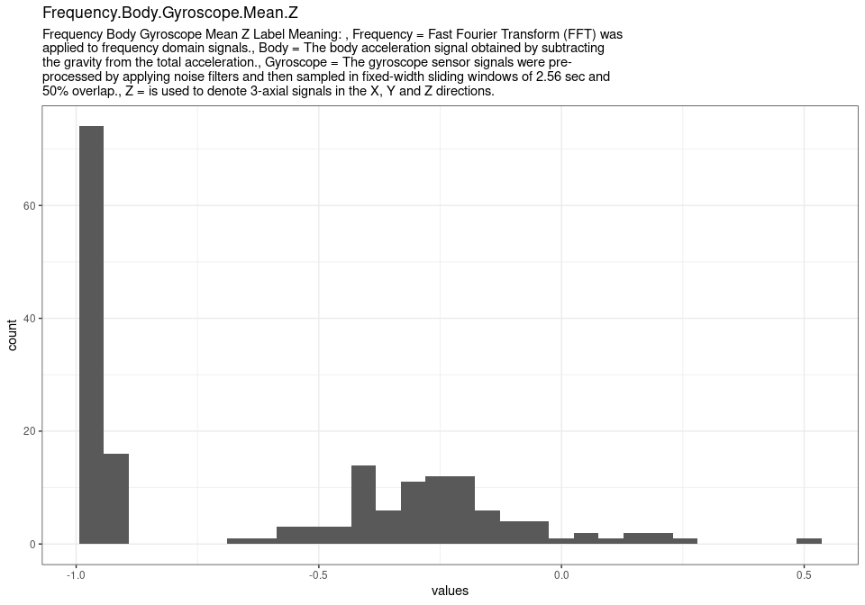

0 missing values.

#### Summary statistics {#Frequency_Body_Gyroscope_Mean_Z_summary}

|name                            |label                           |data_type | n_missing| complete_rate|min   |median |max  |       mean|        sd|hist  |
|:-------------------------------|:-------------------------------|:---------|---------:|-------------:|:-----|:------|:----|----------:|---------:|:-----|
|Frequency.Body.Gyroscope.Mean.Z |Frequency Body Gyroscope Mean Z |numeric   |         0|             1|-0.99 |-0.79  |0.49 | -0.6043912| 0.3842603|▇▂▅▁▁ |


### Frequency.Body.Gyroscope.Standard.Deviation.X {#Frequency_Body_Gyroscope_Standard_Deviation_X .tabset}

Frequency Body Gyroscope Standard Deviation X

#### Distribution {#Frequency_Body_Gyroscope_Standard_Deviation_X_distribution}

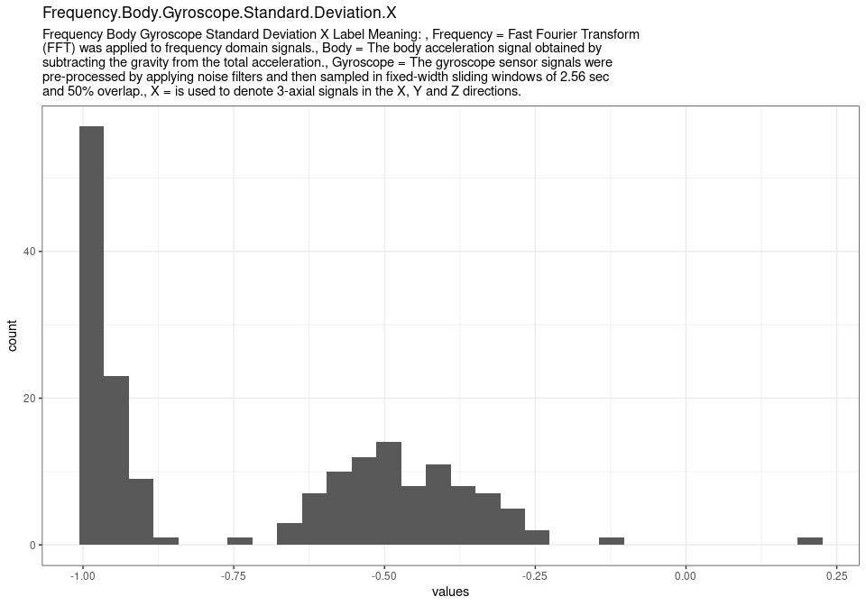

0 missing values.

#### Summary statistics {#Frequency_Body_Gyroscope_Standard_Deviation_X_summary}

|name                                          |label                                         |data_type | n_missing| complete_rate|min   |median |max |       mean|       sd|hist  |
|:---------------------------------------------|:---------------------------------------------|:---------|---------:|-------------:|:-----|:------|:---|----------:|--------:|:-----|
|Frequency.Body.Gyroscope.Standard.Deviation.X |Frequency Body Gyroscope Standard Deviation X |numeric   |         0|             1|-0.99 |-0.81  |0.2 | -0.7110357| 0.272789|▇▂▅▁▁ |


### Frequency.Body.Gyroscope.Standard.Deviation.Y {#Frequency_Body_Gyroscope_Standard_Deviation_Y .tabset}

Frequency Body Gyroscope Standard Deviation Y

#### Distribution {#Frequency_Body_Gyroscope_Standard_Deviation_Y_distribution}

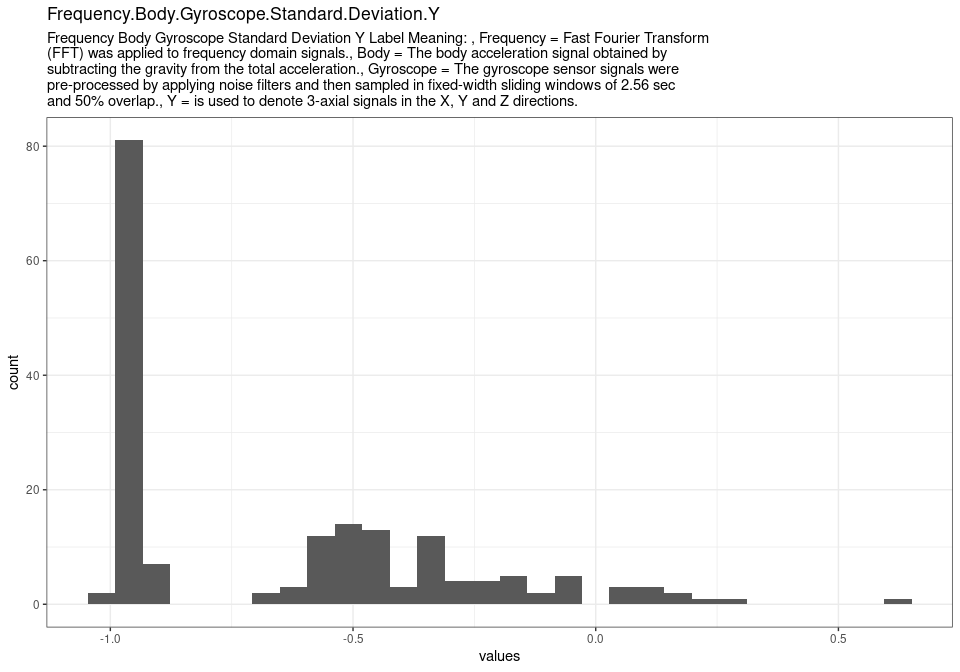

0 missing values.

#### Summary statistics {#Frequency_Body_Gyroscope_Standard_Deviation_Y_summary}

|name                                          |label                                         |data_type | n_missing| complete_rate|min   |median |max  |       mean|        sd|hist  |
|:---------------------------------------------|:---------------------------------------------|:---------|---------:|-------------:|:-----|:------|:----|----------:|---------:|:-----|
|Frequency.Body.Gyroscope.Standard.Deviation.Y |Frequency Body Gyroscope Standard Deviation Y |numeric   |         0|             1|-0.99 |-0.8   |0.65 | -0.6454334| 0.3634445|▇▅▂▁▁ |


### Frequency.Body.Gyroscope.Standard.Deviation.Z {#Frequency_Body_Gyroscope_Standard_Deviation_Z .tabset}

Frequency Body Gyroscope Standard Deviation Z

#### Distribution {#Frequency_Body_Gyroscope_Standard_Deviation_Z_distribution}

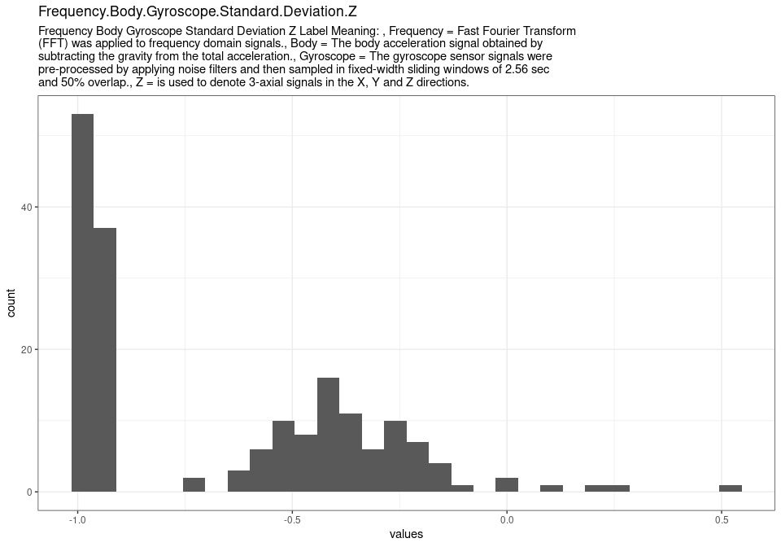

0 missing values.

#### Summary statistics {#Frequency_Body_Gyroscope_Standard_Deviation_Z_summary}

|name                                          |label                                         |data_type | n_missing| complete_rate|min   |median |max  |       mean|        sd|hist  |
|:---------------------------------------------|:---------------------------------------------|:---------|---------:|-------------:|:-----|:------|:----|----------:|---------:|:-----|
|Frequency.Body.Gyroscope.Standard.Deviation.Z |Frequency Body Gyroscope Standard Deviation Z |numeric   |         0|             1|-0.99 |-0.82  |0.52 | -0.6577466| 0.3362014|▇▃▃▁▁ |


### Frequency.Body.Gyroscope.Mean.Frequency.X {#Frequency_Body_Gyroscope_Mean_Frequency_X .tabset}

Frequency Body Gyroscope Mean Frequency X

#### Distribution {#Frequency_Body_Gyroscope_Mean_Frequency_X_distribution}

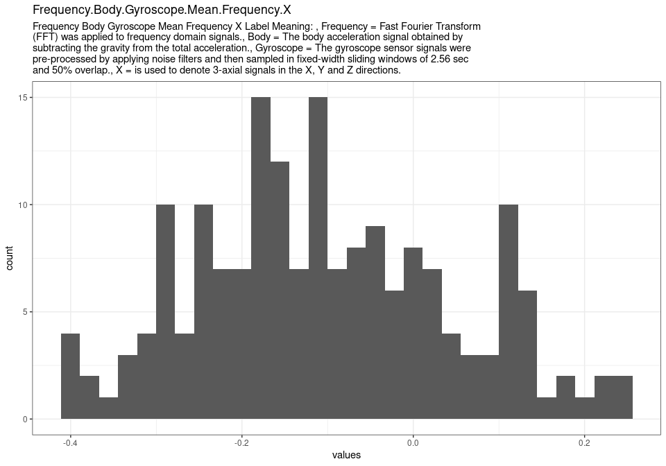

0 missing values.

#### Summary statistics {#Frequency_Body_Gyroscope_Mean_Frequency_X_summary}

|name                                      |label                                     |data_type | n_missing| complete_rate|min  |median |max  |      mean|        sd|hist  |
|:-----------------------------------------|:-----------------------------------------|:---------|---------:|-------------:|:----|:------|:----|---------:|---------:|:-----|
|Frequency.Body.Gyroscope.Mean.Frequency.X |Frequency Body Gyroscope Mean Frequency X |numeric   |         0|             1|-0.4 |-0.12  |0.25 | -0.104551| 0.1480975|▃▇▇▅▂ |


### Frequency.Body.Gyroscope.Mean.Frequency.Y {#Frequency_Body_Gyroscope_Mean_Frequency_Y .tabset}

Frequency Body Gyroscope Mean Frequency Y

#### Distribution {#Frequency_Body_Gyroscope_Mean_Frequency_Y_distribution}

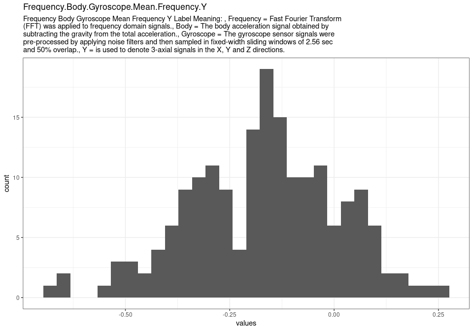

0 missing values.

#### Summary statistics {#Frequency_Body_Gyroscope_Mean_Frequency_Y_summary}

|name                                      |label                                     |data_type | n_missing| complete_rate|min   |median |max  |       mean|        sd|hist  |
|:-----------------------------------------|:-----------------------------------------|:---------|---------:|-------------:|:-----|:------|:----|----------:|---------:|:-----|
|Frequency.Body.Gyroscope.Mean.Frequency.Y |Frequency Body Gyroscope Mean Frequency Y |numeric   |         0|             1|-0.67 |-0.16  |0.27 | -0.1674075| 0.1788011|▁▅▇▆▂ |


### Frequency.Body.Gyroscope.Mean.Frequency.Z {#Frequency_Body_Gyroscope_Mean_Frequency_Z .tabset}

Frequency Body Gyroscope Mean Frequency Z

#### Distribution {#Frequency_Body_Gyroscope_Mean_Frequency_Z_distribution}

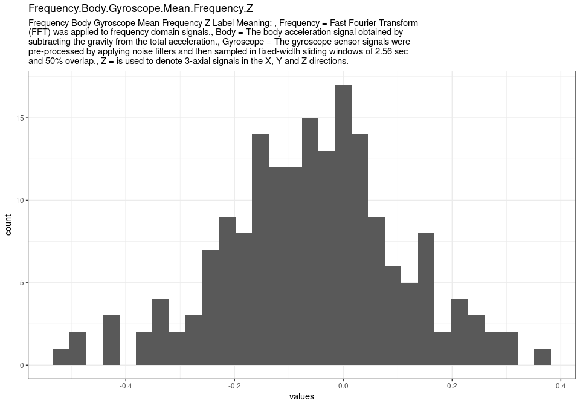

0 missing values.

#### Summary statistics {#Frequency_Body_Gyroscope_Mean_Frequency_Z_summary}

|name                                      |label                                     |data_type | n_missing| complete_rate|min   |median |max  |       mean|        sd|hist  |
|:-----------------------------------------|:-----------------------------------------|:---------|---------:|-------------:|:-----|:------|:----|----------:|---------:|:-----|
|Frequency.Body.Gyroscope.Mean.Frequency.Z |Frequency Body Gyroscope Mean Frequency Z |numeric   |         0|             1|-0.51 |-0.051 |0.38 | -0.0571809| 0.1652298|▁▃▇▃▁ |


### Frequency.Body.Accelerometer.Magnitude.Mean {#Frequency_Body_Accelerometer_Magnitude_Mean .tabset}

Frequency Body Accelerometer Magnitude Mean

#### Distribution {#Frequency_Body_Accelerometer_Magnitude_Mean_distribution}


0 missing values.

#### Summary statistics {#Frequency_Body_Accelerometer_Magnitude_Mean_summary}

|name                                        |label                                       |data_type | n_missing| complete_rate|min   |median |max  |       mean|        sd|hist  |
|:-------------------------------------------|:-------------------------------------------|:---------|---------:|-------------:|:-----|:------|:----|----------:|---------:|:-----|
|Frequency.Body.Accelerometer.Magnitude.Mean |Frequency Body Accelerometer Magnitude Mean |numeric   |         0|             1|-0.99 |-0.67  |0.59 | -0.5365167| 0.4516451|▇▂▃▂▁ |


### Frequency.Body.Accelerometer.Magnitude.Standard.Deviation {#Frequency_Body_Accelerometer_Magnitude_Standard_Deviation .tabset}

Frequency Body Accelerometer Magnitude Standard Deviation

#### Distribution {#Frequency_Body_Accelerometer_Magnitude_Standard_Deviation_distribution}


0 missing values.

#### Summary statistics {#Frequency_Body_Accelerometer_Magnitude_Standard_Deviation_summary}

|name                                                      |label                                                     |data_type | n_missing| complete_rate|min   |median |max  |       mean|        sd|hist  |
|:---------------------------------------------------------|:---------------------------------------------------------|:---------|---------:|-------------:|:-----|:------|:----|----------:|---------:|:-----|
|Frequency.Body.Accelerometer.Magnitude.Standard.Deviation |Frequency Body Accelerometer Magnitude Standard Deviation |numeric   |         0|             1|-0.99 |-0.65  |0.18 | -0.6209633| 0.3529148|▇▁▃▂▁ |


### Frequency.Body.Accelerometer.Magnitude.Mean.Frequency {#Frequency_Body_Accelerometer_Magnitude_Mean_Frequency .tabset}

Frequency Body Accelerometer Magnitude Mean Frequency

#### Distribution {#Frequency_Body_Accelerometer_Magnitude_Mean_Frequency_distribution}


0 missing values.

#### Summary statistics {#Frequency_Body_Accelerometer_Magnitude_Mean_Frequency_summary}

|name                                                  |label                                                 |data_type | n_missing| complete_rate|min   |median |max  |      mean|        sd|hist  |
|:-----------------------------------------------------|:-----------------------------------------------------|:---------|---------:|-------------:|:-----|:------|:----|---------:|---------:|:-----|
|Frequency.Body.Accelerometer.Magnitude.Mean.Frequency |Frequency Body Accelerometer Magnitude Mean Frequency |numeric   |         0|             1|-0.31 |0.081  |0.44 | 0.0761282| 0.1404479|▁▅▇▅▁ |


### Frequency.Body.Accelerometer.Jerk.Magnitude.Mean {#Frequency_Body_Accelerometer_Jerk_Magnitude_Mean .tabset}

Frequency Body Accelerometer Jerk Magnitude Mean

#### Distribution {#Frequency_Body_Accelerometer_Jerk_Magnitude_Mean_distribution}


0 missing values.

#### Summary statistics {#Frequency_Body_Accelerometer_Jerk_Magnitude_Mean_summary}

|name                                             |label                                            |data_type | n_missing| complete_rate|min   |median |max  |       mean|        sd|hist  |
|:------------------------------------------------|:------------------------------------------------|:---------|---------:|-------------:|:-----|:------|:----|----------:|---------:|:-----|
|Frequency.Body.Accelerometer.Jerk.Magnitude.Mean |Frequency Body Accelerometer Jerk Magnitude Mean |numeric   |         0|             1|-0.99 |-0.79  |0.54 | -0.5756175| 0.4312321|▇▂▃▂▁ |


### Frequency.Body.Accelerometer.Jerk.Magnitude.Standard.Deviation {#Frequency_Body_Accelerometer_Jerk_Magnitude_Standard_Deviation .tabset}

Frequency Body Accelerometer Jerk Magnitude Standard Deviation

#### Distribution {#Frequency_Body_Accelerometer_Jerk_Magnitude_Standard_Deviation_distribution}


0 missing values.

#### Summary statistics {#Frequency_Body_Accelerometer_Jerk_Magnitude_Standard_Deviation_summary}

|name                                                           |label                                                          |data_type | n_missing| complete_rate|min   |median |max  |       mean|        sd|hist  |
|:--------------------------------------------------------------|:--------------------------------------------------------------|:---------|---------:|-------------:|:-----|:------|:----|----------:|---------:|:-----|
|Frequency.Body.Accelerometer.Jerk.Magnitude.Standard.Deviation |Frequency Body Accelerometer Jerk Magnitude Standard Deviation |numeric   |         0|             1|-0.99 |-0.81  |0.32 | -0.5991609| 0.4086668|▇▁▃▂▁ |


### Frequency.Body.Accelerometer.Jerk.Magnitude.Mean.Frequency {#Frequency_Body_Accelerometer_Jerk_Magnitude_Mean_Frequency .tabset}

Frequency Body Accelerometer Jerk Magnitude Mean Frequency

#### Distribution {#Frequency_Body_Accelerometer_Jerk_Magnitude_Mean_Frequency_distribution}


0 missing values.

#### Summary statistics {#Frequency_Body_Accelerometer_Jerk_Magnitude_Mean_Frequency_summary}

|name                                                       |label                                                      |data_type | n_missing| complete_rate|min   |median |max  |      mean|      sd|hist  |
|:----------------------------------------------------------|:----------------------------------------------------------|:---------|---------:|-------------:|:-----|:------|:----|---------:|-------:|:-----|
|Frequency.Body.Accelerometer.Jerk.Magnitude.Mean.Frequency |Frequency Body Accelerometer Jerk Magnitude Mean Frequency |numeric   |         0|             1|-0.13 |0.17   |0.49 | 0.1625459| 0.13783|▃▇▇▇▂ |


### Frequency.Body.Gyroscope.Magnitude.Mean {#Frequency_Body_Gyroscope_Magnitude_Mean .tabset}

Frequency Body Gyroscope Magnitude Mean

#### Distribution {#Frequency_Body_Gyroscope_Magnitude_Mean_distribution}

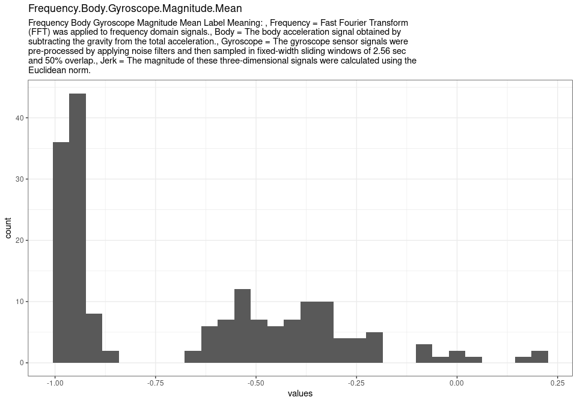

0 missing values.

#### Summary statistics {#Frequency_Body_Gyroscope_Magnitude_Mean_summary}

|name                                    |label                                   |data_type | n_missing| complete_rate|min   |median |max |       mean|        sd|hist  |
|:---------------------------------------|:---------------------------------------|:---------|---------:|-------------:|:-----|:------|:---|----------:|---------:|:-----|
|Frequency.Body.Gyroscope.Magnitude.Mean |Frequency Body Gyroscope Magnitude Mean |numeric   |         0|             1|-0.99 |-0.77  |0.2 | -0.6670991| 0.3181183|▇▂▃▁▁ |


### Frequency.Body.Gyroscope.Magnitude.Standard.Deviation {#Frequency_Body_Gyroscope_Magnitude_Standard_Deviation .tabset}

Frequency Body Gyroscope Magnitude Standard Deviation

#### Distribution {#Frequency_Body_Gyroscope_Magnitude_Standard_Deviation_distribution}

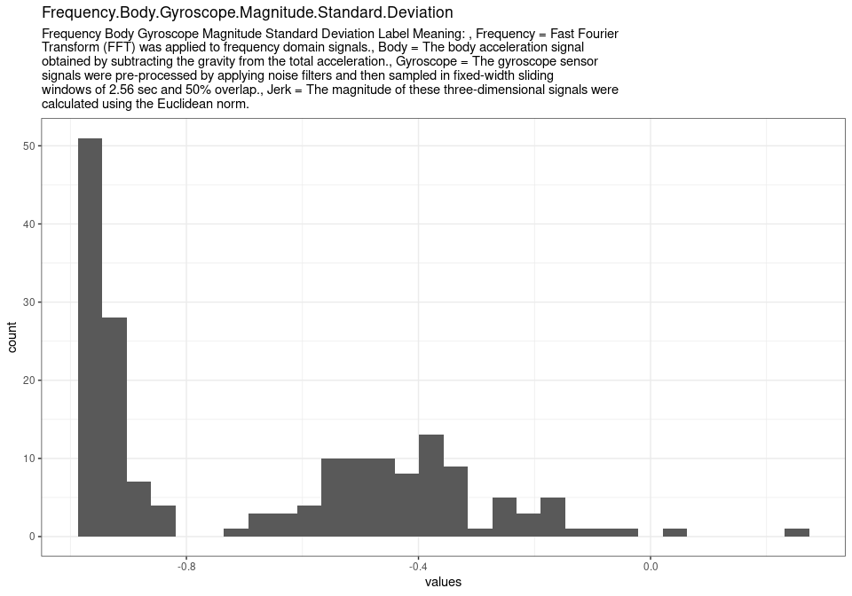

0 missing values.

#### Summary statistics {#Frequency_Body_Gyroscope_Magnitude_Standard_Deviation_summary}

|name                                                  |label                                                 |data_type | n_missing| complete_rate|min   |median |max  |       mean|        sd|hist  |
|:-----------------------------------------------------|:-----------------------------------------------------|:---------|---------:|-------------:|:-----|:------|:----|----------:|---------:|:-----|
|Frequency.Body.Gyroscope.Magnitude.Standard.Deviation |Frequency Body Gyroscope Magnitude Standard Deviation |numeric   |         0|             1|-0.98 |-0.77  |0.24 | -0.6723223| 0.2931842|▇▂▅▁▁ |


### Frequency.Body.Gyroscope.Magnitude.Mean.Frequency {#Frequency_Body_Gyroscope_Magnitude_Mean_Frequency .tabset}

Frequency Body Gyroscope Magnitude Mean Frequency

#### Distribution {#Frequency_Body_Gyroscope_Magnitude_Mean_Frequency_distribution}

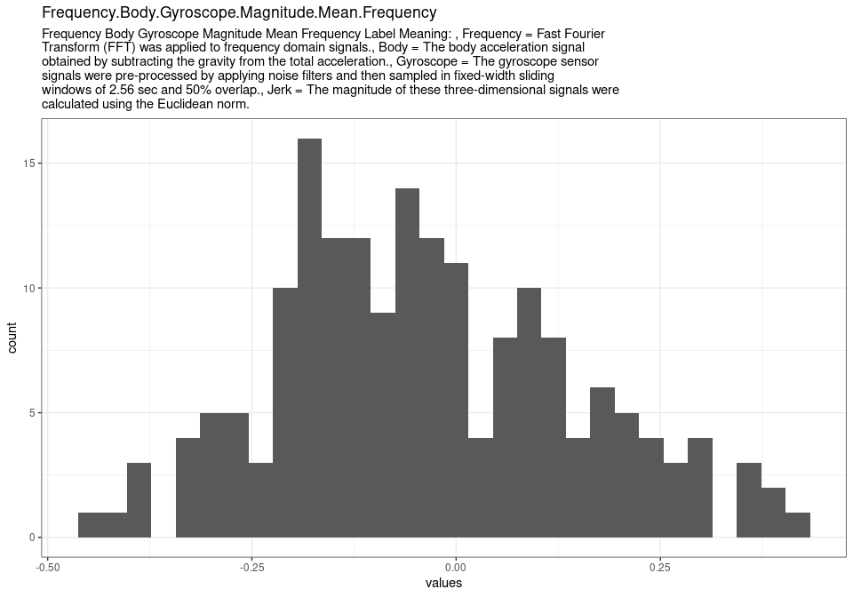

0 missing values.

#### Summary statistics {#Frequency_Body_Gyroscope_Magnitude_Mean_Frequency_summary}

|name                                              |label                                             |data_type | n_missing| complete_rate|min   |median |max  |       mean|        sd|hist  |
|:-------------------------------------------------|:-------------------------------------------------|:---------|---------:|-------------:|:-----|:------|:----|----------:|---------:|:-----|
|Frequency.Body.Gyroscope.Magnitude.Mean.Frequency |Frequency Body Gyroscope Magnitude Mean Frequency |numeric   |         0|             1|-0.46 |-0.054 |0.41 | -0.0360322| 0.1807351|▂▇▇▅▂ |


### Frequency.Body.Gyroscope.Jerk.Magnitude.Mean {#Frequency_Body_Gyroscope_Jerk_Magnitude_Mean .tabset}

Frequency Body Gyroscope Jerk Magnitude Mean

#### Distribution {#Frequency_Body_Gyroscope_Jerk_Magnitude_Mean_distribution}

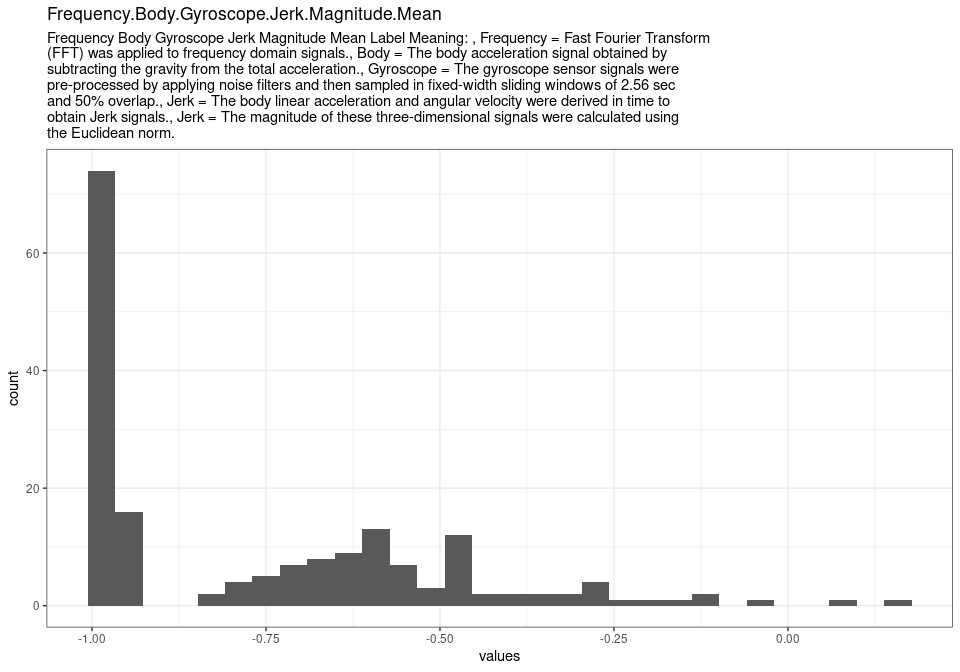

0 missing values.

#### Summary statistics {#Frequency_Body_Gyroscope_Jerk_Magnitude_Mean_summary}

|name                                         |label                                        |data_type | n_missing| complete_rate|min |median |max  |       mean|        sd|hist  |
|:--------------------------------------------|:--------------------------------------------|:---------|---------:|-------------:|:---|:------|:----|----------:|---------:|:-----|
|Frequency.Body.Gyroscope.Jerk.Magnitude.Mean |Frequency Body Gyroscope Jerk Magnitude Mean |numeric   |         0|             1|-1  |-0.88  |0.15 | -0.7563853| 0.2628722|▇▅▂▁▁ |


### Frequency.Body.Gyroscope.Jerk.Magnitude.Standard.Deviation {#Frequency_Body_Gyroscope_Jerk_Magnitude_Standard_Deviation .tabset}

Frequency Body Gyroscope Jerk Magnitude Standard Deviation

#### Distribution {#Frequency_Body_Gyroscope_Jerk_Magnitude_Standard_Deviation_distribution}


0 missing values.

#### Summary statistics {#Frequency_Body_Gyroscope_Jerk_Magnitude_Standard_Deviation_summary}

|name                                                       |label                                                      |data_type | n_missing| complete_rate|min |median |max  |       mean|        sd|hist  |
|:----------------------------------------------------------|:----------------------------------------------------------|:---------|---------:|-------------:|:---|:------|:----|----------:|---------:|:-----|
|Frequency.Body.Gyroscope.Jerk.Magnitude.Standard.Deviation |Frequency Body Gyroscope Jerk Magnitude Standard Deviation |numeric   |         0|             1|-1  |-0.89  |0.29 | -0.7715171| 0.2504248|▇▃▁▁▁ |


### Frequency.Body.Gyroscope.Jerk.Magnitude.Mean.Frequency {#Frequency_Body_Gyroscope_Jerk_Magnitude_Mean_Frequency .tabset}

Frequency Body Gyroscope Jerk Magnitude Mean Frequency

#### Distribution {#Frequency_Body_Gyroscope_Jerk_Magnitude_Mean_Frequency_distribution}

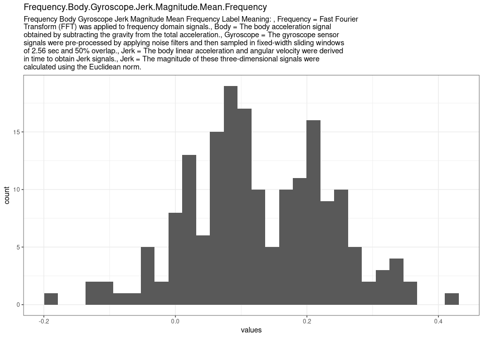

0 missing values.

#### Summary statistics {#Frequency_Body_Gyroscope_Jerk_Magnitude_Mean_Frequency_summary}

|name                                                   |label                                                  |data_type | n_missing| complete_rate|min   |median |max  |      mean|        sd|hist  |
|:------------------------------------------------------|:------------------------------------------------------|:---------|---------:|-------------:|:-----|:------|:----|---------:|---------:|:-----|
|Frequency.Body.Gyroscope.Jerk.Magnitude.Mean.Frequency |Frequency Body Gyroscope Jerk Magnitude Mean Frequency |numeric   |         0|             1|-0.18 |0.11   |0.43 | 0.1259225| 0.1083232|▁▅▇▆▁ |


### Angle.Time.Body.Accelerometer.Mean.Gravity {#Angle_Time_Body_Accelerometer_Mean_Gravity .tabset}

Angle Time Body Accelerometer Mean Gravity

#### Distribution {#Angle_Time_Body_Accelerometer_Mean_Gravity_distribution}


0 missing values.

#### Summary statistics {#Angle_Time_Body_Accelerometer_Mean_Gravity_summary}

|name                                       |label                                      |data_type | n_missing| complete_rate|min   |median |max  |      mean|        sd|hist  |
|:------------------------------------------|:------------------------------------------|:---------|---------:|-------------:|:-----|:------|:----|---------:|---------:|:-----|
|Angle.Time.Body.Accelerometer.Mean.Gravity |Angle Time Body Accelerometer Mean Gravity |numeric   |         0|             1|-0.16 |0.0079 |0.13 | 0.0065557| 0.0396044|▁▁▇▇▁ |


### Angle.Time.Body.Accelerometer.Jerk.Mean.Gravity.Mean {#Angle_Time_Body_Accelerometer_Jerk_Mean_Gravity_Mean .tabset}

Angle Time Body Accelerometer Jerk Mean Gravity Mean

#### Distribution {#Angle_Time_Body_Accelerometer_Jerk_Mean_Gravity_Mean_distribution}


0 missing values.

#### Summary statistics {#Angle_Time_Body_Accelerometer_Jerk_Mean_Gravity_Mean_summary}

|name                                                 |label                                                |data_type | n_missing| complete_rate|min   |median |max |      mean|        sd|hist  |
|:----------------------------------------------------|:----------------------------------------------------|:---------|---------:|-------------:|:-----|:------|:---|---------:|---------:|:-----|
|Angle.Time.Body.Accelerometer.Jerk.Mean.Gravity.Mean |Angle Time Body Accelerometer Jerk Mean Gravity Mean |numeric   |         0|             1|-0.12 |0.0031 |0.2 | 0.0006439| 0.0427632|▂▇▆▁▁ |


### Angle.Time.Body.Gyroscope.Mean.Gravity.Mean {#Angle_Time_Body_Gyroscope_Mean_Gravity_Mean .tabset}

Angle Time Body Gyroscope Mean Gravity Mean

#### Distribution {#Angle_Time_Body_Gyroscope_Mean_Gravity_Mean_distribution}

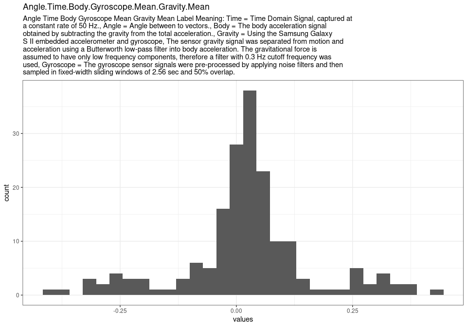

0 missing values.

#### Summary statistics {#Angle_Time_Body_Gyroscope_Mean_Gravity_Mean_summary}

|name                                        |label                                       |data_type | n_missing| complete_rate|min   |median |max  |      mean|        sd|hist  |
|:-------------------------------------------|:-------------------------------------------|:---------|---------:|-------------:|:-----|:------|:----|---------:|---------:|:-----|
|Angle.Time.Body.Gyroscope.Mean.Gravity.Mean |Angle Time Body Gyroscope Mean Gravity Mean |numeric   |         0|             1|-0.39 |0.021  |0.44 | 0.0219317| 0.1401276|▁▁▇▁▁ |


### Angle.Time.Body.Gyroscope.Jerk.Mean.Gravity.Mean {#Angle_Time_Body_Gyroscope_Jerk_Mean_Gravity_Mean .tabset}

Angle Time Body Gyroscope Jerk Mean Gravity Mean

#### Distribution {#Angle_Time_Body_Gyroscope_Jerk_Mean_Gravity_Mean_distribution}

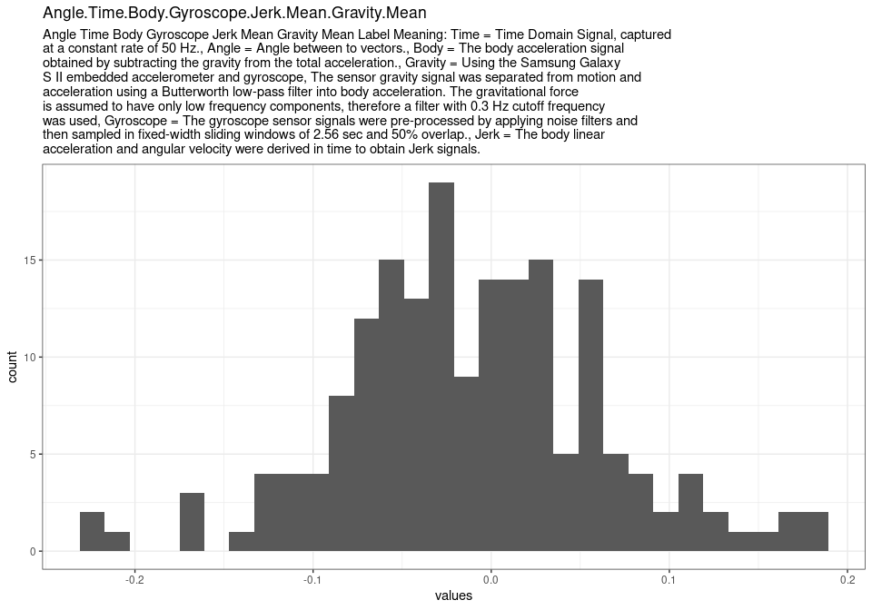

0 missing values.

#### Summary statistics {#Angle_Time_Body_Gyroscope_Jerk_Mean_Gravity_Mean_summary}

|name                                             |label                                            |data_type | n_missing| complete_rate|min   |median |max  |       mean|        sd|hist  |
|:------------------------------------------------|:------------------------------------------------|:---------|---------:|-------------:|:-----|:------|:----|----------:|---------:|:-----|
|Angle.Time.Body.Gyroscope.Jerk.Mean.Gravity.Mean |Angle Time Body Gyroscope Jerk Mean Gravity Mean |numeric   |         0|             1|-0.22 |-0.016 |0.18 | -0.0113732| 0.0729629|▁▃▇▅▁ |


### Angle.X.Gravity.Mean {#Angle_X_Gravity_Mean .tabset}

Angle X Gravity Mean

#### Distribution {#Angle_X_Gravity_Mean_distribution}

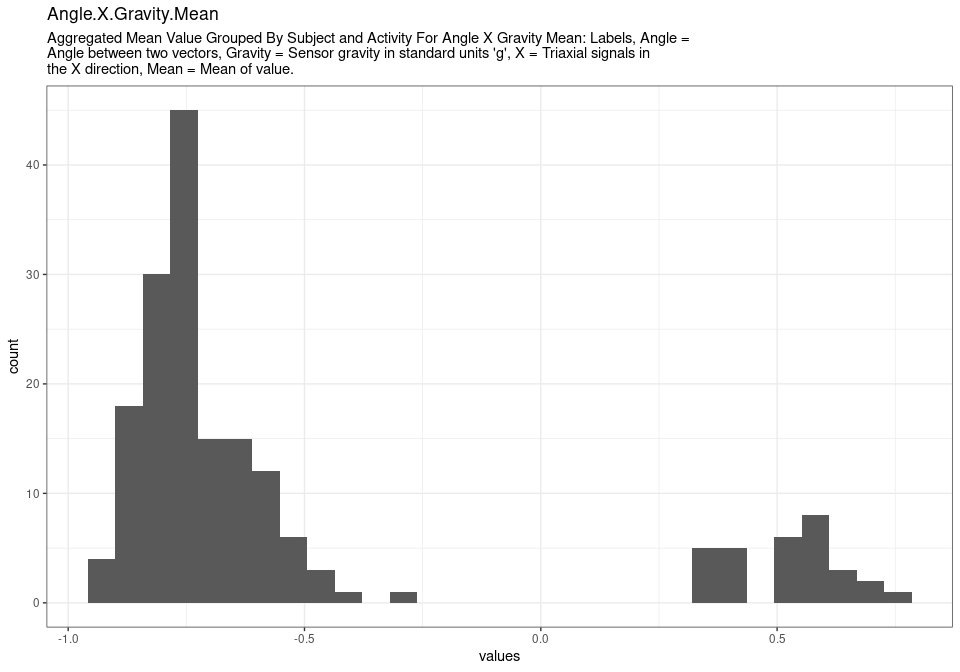

0 missing values.

#### Summary statistics {#Angle_X_Gravity_Mean_summary}

|name                 |label                |data_type | n_missing| complete_rate|min   |median |max  |       mean|       sd|hist  |
|:--------------------|:--------------------|:---------|---------:|-------------:|:-----|:------|:----|----------:|--------:|:-----|
|Angle.X.Gravity.Mean |Angle X Gravity Mean |numeric   |         0|             1|-0.95 |-0.74  |0.74 | -0.5243065| 0.481228|▇▂▁▁▂ |


### Angle.Y.Gravity.Mean {#Angle_Y_Gravity_Mean .tabset}

Angle Y Gravity Mean

#### Distribution {#Angle_Y_Gravity_Mean_distribution}

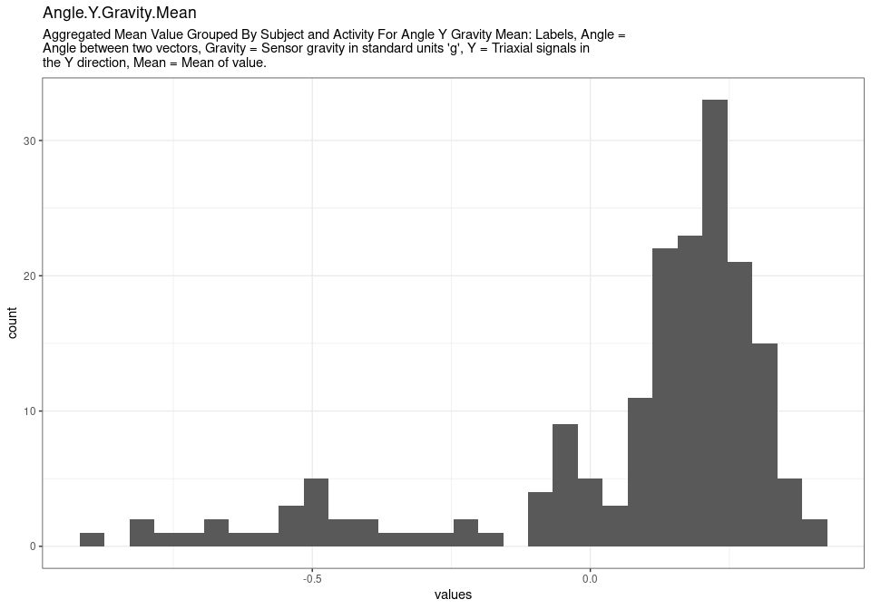

0 missing values.

#### Summary statistics {#Angle_Y_Gravity_Mean_summary}

|name                 |label                |data_type | n_missing| complete_rate|min   |median |max  |      mean|        sd|hist  |
|:--------------------|:--------------------|:---------|---------:|-------------:|:-----|:------|:----|---------:|---------:|:-----|
|Angle.Y.Gravity.Mean |Angle Y Gravity Mean |numeric   |         0|             1|-0.87 |0.17   |0.42 | 0.0786534| 0.2784784|▁▁▁▅▇ |


### Angle.Z.Gravity.Mean {#Angle_Z_Gravity_Mean .tabset}

Angle Z Gravity Mean

#### Distribution {#Angle_Z_Gravity_Mean_distribution}

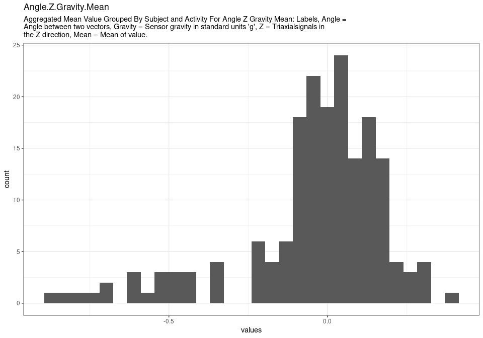

0 missing values.

#### Summary statistics {#Angle_Z_Gravity_Mean_summary}

|name                 |label                |data_type | n_missing| complete_rate|min   |median |max  |       mean|        sd|hist  |
|:--------------------|:--------------------|:---------|---------:|-------------:|:-----|:------|:----|----------:|---------:|:-----|
|Angle.Z.Gravity.Mean |Angle Z Gravity Mean |numeric   |         0|             1|-0.87 |0.0051 |0.39 | -0.0404362| 0.2308332|▁▁▁▇▂ |


## Missingness report


## Codebook table


|name                                                                                                                                         |label                                                          |data_type | n_missing| complete_rate| n_unique| empty|min    |median  |max     |       mean|        sd| whitespace|hist  |
|:--------------------------------------------------------------------------------------------------------------------------------------------|:--------------------------------------------------------------|:---------|---------:|-------------:|--------:|-----:|:------|:-------|:-------|----------:|---------:|----------:|:-----|
|<a href="#subject">subject</a>                                                                                                               |subject                                                        |numeric   |         0|             1|       NA|    NA|1.000  |15.5000 |30.0000 | 15.5000000| 8.6795850|         NA|▇▇▇▇▇ |
|<a href="#activity">activity</a>                                                                                                             |activity                                                       |character |         0|             1|        6|     0|6      |NA      |18      |         NA|        NA|          0|NA    |
|<a href="#Time_Body_Accelerometer_Mean_X">Time.Body.Accelerometer.Mean.X</a>                                                                 |Time Body Accelerometer Mean X                                 |numeric   |         0|             1|       NA|    NA|0.222  |0.2770  |0.3015  |  0.2743027| 0.0121646|         NA|▁▁▂▇▂ |
|<a href="#Time_Body_Accelerometer_Mean_Y">Time.Body.Accelerometer.Mean.Y</a>                                                                 |Time Body Accelerometer Mean Y                                 |numeric   |         0|             1|       NA|    NA|-0.041 |-0.0173 |-0.0013 | -0.0178755| 0.0057712|         NA|▁▂▇▇▁ |
|<a href="#Time_Body_Accelerometer_Mean_Z">Time.Body.Accelerometer.Mean.Z</a>                                                                 |Time Body Accelerometer Mean Z                                 |numeric   |         0|             1|       NA|    NA|-0.153 |-0.1082 |-0.0754 | -0.1091638| 0.0095820|         NA|▁▁▇▅▁ |
|<a href="#Time_Body_Accelerometer_Standard_Deviation_X">Time.Body.Accelerometer.Standard.Deviation.X</a>                                     |Time Body Accelerometer Standard Deviation X                   |numeric   |         0|             1|       NA|    NA|-0.996 |-0.7526 |0.6269  | -0.5576901| 0.4516911|         NA|▇▂▅▂▁ |
|<a href="#Time_Body_Accelerometer_Standard_Deviation_Y">Time.Body.Accelerometer.Standard.Deviation.Y</a>                                     |Time Body Accelerometer Standard Deviation Y                   |numeric   |         0|             1|       NA|    NA|-0.990 |-0.5090 |0.6169  | -0.4604626| 0.4965650|         NA|▇▁▅▃▁ |
|<a href="#Time_Body_Accelerometer_Standard_Deviation_Z">Time.Body.Accelerometer.Standard.Deviation.Z</a>                                     |Time Body Accelerometer Standard Deviation Z                   |numeric   |         0|             1|       NA|    NA|-0.988 |-0.6518 |0.6090  | -0.5755602| 0.3955439|         NA|▇▂▅▁▁ |
|<a href="#Time_Gravity_Accelerometer_Mean_X">Time.Gravity.Accelerometer.Mean.X</a>                                                           |Time Gravity Accelerometer Mean X                              |numeric   |         0|             1|       NA|    NA|-0.680 |0.9208  |0.9745  |  0.6974775| 0.4872534|         NA|▁▁▁▁▇ |
|<a href="#Time_Gravity_Accelerometer_Mean_Y">Time.Gravity.Accelerometer.Mean.Y</a>                                                           |Time Gravity Accelerometer Mean Y                              |numeric   |         0|             1|       NA|    NA|-0.480 |-0.1278 |0.9566  | -0.0162128| 0.3452376|         NA|▇▇▂▁▂ |
|<a href="#Time_Gravity_Accelerometer_Mean_Z">Time.Gravity.Accelerometer.Mean.Z</a>                                                           |Time Gravity Accelerometer Mean Z                              |numeric   |         0|             1|       NA|    NA|-0.495 |0.0238  |0.9579  |  0.0741279| 0.2887919|         NA|▂▇▃▁▁ |
|<a href="#Time_Gravity_Accelerometer_Standard_Deviation_X">Time.Gravity.Accelerometer.Standard.Deviation.X</a>                               |Time Gravity Accelerometer Standard Deviation X                |numeric   |         0|             1|       NA|    NA|-0.997 |-0.9695 |-0.8296 | -0.9637525| 0.0250344|         NA|▇▆▁▁▁ |
|<a href="#Time_Gravity_Accelerometer_Standard_Deviation_Y">Time.Gravity.Accelerometer.Standard.Deviation.Y</a>                               |Time Gravity Accelerometer Standard Deviation Y                |numeric   |         0|             1|       NA|    NA|-0.994 |-0.9590 |-0.6436 | -0.9524296| 0.0326557|         NA|▇▁▁▁▁ |
|<a href="#Time_Gravity_Accelerometer_Standard_Deviation_Z">Time.Gravity.Accelerometer.Standard.Deviation.Z</a>                               |Time Gravity Accelerometer Standard Deviation Z                |numeric   |         0|             1|       NA|    NA|-0.991 |-0.9450 |-0.6102 | -0.9364010| 0.0402912|         NA|▇▂▁▁▁ |
|<a href="#Time_Body_Accelerometer_Jerk_Mean_X">Time.Body.Accelerometer.Jerk.Mean.X</a>                                                       |Time Body Accelerometer Jerk Mean X                            |numeric   |         0|             1|       NA|    NA|0.043  |0.0764  |0.1302  |  0.0794736| 0.0125880|         NA|▁▇▃▂▁ |
|<a href="#Time_Body_Accelerometer_Jerk_Mean_Y">Time.Body.Accelerometer.Jerk.Mean.Y</a>                                                       |Time Body Accelerometer Jerk Mean Y                            |numeric   |         0|             1|       NA|    NA|-0.039 |0.0095  |0.0568  |  0.0075652| 0.0135764|         NA|▁▃▇▂▁ |
|<a href="#Time_Body_Accelerometer_Jerk_Mean_Z">Time.Body.Accelerometer.Jerk.Mean.Z</a>                                                       |Time Body Accelerometer Jerk Mean Z                            |numeric   |         0|             1|       NA|    NA|-0.067 |-0.0039 |0.0381  | -0.0049534| 0.0134621|         NA|▁▁▇▇▁ |
|<a href="#Time_Body_Accelerometer_Jerk_Standard_Deviation_X">Time.Body.Accelerometer.Jerk.Standard.Deviation.X</a>                           |Time Body Accelerometer Jerk Standard Deviation X              |numeric   |         0|             1|       NA|    NA|-0.995 |-0.8104 |0.5443  | -0.5949467| 0.4175865|         NA|▇▂▅▂▁ |
|<a href="#Time_Body_Accelerometer_Jerk_Standard_Deviation_Y">Time.Body.Accelerometer.Jerk.Standard.Deviation.Y</a>                           |Time Body Accelerometer Jerk Standard Deviation Y              |numeric   |         0|             1|       NA|    NA|-0.990 |-0.7756 |0.3553  | -0.5654147| 0.4330871|         NA|▇▁▃▃▁ |
|<a href="#Time_Body_Accelerometer_Jerk_Standard_Deviation_Z">Time.Body.Accelerometer.Jerk.Standard.Deviation.Z</a>                           |Time Body Accelerometer Jerk Standard Deviation Z              |numeric   |         0|             1|       NA|    NA|-0.993 |-0.8837 |0.0310  | -0.7359577| 0.2768479|         NA|▇▂▃▁▁ |
|<a href="#Time_Body_Gyroscope_Mean_X">Time.Body.Gyroscope.Mean.X</a>                                                                         |Time Body Gyroscope Mean X                                     |numeric   |         0|             1|       NA|    NA|-0.206 |-0.0287 |0.1927  | -0.0324372| 0.0540518|         NA|▁▂▇▁▁ |
|<a href="#Time_Body_Gyroscope_Mean_Y">Time.Body.Gyroscope.Mean.Y</a>                                                                         |Time Body Gyroscope Mean Y                                     |numeric   |         0|             1|       NA|    NA|-0.204 |-0.0732 |0.0275  | -0.0742596| 0.0355415|         NA|▁▁▇▃▁ |
|<a href="#Time_Body_Gyroscope_Mean_Z">Time.Body.Gyroscope.Mean.Z</a>                                                                         |Time Body Gyroscope Mean Z                                     |numeric   |         0|             1|       NA|    NA|-0.072 |0.0851  |0.1791  |  0.0874446| 0.0362125|         NA|▁▁▃▇▂ |
|<a href="#Time_Body_Gyroscope_Standard_Deviation_X">Time.Body.Gyroscope.Standard.Deviation.X</a>                                             |Time Body Gyroscope Standard Deviation X                       |numeric   |         0|             1|       NA|    NA|-0.994 |-0.7890 |0.2677  | -0.6916399| 0.2910189|         NA|▇▃▅▁▁ |
|<a href="#Time_Body_Gyroscope_Standard_Deviation_Y">Time.Body.Gyroscope.Standard.Deviation.Y</a>                                             |Time Body Gyroscope Standard Deviation Y                       |numeric   |         0|             1|       NA|    NA|-0.994 |-0.8017 |0.4765  | -0.6533020| 0.3520252|         NA|▇▅▂▁▁ |
|<a href="#Time_Body_Gyroscope_Standard_Deviation_Z">Time.Body.Gyroscope.Standard.Deviation.Z</a>                                             |Time Body Gyroscope Standard Deviation Z                       |numeric   |         0|             1|       NA|    NA|-0.986 |-0.8010 |0.5649  | -0.6164353| 0.3730264|         NA|▇▂▅▁▁ |
|<a href="#Time_Body_Gyroscope_Jerk_Mean_X">Time.Body.Gyroscope.Jerk.Mean.X</a>                                                               |Time Body Gyroscope Jerk Mean X                                |numeric   |         0|             1|       NA|    NA|-0.157 |-0.0987 |-0.0221 | -0.0960568| 0.0233458|         NA|▁▂▇▁▁ |
|<a href="#Time_Body_Gyroscope_Jerk_Mean_Y">Time.Body.Gyroscope.Jerk.Mean.Y</a>                                                               |Time Body Gyroscope Jerk Mean Y                                |numeric   |         0|             1|       NA|    NA|-0.077 |-0.0411 |-0.0132 | -0.0426928| 0.0095320|         NA|▁▂▇▃▁ |
|<a href="#Time_Body_Gyroscope_Jerk_Mean_Z">Time.Body.Gyroscope.Jerk.Mean.Z</a>                                                               |Time Body Gyroscope Jerk Mean Z                                |numeric   |         0|             1|       NA|    NA|-0.092 |-0.0534 |-0.0069 | -0.0548019| 0.0123470|         NA|▁▅▇▁▁ |
|<a href="#Time_Body_Gyroscope_Jerk_Standard_Deviation_X">Time.Body.Gyroscope.Jerk.Standard.Deviation.X</a>                                   |Time Body Gyroscope Jerk Standard Deviation X                  |numeric   |         0|             1|       NA|    NA|-0.997 |-0.8396 |0.1791  | -0.7036327| 0.3008361|         NA|▇▂▃▂▁ |
|<a href="#Time_Body_Gyroscope_Jerk_Standard_Deviation_Y">Time.Body.Gyroscope.Jerk.Standard.Deviation.Y</a>                                   |Time Body Gyroscope Jerk Standard Deviation Y                  |numeric   |         0|             1|       NA|    NA|-0.997 |-0.8942 |0.2959  | -0.7635518| 0.2672885|         NA|▇▃▂▁▁ |
|<a href="#Time_Body_Gyroscope_Jerk_Standard_Deviation_Z">Time.Body.Gyroscope.Jerk.Standard.Deviation.Z</a>                                   |Time Body Gyroscope Jerk Standard Deviation Z                  |numeric   |         0|             1|       NA|    NA|-0.995 |-0.8610 |0.1932  | -0.7095592| 0.3045394|         NA|▇▃▃▁▁ |
|<a href="#Time_Body_Accelerometer_Magnitude_Mean">Time.Body.Accelerometer.Magnitude.Mean</a>                                                 |Time Body Accelerometer Magnitude Mean                         |numeric   |         0|             1|       NA|    NA|-0.986 |-0.4829 |0.6446  | -0.4972897| 0.4728834|         NA|▇▁▅▃▁ |
|<a href="#Time_Body_Accelerometer_Magnitude_Standard_Deviation">Time.Body.Accelerometer.Magnitude.Standard.Deviation</a>                     |Time Body Accelerometer Magnitude Standard Deviation           |numeric   |         0|             1|       NA|    NA|-0.986 |-0.6074 |0.4284  | -0.5439087| 0.4310448|         NA|▇▁▅▂▁ |
|<a href="#Time_Gravity_Accelerometer_Magnitude_Mean">Time.Gravity.Accelerometer.Magnitude.Mean</a>                                           |Time Gravity Accelerometer Magnitude Mean                      |numeric   |         0|             1|       NA|    NA|-0.986 |-0.4829 |0.6446  | -0.4972897| 0.4728834|         NA|▇▁▅▃▁ |
|<a href="#Time_Gravity_Accelerometer_Magnitude_Standard_Deviation">Time.Gravity.Accelerometer.Magnitude.Standard.Deviation</a>               |Time Gravity Accelerometer Magnitude Standard Deviation        |numeric   |         0|             1|       NA|    NA|-0.986 |-0.6074 |0.4284  | -0.5439087| 0.4310448|         NA|▇▁▅▂▁ |
|<a href="#Time_Body_Accelerometer_Jerk_Magnitude_Mean">Time.Body.Accelerometer.Jerk.Magnitude.Mean</a>                                       |Time Body Accelerometer Jerk Magnitude Mean                    |numeric   |         0|             1|       NA|    NA|-0.993 |-0.8168 |0.4345  | -0.6079296| 0.3965272|         NA|▇▂▅▂▁ |
|<a href="#Time_Body_Accelerometer_Jerk_Magnitude_Standard_Deviation">Time.Body.Accelerometer.Jerk.Magnitude.Standard.Deviation</a>           |Time Body Accelerometer Jerk Magnitude Standard Deviation      |numeric   |         0|             1|       NA|    NA|-0.995 |-0.8014 |0.4506  | -0.5841756| 0.4227953|         NA|▇▂▃▂▁ |
|<a href="#Time_Body_Gyroscope_Magnitude_Mean">Time.Body.Gyroscope.Magnitude.Mean</a>                                                         |Time Body Gyroscope Magnitude Mean                             |numeric   |         0|             1|       NA|    NA|-0.981 |-0.6551 |0.4180  | -0.5651631| 0.3977338|         NA|▇▁▅▂▁ |
|<a href="#Time_Body_Gyroscope_Magnitude_Standard_Deviation">Time.Body.Gyroscope.Magnitude.Standard.Deviation</a>                             |Time Body Gyroscope Magnitude Standard Deviation               |numeric   |         0|             1|       NA|    NA|-0.981 |-0.7420 |0.3000  | -0.6303947| 0.3368827|         NA|▇▂▅▂▁ |
|<a href="#Time_Body_Gyroscope_Jerk_Magnitude_Mean">Time.Body.Gyroscope.Jerk.Magnitude.Mean</a>                                               |Time Body Gyroscope Jerk Magnitude Mean                        |numeric   |         0|             1|       NA|    NA|-0.997 |-0.8648 |0.0876  | -0.7363693| 0.2767541|         NA|▇▃▃▁▁ |
|<a href="#Time_Body_Gyroscope_Jerk_Magnitude_Standard_Deviation">Time.Body.Gyroscope.Jerk.Magnitude.Standard.Deviation</a>                   |Time Body Gyroscope Jerk Magnitude Standard Deviation          |numeric   |         0|             1|       NA|    NA|-0.998 |-0.8809 |0.2502  | -0.7550152| 0.2655057|         NA|▇▃▂▁▁ |
|<a href="#Frequency_Body_Accelerometer_Mean_X">Frequency.Body.Accelerometer.Mean.X</a>                                                       |Frequency Body Accelerometer Mean X                            |numeric   |         0|             1|       NA|    NA|-0.995 |-0.7691 |0.5370  | -0.5758000| 0.4300214|         NA|▇▁▃▂▁ |
|<a href="#Frequency_Body_Accelerometer_Mean_Y">Frequency.Body.Accelerometer.Mean.Y</a>                                                       |Frequency Body Accelerometer Mean Y                            |numeric   |         0|             1|       NA|    NA|-0.989 |-0.5950 |0.5242  | -0.4887327| 0.4806496|         NA|▇▁▃▃▁ |
|<a href="#Frequency_Body_Accelerometer_Mean_Z">Frequency.Body.Accelerometer.Mean.Z</a>                                                       |Frequency Body Accelerometer Mean Z                            |numeric   |         0|             1|       NA|    NA|-0.989 |-0.7236 |0.2807  | -0.6297388| 0.3556469|         NA|▇▂▅▁▁ |
|<a href="#Frequency_Body_Accelerometer_Standard_Deviation_X">Frequency.Body.Accelerometer.Standard.Deviation.X</a>                           |Frequency Body Accelerometer Standard Deviation X              |numeric   |         0|             1|       NA|    NA|-0.997 |-0.7470 |0.6585  | -0.5522011| 0.4600233|         NA|▇▂▅▂▁ |
|<a href="#Frequency_Body_Accelerometer_Standard_Deviation_Y">Frequency.Body.Accelerometer.Standard.Deviation.Y</a>                           |Frequency Body Accelerometer Standard Deviation Y              |numeric   |         0|             1|       NA|    NA|-0.991 |-0.5134 |0.5602  | -0.4814787| 0.4740277|         NA|▇▁▅▃▁ |
|<a href="#Frequency_Body_Accelerometer_Standard_Deviation_Z">Frequency.Body.Accelerometer.Standard.Deviation.Z</a>                           |Frequency Body Accelerometer Standard Deviation Z              |numeric   |         0|             1|       NA|    NA|-0.987 |-0.6441 |0.6871  | -0.5823614| 0.3880902|         NA|▇▃▅▁▁ |
|<a href="#Frequency_Body_Accelerometer_Mean_Frequency_X">Frequency.Body.Accelerometer.Mean.Frequency.X</a>                                   |Frequency Body Accelerometer Mean Frequency X                  |numeric   |         0|             1|       NA|    NA|-0.636 |-0.2573 |0.1591  | -0.2322661| 0.1935684|         NA|▂▇▆▆▃ |
|<a href="#Frequency_Body_Accelerometer_Mean_Frequency_Y">Frequency.Body.Accelerometer.Mean.Frequency.Y</a>                                   |Frequency Body Accelerometer Mean Frequency Y                  |numeric   |         0|             1|       NA|    NA|-0.380 |0.0079  |0.4665  |  0.0115289| 0.1447051|         NA|▁▅▇▂▁ |
|<a href="#Frequency_Body_Accelerometer_Mean_Frequency_Z">Frequency.Body.Accelerometer.Mean.Frequency.Z</a>                                   |Frequency Body Accelerometer Mean Frequency Z                  |numeric   |         0|             1|       NA|    NA|-0.520 |0.0658  |0.4025  |  0.0437174| 0.1850113|         NA|▁▂▆▇▃ |
|<a href="#Frequency_Body_Accelerometer_Jerk_Mean_X">Frequency.Body.Accelerometer.Jerk.Mean.X</a>                                             |Frequency Body Accelerometer Jerk Mean X                       |numeric   |         0|             1|       NA|    NA|-0.995 |-0.8126 |0.4743  | -0.6139282| 0.3982896|         NA|▇▂▃▂▁ |
|<a href="#Frequency_Body_Accelerometer_Jerk_Mean_Y">Frequency.Body.Accelerometer.Jerk.Mean.Y</a>                                             |Frequency Body Accelerometer Jerk Mean Y                       |numeric   |         0|             1|       NA|    NA|-0.989 |-0.7817 |0.2767  | -0.5881631| 0.4077491|         NA|▇▁▃▃▁ |
|<a href="#Frequency_Body_Accelerometer_Jerk_Mean_Z">Frequency.Body.Accelerometer.Jerk.Mean.Z</a>                                             |Frequency Body Accelerometer Jerk Mean Z                       |numeric   |         0|             1|       NA|    NA|-0.992 |-0.8707 |0.1578  | -0.7143585| 0.2970225|         NA|▇▂▃▁▁ |
|<a href="#Frequency_Body_Accelerometer_Jerk_Standard_Deviation_X">Frequency.Body.Accelerometer.Jerk.Standard.Deviation.X</a>                 |Frequency Body Accelerometer Jerk Standard Deviation X         |numeric   |         0|             1|       NA|    NA|-0.995 |-0.8254 |0.4768  | -0.6121033| 0.4004506|         NA|▇▂▃▂▁ |
|<a href="#Frequency_Body_Accelerometer_Jerk_Standard_Deviation_Y">Frequency.Body.Accelerometer.Jerk.Standard.Deviation.Y</a>                 |Frequency Body Accelerometer Jerk Standard Deviation Y         |numeric   |         0|             1|       NA|    NA|-0.990 |-0.7852 |0.3498  | -0.5707310| 0.4319873|         NA|▇▁▃▃▁ |
|<a href="#Frequency_Body_Accelerometer_Jerk_Standard_Deviation_Z">Frequency.Body.Accelerometer.Jerk.Standard.Deviation.Z</a>                 |Frequency Body Accelerometer Jerk Standard Deviation Z         |numeric   |         0|             1|       NA|    NA|-0.993 |-0.8951 |-0.0062 | -0.7564894| 0.2570577|         NA|▇▃▃▁▁ |
|<a href="#Frequency_Body_Accelerometer_Jerk_Mean_Frequency_X">Frequency.Body.Accelerometer.Jerk.Mean.Frequency.X</a>                         |Frequency Body Accelerometer Jerk Mean Frequency X             |numeric   |         0|             1|       NA|    NA|-0.576 |-0.0609 |0.3314  | -0.0691018| 0.2541022|         NA|▂▇▂▅▇ |
|<a href="#Frequency_Body_Accelerometer_Jerk_Mean_Frequency_Y">Frequency.Body.Accelerometer.Jerk.Mean.Frequency.Y</a>                         |Frequency Body Accelerometer Jerk Mean Frequency Y             |numeric   |         0|             1|       NA|    NA|-0.602 |-0.2321 |0.1957  | -0.2281021| 0.1998647|         NA|▅▇▆▇▃ |
|<a href="#Frequency_Body_Accelerometer_Jerk_Mean_Frequency_Z">Frequency.Body.Accelerometer.Jerk.Mean.Frequency.Z</a>                         |Frequency Body Accelerometer Jerk Mean Frequency Z             |numeric   |         0|             1|       NA|    NA|-0.628 |-0.0919 |0.2301  | -0.1376023| 0.2078722|         NA|▂▅▃▇▅ |
|<a href="#Frequency_Body_Gyroscope_Mean_X">Frequency.Body.Gyroscope.Mean.X</a>                                                               |Frequency Body Gyroscope Mean X                                |numeric   |         0|             1|       NA|    NA|-0.993 |-0.7300 |0.4750  | -0.6367396| 0.3467628|         NA|▇▂▅▁▁ |
|<a href="#Frequency_Body_Gyroscope_Mean_Y">Frequency.Body.Gyroscope.Mean.Y</a>                                                               |Frequency Body Gyroscope Mean Y                                |numeric   |         0|             1|       NA|    NA|-0.994 |-0.8141 |0.3288  | -0.6766868| 0.3319182|         NA|▇▃▃▁▁ |
|<a href="#Frequency_Body_Gyroscope_Mean_Z">Frequency.Body.Gyroscope.Mean.Z</a>                                                               |Frequency Body Gyroscope Mean Z                                |numeric   |         0|             1|       NA|    NA|-0.986 |-0.7909 |0.4924  | -0.6043912| 0.3842603|         NA|▇▂▅▁▁ |
|<a href="#Frequency_Body_Gyroscope_Standard_Deviation_X">Frequency.Body.Gyroscope.Standard.Deviation.X</a>                                   |Frequency Body Gyroscope Standard Deviation X                  |numeric   |         0|             1|       NA|    NA|-0.995 |-0.8086 |0.1966  | -0.7110357| 0.2727890|         NA|▇▂▅▁▁ |
|<a href="#Frequency_Body_Gyroscope_Standard_Deviation_Y">Frequency.Body.Gyroscope.Standard.Deviation.Y</a>                                   |Frequency Body Gyroscope Standard Deviation Y                  |numeric   |         0|             1|       NA|    NA|-0.994 |-0.7964 |0.6462  | -0.6454334| 0.3634445|         NA|▇▅▂▁▁ |
|<a href="#Frequency_Body_Gyroscope_Standard_Deviation_Z">Frequency.Body.Gyroscope.Standard.Deviation.Z</a>                                   |Frequency Body Gyroscope Standard Deviation Z                  |numeric   |         0|             1|       NA|    NA|-0.987 |-0.8224 |0.5225  | -0.6577466| 0.3362014|         NA|▇▃▃▁▁ |
|<a href="#Frequency_Body_Gyroscope_Mean_Frequency_X">Frequency.Body.Gyroscope.Mean.Frequency.X</a>                                           |Frequency Body Gyroscope Mean Frequency X                      |numeric   |         0|             1|       NA|    NA|-0.396 |-0.1155 |0.2492  | -0.1045510| 0.1480975|         NA|▃▇▇▅▂ |
|<a href="#Frequency_Body_Gyroscope_Mean_Frequency_Y">Frequency.Body.Gyroscope.Mean.Frequency.Y</a>                                           |Frequency Body Gyroscope Mean Frequency Y                      |numeric   |         0|             1|       NA|    NA|-0.667 |-0.1579 |0.2731  | -0.1674075| 0.1788011|         NA|▁▅▇▆▂ |
|<a href="#Frequency_Body_Gyroscope_Mean_Frequency_Z">Frequency.Body.Gyroscope.Mean.Frequency.Z</a>                                           |Frequency Body Gyroscope Mean Frequency Z                      |numeric   |         0|             1|       NA|    NA|-0.507 |-0.0508 |0.3771  | -0.0571809| 0.1652298|         NA|▁▃▇▃▁ |
|<a href="#Frequency_Body_Accelerometer_Magnitude_Mean">Frequency.Body.Accelerometer.Magnitude.Mean</a>                                       |Frequency Body Accelerometer Magnitude Mean                    |numeric   |         0|             1|       NA|    NA|-0.987 |-0.6703 |0.5866  | -0.5365167| 0.4516451|         NA|▇▂▃▂▁ |
|<a href="#Frequency_Body_Accelerometer_Magnitude_Standard_Deviation">Frequency.Body.Accelerometer.Magnitude.Standard.Deviation</a>           |Frequency Body Accelerometer Magnitude Standard Deviation      |numeric   |         0|             1|       NA|    NA|-0.988 |-0.6513 |0.1787  | -0.6209633| 0.3529148|         NA|▇▁▃▂▁ |
|<a href="#Frequency_Body_Accelerometer_Magnitude_Mean_Frequency">Frequency.Body.Accelerometer.Magnitude.Mean.Frequency</a>                   |Frequency Body Accelerometer Magnitude Mean Frequency          |numeric   |         0|             1|       NA|    NA|-0.312 |0.0813  |0.4358  |  0.0761282| 0.1404479|         NA|▁▅▇▅▁ |
|<a href="#Frequency_Body_Accelerometer_Jerk_Magnitude_Mean">Frequency.Body.Accelerometer.Jerk.Magnitude.Mean</a>                             |Frequency Body Accelerometer Jerk Magnitude Mean               |numeric   |         0|             1|       NA|    NA|-0.994 |-0.7940 |0.5384  | -0.5756175| 0.4312321|         NA|▇▂▃▂▁ |
|<a href="#Frequency_Body_Accelerometer_Jerk_Magnitude_Standard_Deviation">Frequency.Body.Accelerometer.Jerk.Magnitude.Standard.Deviation</a> |Frequency Body Accelerometer Jerk Magnitude Standard Deviation |numeric   |         0|             1|       NA|    NA|-0.994 |-0.8126 |0.3163  | -0.5991609| 0.4086668|         NA|▇▁▃▂▁ |
|<a href="#Frequency_Body_Accelerometer_Jerk_Magnitude_Mean_Frequency">Frequency.Body.Accelerometer.Jerk.Magnitude.Mean.Frequency</a>         |Frequency Body Accelerometer Jerk Magnitude Mean Frequency     |numeric   |         0|             1|       NA|    NA|-0.125 |0.1720  |0.4881  |  0.1625459| 0.1378300|         NA|▃▇▇▇▂ |
|<a href="#Frequency_Body_Gyroscope_Magnitude_Mean">Frequency.Body.Gyroscope.Magnitude.Mean</a>                                               |Frequency Body Gyroscope Magnitude Mean                        |numeric   |         0|             1|       NA|    NA|-0.987 |-0.7657 |0.2040  | -0.6670991| 0.3181183|         NA|▇▂▃▁▁ |
|<a href="#Frequency_Body_Gyroscope_Magnitude_Standard_Deviation">Frequency.Body.Gyroscope.Magnitude.Standard.Deviation</a>                   |Frequency Body Gyroscope Magnitude Standard Deviation          |numeric   |         0|             1|       NA|    NA|-0.981 |-0.7727 |0.2367  | -0.6723223| 0.2931842|         NA|▇▂▅▁▁ |
|<a href="#Frequency_Body_Gyroscope_Magnitude_Mean_Frequency">Frequency.Body.Gyroscope.Magnitude.Mean.Frequency</a>                           |Frequency Body Gyroscope Magnitude Mean Frequency              |numeric   |         0|             1|       NA|    NA|-0.457 |-0.0535 |0.4095  | -0.0360322| 0.1807351|         NA|▂▇▇▅▂ |
|<a href="#Frequency_Body_Gyroscope_Jerk_Magnitude_Mean">Frequency.Body.Gyroscope.Jerk.Magnitude.Mean</a>                                     |Frequency Body Gyroscope Jerk Magnitude Mean                   |numeric   |         0|             1|       NA|    NA|-0.998 |-0.8779 |0.1466  | -0.7563853| 0.2628722|         NA|▇▅▂▁▁ |
|<a href="#Frequency_Body_Gyroscope_Jerk_Magnitude_Standard_Deviation">Frequency.Body.Gyroscope.Jerk.Magnitude.Standard.Deviation</a>         |Frequency Body Gyroscope Jerk Magnitude Standard Deviation     |numeric   |         0|             1|       NA|    NA|-0.998 |-0.8941 |0.2878  | -0.7715171| 0.2504248|         NA|▇▃▁▁▁ |
|<a href="#Frequency_Body_Gyroscope_Jerk_Magnitude_Mean_Frequency">Frequency.Body.Gyroscope.Jerk.Magnitude.Mean.Frequency</a>                 |Frequency Body Gyroscope Jerk Magnitude Mean Frequency         |numeric   |         0|             1|       NA|    NA|-0.183 |0.1116  |0.4263  |  0.1259225| 0.1083232|         NA|▁▅▇▆▁ |
|<a href="#Angle_Time_Body_Accelerometer_Mean_Gravity">Angle.Time.Body.Accelerometer.Mean.Gravity</a>                                         |Angle Time Body Accelerometer Mean Gravity                     |numeric   |         0|             1|       NA|    NA|-0.163 |0.0079  |0.1292  |  0.0065557| 0.0396044|         NA|▁▁▇▇▁ |
|<a href="#Angle_Time_Body_Accelerometer_Jerk_Mean_Gravity_Mean">Angle.Time.Body.Accelerometer.Jerk.Mean.Gravity.Mean</a>                     |Angle Time Body Accelerometer Jerk Mean Gravity Mean           |numeric   |         0|             1|       NA|    NA|-0.121 |0.0031  |0.2033  |  0.0006439| 0.0427632|         NA|▂▇▆▁▁ |
|<a href="#Angle_Time_Body_Gyroscope_Mean_Gravity_Mean">Angle.Time.Body.Gyroscope.Mean.Gravity.Mean</a>                                       |Angle Time Body Gyroscope Mean Gravity Mean                    |numeric   |         0|             1|       NA|    NA|-0.389 |0.0209  |0.4441  |  0.0219317| 0.1401276|         NA|▁▁▇▁▁ |
|<a href="#Angle_Time_Body_Gyroscope_Jerk_Mean_Gravity_Mean">Angle.Time.Body.Gyroscope.Jerk.Mean.Gravity.Mean</a>                             |Angle Time Body Gyroscope Jerk Mean Gravity Mean               |numeric   |         0|             1|       NA|    NA|-0.224 |-0.0160 |0.1824  | -0.0113732| 0.0729629|         NA|▁▃▇▅▁ |
|<a href="#Angle_X_Gravity_Mean">Angle.X.Gravity.Mean</a>                                                                                     |Angle X Gravity Mean                                           |numeric   |         0|             1|       NA|    NA|-0.947 |-0.7377 |0.7378  | -0.5243065| 0.4812280|         NA|▇▂▁▁▂ |
|<a href="#Angle_Y_Gravity_Mean">Angle.Y.Gravity.Mean</a>                                                                                     |Angle Y Gravity Mean                                           |numeric   |         0|             1|       NA|    NA|-0.875 |0.1714  |0.4248  |  0.0786534| 0.2784784|         NA|▁▁▁▅▇ |
|<a href="#Angle_Z_Gravity_Mean">Angle.Z.Gravity.Mean</a>                                                                                     |Angle Z Gravity Mean                                           |numeric   |         0|             1|       NA|    NA|-0.874 |0.0051  |0.3904  | -0.0404362| 0.2308332|         NA|▁▁▁▇▂ |


<script type="application/ld+json">
{
  "name": "Grouped Accelerometer Standard Deviation and Mean Data by Student and Activity",
  "description": "This data set contains the standard deviation and mean of the original data. See the README.txt found in the original data, \"sample_data/getdata_projectfiles_UCI_HAR_Dataset/UCI HAR Dataset/README.txt\", for more information.\n\n\n## Table of variables\nThis table contains variable names, labels, and number of missing values.\nSee the complete codebook for more.\n\n[truncated]\n\n### Note\nThis dataset was automatically described using the [codebook R package](https://rubenarslan.github.io/codebook/) (version 0.9.2).",
  "creator": "Robert de Lorimier",
  "citation": "Davide Anguita, Alessandro Ghio, Luca Oneto, Xavier Parra and Jorge L. Reyes-Ortiz. Human Activity Recognition on Smartphones using a Multiclass Hardware-Friendly Support Vector Machine. International Workshop of Ambient Assisted Living (IWAAL 2012). Vitoria-Gasteiz, Spain. Dec 2012",
  "url": "https://github.com/rodelor97/GettingCleaningDataWeek4Project",
  "datePublished": "2021-02-07",
  "spatialCoverage": "Online",
  "keywords": ["subject", "activity", "Time.Body.Accelerometer.Mean.X", "Time.Body.Accelerometer.Mean.Y", "Time.Body.Accelerometer.Mean.Z", "Time.Body.Accelerometer.Standard.Deviation.X", "Time.Body.Accelerometer.Standard.Deviation.Y", "Time.Body.Accelerometer.Standard.Deviation.Z", "Time.Gravity.Accelerometer.Mean.X", "Time.Gravity.Accelerometer.Mean.Y", "Time.Gravity.Accelerometer.Mean.Z", "Time.Gravity.Accelerometer.Standard.Deviation.X", "Time.Gravity.Accelerometer.Standard.Deviation.Y", "Time.Gravity.Accelerometer.Standard.Deviation.Z", "Time.Body.Accelerometer.Jerk.Mean.X", "Time.Body.Accelerometer.Jerk.Mean.Y", "Time.Body.Accelerometer.Jerk.Mean.Z", "Time.Body.Accelerometer.Jerk.Standard.Deviation.X", "Time.Body.Accelerometer.Jerk.Standard.Deviation.Y", "Time.Body.Accelerometer.Jerk.Standard.Deviation.Z", "Time.Body.Gyroscope.Mean.X", "Time.Body.Gyroscope.Mean.Y", "Time.Body.Gyroscope.Mean.Z", "Time.Body.Gyroscope.Standard.Deviation.X", "Time.Body.Gyroscope.Standard.Deviation.Y", "Time.Body.Gyroscope.Standard.Deviation.Z", "Time.Body.Gyroscope.Jerk.Mean.X", "Time.Body.Gyroscope.Jerk.Mean.Y", "Time.Body.Gyroscope.Jerk.Mean.Z", "Time.Body.Gyroscope.Jerk.Standard.Deviation.X", "Time.Body.Gyroscope.Jerk.Standard.Deviation.Y", "Time.Body.Gyroscope.Jerk.Standard.Deviation.Z", "Time.Body.Accelerometer.Magnitude.Mean", "Time.Body.Accelerometer.Magnitude.Standard.Deviation", "Time.Gravity.Accelerometer.Magnitude.Mean", "Time.Gravity.Accelerometer.Magnitude.Standard.Deviation", "Time.Body.Accelerometer.Jerk.Magnitude.Mean", "Time.Body.Accelerometer.Jerk.Magnitude.Standard.Deviation", "Time.Body.Gyroscope.Magnitude.Mean", "Time.Body.Gyroscope.Magnitude.Standard.Deviation", "Time.Body.Gyroscope.Jerk.Magnitude.Mean", "Time.Body.Gyroscope.Jerk.Magnitude.Standard.Deviation", "Frequency.Body.Accelerometer.Mean.X", "Frequency.Body.Accelerometer.Mean.Y", "Frequency.Body.Accelerometer.Mean.Z", "Frequency.Body.Accelerometer.Standard.Deviation.X", "Frequency.Body.Accelerometer.Standard.Deviation.Y", "Frequency.Body.Accelerometer.Standard.Deviation.Z", "Frequency.Body.Accelerometer.Mean.Frequency.X", "Frequency.Body.Accelerometer.Mean.Frequency.Y", "Frequency.Body.Accelerometer.Mean.Frequency.Z", "Frequency.Body.Accelerometer.Jerk.Mean.X", "Frequency.Body.Accelerometer.Jerk.Mean.Y", "Frequency.Body.Accelerometer.Jerk.Mean.Z", "Frequency.Body.Accelerometer.Jerk.Standard.Deviation.X", "Frequency.Body.Accelerometer.Jerk.Standard.Deviation.Y", "Frequency.Body.Accelerometer.Jerk.Standard.Deviation.Z", "Frequency.Body.Accelerometer.Jerk.Mean.Frequency.X", "Frequency.Body.Accelerometer.Jerk.Mean.Frequency.Y", "Frequency.Body.Accelerometer.Jerk.Mean.Frequency.Z", "Frequency.Body.Gyroscope.Mean.X", "Frequency.Body.Gyroscope.Mean.Y", "Frequency.Body.Gyroscope.Mean.Z", "Frequency.Body.Gyroscope.Standard.Deviation.X", "Frequency.Body.Gyroscope.Standard.Deviation.Y", "Frequency.Body.Gyroscope.Standard.Deviation.Z", "Frequency.Body.Gyroscope.Mean.Frequency.X", "Frequency.Body.Gyroscope.Mean.Frequency.Y", "Frequency.Body.Gyroscope.Mean.Frequency.Z", "Frequency.Body.Accelerometer.Magnitude.Mean", "Frequency.Body.Accelerometer.Magnitude.Standard.Deviation", "Frequency.Body.Accelerometer.Magnitude.Mean.Frequency", "Frequency.Body.Accelerometer.Jerk.Magnitude.Mean", "Frequency.Body.Accelerometer.Jerk.Magnitude.Standard.Deviation", "Frequency.Body.Accelerometer.Jerk.Magnitude.Mean.Frequency", "Frequency.Body.Gyroscope.Magnitude.Mean", "Frequency.Body.Gyroscope.Magnitude.Standard.Deviation", "Frequency.Body.Gyroscope.Magnitude.Mean.Frequency", "Frequency.Body.Gyroscope.Jerk.Magnitude.Mean", "Frequency.Body.Gyroscope.Jerk.Magnitude.Standard.Deviation", "Frequency.Body.Gyroscope.Jerk.Magnitude.Mean.Frequency", "Angle.Time.Body.Accelerometer.Mean.Gravity", "Angle.Time.Body.Accelerometer.Jerk.Mean.Gravity.Mean", "Angle.Time.Body.Gyroscope.Mean.Gravity.Mean", "Angle.Time.Body.Gyroscope.Jerk.Mean.Gravity.Mean", "Angle.X.Gravity.Mean", "Angle.Y.Gravity.Mean", "Angle.Z.Gravity.Mean"],
  "@context": "http://schema.org/",
  "@type": "Dataset",
  "variableMeasured": [
    {
      "name": "subject",
      "description": "subject",
      "@type": "propertyValue"
    },
    {
      "name": "activity",
      "description": "activity",
      "@type": "propertyValue"
    },
    {
      "name": "Time.Body.Accelerometer.Mean.X",
      "description": "Time Body Accelerometer Mean X",
      "@type": "propertyValue"
    },
    {
      "name": "Time.Body.Accelerometer.Mean.Y",
      "description": "Time Body Accelerometer Mean Y",
      "@type": "propertyValue"
    },
    {
      "name": "Time.Body.Accelerometer.Mean.Z",
      "description": "Time Body Accelerometer Mean Z",
      "@type": "propertyValue"
    },
    {
      "name": "Time.Body.Accelerometer.Standard.Deviation.X",
      "description": "Time Body Accelerometer Standard Deviation X",
      "@type": "propertyValue"
    },
    {
      "name": "Time.Body.Accelerometer.Standard.Deviation.Y",
      "description": "Time Body Accelerometer Standard Deviation Y",
      "@type": "propertyValue"
    },
    {
      "name": "Time.Body.Accelerometer.Standard.Deviation.Z",
      "description": "Time Body Accelerometer Standard Deviation Z",
      "@type": "propertyValue"
    },
    {
      "name": "Time.Gravity.Accelerometer.Mean.X",
      "description": "Time Gravity Accelerometer Mean X",
      "@type": "propertyValue"
    },
    {
      "name": "Time.Gravity.Accelerometer.Mean.Y",
      "description": "Time Gravity Accelerometer Mean Y",
      "@type": "propertyValue"
    },
    {
      "name": "Time.Gravity.Accelerometer.Mean.Z",
      "description": "Time Gravity Accelerometer Mean Z",
      "@type": "propertyValue"
    },
    {
      "name": "Time.Gravity.Accelerometer.Standard.Deviation.X",
      "description": "Time Gravity Accelerometer Standard Deviation X",
      "@type": "propertyValue"
    },
    {
      "name": "Time.Gravity.Accelerometer.Standard.Deviation.Y",
      "description": "Time Gravity Accelerometer Standard Deviation Y",
      "@type": "propertyValue"
    },
    {
      "name": "Time.Gravity.Accelerometer.Standard.Deviation.Z",
      "description": "Time Gravity Accelerometer Standard Deviation Z",
      "@type": "propertyValue"
    },
    {
      "name": "Time.Body.Accelerometer.Jerk.Mean.X",
      "description": "Time Body Accelerometer Jerk Mean X",
      "@type": "propertyValue"
    },
    {
      "name": "Time.Body.Accelerometer.Jerk.Mean.Y",
      "description": "Time Body Accelerometer Jerk Mean Y",
      "@type": "propertyValue"
    },
    {
      "name": "Time.Body.Accelerometer.Jerk.Mean.Z",
      "description": "Time Body Accelerometer Jerk Mean Z",
      "@type": "propertyValue"
    },
    {
      "name": "Time.Body.Accelerometer.Jerk.Standard.Deviation.X",
      "description": "Time Body Accelerometer Jerk Standard Deviation X",
      "@type": "propertyValue"
    },
    {
      "name": "Time.Body.Accelerometer.Jerk.Standard.Deviation.Y",
      "description": "Time Body Accelerometer Jerk Standard Deviation Y",
      "@type": "propertyValue"
    },
    {
      "name": "Time.Body.Accelerometer.Jerk.Standard.Deviation.Z",
      "description": "Time Body Accelerometer Jerk Standard Deviation Z",
      "@type": "propertyValue"
    },
    {
      "name": "Time.Body.Gyroscope.Mean.X",
      "description": "Time Body Gyroscope Mean X",
      "@type": "propertyValue"
    },
    {
      "name": "Time.Body.Gyroscope.Mean.Y",
      "description": "Time Body Gyroscope Mean Y",
      "@type": "propertyValue"
    },
    {
      "name": "Time.Body.Gyroscope.Mean.Z",
      "description": "Time Body Gyroscope Mean Z",
      "@type": "propertyValue"
    },
    {
      "name": "Time.Body.Gyroscope.Standard.Deviation.X",
      "description": "Time Body Gyroscope Standard Deviation X",
      "@type": "propertyValue"
    },
    {
      "name": "Time.Body.Gyroscope.Standard.Deviation.Y",
      "description": "Time Body Gyroscope Standard Deviation Y",
      "@type": "propertyValue"
    },
    {
      "name": "Time.Body.Gyroscope.Standard.Deviation.Z",
      "description": "Time Body Gyroscope Standard Deviation Z",
      "@type": "propertyValue"
    },
    {
      "name": "Time.Body.Gyroscope.Jerk.Mean.X",
      "description": "Time Body Gyroscope Jerk Mean X",
      "@type": "propertyValue"
    },
    {
      "name": "Time.Body.Gyroscope.Jerk.Mean.Y",
      "description": "Time Body Gyroscope Jerk Mean Y",
      "@type": "propertyValue"
    },
    {
      "name": "Time.Body.Gyroscope.Jerk.Mean.Z",
      "description": "Time Body Gyroscope Jerk Mean Z",
      "@type": "propertyValue"
    },
    {
      "name": "Time.Body.Gyroscope.Jerk.Standard.Deviation.X",
      "description": "Time Body Gyroscope Jerk Standard Deviation X",
      "@type": "propertyValue"
    },
    {
      "name": "Time.Body.Gyroscope.Jerk.Standard.Deviation.Y",
      "description": "Time Body Gyroscope Jerk Standard Deviation Y",
      "@type": "propertyValue"
    },
    {
      "name": "Time.Body.Gyroscope.Jerk.Standard.Deviation.Z",
      "description": "Time Body Gyroscope Jerk Standard Deviation Z",
      "@type": "propertyValue"
    },
    {
      "name": "Time.Body.Accelerometer.Magnitude.Mean",
      "description": "Time Body Accelerometer Magnitude Mean",
      "@type": "propertyValue"
    },
    {
      "name": "Time.Body.Accelerometer.Magnitude.Standard.Deviation",
      "description": "Time Body Accelerometer Magnitude Standard Deviation",
      "@type": "propertyValue"
    },
    {
      "name": "Time.Gravity.Accelerometer.Magnitude.Mean",
      "description": "Time Gravity Accelerometer Magnitude Mean",
      "@type": "propertyValue"
    },
    {
      "name": "Time.Gravity.Accelerometer.Magnitude.Standard.Deviation",
      "description": "Time Gravity Accelerometer Magnitude Standard Deviation",
      "@type": "propertyValue"
    },
    {
      "name": "Time.Body.Accelerometer.Jerk.Magnitude.Mean",
      "description": "Time Body Accelerometer Jerk Magnitude Mean",
      "@type": "propertyValue"
    },
    {
      "name": "Time.Body.Accelerometer.Jerk.Magnitude.Standard.Deviation",
      "description": "Time Body Accelerometer Jerk Magnitude Standard Deviation",
      "@type": "propertyValue"
    },
    {
      "name": "Time.Body.Gyroscope.Magnitude.Mean",
      "description": "Time Body Gyroscope Magnitude Mean",
      "@type": "propertyValue"
    },
    {
      "name": "Time.Body.Gyroscope.Magnitude.Standard.Deviation",
      "description": "Time Body Gyroscope Magnitude Standard Deviation",
      "@type": "propertyValue"
    },
    {
      "name": "Time.Body.Gyroscope.Jerk.Magnitude.Mean",
      "description": "Time Body Gyroscope Jerk Magnitude Mean",
      "@type": "propertyValue"
    },
    {
      "name": "Time.Body.Gyroscope.Jerk.Magnitude.Standard.Deviation",
      "description": "Time Body Gyroscope Jerk Magnitude Standard Deviation",
      "@type": "propertyValue"
    },
    {
      "name": "Frequency.Body.Accelerometer.Mean.X",
      "description": "Frequency Body Accelerometer Mean X",
      "@type": "propertyValue"
    },
    {
      "name": "Frequency.Body.Accelerometer.Mean.Y",
      "description": "Frequency Body Accelerometer Mean Y",
      "@type": "propertyValue"
    },
    {
      "name": "Frequency.Body.Accelerometer.Mean.Z",
      "description": "Frequency Body Accelerometer Mean Z",
      "@type": "propertyValue"
    },
    {
      "name": "Frequency.Body.Accelerometer.Standard.Deviation.X",
      "description": "Frequency Body Accelerometer Standard Deviation X",
      "@type": "propertyValue"
    },
    {
      "name": "Frequency.Body.Accelerometer.Standard.Deviation.Y",
      "description": "Frequency Body Accelerometer Standard Deviation Y",
      "@type": "propertyValue"
    },
    {
      "name": "Frequency.Body.Accelerometer.Standard.Deviation.Z",
      "description": "Frequency Body Accelerometer Standard Deviation Z",
      "@type": "propertyValue"
    },
    {
      "name": "Frequency.Body.Accelerometer.Mean.Frequency.X",
      "description": "Frequency Body Accelerometer Mean Frequency X",
      "@type": "propertyValue"
    },
    {
      "name": "Frequency.Body.Accelerometer.Mean.Frequency.Y",
      "description": "Frequency Body Accelerometer Mean Frequency Y",
      "@type": "propertyValue"
    },
    {
      "name": "Frequency.Body.Accelerometer.Mean.Frequency.Z",
      "description": "Frequency Body Accelerometer Mean Frequency Z",
      "@type": "propertyValue"
    },
    {
      "name": "Frequency.Body.Accelerometer.Jerk.Mean.X",
      "description": "Frequency Body Accelerometer Jerk Mean X",
      "@type": "propertyValue"
    },
    {
      "name": "Frequency.Body.Accelerometer.Jerk.Mean.Y",
      "description": "Frequency Body Accelerometer Jerk Mean Y",
      "@type": "propertyValue"
    },
    {
      "name": "Frequency.Body.Accelerometer.Jerk.Mean.Z",
      "description": "Frequency Body Accelerometer Jerk Mean Z",
      "@type": "propertyValue"
    },
    {
      "name": "Frequency.Body.Accelerometer.Jerk.Standard.Deviation.X",
      "description": "Frequency Body Accelerometer Jerk Standard Deviation X",
      "@type": "propertyValue"
    },
    {
      "name": "Frequency.Body.Accelerometer.Jerk.Standard.Deviation.Y",
      "description": "Frequency Body Accelerometer Jerk Standard Deviation Y",
      "@type": "propertyValue"
    },
    {
      "name": "Frequency.Body.Accelerometer.Jerk.Standard.Deviation.Z",
      "description": "Frequency Body Accelerometer Jerk Standard Deviation Z",
      "@type": "propertyValue"
    },
    {
      "name": "Frequency.Body.Accelerometer.Jerk.Mean.Frequency.X",
      "description": "Frequency Body Accelerometer Jerk Mean Frequency X",
      "@type": "propertyValue"
    },
    {
      "name": "Frequency.Body.Accelerometer.Jerk.Mean.Frequency.Y",
      "description": "Frequency Body Accelerometer Jerk Mean Frequency Y",
      "@type": "propertyValue"
    },
    {
      "name": "Frequency.Body.Accelerometer.Jerk.Mean.Frequency.Z",
      "description": "Frequency Body Accelerometer Jerk Mean Frequency Z",
      "@type": "propertyValue"
    },
    {
      "name": "Frequency.Body.Gyroscope.Mean.X",
      "description": "Frequency Body Gyroscope Mean X",
      "@type": "propertyValue"
    },
    {
      "name": "Frequency.Body.Gyroscope.Mean.Y",
      "description": "Frequency Body Gyroscope Mean Y",
      "@type": "propertyValue"
    },
    {
      "name": "Frequency.Body.Gyroscope.Mean.Z",
      "description": "Frequency Body Gyroscope Mean Z",
      "@type": "propertyValue"
    },
    {
      "name": "Frequency.Body.Gyroscope.Standard.Deviation.X",
      "description": "Frequency Body Gyroscope Standard Deviation X",
      "@type": "propertyValue"
    },
    {
      "name": "Frequency.Body.Gyroscope.Standard.Deviation.Y",
      "description": "Frequency Body Gyroscope Standard Deviation Y",
      "@type": "propertyValue"
    },
    {
      "name": "Frequency.Body.Gyroscope.Standard.Deviation.Z",
      "description": "Frequency Body Gyroscope Standard Deviation Z",
      "@type": "propertyValue"
    },
    {
      "name": "Frequency.Body.Gyroscope.Mean.Frequency.X",
      "description": "Frequency Body Gyroscope Mean Frequency X",
      "@type": "propertyValue"
    },
    {
      "name": "Frequency.Body.Gyroscope.Mean.Frequency.Y",
      "description": "Frequency Body Gyroscope Mean Frequency Y",
      "@type": "propertyValue"
    },
    {
      "name": "Frequency.Body.Gyroscope.Mean.Frequency.Z",
      "description": "Frequency Body Gyroscope Mean Frequency Z",
      "@type": "propertyValue"
    },
    {
      "name": "Frequency.Body.Accelerometer.Magnitude.Mean",
      "description": "Frequency Body Accelerometer Magnitude Mean",
      "@type": "propertyValue"
    },
    {
      "name": "Frequency.Body.Accelerometer.Magnitude.Standard.Deviation",
      "description": "Frequency Body Accelerometer Magnitude Standard Deviation",
      "@type": "propertyValue"
    },
    {
      "name": "Frequency.Body.Accelerometer.Magnitude.Mean.Frequency",
      "description": "Frequency Body Accelerometer Magnitude Mean Frequency",
      "@type": "propertyValue"
    },
    {
      "name": "Frequency.Body.Accelerometer.Jerk.Magnitude.Mean",
      "description": "Frequency Body Accelerometer Jerk Magnitude Mean",
      "@type": "propertyValue"
    },
    {
      "name": "Frequency.Body.Accelerometer.Jerk.Magnitude.Standard.Deviation",
      "description": "Frequency Body Accelerometer Jerk Magnitude Standard Deviation",
      "@type": "propertyValue"
    },
    {
      "name": "Frequency.Body.Accelerometer.Jerk.Magnitude.Mean.Frequency",
      "description": "Frequency Body Accelerometer Jerk Magnitude Mean Frequency",
      "@type": "propertyValue"
    },
    {
      "name": "Frequency.Body.Gyroscope.Magnitude.Mean",
      "description": "Frequency Body Gyroscope Magnitude Mean",
      "@type": "propertyValue"
    },
    {
      "name": "Frequency.Body.Gyroscope.Magnitude.Standard.Deviation",
      "description": "Frequency Body Gyroscope Magnitude Standard Deviation",
      "@type": "propertyValue"
    },
    {
      "name": "Frequency.Body.Gyroscope.Magnitude.Mean.Frequency",
      "description": "Frequency Body Gyroscope Magnitude Mean Frequency",
      "@type": "propertyValue"
    },
    {
      "name": "Frequency.Body.Gyroscope.Jerk.Magnitude.Mean",
      "description": "Frequency Body Gyroscope Jerk Magnitude Mean",
      "@type": "propertyValue"
    },
    {
      "name": "Frequency.Body.Gyroscope.Jerk.Magnitude.Standard.Deviation",
      "description": "Frequency Body Gyroscope Jerk Magnitude Standard Deviation",
      "@type": "propertyValue"
    },
    {
      "name": "Frequency.Body.Gyroscope.Jerk.Magnitude.Mean.Frequency",
      "description": "Frequency Body Gyroscope Jerk Magnitude Mean Frequency",
      "@type": "propertyValue"
    },
    {
      "name": "Angle.Time.Body.Accelerometer.Mean.Gravity",
      "description": "Angle Time Body Accelerometer Mean Gravity",
      "@type": "propertyValue"
    },
    {
      "name": "Angle.Time.Body.Accelerometer.Jerk.Mean.Gravity.Mean",
      "description": "Angle Time Body Accelerometer Jerk Mean Gravity Mean",
      "@type": "propertyValue"
    },
    {
      "name": "Angle.Time.Body.Gyroscope.Mean.Gravity.Mean",
      "description": "Angle Time Body Gyroscope Mean Gravity Mean",
      "@type": "propertyValue"
    },
    {
      "name": "Angle.Time.Body.Gyroscope.Jerk.Mean.Gravity.Mean",
      "description": "Angle Time Body Gyroscope Jerk Mean Gravity Mean",
      "@type": "propertyValue"
    },
    {
      "name": "Angle.X.Gravity.Mean",
      "description": "Angle X Gravity Mean",
      "@type": "propertyValue"
    },
    {
      "name": "Angle.Y.Gravity.Mean",
      "description": "Angle Y Gravity Mean",
      "@type": "propertyValue"
    },
    {
      "name": "Angle.Z.Gravity.Mean",
      "description": "Angle Z Gravity Mean",
      "@type": "propertyValue"
    }
  ]
}
</script>

<details><summary>JSON-LD metadata</summary>
The following JSON-LD can be found by search engines, if you share this codebook
publicly on the web.

```json
{
  "name": "Grouped Accelerometer Standard Deviation and Mean Data by Student and Activity",
  "description": "This data set contains the standard deviation and mean of the original data. See the README.txt found in the original data, \"sample_data/getdata_projectfiles_UCI_HAR_Dataset/UCI HAR Dataset/README.txt\", for more information.\n\n\n## Table of variables\nThis table contains variable names, labels, and number of missing values.\nSee the complete codebook for more.\n\n[truncated]\n\n### Note\nThis dataset was automatically described using the [codebook R package](https://rubenarslan.github.io/codebook/) (version 0.9.2).",
  "creator": "Robert de Lorimier",
  "citation": "Davide Anguita, Alessandro Ghio, Luca Oneto, Xavier Parra and Jorge L. Reyes-Ortiz. Human Activity Recognition on Smartphones using a Multiclass Hardware-Friendly Support Vector Machine. International Workshop of Ambient Assisted Living (IWAAL 2012). Vitoria-Gasteiz, Spain. Dec 2012",
  "url": "https://github.com/rodelor97/GettingCleaningDataWeek4Project",
  "datePublished": "2021-02-07",
  "spatialCoverage": "Online",
  "keywords": ["subject", "activity", "Time.Body.Accelerometer.Mean.X", "Time.Body.Accelerometer.Mean.Y", "Time.Body.Accelerometer.Mean.Z", "Time.Body.Accelerometer.Standard.Deviation.X", "Time.Body.Accelerometer.Standard.Deviation.Y", "Time.Body.Accelerometer.Standard.Deviation.Z", "Time.Gravity.Accelerometer.Mean.X", "Time.Gravity.Accelerometer.Mean.Y", "Time.Gravity.Accelerometer.Mean.Z", "Time.Gravity.Accelerometer.Standard.Deviation.X", "Time.Gravity.Accelerometer.Standard.Deviation.Y", "Time.Gravity.Accelerometer.Standard.Deviation.Z", "Time.Body.Accelerometer.Jerk.Mean.X", "Time.Body.Accelerometer.Jerk.Mean.Y", "Time.Body.Accelerometer.Jerk.Mean.Z", "Time.Body.Accelerometer.Jerk.Standard.Deviation.X", "Time.Body.Accelerometer.Jerk.Standard.Deviation.Y", "Time.Body.Accelerometer.Jerk.Standard.Deviation.Z", "Time.Body.Gyroscope.Mean.X", "Time.Body.Gyroscope.Mean.Y", "Time.Body.Gyroscope.Mean.Z", "Time.Body.Gyroscope.Standard.Deviation.X", "Time.Body.Gyroscope.Standard.Deviation.Y", "Time.Body.Gyroscope.Standard.Deviation.Z", "Time.Body.Gyroscope.Jerk.Mean.X", "Time.Body.Gyroscope.Jerk.Mean.Y", "Time.Body.Gyroscope.Jerk.Mean.Z", "Time.Body.Gyroscope.Jerk.Standard.Deviation.X", "Time.Body.Gyroscope.Jerk.Standard.Deviation.Y", "Time.Body.Gyroscope.Jerk.Standard.Deviation.Z", "Time.Body.Accelerometer.Magnitude.Mean", "Time.Body.Accelerometer.Magnitude.Standard.Deviation", "Time.Gravity.Accelerometer.Magnitude.Mean", "Time.Gravity.Accelerometer.Magnitude.Standard.Deviation", "Time.Body.Accelerometer.Jerk.Magnitude.Mean", "Time.Body.Accelerometer.Jerk.Magnitude.Standard.Deviation", "Time.Body.Gyroscope.Magnitude.Mean", "Time.Body.Gyroscope.Magnitude.Standard.Deviation", "Time.Body.Gyroscope.Jerk.Magnitude.Mean", "Time.Body.Gyroscope.Jerk.Magnitude.Standard.Deviation", "Frequency.Body.Accelerometer.Mean.X", "Frequency.Body.Accelerometer.Mean.Y", "Frequency.Body.Accelerometer.Mean.Z", "Frequency.Body.Accelerometer.Standard.Deviation.X", "Frequency.Body.Accelerometer.Standard.Deviation.Y", "Frequency.Body.Accelerometer.Standard.Deviation.Z", "Frequency.Body.Accelerometer.Mean.Frequency.X", "Frequency.Body.Accelerometer.Mean.Frequency.Y", "Frequency.Body.Accelerometer.Mean.Frequency.Z", "Frequency.Body.Accelerometer.Jerk.Mean.X", "Frequency.Body.Accelerometer.Jerk.Mean.Y", "Frequency.Body.Accelerometer.Jerk.Mean.Z", "Frequency.Body.Accelerometer.Jerk.Standard.Deviation.X", "Frequency.Body.Accelerometer.Jerk.Standard.Deviation.Y", "Frequency.Body.Accelerometer.Jerk.Standard.Deviation.Z", "Frequency.Body.Accelerometer.Jerk.Mean.Frequency.X", "Frequency.Body.Accelerometer.Jerk.Mean.Frequency.Y", "Frequency.Body.Accelerometer.Jerk.Mean.Frequency.Z", "Frequency.Body.Gyroscope.Mean.X", "Frequency.Body.Gyroscope.Mean.Y", "Frequency.Body.Gyroscope.Mean.Z", "Frequency.Body.Gyroscope.Standard.Deviation.X", "Frequency.Body.Gyroscope.Standard.Deviation.Y", "Frequency.Body.Gyroscope.Standard.Deviation.Z", "Frequency.Body.Gyroscope.Mean.Frequency.X", "Frequency.Body.Gyroscope.Mean.Frequency.Y", "Frequency.Body.Gyroscope.Mean.Frequency.Z", "Frequency.Body.Accelerometer.Magnitude.Mean", "Frequency.Body.Accelerometer.Magnitude.Standard.Deviation", "Frequency.Body.Accelerometer.Magnitude.Mean.Frequency", "Frequency.Body.Accelerometer.Jerk.Magnitude.Mean", "Frequency.Body.Accelerometer.Jerk.Magnitude.Standard.Deviation", "Frequency.Body.Accelerometer.Jerk.Magnitude.Mean.Frequency", "Frequency.Body.Gyroscope.Magnitude.Mean", "Frequency.Body.Gyroscope.Magnitude.Standard.Deviation", "Frequency.Body.Gyroscope.Magnitude.Mean.Frequency", "Frequency.Body.Gyroscope.Jerk.Magnitude.Mean", "Frequency.Body.Gyroscope.Jerk.Magnitude.Standard.Deviation", "Frequency.Body.Gyroscope.Jerk.Magnitude.Mean.Frequency", "Angle.Time.Body.Accelerometer.Mean.Gravity", "Angle.Time.Body.Accelerometer.Jerk.Mean.Gravity.Mean", "Angle.Time.Body.Gyroscope.Mean.Gravity.Mean", "Angle.Time.Body.Gyroscope.Jerk.Mean.Gravity.Mean", "Angle.X.Gravity.Mean", "Angle.Y.Gravity.Mean", "Angle.Z.Gravity.Mean"],
  "@context": "http://schema.org/",
  "@type": "Dataset",
  "variableMeasured": [
    {
      "name": "subject",
      "description": "subject",
      "@type": "propertyValue"
    },
    {
      "name": "activity",
      "description": "activity",
      "@type": "propertyValue"
    },
    {
      "name": "Time.Body.Accelerometer.Mean.X",
      "description": "Time Body Accelerometer Mean X",
      "@type": "propertyValue"
    },
    {
      "name": "Time.Body.Accelerometer.Mean.Y",
      "description": "Time Body Accelerometer Mean Y",
      "@type": "propertyValue"
    },
    {
      "name": "Time.Body.Accelerometer.Mean.Z",
      "description": "Time Body Accelerometer Mean Z",
      "@type": "propertyValue"
    },
    {
      "name": "Time.Body.Accelerometer.Standard.Deviation.X",
      "description": "Time Body Accelerometer Standard Deviation X",
      "@type": "propertyValue"
    },
    {
      "name": "Time.Body.Accelerometer.Standard.Deviation.Y",
      "description": "Time Body Accelerometer Standard Deviation Y",
      "@type": "propertyValue"
    },
    {
      "name": "Time.Body.Accelerometer.Standard.Deviation.Z",
      "description": "Time Body Accelerometer Standard Deviation Z",
      "@type": "propertyValue"
    },
    {
      "name": "Time.Gravity.Accelerometer.Mean.X",
      "description": "Time Gravity Accelerometer Mean X",
      "@type": "propertyValue"
    },
    {
      "name": "Time.Gravity.Accelerometer.Mean.Y",
      "description": "Time Gravity Accelerometer Mean Y",
      "@type": "propertyValue"
    },
    {
      "name": "Time.Gravity.Accelerometer.Mean.Z",
      "description": "Time Gravity Accelerometer Mean Z",
      "@type": "propertyValue"
    },
    {
      "name": "Time.Gravity.Accelerometer.Standard.Deviation.X",
      "description": "Time Gravity Accelerometer Standard Deviation X",
      "@type": "propertyValue"
    },
    {
      "name": "Time.Gravity.Accelerometer.Standard.Deviation.Y",
      "description": "Time Gravity Accelerometer Standard Deviation Y",
      "@type": "propertyValue"
    },
    {
      "name": "Time.Gravity.Accelerometer.Standard.Deviation.Z",
      "description": "Time Gravity Accelerometer Standard Deviation Z",
      "@type": "propertyValue"
    },
    {
      "name": "Time.Body.Accelerometer.Jerk.Mean.X",
      "description": "Time Body Accelerometer Jerk Mean X",
      "@type": "propertyValue"
    },
    {
      "name": "Time.Body.Accelerometer.Jerk.Mean.Y",
      "description": "Time Body Accelerometer Jerk Mean Y",
      "@type": "propertyValue"
    },
    {
      "name": "Time.Body.Accelerometer.Jerk.Mean.Z",
      "description": "Time Body Accelerometer Jerk Mean Z",
      "@type": "propertyValue"
    },
    {
      "name": "Time.Body.Accelerometer.Jerk.Standard.Deviation.X",
      "description": "Time Body Accelerometer Jerk Standard Deviation X",
      "@type": "propertyValue"
    },
    {
      "name": "Time.Body.Accelerometer.Jerk.Standard.Deviation.Y",
      "description": "Time Body Accelerometer Jerk Standard Deviation Y",
      "@type": "propertyValue"
    },
    {
      "name": "Time.Body.Accelerometer.Jerk.Standard.Deviation.Z",
      "description": "Time Body Accelerometer Jerk Standard Deviation Z",
      "@type": "propertyValue"
    },
    {
      "name": "Time.Body.Gyroscope.Mean.X",
      "description": "Time Body Gyroscope Mean X",
      "@type": "propertyValue"
    },
    {
      "name": "Time.Body.Gyroscope.Mean.Y",
      "description": "Time Body Gyroscope Mean Y",
      "@type": "propertyValue"
    },
    {
      "name": "Time.Body.Gyroscope.Mean.Z",
      "description": "Time Body Gyroscope Mean Z",
      "@type": "propertyValue"
    },
    {
      "name": "Time.Body.Gyroscope.Standard.Deviation.X",
      "description": "Time Body Gyroscope Standard Deviation X",
      "@type": "propertyValue"
    },
    {
      "name": "Time.Body.Gyroscope.Standard.Deviation.Y",
      "description": "Time Body Gyroscope Standard Deviation Y",
      "@type": "propertyValue"
    },
    {
      "name": "Time.Body.Gyroscope.Standard.Deviation.Z",
      "description": "Time Body Gyroscope Standard Deviation Z",
      "@type": "propertyValue"
    },
    {
      "name": "Time.Body.Gyroscope.Jerk.Mean.X",
      "description": "Time Body Gyroscope Jerk Mean X",
      "@type": "propertyValue"
    },
    {
      "name": "Time.Body.Gyroscope.Jerk.Mean.Y",
      "description": "Time Body Gyroscope Jerk Mean Y",
      "@type": "propertyValue"
    },
    {
      "name": "Time.Body.Gyroscope.Jerk.Mean.Z",
      "description": "Time Body Gyroscope Jerk Mean Z",
      "@type": "propertyValue"
    },
    {
      "name": "Time.Body.Gyroscope.Jerk.Standard.Deviation.X",
      "description": "Time Body Gyroscope Jerk Standard Deviation X",
      "@type": "propertyValue"
    },
    {
      "name": "Time.Body.Gyroscope.Jerk.Standard.Deviation.Y",
      "description": "Time Body Gyroscope Jerk Standard Deviation Y",
      "@type": "propertyValue"
    },
    {
      "name": "Time.Body.Gyroscope.Jerk.Standard.Deviation.Z",
      "description": "Time Body Gyroscope Jerk Standard Deviation Z",
      "@type": "propertyValue"
    },
    {
      "name": "Time.Body.Accelerometer.Magnitude.Mean",
      "description": "Time Body Accelerometer Magnitude Mean",
      "@type": "propertyValue"
    },
    {
      "name": "Time.Body.Accelerometer.Magnitude.Standard.Deviation",
      "description": "Time Body Accelerometer Magnitude Standard Deviation",
      "@type": "propertyValue"
    },
    {
      "name": "Time.Gravity.Accelerometer.Magnitude.Mean",
      "description": "Time Gravity Accelerometer Magnitude Mean",
      "@type": "propertyValue"
    },
    {
      "name": "Time.Gravity.Accelerometer.Magnitude.Standard.Deviation",
      "description": "Time Gravity Accelerometer Magnitude Standard Deviation",
      "@type": "propertyValue"
    },
    {
      "name": "Time.Body.Accelerometer.Jerk.Magnitude.Mean",
      "description": "Time Body Accelerometer Jerk Magnitude Mean",
      "@type": "propertyValue"
    },
    {
      "name": "Time.Body.Accelerometer.Jerk.Magnitude.Standard.Deviation",
      "description": "Time Body Accelerometer Jerk Magnitude Standard Deviation",
      "@type": "propertyValue"
    },
    {
      "name": "Time.Body.Gyroscope.Magnitude.Mean",
      "description": "Time Body Gyroscope Magnitude Mean",
      "@type": "propertyValue"
    },
    {
      "name": "Time.Body.Gyroscope.Magnitude.Standard.Deviation",
      "description": "Time Body Gyroscope Magnitude Standard Deviation",
      "@type": "propertyValue"
    },
    {
      "name": "Time.Body.Gyroscope.Jerk.Magnitude.Mean",
      "description": "Time Body Gyroscope Jerk Magnitude Mean",
      "@type": "propertyValue"
    },
    {
      "name": "Time.Body.Gyroscope.Jerk.Magnitude.Standard.Deviation",
      "description": "Time Body Gyroscope Jerk Magnitude Standard Deviation",
      "@type": "propertyValue"
    },
    {
      "name": "Frequency.Body.Accelerometer.Mean.X",
      "description": "Frequency Body Accelerometer Mean X",
      "@type": "propertyValue"
    },
    {
      "name": "Frequency.Body.Accelerometer.Mean.Y",
      "description": "Frequency Body Accelerometer Mean Y",
      "@type": "propertyValue"
    },
    {
      "name": "Frequency.Body.Accelerometer.Mean.Z",
      "description": "Frequency Body Accelerometer Mean Z",
      "@type": "propertyValue"
    },
    {
      "name": "Frequency.Body.Accelerometer.Standard.Deviation.X",
      "description": "Frequency Body Accelerometer Standard Deviation X",
      "@type": "propertyValue"
    },
    {
      "name": "Frequency.Body.Accelerometer.Standard.Deviation.Y",
      "description": "Frequency Body Accelerometer Standard Deviation Y",
      "@type": "propertyValue"
    },
    {
      "name": "Frequency.Body.Accelerometer.Standard.Deviation.Z",
      "description": "Frequency Body Accelerometer Standard Deviation Z",
      "@type": "propertyValue"
    },
    {
      "name": "Frequency.Body.Accelerometer.Mean.Frequency.X",
      "description": "Frequency Body Accelerometer Mean Frequency X",
      "@type": "propertyValue"
    },
    {
      "name": "Frequency.Body.Accelerometer.Mean.Frequency.Y",
      "description": "Frequency Body Accelerometer Mean Frequency Y",
      "@type": "propertyValue"
    },
    {
      "name": "Frequency.Body.Accelerometer.Mean.Frequency.Z",
      "description": "Frequency Body Accelerometer Mean Frequency Z",
      "@type": "propertyValue"
    },
    {
      "name": "Frequency.Body.Accelerometer.Jerk.Mean.X",
      "description": "Frequency Body Accelerometer Jerk Mean X",
      "@type": "propertyValue"
    },
    {
      "name": "Frequency.Body.Accelerometer.Jerk.Mean.Y",
      "description": "Frequency Body Accelerometer Jerk Mean Y",
      "@type": "propertyValue"
    },
    {
      "name": "Frequency.Body.Accelerometer.Jerk.Mean.Z",
      "description": "Frequency Body Accelerometer Jerk Mean Z",
      "@type": "propertyValue"
    },
    {
      "name": "Frequency.Body.Accelerometer.Jerk.Standard.Deviation.X",
      "description": "Frequency Body Accelerometer Jerk Standard Deviation X",
      "@type": "propertyValue"
    },
    {
      "name": "Frequency.Body.Accelerometer.Jerk.Standard.Deviation.Y",
      "description": "Frequency Body Accelerometer Jerk Standard Deviation Y",
      "@type": "propertyValue"
    },
    {
      "name": "Frequency.Body.Accelerometer.Jerk.Standard.Deviation.Z",
      "description": "Frequency Body Accelerometer Jerk Standard Deviation Z",
      "@type": "propertyValue"
    },
    {
      "name": "Frequency.Body.Accelerometer.Jerk.Mean.Frequency.X",
      "description": "Frequency Body Accelerometer Jerk Mean Frequency X",
      "@type": "propertyValue"
    },
    {
      "name": "Frequency.Body.Accelerometer.Jerk.Mean.Frequency.Y",
      "description": "Frequency Body Accelerometer Jerk Mean Frequency Y",
      "@type": "propertyValue"
    },
    {
      "name": "Frequency.Body.Accelerometer.Jerk.Mean.Frequency.Z",
      "description": "Frequency Body Accelerometer Jerk Mean Frequency Z",
      "@type": "propertyValue"
    },
    {
      "name": "Frequency.Body.Gyroscope.Mean.X",
      "description": "Frequency Body Gyroscope Mean X",
      "@type": "propertyValue"
    },
    {
      "name": "Frequency.Body.Gyroscope.Mean.Y",
      "description": "Frequency Body Gyroscope Mean Y",
      "@type": "propertyValue"
    },
    {
      "name": "Frequency.Body.Gyroscope.Mean.Z",
      "description": "Frequency Body Gyroscope Mean Z",
      "@type": "propertyValue"
    },
    {
      "name": "Frequency.Body.Gyroscope.Standard.Deviation.X",
      "description": "Frequency Body Gyroscope Standard Deviation X",
      "@type": "propertyValue"
    },
    {
      "name": "Frequency.Body.Gyroscope.Standard.Deviation.Y",
      "description": "Frequency Body Gyroscope Standard Deviation Y",
      "@type": "propertyValue"
    },
    {
      "name": "Frequency.Body.Gyroscope.Standard.Deviation.Z",
      "description": "Frequency Body Gyroscope Standard Deviation Z",
      "@type": "propertyValue"
    },
    {
      "name": "Frequency.Body.Gyroscope.Mean.Frequency.X",
      "description": "Frequency Body Gyroscope Mean Frequency X",
      "@type": "propertyValue"
    },
    {
      "name": "Frequency.Body.Gyroscope.Mean.Frequency.Y",
      "description": "Frequency Body Gyroscope Mean Frequency Y",
      "@type": "propertyValue"
    },
    {
      "name": "Frequency.Body.Gyroscope.Mean.Frequency.Z",
      "description": "Frequency Body Gyroscope Mean Frequency Z",
      "@type": "propertyValue"
    },
    {
      "name": "Frequency.Body.Accelerometer.Magnitude.Mean",
      "description": "Frequency Body Accelerometer Magnitude Mean",
      "@type": "propertyValue"
    },
    {
      "name": "Frequency.Body.Accelerometer.Magnitude.Standard.Deviation",
      "description": "Frequency Body Accelerometer Magnitude Standard Deviation",
      "@type": "propertyValue"
    },
    {
      "name": "Frequency.Body.Accelerometer.Magnitude.Mean.Frequency",
      "description": "Frequency Body Accelerometer Magnitude Mean Frequency",
      "@type": "propertyValue"
    },
    {
      "name": "Frequency.Body.Accelerometer.Jerk.Magnitude.Mean",
      "description": "Frequency Body Accelerometer Jerk Magnitude Mean",
      "@type": "propertyValue"
    },
    {
      "name": "Frequency.Body.Accelerometer.Jerk.Magnitude.Standard.Deviation",
      "description": "Frequency Body Accelerometer Jerk Magnitude Standard Deviation",
      "@type": "propertyValue"
    },
    {
      "name": "Frequency.Body.Accelerometer.Jerk.Magnitude.Mean.Frequency",
      "description": "Frequency Body Accelerometer Jerk Magnitude Mean Frequency",
      "@type": "propertyValue"
    },
    {
      "name": "Frequency.Body.Gyroscope.Magnitude.Mean",
      "description": "Frequency Body Gyroscope Magnitude Mean",
      "@type": "propertyValue"
    },
    {
      "name": "Frequency.Body.Gyroscope.Magnitude.Standard.Deviation",
      "description": "Frequency Body Gyroscope Magnitude Standard Deviation",
      "@type": "propertyValue"
    },
    {
      "name": "Frequency.Body.Gyroscope.Magnitude.Mean.Frequency",
      "description": "Frequency Body Gyroscope Magnitude Mean Frequency",
      "@type": "propertyValue"
    },
    {
      "name": "Frequency.Body.Gyroscope.Jerk.Magnitude.Mean",
      "description": "Frequency Body Gyroscope Jerk Magnitude Mean",
      "@type": "propertyValue"
    },
    {
      "name": "Frequency.Body.Gyroscope.Jerk.Magnitude.Standard.Deviation",
      "description": "Frequency Body Gyroscope Jerk Magnitude Standard Deviation",
      "@type": "propertyValue"
    },
    {
      "name": "Frequency.Body.Gyroscope.Jerk.Magnitude.Mean.Frequency",
      "description": "Frequency Body Gyroscope Jerk Magnitude Mean Frequency",
      "@type": "propertyValue"
    },
    {
      "name": "Angle.Time.Body.Accelerometer.Mean.Gravity",
      "description": "Angle Time Body Accelerometer Mean Gravity",
      "@type": "propertyValue"
    },
    {
      "name": "Angle.Time.Body.Accelerometer.Jerk.Mean.Gravity.Mean",
      "description": "Angle Time Body Accelerometer Jerk Mean Gravity Mean",
      "@type": "propertyValue"
    },
    {
      "name": "Angle.Time.Body.Gyroscope.Mean.Gravity.Mean",
      "description": "Angle Time Body Gyroscope Mean Gravity Mean",
      "@type": "propertyValue"
    },
    {
      "name": "Angle.Time.Body.Gyroscope.Jerk.Mean.Gravity.Mean",
      "description": "Angle Time Body Gyroscope Jerk Mean Gravity Mean",
      "@type": "propertyValue"
    },
    {
      "name": "Angle.X.Gravity.Mean",
      "description": "Angle X Gravity Mean",
      "@type": "propertyValue"
    },
    {
      "name": "Angle.Y.Gravity.Mean",
      "description": "Angle Y Gravity Mean",
      "@type": "propertyValue"
    },
    {
      "name": "Angle.Z.Gravity.Mean",
      "description": "Angle Z Gravity Mean",
      "@type": "propertyValue"
    }
  ]
}`
```
</details>
